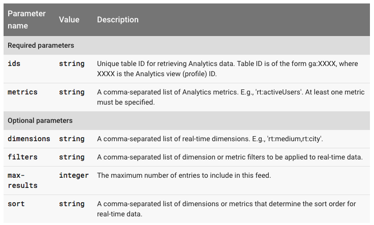
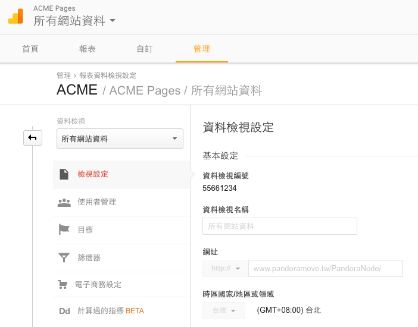

Google 常在推出新的服務，或是在既有的服務上加入新功能。即使有 [google-api-java-client](https://github.com/google/google-api-java-client) 與 [google-cloud-java](https://github.com/GoogleCloudPlatform/google-cloud-java) 函式庫能用，但不一定有支援最新的或是 Beta 的功能。這種時候不免要自行實作一下，研究了既有實作後，發現要自己刻一個蠻容易的。


Google API 僅是 Restful API 並多數都支援 OAuth2 與 Service Account 授權方式（部分剛出的 API 只有 API key 認證），所以只要搞定：

1. 取得授權
1. 知道 Restful API 的服務端點與呼叫參數

## Analytics Realtime API

以 Google Analytics 的 [Reporting Real Time Reporting API](https://developers.google.com/analytics/devguides/reporting/realtime/v3/reference/data/realtime/get) 為例，它目前在文件上的狀態仍標示為 Limited Beta。

依文件說明，它只需要呼叫下列位址即可（當然還需要適當的參數）：

```
GET https://www.googleapis.com/analytics/v3/data/realtime
```

由文看可知 `ids` 與 `metrics` 是必填的：



而 Scope 部分，至少需要下列選項的其中之一：

* https://www.googleapis.com/auth/analytics
* https://www.googleapis.com/auth/analytics.readonly


## 建立授權的連線

在 [google-api-java-client](https://github.com/google/google-api-java-client) 裡，它有提供 1 個抽象類別 [AbstractGoogleJsonClient](https://github.com/google/google-api-java-client/blob/1.18/google-api-client/src/main/java/com/google/api/client/googleapis/services/json/AbstractGoogleJsonClient.java)。它本質上是個 Http Client 能配合 [Credential](https://github.com/google/google-oauth-java-client/blob/1.8/google-oauth-client/src/main/java/com/google/api/client/auth/oauth2/Credential.java) 使用，執行經授權的 HTTP Request。

由於它本身是抽象類別，無法直接使用，我們仿其他程式建立出一個通用的 Helper Class

```java

import com.google.api.client.googleapis.auth.oauth2.GoogleCredential;
import com.google.api.client.googleapis.services.json.AbstractGoogleJsonClient;
import com.google.api.client.googleapis.util.Utils;

public class HttpClientBuilder extends AbstractGoogleJsonClient.Builder {

    public HttpClientBuilder(String rootUri, String servicePath, GoogleCredential httpRequestInitializer) {
        super(Utils.getDefaultTransport(), Utils.getDefaultJsonFactory(), rootUri, servicePath, httpRequestInitializer,
                false);
    }

    @Override
    public AbstractGoogleJsonClient build() {
        return new DefaultAPICaller(this);
    }

    static class DefaultAPICaller extends AbstractGoogleJsonClient {

        protected DefaultAPICaller(Builder builder) {
            super(builder);
        }

    }

}
```

有了 `HttpClientBuilder` 我們能順利建出 `AbstractGoogleJsonClient`：

```java
GoogleCredential googleCredential = GoogleCredential.fromStream(new FileInputStream(new File(AUTH_JSON_FILE)));
googleCredential = googleCredential.createScoped(AUTHED_SCOPES());

HttpClientBuilder builder = new HttpClientBuilder(ROOT_URI, SERVICE_PATH, googleCredential);
AbstractGoogleJsonClient client = builder.build();
```

## 執行 API

一旦有了 Client，就能執行文件上寫的：

```
GET https://www.googleapis.com/analytics/v3/data/realtime
```

透過 `AbstractGoogleJsonClient` 執行：

```java
HttpResponse response = client.getRequestFactory().buildGetRequest(buildRequestURL()).execute();
IOUtils.copy(response.getContent(), System.out);
```

經過排版的結果，大致如下：

```json
{
  "kind": "analytics#realtimeData",
  "id": "https://www.googleapis.com/analytics/v3/data/realtime?ids=ga:5566556655&metrics=rt:activeUsers",
  "query": {
    "ids": "ga:5566556655",
    "metrics": [
      "rt:activeUsers"
    ],
    "max-results": 1000
  },
  "totalResults": 1,
  "selfLink": "https://www.googleapis.com/analytics/v3/data/realtime?ids=ga:5566556655&metrics=rt:activeUsers",
  "profileInfo": {
    "profileId": "5566556655",
    "accountId": "55661234",
    "webPropertyId": "UA-55661234-1",
    "internalWebPropertyId": "110415566",
    "profileName": "所有網站資料",
    "tableId": "realtime:5566556655"
  },
  "columnHeaders": [
    {
      "name": "rt:activeUsers",
      "columnType": "METRIC",
      "dataType": "INTEGER"
    }
  ],
  "totalsForAllResults": {
    "rt:activeUsers": "34"
  },
  "rows": [
    [
      "34"
    ]
  ]
}
```

完整原始碼可參點此[連結](projects/google-api-lab/src/main/java/Main.java)參考。

## 其他細節

### 設定 GA 權限

授權檔的設定方式與其他 Google API 沒什麼差異，只是大多的功能都已整合至 Google Cloud 的 API Manager。

除了這個之外，就剩權限設定的問題了。以 Google Analytics 為例，它有自己的管理頁，確定此 API 的「行為者」必需被加入可以「檢視」的使用者。

以 OAuth2 驗證為例，使用的是某個人的 gmail 作為「行為者」那麼，此 email 帳號就需被加入需觀察的 Google Analytics 權限。若是以 Service Account 的方式取得驗證，它代表的就不是某一個人，是另一個 Service 與 Google Analytics 之間的互動，你需要加入的 email 則是此 Service Account 的 email（建立時會自動產生）。

### GA 編號去哪查

在管理頁的 `資料檢視設定` 裡，有看到 `資料檢視編號` 就是它了！




