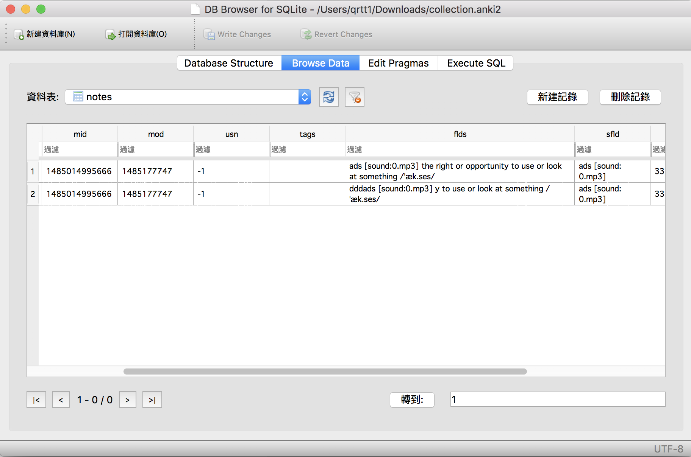
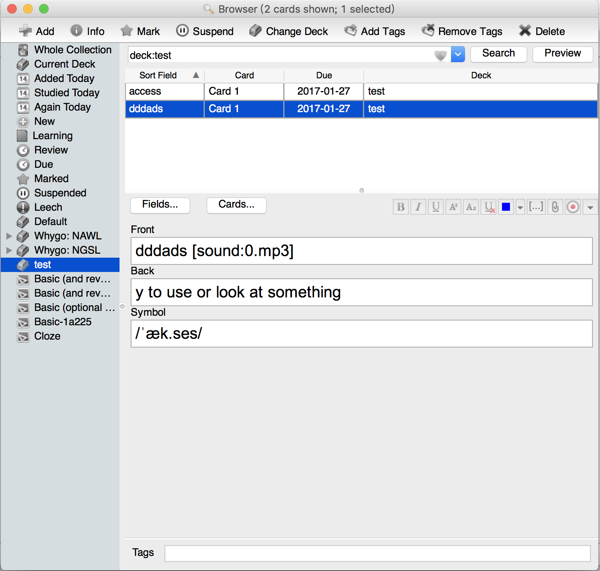
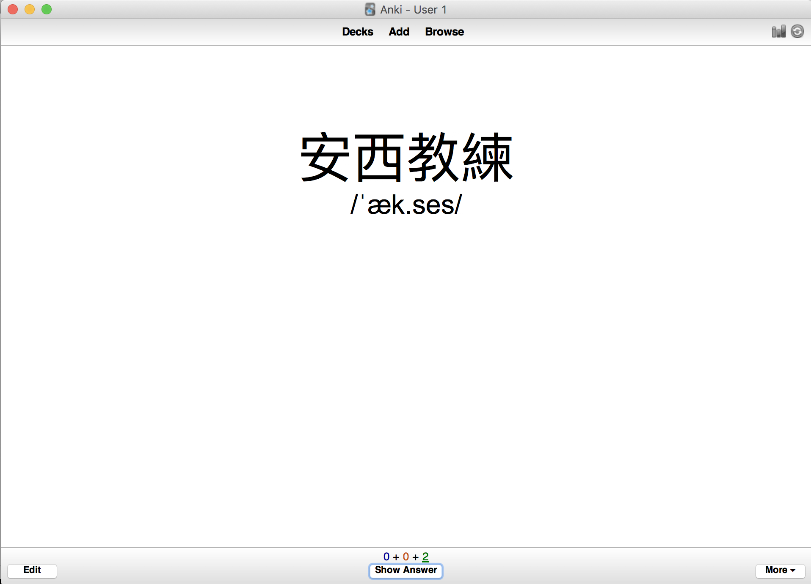

最近開始嚐試蠻多人推薦的助憶神器 `Anki`，不過預設的操作方式似乎不太方便大量新增 flashcard。還好 google 得到有一篇 [Anki `APKG` 檔案格式文件](http://decks.wikia.com/wiki/Anki_APKG_format_documentation)，就索性來試看看能不能真的新增 flashcard 吧。

## 製作 Anki Flashcard

如果他提供的資訊是可行的，那我們就有可能製作自己的大量匯入工具。文件雖然不長，但最初的 table schema 其實可以跳過，除真你真心想要從無到有自行建立完整的 APKG 檔。單純以實作前的 Proof of Concept 來說，我們直接跳到 `Creating a note and associated card` 應該比較有效率些。

由文件告訴我們的資訊，必需做二個動作：

1. 增加 `note`
1. 增加對應的 `card`

`note` 就是卡片上的內容，也就是 flashcard 的正、反面資訊。而 `card` 是用來對應 `{note, desk}` 的，因為同 1 個 flashcard 可以在多個 desk 裡。透過 table schema 我們其實能知曉 flashcard 其實就是由 card 在邏輯上將 note 與 desk 打包成 1 個單位的容器。

### notes

```sql
sqlite> .databases
seq  name             file
---  ---------------  ----------------------------------------------------------
0    main             /Users/qrtt1/Downloads/collection.anki2
sqlite> .schema notes
CREATE TABLE notes (
    id              integer primary key,   /* 0 */
    guid            text not null,         /* 1 */
    mid             integer not null,      /* 2 */
    mod             integer not null,      /* 3 */
    usn             integer not null,      /* 4 */
    tags            text not null,         /* 5 */
    flds            text not null,         /* 6 */
    sfld            integer not null,      /* 7 */
    csum            integer not null,      /* 8 */
    flags           integer not null,      /* 9 */
    data            text not null          /* 10 */
);
CREATE INDEX ix_notes_usn on notes (usn);
CREATE INDEX ix_notes_csum on notes (csum);
sqlite>
```

依文件的說明，我們需要自己產生的欄位如下：

```
    id              integer primary key,   /* 0 */
    guid            text not null,         /* 1 */
    mod             integer not null,      /* 3 */
    flds            text not null,         /* 6 */
    sfld            integer not null,      /* 7 */
    csum            integer not null,      /* 8 */
```

其中：

* `id` `guid` 都是隨機值
* mod 是 timestamp（單位是秒）
* sfld 是 `{{Front}}` 的值（我們把一個字串存入 integer 欄位，雖然奇怪了點，[但它是 sqlite 的 feature](https://sqlite.org/faq.html#q3)）
* flds 是所有欄位的值以 `0x1f` 隔開，它的順序定義在對應的 `mid`（model id）
* csum 的算法則是

  >>  A string SHA1 checksum of sfld, limited to 8 digits. PHP: (int)(hexdec(getFirstNchars(sha1($sfld), 8)));


## model id 

model id 是 note 資料存放方式的資訊，它被寫在 col（collection 資料表）的 `models` 裡：

```
sqlite> .schema col
CREATE TABLE col (
    id              integer primary key,
    crt             integer not null,
    mod             integer not null,
    scm             integer not null,
    ver             integer not null,
    dty             integer not null,
    usn             integer not null,
    ls              integer not null,
    conf            text not null,
    models          text not null,
    decks           text not null,
    dconf           text not null,
    tags            text not null
);
sqlite>
```

實際上它會是 1 個 json，它把印出來會看到有各種有趣的東西，最令我驚奇的是含 latex 語法：

```json
{
  "1485014995666": {
    "vers": [],
    "name": "Basic",
    "tags": [],
    "did": 1485168201845,
    "usn": -1,
    "req": [
      [
        0,
        "any",
        [
          0,
          2
        ]
      ]
    ],
    "flds": [
      {
        "name": "Front",
        "media": [],
        "sticky": false,
        "rtl": false,
        "ord": 0,
        "font": "Arial",
        "size": 20
      },
      {
        "name": "Back",
        "media": [],
        "sticky": false,
        "rtl": false,
        "ord": 1,
        "font": "Arial",
        "size": 20
      },
      {
        "name": "Symbol",
        "media": [],
        "sticky": false,
        "rtl": false,
        "ord": 2,
        "font": "Arial",
        "size": 20
      }
    ],
    "sortf": 0,
    "latexPre": "\\documentclass[12pt]{article}\n\\special{papersize=3in,5in}\n\\usepackage[utf8]{inputenc}\n\\usepackage{amssymb,amsmath}\n\\pagestyle{empty}\n\\setlength{\\parindent}{0in}\n\\begin{document}\n",
    "tmpls": [
      {
        "name": "Card 1",
        "qfmt": "{{Front}}\n\n<div style='font-family: Arial; font-size: 32px;'>{{Symbol}}</div>\n\n",
        "did": null,
        "bafmt": "",
        "afmt": "{{FrontSide}}\n\n<hr id=answer>\n\n\n<div style='font-family: Arial; font-size: 20px;'>{{Back}}</div>",
        "ord": 0,
        "bqfmt": ""
      }
    ],
    "latexPost": "\\end{document}",
    "type": 0,
    "id": "1485014995666",
    "css": ".card {\n font-family: arial;\n font-size: 64px;\n text-align: center;\n color: black;\n background-color: white;\n}\n",
    "mod": 1485175986
  }
}

```

我們能觀察到有個熟悉的欄位名稱 `flds`，它是個 json array，其中的 name 就對應到卡片的變數：


```json
"flds": [
  {
    "name": "Front",
    "media": [],
    "sticky": false,
    "rtl": false,
    "ord": 0,
    "font": "Arial",
    "size": 20
  },
  {
    "name": "Back",
    "media": [],
    "sticky": false,
    "rtl": false,
    "ord": 1,
    "font": "Arial",
    "size": 20
  },
  {
    "name": "Symbol",
    "media": [],
    "sticky": false,
    "rtl": false,
    "ord": 2,
    "font": "Arial",
    "size": 20
  }
]
```

以此例來說，變數依序為： `{{Front}}` `{{Back}}` `{{Symbol}}`。所以在 flds 欄位應該存入 `{{Front}}0x1f{{Back}}0x1f{{Symbol}}`。

## cards

cards 資料表的欄位如下，多數的欄位文件都建議我們不用修改（那就直接複製現有資料就行了），所以我們只需要建立好 note 與 deck 的關聯即可。

```sql
sqlite> .schema cards
CREATE TABLE cards (
    id              integer primary key,   /* 0 */
    nid             integer not null,      /* 1 */
    did             integer not null,      /* 2 */
    ord             integer not null,      /* 3 */
    mod             integer not null,      /* 4 */
    usn             integer not null,      /* 5 */
    type            integer not null,      /* 6 */
    queue           integer not null,      /* 7 */
    due             integer not null,      /* 8 */
    ivl             integer not null,      /* 9 */
    factor          integer not null,      /* 10 */
    reps            integer not null,      /* 11 */
    lapses          integer not null,      /* 12 */
    left            integer not null,      /* 13 */
    odue            integer not null,      /* 14 */
    odid            integer not null,      /* 15 */
    flags           integer not null,      /* 16 */
    data            text not null          /* 17 */
);
CREATE INDEX ix_cards_usn on cards (usn);
CREATE INDEX ix_cards_nid on cards (nid);
CREATE INDEX ix_cards_sched on cards (did, queue, due);
sqlite>
```

需要填的主要是些欄位：

```
    id              integer primary key,   /* 0 */
    nid             integer not null,      /* 1 */
    did             integer not null,      /* 2 */
    mod             integer not null,      /* 4 */
```

* id 就是這張 card 本身的 id，文件依然建議給隨機數值
* nid, did 就分別代表 note 與 deck
* mod 依然是 timestamp


## 動手做看看

有了上述整理的資訊，那我們就能先試著直接在 sqlite 塞資料試試，並把它打包後匯入 Anki 觀察有沒有多出新的 flashcard。這件事挺簡單的，只要有個 GUI 的 sqlite browser 就能做到，除了 csum 的計算需要寫程式之外，其它的工都是複製單上就能搞定的。

### 新增 flashcard



例如：單純修改 flds 試試能不能追加一張新的 flashcard，我們可暫時略過 csum 計算的問題。把修改後的檔案重新 zip 起來，匯入 anki 再由 anki browser 看，確實新加了 flashcard：




### 驗證 csum 規則

看到新的 flashcard 後稍為有信心進行下一步囉！回顧一下 csum 算式：

  >>  A string SHA1 checksum of sfld, limited to 8 digits. PHP: (int)(hexdec(getFirstNchars(sha1($sfld), 8)));

並拿現有的資料來實際驗證一下：

```
"ads [sound:0.mp3]"	"3339972935"
```

首先，我們算出 sha1 的結果：

```
qty:Downloads qrtt1$ echo -n "ads [sound:0.mp3]" | shasum
c713f147d3e3d38c2b0d0ec9e34cd4ee2ab2fef4  -
```

再將結果取前 8 個字元，換算成 10 進位數字：

```
qty:Downloads qrtt1$ python -c 'print int("c713f147", 16)'
3339972935
```

會看到我們成功地算出一樣的數值。這樣就有足夠的信心修改 sfld 欄位，例如：

```
qty:Downloads qrtt1$ echo "安西教練" | shasum | cut -c 1-8
0e2dff31
```

```
qty:Downloads qrtt1$ python -c 'print int("0e2dff31", 16)'
237895473
```

PS. 依據我實驗的結果，flashcard 顯示的時候主要是看 flds 欄位的資料，而非  sfld 欄位。所以，flds 上的內容要記得修改呦。

