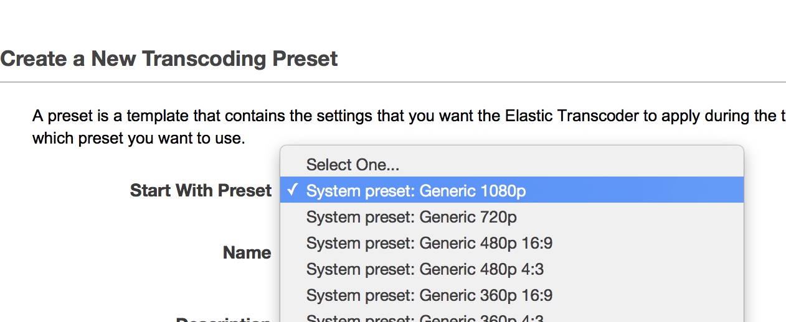

# AWS Elastic Transcoder CLI 搭配 jq 製作 preset

雖然一直覺得這服務有點貴，但沒時間調轉檔參數時，它會是省力的好幫手啊。先前一直是靠 web console 手動建立 presets 的
但這樣的流程不太適合筆記在 issue tracker 或專案的 wiki 上，所以應該要有用 cli 也能方便建立它的方法。

主要目標是模仿 web console 上的 Start With Preset，透過修改現有的範本來建立新的 Preset：




## generate-cli-skeleton

這件事其實挺容易實現的，我們可以先觀察一下 `create-preset` 指令需要什麼？

```
aws elastictranscoder create-preset --generate-cli-skeleton
```

透過 generate-cli-skeleton 可以產生空白的參數範本：

```json
aws elastictranscoder create-preset --generate-cli-skeleton
{
    "Name": "",
    "Description": "",
    "Container": "",
    "Video": {
        "Codec": "",
        "CodecOptions": {
            "KeyName": ""
        },
        "KeyframesMaxDist": "",
        "FixedGOP": "",
        "BitRate": "",
        "FrameRate": "",
        "MaxFrameRate": "",
        "Resolution": "",
        "AspectRatio": "",
        "MaxWidth": "",
        "MaxHeight": "",
        "DisplayAspectRatio": "",
        "SizingPolicy": "",
        "PaddingPolicy": "",
        "Watermarks": [
            {
                "Id": "",
                "MaxWidth": "",
                "MaxHeight": "",
                "SizingPolicy": "",
                "HorizontalAlign": "",
                "HorizontalOffset": "",
                "VerticalAlign": "",
                "VerticalOffset": "",
                "Opacity": "",
                "Target": ""
            }
        ]
    },
    "Audio": {
        "Codec": "",
        "SampleRate": "",
        "BitRate": "",
        "Channels": "",
        "AudioPackingMode": "",
        "CodecOptions": {
            "Profile": "",
            "BitDepth": "",
            "BitOrder": "",
            "Signed": ""
        }
    },
    "Thumbnails": {
        "Format": "",
        "Interval": "",
        "Resolution": "",
        "AspectRatio": "",
        "MaxWidth": "",
        "MaxHeight": "",
        "SizingPolicy": "",
        "PaddingPolicy": ""
    }
}
```

你會發現，它其實跟 `list-presets` 的結果大同小異：

```json
        {
            "Thumbnails": {
                "SizingPolicy": "ShrinkToFit", 
                "MaxWidth": "192", 
                "Format": "png", 
                "PaddingPolicy": "NoPad", 
                "Interval": "60", 
                "MaxHeight": "108"
            }, 
            "Container": "mp4", 
            "Description": "System preset generic 720p", 
            "Video": {
                "SizingPolicy": "ShrinkToFit", 
                "MaxWidth": "1280", 
                "PaddingPolicy": "NoPad", 
                "FrameRate": "29.97", 
                "MaxHeight": "720", 
                "KeyframesMaxDist": "90", 
                "FixedGOP": "false", 
                "Codec": "H.264", 
                "Watermarks": [
                    {
                        "SizingPolicy": "ShrinkToFit", 
                        "VerticalOffset": "10%", 
                        "VerticalAlign": "Top", 
                        "Target": "Content", 
                        "MaxWidth": "10%", 
                        "MaxHeight": "10%", 
                        "HorizontalAlign": "Left", 
                        "HorizontalOffset": "10%", 
                        "Opacity": "100", 
                        "Id": "TopLeft"
                    }, 
                    {
                        "SizingPolicy": "ShrinkToFit", 
                        "VerticalOffset": "10%", 
                        "VerticalAlign": "Top", 
                        "Target": "Content", 
                        "MaxWidth": "10%", 
                        "MaxHeight": "10%", 
                        "HorizontalAlign": "Right", 
                        "HorizontalOffset": "10%", 
                        "Opacity": "100", 
                        "Id": "TopRight"
                    }, 
                    {
                        "SizingPolicy": "ShrinkToFit", 
                        "VerticalOffset": "10%", 
                        "VerticalAlign": "Bottom", 
                        "Target": "Content", 
                        "MaxWidth": "10%", 
                        "MaxHeight": "10%", 
                        "HorizontalAlign": "Left", 
                        "HorizontalOffset": "10%", 
                        "Opacity": "100", 
                        "Id": "BottomLeft"
                    }, 
                    {
                        "SizingPolicy": "ShrinkToFit", 
                        "VerticalOffset": "10%", 
                        "VerticalAlign": "Bottom", 
                        "Target": "Content", 
                        "MaxWidth": "10%", 
                        "MaxHeight": "10%", 
                        "HorizontalAlign": "Right", 
                        "HorizontalOffset": "10%", 
                        "Opacity": "100", 
                        "Id": "BottomRight"
                    }
                ], 
                "CodecOptions": {
                    "Profile": "baseline", 
                    "MaxReferenceFrames": "3", 
                    "ColorSpaceConversionMode": "None", 
                    "InterlacedMode": "Progressive", 
                    "Level": "3.1"
                }, 
                "BitRate": "2400", 
                "DisplayAspectRatio": "auto"
            }, 
            "Audio": {
                "Channels": "2", 
                "CodecOptions": {
                    "Profile": "AAC-LC"
                }, 
                "SampleRate": "44100", 
                "Codec": "AAC", 
                "BitRate": "160"
            }, 
            "Type": "System", 
            "Id": "1351620000001-000010", 
            "Arn": "arn:aws:elastictranscoder:ap-northeast-1:777422099543:preset/1351620000001-000010", 
            "Name": "System preset: Generic 720p"
        } 

```

只是結果裡多出了 `Type` `Id` `Arn` 還有它的 `Name` 與其它參數是我們需要修改或剔除的。

## 透過 jq 實現 Start With Preset


### 挑選一個範本

透過 jq 的 select 先看一下名稱 `.Presets[].Name`：

```
aws elastictranscoder list-presets | jq .Presets[].Name
"System preset: Generic 1080p"
"System preset: Generic 720p"
"System preset: Generic 480p 16:9"
"System preset: Generic 480p 4:3"
"System preset: Generic 360p 16:9"
"System preset: Generic 360p 4:3"
"System preset: Generic 320x240"
"System preset: iPhone4S"
"System preset: iPod Touch"
"System preset: Apple TV 2G"
"System preset: Apple TV 3G"
"System preset: Web"
"System preset: KindleFireHD"
"System preset: KindleFireHD8.9"
"System preset: Audio AAC - 256k"
"System preset: Audio AAC - 160k"
"System preset: Audio AAC - 128k"
"System preset: Audio AAC - 64k"
"System preset: KindleFireHDX"
"System preset: NTSC - MPG"
"System preset: PAL - MPG"
"System preset: Full HD 1080i60 - MP4"
"System preset: Full HD 1080i50 - MP4"
"System preset: Gif (Animated)"
"System preset: Web: Flash Video"
"System preset: Full HD 1080i60 - XDCAM422"
"System preset: Full HD 1080i50 - XDCAM422"
"System preset: Webm 720p"
"System preset: Webm VP9 720p"
"System preset: Webm VP9 360p"
"System preset: HLS 2M"
"System preset: HLS Video - 2M"
"System preset: HLS 1.5M"
"System preset: HLS Video - 1.5M"
"System preset: HLS 1M"
"System preset: HLS Video - 1M"
"System preset: HLS 600k"
"System preset: HLS Video - 600k"
"System preset: HLS 400k"
"System preset: HLS Video - 400k"
"System preset: HLS Audio - 160k"
"System preset: HLS Audio - 64k"
"System preset: Audio MP3 - 320k"
"System preset: Audio MP3 - 192k"
"System preset: Audio MP3 - 160k"
"System preset: Audio MP3 - 128k"
"System preset: Audio FLAC - CD"
"System preset: Audio WAV 44100 Hz, 8 bit"
"System preset: Audio WAV 44100 Hz, 16 bit - CD Quality"
"System preset: Smooth 3M"
"System preset: Smooth 2M"
"System preset: Smooth 1.5M"
"System preset: Smooth 1M"
"System preset: Smooth 800k"
"System preset: Smooth 600k"
"System preset: Smooth 500k"
"System preset: Smooth 400k"
"System preset: MPEG-Dash Video - 4.8M"
"System preset: MPEG-Dash Video - 2.4M"
"System preset: MPEG-Dash Video - 1.2M"
"System preset: MPEG-Dash Video - 600k"
"System preset: MPEG-Dash Audio - 128k"
```

### 基於 System preset: Generic 720p 的修改

```
aws elastictranscoder list-presets \
| jq '.Presets[] | select(.Name=="System preset: Generic 720p") ' \
| jq 'del(.Type) | del(.Id) | del(.Arn)' \
| jq '.Name = "HappyTranscoder 720p-4m"' \
| jq '.Video.BitRate = "4000"' 
```

我們查出了 `System preset: Generic 720p` 並執行：

1. 刪除欄位 Type, Id, Arn
1. 修改名稱欄位為  *HappyTranscoder 720p-4m*
1. 修改 Video 參數的 BitRate 值為 4000

可以將結果輸出至檔案，例如 720p4m.json，並建立 preset： 

```
aws elastictranscoder create-preset --cli-input-json file://720p4m.json
```

需要注意的是，檔名前需要加 `file://` 才會被當作檔案處理。完成建立後，就可查詢 Preset 列出它的資料，重點還是 Id 唄 :)

```
aws elastictranscoder list-presets \
| jq '.Presets[] | select(.Name=="HappyTranscoder 720p-4m") | .Id'
```

