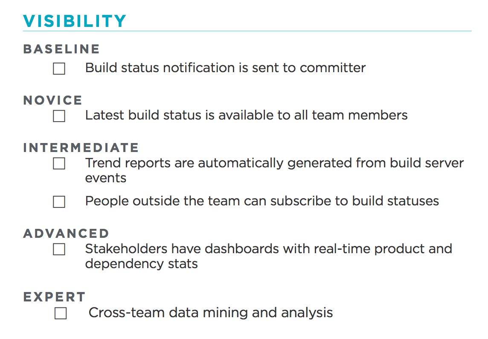

#  Log 處理新手村

今天要練習的是使用 fluentd 接收 log，並接上 kibana 展示出系統狀態。今天選用的 fluentd 與 ELK 組合，單純只是有相關經驗，對於工具的選擇沒有特別的好惡，也沒有比較過其他工具，同質性的競品有多許，後續可依自己的需求替換。

在進入正題前，先來談談為什麼要處理 Log，而我用什麼角度來看待 Log 資料的處理。整理 Log 有許多好處，特別對於維運系統來說，它能輔助決策，無論是系統穩定性的判別或是產品功能的接受度都可以透過 Log 蒐集。我們可以在 Log 上追加新的量測項目，而獲得需要的資訊。

我們可以用很多不同的觀點來看待 Log 資料的處理，我個人偏好用持續性部署裡的成熟度模型來看待它：

* [The Continuous Delivery Maturity Model](https://www.infoq.com/articles/Continuous-Delivery-Maturity-Model)
* [Continuous Delivery: Maturity Checklist](https://dzone.com/articles/continuous-delivery-maturity)

畢竟，對工程師來說穩定的系統可保你夜夜好眠，想要滿足成熟度模型裡的 Visibility，最基本的方式就是將系統的回應收集起來加以應用，而 Log 即為一種典型的型式：

