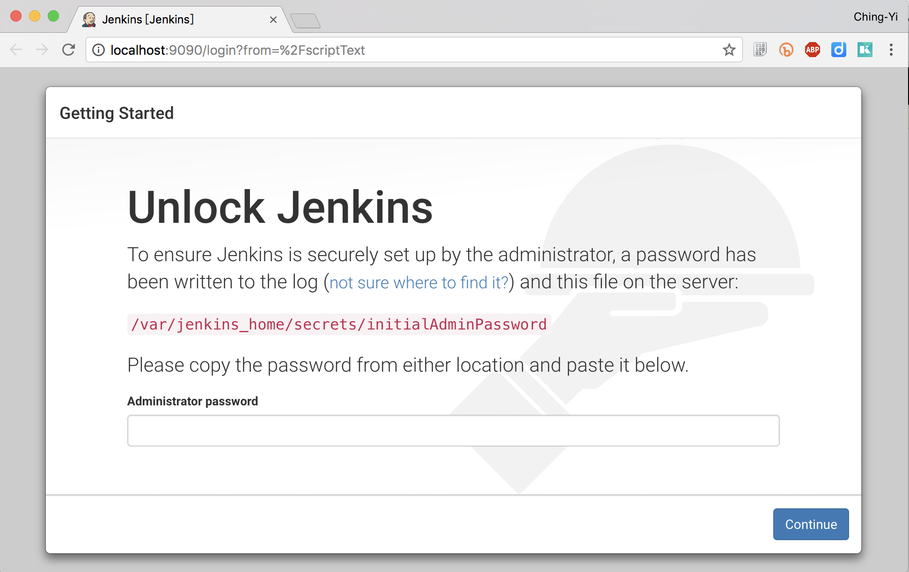

# Jenkins Configuration as a Code

[Jenkins World 2017: Mastering the Jenkins Script Console](https://www.youtube.com/watch?v=qaUPESDcsGg) 觀後有感，講者在他新的專案簡單運用 Jenkins Script Console 製作 Jenkins Provision Tool，從他分享的專案我們能由原始碼了解如何設計基本的 Configuration as a Code。

## Jenkins 2.x

Jenkins 是相當熱門的 CI/CD 解決方案，它在非常古早的時代就存在了。那時我對他還不太感興趣，主要是配置上過於倚懶 Web GUI。早期在官網上的教學也以 Web UI 的操作為主，在它產品走向由 CI 往 CD 傾斜的過程中，衍生出 workflow 的概念，直到正名為 Pipelie 後開始引起我興趣。

其中一個原因是 Pipeline 是以 Groovy DSL，這讓我們可以讓 Jenkins Job 能變成以 `Code` 的型式存在。換句話說，它變得可以版本控制。不過，Pipeline 是一個新型態的 Jenkins Job，為了讓舊的 Job 也能以 DSL 型式存在，於是誕生了 [Jenkins Job DSL Plugin](https://jenkinsci.github.io/job-dsl-plugin/)，讓我們能以 `Code` 的型式建立各種型態的 Job。

## Jenkins Scripting

那麼在 Jenkins 本身的 Provision 與 Configruation 部分是否也有 `Code` 存在的方案呢？
答案是有機會做到，因為 Jenkins 提供了 Script Console，例如今年 [Jenkins World 2017: Mastering the Jenkins Script Console](https://www.youtube.com/watch?v=qaUPESDcsGg) 介紹了 Script Console 相關用法，也順便宣傳了 [jervis](https://github.com/samrocketman/jenkins-bootstrap-jervis) 專案。這個專案是讓你透過 
Travis CI 的 yaml 設計檔建立 Jenkins Job。

 以此專案提供的 Provision 設定範例 [settings.groovy.EXAMPLE](https://github.com/samrocketman/jenkins-bootstrap-jervis/blob/master/settings.groovy.EXAMPLE) 來看，這不就示範了運用 Jenkins 的 Scripting 功能，達到 Provision 與 Configuration 的 `as a Code` 的可能性嗎!

他的做法很簡單直覺：

https://github.com/samrocketman/jenkins-bootstrap-jervis/blob/914ddb8663ff630cbe9e89587dafcb335decb3d7/jervis_bootstrap.sh#L24-L28

```sh
if [ -r settings.groovy ]; then
  jenkins_console -s ./settings.groovy -s "${SCRIPT_LIBRARY_PATH}"/configure-jenkins-settings.groovy
  jenkins_console -s ./settings.groovy -s "${SCRIPT_LIBRARY_PATH}"/credentials-multitype.groovy
  jenkins_console -s ./settings.groovy -s "${SCRIPT_LIBRARY_PATH}"/configure-yadocker-cloud.groovy
fi
``` 

其中 [jenkins_console](https://github.com/samrocketman/jenkins-bootstrap-shared/blob/bb2147f2d051396a60bc81eca9b7374b3dbe0ea4/scripts/common.sh#L13-L38) 只是另一個 shell script 的 function，它僅作為輔助組裝實際要送入另一隻 python script 
[jenkins-call-url](https://github.com/samrocketman/jenkins-bootstrap-shared/blob/bb2147f2d051396a60bc81eca9b7374b3dbe0ea4/scripts/jenkins-call-url) 的工具，說到底還是會組合成 curl 指令。

那麼它是怎麼讓 `settings.groovy` 的變數，可以在其它 script 中能使用呢？其實沒有什麼魔術的地方，它就只是把[多個 groovy file 當字合併起來](https://github.com/samrocketman/jenkins-bootstrap-shared/blob/bb2147f2d051396a60bc81eca9b7374b3dbe0ea4/scripts/jenkins-call-url#L304-L310)： 

```python
#prepare the HTTP message body payload
data=None
if len(args.http_data_files) > 0:
    data = ""
    for string in args.http_data_strings:
        data += string
    for path in args.http_data_files:
        with open(path) as f:
            data += urllib.quote(f.read())
```

若我們打算做自己的版本，那麼可以是將公用的工具程式放作為 Code Block 放在其它 Script 最開頭來達到目的。


## Unlock Jenkins

另一個吸引到我注意的點是，使用：

```shell
export VAGRANT_JENKINS=1
vagrant up
./jervis_bootstrap.sh
```

[進行 Jenkins Provison 動作](https://youtu.be/qaUPESDcsGg?t=26m21s)時，完全不用人工再去開啟 Jenkins Web UI 手動輪入初始的密碼。

在專案內的 [provision_jenkins.sh](https://github.com/samrocketman/jenkins-bootstrap-shared/blob/bb2147f2d051396a60bc81eca9b7374b3dbe0ea4/scripts/provision_jenkins.sh) 即為做這件事的主要工具，它的 [bootstrap](https://github.com/samrocketman/jenkins-bootstrap-shared/blob/bb2147f2d051396a60bc81eca9b7374b3dbe0ea4/scripts/provision_jenkins.sh#L311) 實作，就說明了一切：

```shell

    #try enabling CSRF protection support
    csrf_set_curl

    jenkins_script_console script_skip_wizard
    jenkins_script_console script_disable_usage_stats
    jenkins_script_console script_upgrade_plugins
    jenkins_script_console script_install_plugins "credentials-binding,git,github,github-oauth,job-dsl,matrix-auth,matrix-project,pipeline-stage-view,ssh-slaves,workflow-aggregator"
```

其中 `csrf_set_curl` 決定了實際上下 `curl` 時，需不需要加 `crumb` 參數：

```shell
#CSRF protection support
function csrf_set_curl() {
  if is_crumbs_enabled; then
    if [ ! "${CSRF_CRUMB}" = "$(get_crumb)" ]; then
      if [ -n "${CSRF_CRUMB}" ]; then
        #remove existing crumb value from curl command
        CURL="$(echo "${CURL}" | sed "s/ -d ${CSRF_CRUMB}//")"
      fi
      export CSRF_CRUMB="$(get_crumb)"
      export CURL="${CURL} -d ${CSRF_CRUMB}"
      echo "Using crumbs for CSRF support."
    elif ! echo "${CURL}" | grep -F "${CSRF_CRUMB}" &> /dev/null; then
      export CURL="${CURL} -d ${CSRF_CRUMB}"
      echo "Using crumbs for CSRF support."
    fi
  fi
}
```

經過 trace 後，我們可以得到概念，自行實作一個簡易的版本。

### 實作 unlock jenkins POC

先用 docker 弄一個簡單的 Jenkins 環境來玩

```
mkdir -p secrets
docker run -p 9090:8080 -v `pwd`/secrets:/var/jenkins_home/secrets/ \
-it --rm jenkins/jenkins:lts
```

啟動後，你會看到 Jenkins 在 console 印出解鎖資訊：

```
Jenkins initial setup is required. An admin user has been created and a password generated.
Please use the following password to proceed to installation:

ade481f421b24432a17bea52d86b78c0

This may also be found at: /var/jenkins_home/secrets/initialAdminPassword
```

並在 Web UI 看到這樣的畫面：



在 Docker 執行成功後，我們有 `secrets/initialAdminPassword`，但希望不用進 Web UI 能透過 Jenkins Script Console 來關掉它：

```
$ cat secrets/initialAdminPassword
3b1179a037124bb18d1495348b69d187
```

先取得 Crumb

```shell
export JENKINS_WEB=http://localhost:9090/
export CSRF_CRUMB=$(curl -u admin:$(cat secrets/initialAdminPassword) $JENKINS_WEB/crumbIssuer/api/json | \
python -c 'import sys,json;j=json.load(sys.stdin);print j["crumbRequestField"] + ":" + j["crumb"]')
```

有了 Crumb 後，我們就能利用 admin 使用者，執行 Script Console

```shell
export JENKINS_SCRIPT_CURL="curl -u admin:$(cat secrets/initialAdminPassword) -H $CSRF_CRUMB"
$JENKINS_SCRIPT_CURL --data-urlencode "script=println Jenkins.instance" http://localhost:9090/scriptText
```

可以得到結果：

```
hudson.model.Hudson@3a66b14d
```

#### 執行 unlock functoin

這裡直接使用 [provision_jenkins.sh] (https://github.com/samrocketman/jenkins-bootstrap-shared/blob/bb2147f2d051396a60bc81eca9b7374b3dbe0ea4/scripts/provision_jenkins.sh#L69) 內的 function：

```shell
function script_skip_wizard() {
  cat <<'EOF'
import hudson.util.PluginServletFilter
def j=Jenkins.instance
if('getSetupWizard' in j.metaClass.methods*.name.sort().unique()) {
    def w=j.getSetupWizard()
    if(w != null) {
        try {
          w.completeSetup()
        }
        catch(Exception e) {
          //pre Jenkins 2.6
          w.completeSetup(j)
          PluginServletFilter.removeFilter(w.FORCE_SETUP_WIZARD_FILTER)
        }
        j.save()
        println 'Wizard skipped.'
    }
}
EOF
}

$JENKINS_SCRIPT_CURL --data-urlencode "script=$(script_skip_wizard)" http://localhost:9090/scriptText
```

```
$ function script_skip_wizard() {
>   cat <<'EOF'
> import hudson.util.PluginServletFilter
> def j=Jenkins.instance
> if('getSetupWizard' in j.metaClass.methods*.name.sort().unique()) {
>     def w=j.getSetupWizard()
>     if(w != null) {
>         try {
>           w.completeSetup()
>         }
>         catch(Exception e) {
>           //pre Jenkins 2.6
>           w.completeSetup(j)
>           PluginServletFilter.removeFilter(w.FORCE_SETUP_WIZARD_FILTER)
>         }
>         j.save()
>         println 'Wizard skipped.'
>     }
> }
> EOF
> }
$
$ $JENKINS_SCRIPT_CURL --data-urlencode "script=$(script_skip_wizard)" http://localhost:9090/scriptText
Wizard skipped.
```

當我們再次連上 http://localhost:9090 時，就不再是 Unlock Wizard 的畫面了。