先前對於系統內使用到的 [jieba](https://github.com/fxsjy/jieba) 中文分詞器有了點興趣，在它的介紹提到：

> 对于未登录词，采用了基于汉字成词能力的 HMM 模型，使用了 Viterbi 算法

對於 HMM 這個好像常聽到，但又一直沒花時間好好理解它的機率模型，該花時間學習一下了。查了不同人的 talk 與 slide，大致上都會提到相似的說例，但可能因為是演講的關係，有些 term 並沒有定義到相當清楚，這樣理解起來挺困難的。

最後，我在不同的 paper 或 reference 上，找到他們的共同來源：

[L. Rabiner, A Tutorial on Hidden Markov Models and Selected Applications in Speech Recognition, Proceedings of the IEEE, vol. 77, No. 2, February 1989.](rabiner.pdf)

這篇 paper 即為不同的 slide 與 youtube video 內會提到的天氣預測的主要說例，重點是對於 term 定義的更加清楚。若在閱讀不同「年代」的材料時，發現 term 突然風格不同的話，也許該來看看這篇的內容先。


## Markov Chains

在進入 Hidden Markov Model 前，最好先對於 Markov Chains 有基本的理解。在 Youtube 上的 [Brandon Foltz](https://www.youtube.com/channel/UCFrjdcImgcQVyFbK04MBEhA) 製作了一些清楚易懂的數學科普教學，並中 [Finite Mathematics](https://www.youtube.com/playlist?list=PLIeGtxpvyG-KxMqY8wJ0KoY3ujxf0C856) 清單裡的 Index 24 開始，就是介紹 Makrov Chains：

* [Finite Math: Introduction to Markov Chains](https://www.youtube.com/watch?v=tYaW-1kzTZI&index=24&list=PLIeGtxpvyG-KxMqY8wJ0KoY3ujxf0C856)
* [Finite Math: Markov Transition Diagram to Matrix Practice](https://www.youtube.com/watch?v=hUBc2Nb8yyI&list=PLIeGtxpvyG-KxMqY8wJ0KoY3ujxf0C856&index=25)
* [Finite Math: One-step Markov Chains](https://www.youtube.com/watch?v=1_uPFU_49d0&list=PLIeGtxpvyG-KxMqY8wJ0KoY3ujxf0C856&index=26)
* [Finite Math: Two-step Markov Chains](https://www.youtube.com/watch?v=roqCW_nMKCQ&index=27&list=PLIeGtxpvyG-KxMqY8wJ0KoY3ujxf0C856)
* [Finite Math: Long-run Markov Chain Probabilities](https://www.youtube.com/watch?v=IYaOMor9qvE&index=28&list=PLIeGtxpvyG-KxMqY8wJ0KoY3ujxf0C856)
* [Finite Math: Markov Steady-State Vectors](https://www.youtube.com/watch?v=D2wvhwOTWIo&list=PLIeGtxpvyG-KxMqY8wJ0KoY3ujxf0C856&index=29)
* [Finite Math: Markov Chain Steady-State Calculation](https://www.youtube.com/watch?v=cP3c2PJ4UHg&index=30&list=PLIeGtxpvyG-KxMqY8wJ0KoY3ujxf0C856)
* [Finite Math: Markov Chains and College Enrollment Decisions](https://www.youtube.com/watch?v=q6dHV6cNkR8&index=31&list=PLIeGtxpvyG-KxMqY8wJ0KoY3ujxf0C856)

看完這些，最終知道 Markov Chain 是一組 matrix 定義與它的運算方法。這組 matrix 即為狀態轉移陣列 (transition matrix)，在後續的 HMM 學習，它常被標為 A 陣列（因為 paper 內的用是 a 原素的 ij 標註)。只要配合適當的初始狀態，可以計算出經過幾個 iteration 後的機率。初始狀態即為一個 1xN 的陣列，也就是一個向量，所以也稱初始向量，後續的 HMM 符號為 π。

截個 paper 的圖上，來看一下 A matrix：

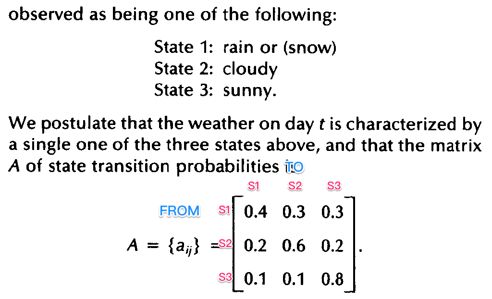 

我們把它標上狀態：

* S1：rain or snow
* S2：cloudy
* S3：sunny

有沒有覺得跟看過的入門教學就很像了呢？

## Markov Model

在進入 `Hidden` 的情境前，paper 先定義由圖例到 Markov Model 間使用的符號：

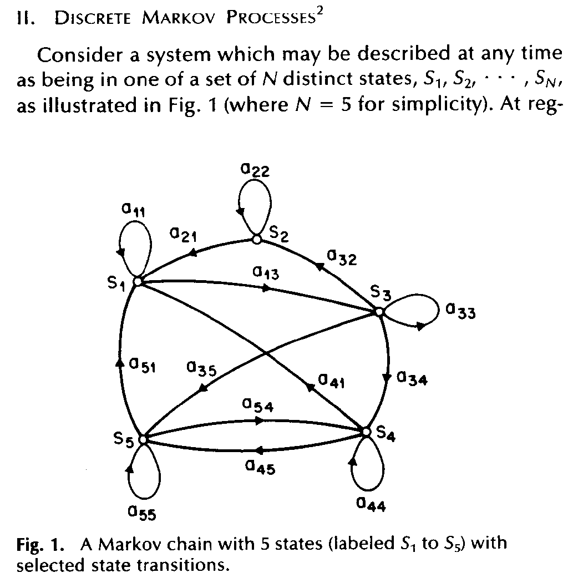

上面的大寫 `S` 表示為互斥的狀態，而小寫 a 為狀態間的移轉機率，它的標註是 2 位數的。第 1 個數字就是 `From` 第 2 個數字是 `To`，像是 a55 就是由狀態 S5 轉移至 S5，a51 就是狀態 S5 轉移至狀態 S1。

這種可以直接 `觀察` 到實際狀態的 Model 稱為 `Observable Markov model`，其實就是我們俗稱的 Markov model。廣義地說，目前的狀態受先前 `所有狀態` 影響，它的機率算公式為：

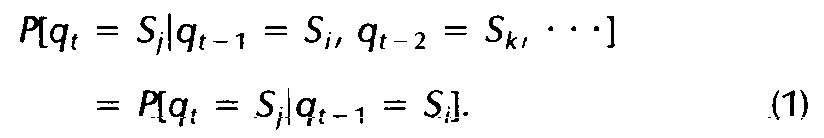

這組條件機率公式，它所求的是先前所有狀態，已被觀測出序列的前提下，t 時間觀察到 `某個` 狀態的機率：

```
Sk ------> Si ------> | ------> Sj
q (t-2)    q (t-1)    |         q (t)
```

但是要回頭算過去所有的機率，似乎很麻煩。所以，它的式 `(1)` 改寫了，標示它為其中一種特例，稱為 `first order`，也就是只往前看 1 個狀態，現在的狀態只跟前 1 個狀態有關聯。

PS. 在[其他人的筆記](http://www.csie.ntnu.edu.tw/~u91029/HiddenMarkovModel.html)有提到 second order，就是往回看 2 個狀態。


由於在 first order 的情境下只關心上一個狀態，那麼在計算上就相對簡單了，因為它直接是對應到 Transition Matrix `(2)`，其中 j 是 From，i 是 To：


## Observable Markov Model

在開胃小菜的部分 paper 先跟我們談談天氣：

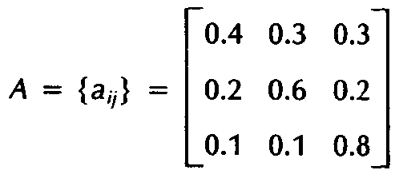

* S1：rain or snow
* S2：cloudy
* S3：sunny

給定了 S 狀態集合與 A 轉移陣列即為 1 個 Markov Model，它問了第 1 個問題：

> 如果第 1 天 (t=1) 是 sunny (S3)，依據現有的 Model 來計算未來 7 天的天氣序列如下的機率：
> sunny sunny rain rain sunny cloudy sunny

它用 oberversation 的 `O` 代表觀察序列：

```
O = {S3, S3, S3, S1, S1, S3, S2, S3}
t =  1   2   3   4   5   6   7   8      
```

它給了我們個計算過程：

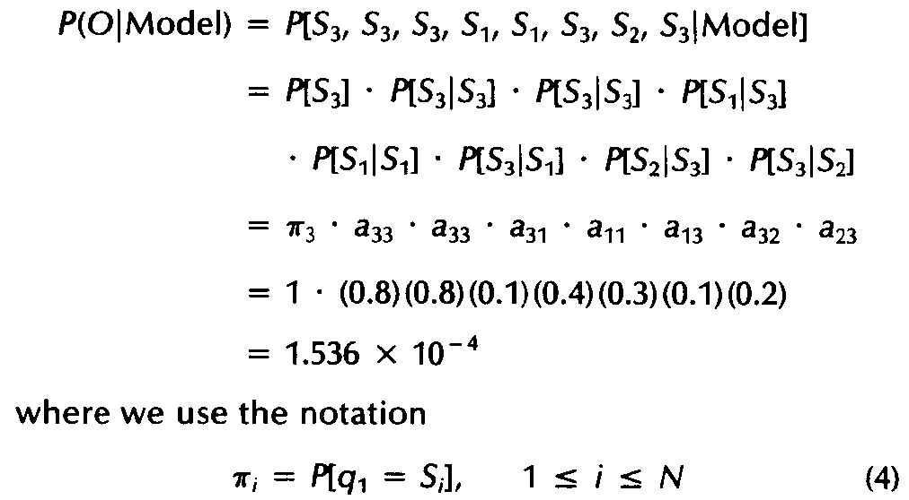

回想一下，由於我們在用 first order 的情境理解它，可以知道目前狀態只與前一個狀態有關，所以把狀態轉移的歷程標註後，可以用表格來理解：

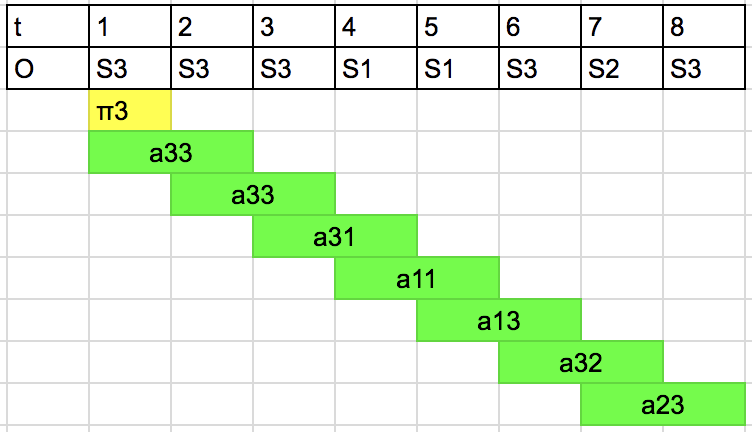

其中 `π3` 是一開始的條件 `如果 t=1 為 sunny`，因為已經設定好了，它必然發生，故機率為 1 是毫無疑問地。那麼把 aij 的機率標上去，直接在試算表連乘的結果即為答案：

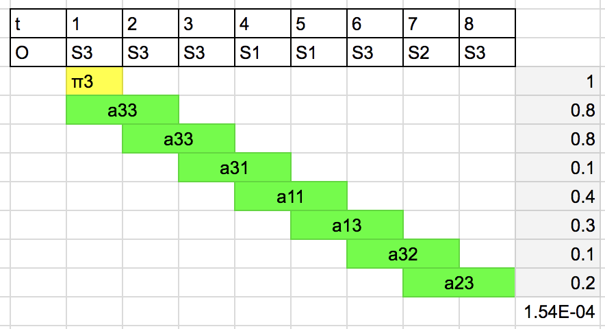

另一個問題是給定 1 個已知的狀態，它持續 n 天的機率為何（還沒弄懂怎麼算，只能先放圖了）：

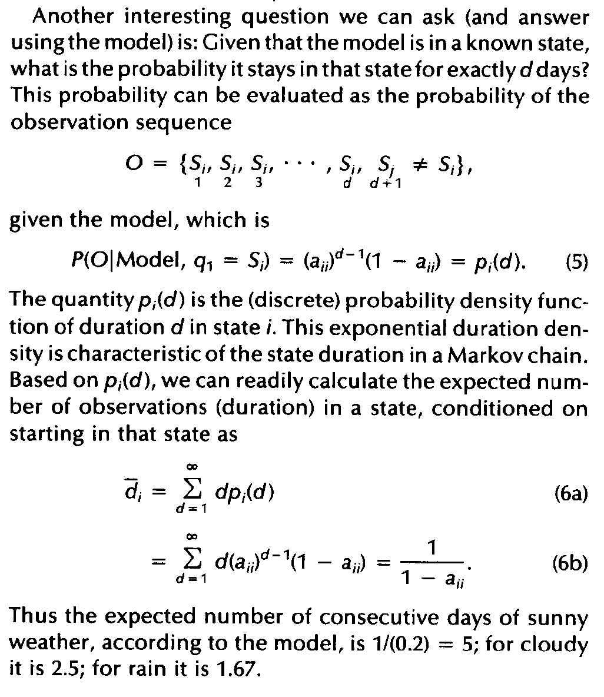

(因為還沒點開機率密度函數與積分的技能，只能先略過式子的理解了。)


## Hidden Markov Model

在解說過 `Observable Markov Model` 的例子後，Paper 先使用擲銅板的範例來起頭，並舉了例子一些無法直接觀察實際狀態的情境。如果放到這個年代，也許就不用特別解說情境了，特別在這 Sensor 泛濫的年代，為了建置成本 (Sensor 部署數量與單價)，往往我們只能觀察到一些關聯的事件，而不是直接產生狀態物體。

在 `B. Elements of an HMM` 給了較正式的定義，那也看懂其他人的筆記用的符號的關鍵，這就是 HMM 的共通語言。HMM 共有 5 個主要的元素 (其實只需要 3 個，多出來的部分應該是為了讓定義更嚴謹)：

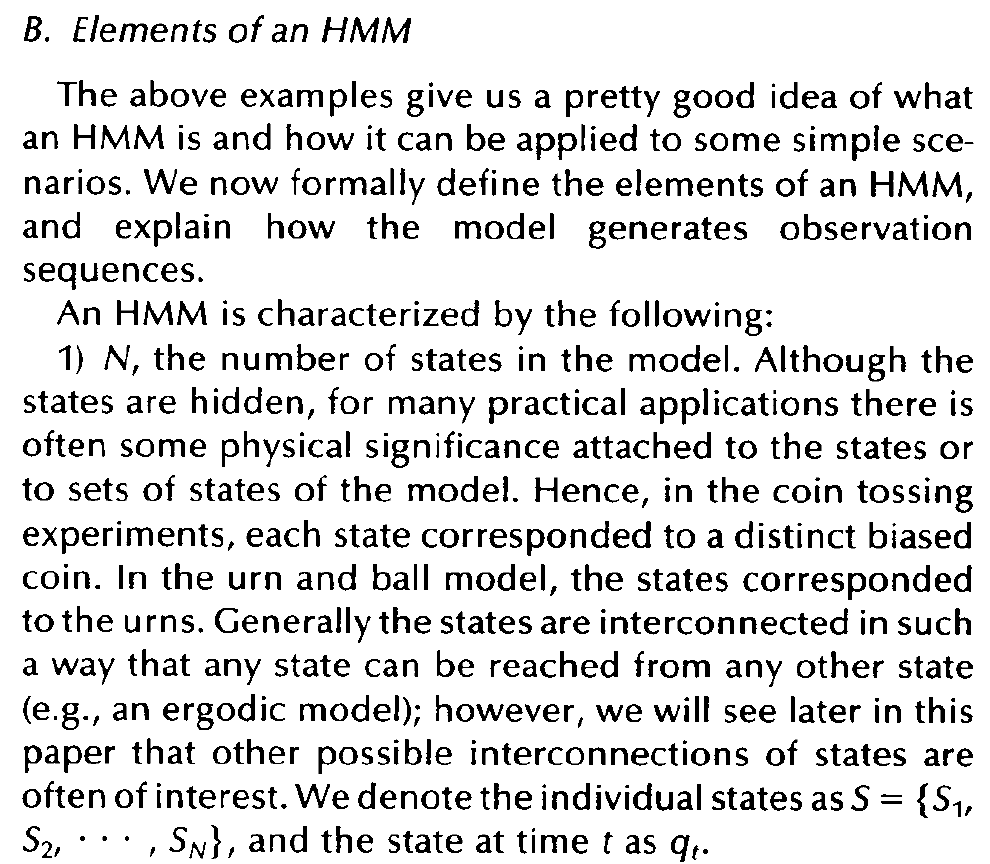

首先它定義 `N` 為狀態 `S` 的數量，其中定義的最後一句：

```
S = {S1, S2, ... SN}, and the state at time t as qt
```

其中的 qt 這小細節是指，在時間點 t 的情況下，代表的 q 即為某一個 S。在網路上看別人的教學，突然冒出 `q` 覺得奇怪，也沒指出 q 的定義是什麼，多半是一頭霧水的。透過 paper 原始定義，我們終於能掌握到，`q` 其實就是某個可觀察序列中，時間點 t 下，對應到 `隱藏狀態` 的某一個 S。

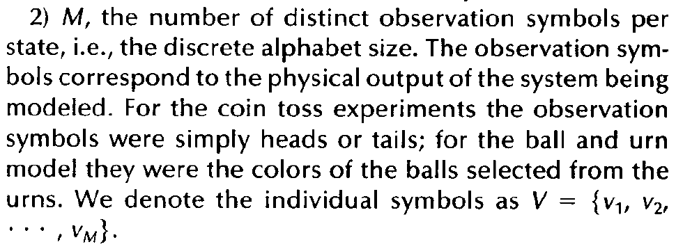

再來定義 `M` 為實際可觀察符號 (symbol) 的狀態數量，它用一個 `V` 集合來表示，我想應該是 Visible 吧。

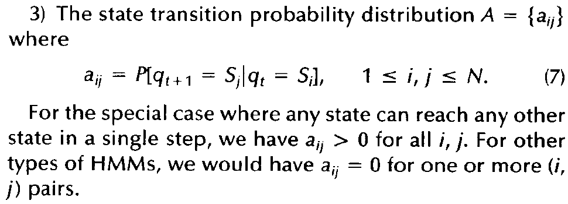

第 3 個部分是我們先前見過的 `A` 狀態轉移矩陣，它只是寫成條件機率的型式，本質上是一樣的內涵。它另外提到當 aij 為 0 時，別示沒有 `FROM i TO j` 的轉移情況，若每一個 aij 都大於 0 則表示，任意 2 個狀態都能互相轉移。

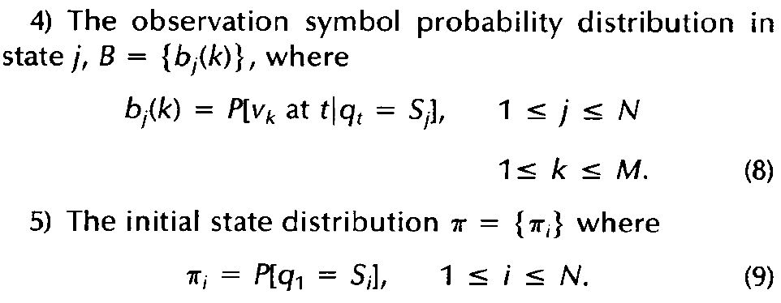

最後的 4, 5 其中的初始向量 π 在最開始就一直提過了，只是經過了 `q` 的定義後，我們知道它是可觀察序列的第 1 個符號 (t=1 的情況)。`B` 則是新的東西，它對應至任意一個 `Sj` 狀態發生的前提下，觀看到各別 v 的機率。（也就是每個 Sj 下會有 M 組可觀測符號的機率分佈），即為 paper 圖例範例中，不同的甕 (urn) 對塵至各顏色落球的機率：

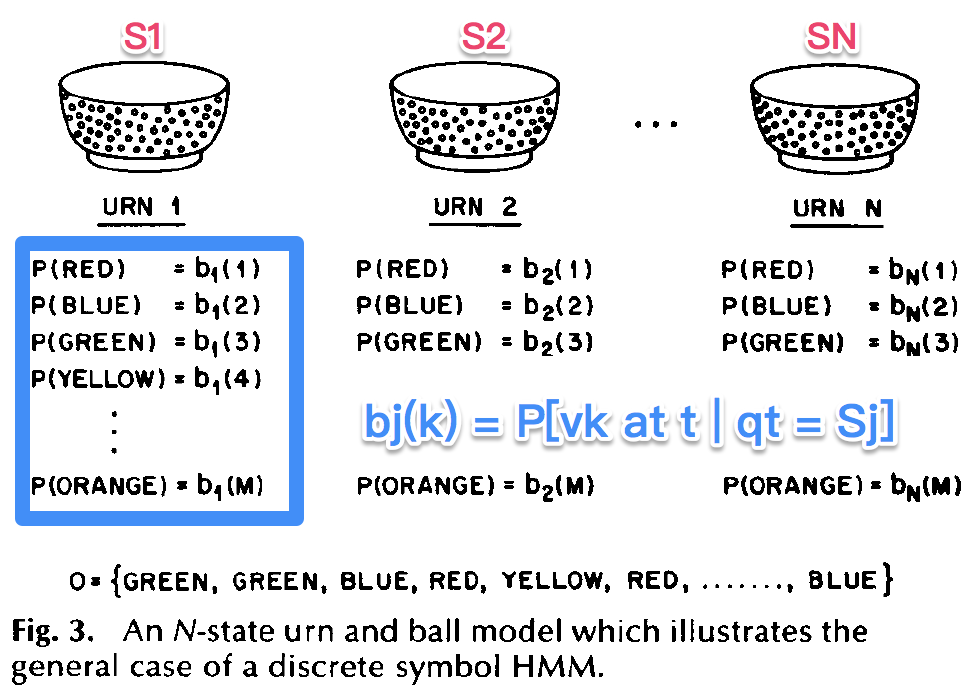

在明白 paper 裡完整的定義後，它開始提到我們可以用 HMM 來產生 `可觀察` 序列：

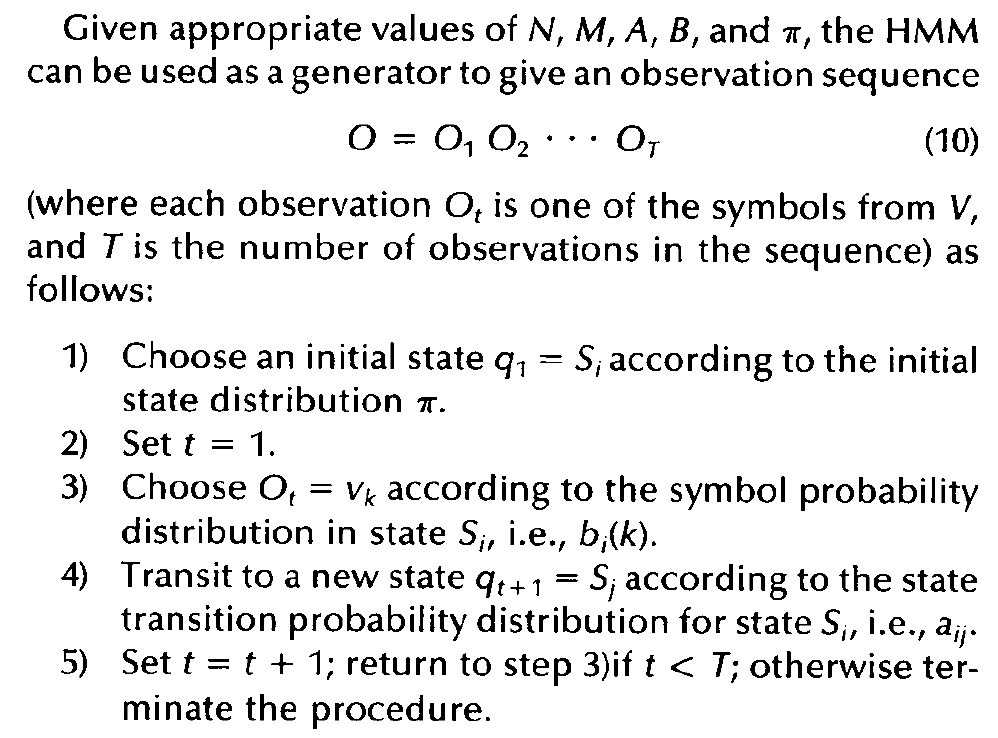

1. 首先，要先選擇一個 q1 = Si。 (這通常看實驗條件來定，若沒有特別指定，也看過有其他講者用 1/M 的機率均分配，也有直接限定第 1 個符號，那它就機率就是 `100%`)
2. 令 `t=1` (總之，我們要先走出第 1 步，這其實就是演算法典型的迴圈描述)
3. 依據目前的 `qt` 對應到的 `Si 相應的 bi(k)` 依分佈產生符合機率分佈的 `vk`，挑出一個 `Ot = vk`。
4. 依據轉移矩陣 `A` 的機率分佈，轉移至一個新的狀態 `q(t+1) = Sj`
5. 令 `t=t+1` 若 t 小於 T 則回到 `3.`，繼續產生新的符號。否則，結束產生器的運作。

以上即為較正式的定義 HMM 的術語與概念，它也提到能簡化為：

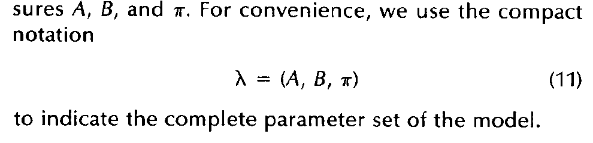

## HMM 有 3 個基本問題

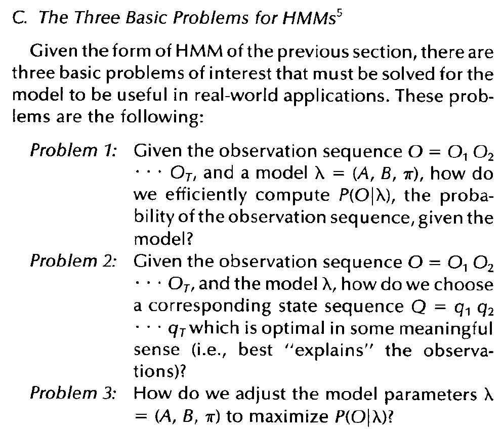

