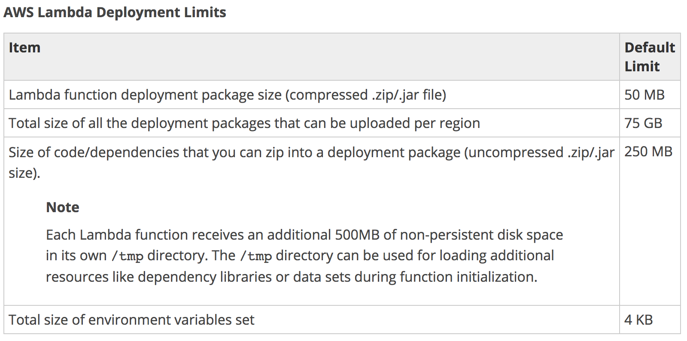
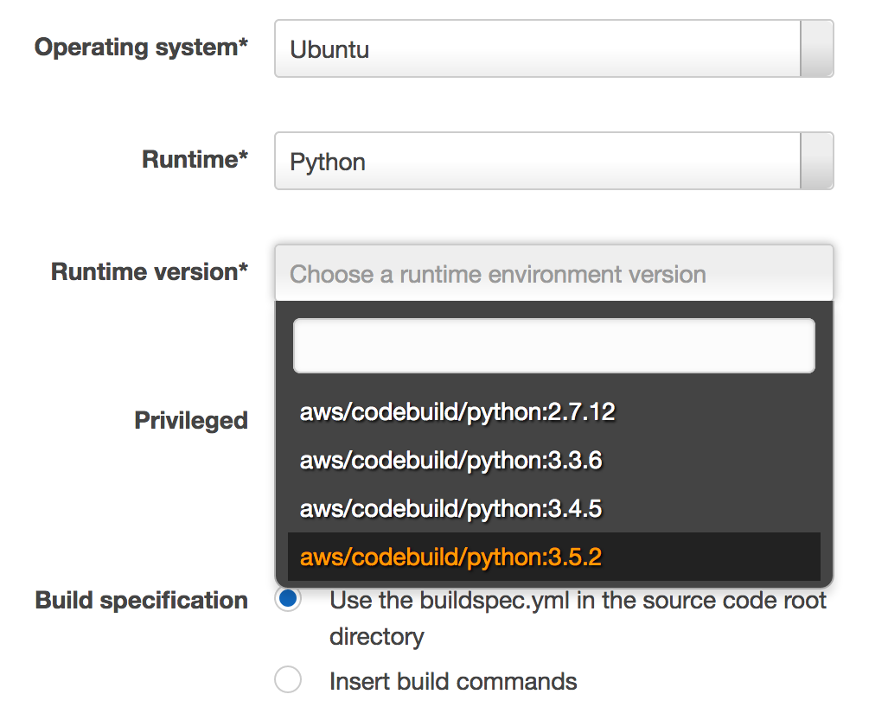
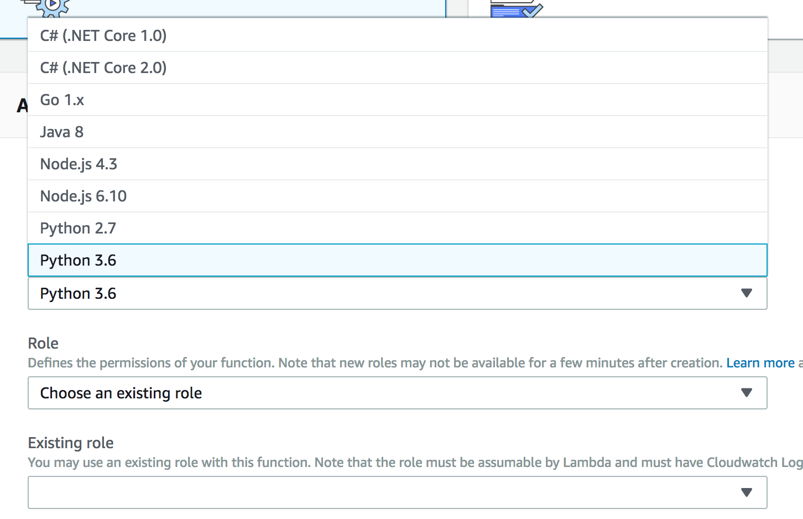

# AWS Lambda Python Notes

最近剛好用到 AWS Lambda 上跑 Python + pandas 的情境，寫一下 library 準備的 tips


## 準備相依 library

因為 pandas 這類科學計算用的 library，大多包有 native library 在裡面。在官方手冊上有教如何準備 library。
不過目前環境是 linux x86\_64 的機器，那我們其實可以簡單地運用 docker 來準備它：

```
mkdir -p data
docker run -it --rm -v `pwd`/data:/data -w /data python:3.6 pip install pandas -t /data
```

上面的指令其實就是，建立一個 data 資料夾，並在 docker 啟動時 mount 進去而已。再指定 pip 要裝到 data 資料夾內，執行完後你可以發現它抓的版本就是給 linux 使用的:

```
qty:data qrtt1$ find . -name "*.so" |head
./numpy/.libs/libopenblasp-r0-39a31c03.2.18.so
./numpy/core/_dummy.cpython-36m-x86_64-linux-gnu.so
./numpy/core/multiarray.cpython-36m-x86_64-linux-gnu.so
./numpy/core/multiarray_tests.cpython-36m-x86_64-linux-gnu.so
./numpy/core/operand_flag_tests.cpython-36m-x86_64-linux-gnu.so
./numpy/core/struct_ufunc_test.cpython-36m-x86_64-linux-gnu.so
./numpy/core/test_rational.cpython-36m-x86_64-linux-gnu.so
./numpy/core/umath.cpython-36m-x86_64-linux-gnu.so
./numpy/core/umath_tests.cpython-36m-x86_64-linux-gnu.so
./numpy/fft/fftpack_lite.cpython-36m-x86_64-linux-gnu.so
```

總大小其實蠻巨大的，要注意一下它不可以超過 [AWS Lambda Limits](https://docs.aws.amazon.com/lambda/latest/dg/limits.html) 的限制：



```
qty:data qrtt1$ du -h -s
170M    .
```

### 超出限制怎麼辦

若是 zip 檔超過限制，時則有另一招可以用來 work around：

* python 的 module search path 是 runtime 可以變更的
* 將超出限制的部分，放在 s3 上，下載回來解壓縮，並加入 module search path (也就是 sys.path)
* aws lambda 的 `/tmp` 內是可以寫入的空間

以下是以 pandas library 實驗的程式：

```python
import os, sys, time
import boto3
import logging

__bucket_name = 'the_bucket_you_put_library'

logging.basicConfig()
logger = logging.getLogger('perf')
logger.setLevel(logging.INFO)

def stopwatch(func):
    def with_logging(*args, **kwargs):
        start_time = time.time()
        try:
            return func(*args, **kwargs)
        finally:
            end_time = time.time()
            logger.info("func[ {:16s} ] :: {:.3f}".format(func.__name__, end_time - start_time))
            pass

    return with_logging

def dir(p, filename = None):
    target = os.path.join('/tmp/extra', p)
    if not os.path.exists(target):
        os.makedirs(target)
    if filename:
        return "{}/{}".format(target, filename)
    else:
        return target

@stopwatch
def prepare_dir():
    
    s3 = boto3.resource('s3')
    if not os.path.exists(dir('downloads', 'pandas.zip')):
        s3.Object(__bucket_name, 'pandas.zip').download_file(dir('downloads', 'pandas.zip'))
        cmd = "bash -c 'cd {}; unzip {} -d {} '".format(dir('libs'), dir('downloads', 'pandas.zip'), dir('libs'))
        os.system(cmd)
    

def lambda_handler(event, context):
    prepare_dir()
    sys.path.append(dir('libs'))
    
    import pandas as pd
    print(pd.__doc__)
   
    return 'Hello from Lambda'

```

結果為：

* 需要約 30 秒準備 library，其中 6 秒大約是由 s3 下載的時間
* 雖然需要很久，但至少能將 library 放進去了

```
Response:
"Hello from Lambda"

Request ID:
"75f55322-2bef-11e8-823a-fb6239c1b277"

Function Logs:
START RequestId: 75f55322-2bef-11e8-823a-fb6239c1b277 Version: $LATEST
[INFO]	2018-03-20T03:34:01.587Z	75f55322-2bef-11e8-823a-fb6239c1b277	func[ prepare_dir      ] :: 30.103

pandas - a powerful data analysis and manipulation library for Python
=====================================================================

**pandas** is a Python package providing fast, flexible, and expressive data
structures designed to make working with "relational" or "labeled" data both
easy and intuitive. It aims to be the fundamental high-level building block for
doing practical, **real world** data analysis in Python. Additionally, it has
the broader goal of becoming **the most powerful and flexible open source data
analysis / manipulation tool available in any language**. It is already well on
its way toward this goal.

Main Features
-------------
Here are just a few of the things that pandas does well:

  - Easy handling of missing data in floating point as well as non-floating
    point data
  - Size mutability: columns can be inserted and deleted from DataFrame and
    higher dimensional objects
  - Automatic and explicit data alignment: objects can  be explicitly aligned
    to a set of labels, or the user can simply ignore the labels and let
    `Series`, `DataFrame`, etc. automatically align the data for you in
    computations
  - Powerful, flexible group by functionality to perform split-apply-combine
    operations on data sets, for both aggregating and transforming data
  - Make it easy to convert ragged, differently-indexed data in other Python
    and NumPy data structures into DataFrame objects
  - Intelligent label-based slicing, fancy indexing, and subsetting of large
    data sets
  - Intuitive merging and joining data sets
  - Flexible reshaping and pivoting of data sets
  - Hierarchical labeling of axes (possible to have multiple labels per tick)
  - Robust IO tools for loading data from flat files (CSV and delimited),
    Excel files, databases, and saving/loading data from the ultrafast HDF5
    format
  - Time series-specific functionality: date range generation and frequency
    conversion, moving window statistics, moving window linear regressions,
    date shifting and lagging, etc.

END RequestId: 75f55322-2bef-11e8-823a-fb6239c1b277
REPORT RequestId: 75f55322-2bef-11e8-823a-fb6239c1b277	Duration: 34092.77 ms	Billed Duration: 34100 ms 	Memory Size: 128 MB	Max Memory Used: 128 MB	
```

### Work Around 應用建議

* 由於解壓縮的時間會很久，最好是能避勉使用 Work Around
* 若真的需要 Work Around，那僅將超出的範圍使用 Work Around 以獲得最佳的啟動速度

## Code Build 與 Lambda

隨著 AWS 提供越來越多好用的功能，蠻多開發者漸漸將 CI/DI 環境搬上 AWS 上，像是

* 將原程碼放入 codecommit
* 啟用 codepipeline 來管理 CI/CD
* 使用 codebuild 編譯，打包，測試
* 透過 codedeploy 部署服務

若是你的 python 應用程式，有用到 native library 對好是要能配得上 python 的 minor version (特別是透過 cpython 提昇效的)。例如下列版本對 native library 是有差異的：

* python 3.4
* python 3.5
* python 3.6
* python 3.7

舉例來說，若是在 docker python:3.5 與 python:3.6 下進行 pip install，你會得到不同預編版本的 .so：

```
./pandas/_libs/json.cpython-35m-x86_64-linux-gnu.so
```
```
./pandas/_libs/json.cpython-36m-x86_64-linux-gnu.so
```

它們需要對應的版本才能使用，其中 `35m` 就是代表 python `3.5`；`36m` 就是 `3.6`。以撰文的時間來說，目前 codebuild 提供的 aws managed docker image 最高支援到 `3.5`：



而 aws lambda 目前支援的最高版本為 `3.6`：



考慮下列情境：

* 在 codebuild 打包 lambda 用的 python package 給 lambda 用
* 在 codebuild 內使用 pip install 安裝相關的 native library

都選擇內建最新的 python 支援版，那就會變成包了 3.5 的 native library 給 3.6 使用。最後，在 lambda invocation 時發生了 import error。

### 確保 Python 版本一致

要解決版本不一致而發生的問題，有幾個選項：

1. 使用 codebuild 與 lambda 都有的 2.7 版 (這不推薦，因為大方向是朝 3.x 版前進)
1. 讓 codebuild 吃開發者預包的 docker image 提供與 aws lambda 對應版本的 Python
1. pip install 的動作，不要在 codebuild 上執行，而是預包好，在 codebuild 時下載回來使用而已

後二者是比較推薦的方案，而提供客製的 docker image 的優點就是，能在 codebuild 環境下編譯，打包，測試。缺點是得自己維護 docker image。

另一個方案是預包 Library，在 codebuild 內只是將它合併起來。舉例來說，我能在 s3 上先準備好 native library：

```
Pandas_cpython-36m-x86_64-linux.zip
```

在 codebuild 時，將它下載回來，並將需要包進去的檔案，透過 zip 指令附加進去：

```
zip -u Pandas_cpython-36m-x86_64-linux.zip a.py b.py …
```

這麼做是省下 pip 的時間，但缺點就是無法在 codebuild 內跑測試，因為 python 版本對不上。但也能透過在 codebuild 的過程中，建立臨時的 lambda function 部署上去，跑一次整合測試來達成目標。

