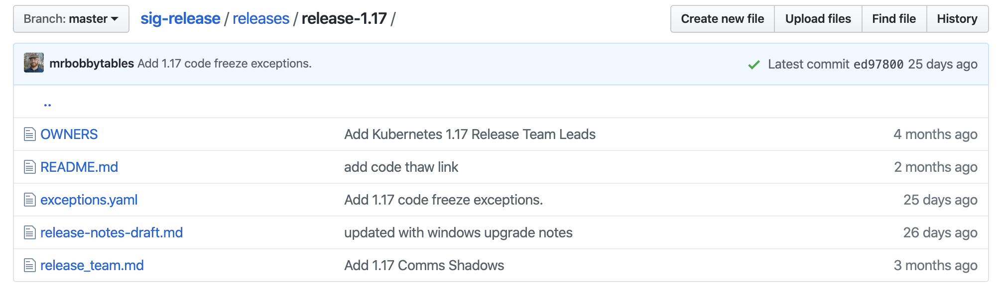

# Kubernetes 升級準備

無論使用 Managed Kubernetes 或是自建的 Kubernetes 皆面臨升級的問題。因為 Kubernetes 以每 3 個月推進一個小版號的週期在釋出新的版本，並且僅支援最後 3 個新的版本。由這個週期來說，至少每 9 個月得升級一次。

若是打定主意不升級會發生什麼事呢？對那些已不在支援週期的版本，開發團隊不再接受任何 Security Patch，也不會有新的發佈計劃。若是遇上了需要處理的安全問題，那麼可能的選擇是：

* 使用者自行 Patch 自行編譯出需要的版本
* 升級 Kubernetes 至有 Patch 的版本

自行 Patch 的方法只對自建 Kubernetes 的使用者適用，但這是最不得已的選擇。正常來說，乖乖升級至有開發團隊維護的版本才是正途。只是 Kubernetes 升級總是充滿驚奇，不免讓人有點抗拒。

## Kubernetes 官方支援的版本

在 Kubernetes [Getting Started](https://kubernetes.io/docs/setup/) 文件放著一份最新版的 Release Notes，使用者可以由這版文件得知目前支援的最新版本。在這頁中，還有另一個重要的知識 [Kubernetes version and version skew support policy](https://kubernetes.io/docs/setup/release/version-skew-policy/)：

> The Kubernetes project maintains release branches for the most recent three minor releases.

> Minor releases occur approximately every 3 months, so each minor release branch is maintained for approximately 9 months.

它說，開發團隊會維護最近的 3 個 minor 版本，而每 3 個月推出一版。所以，每個小版的維護週期是 9 個月。這些資訊即為我們預估，至少 9 個月得升級一次 Kubernetes 的依據。

我們可以由 Kubernetes 的 [sig-release](https://github.com/kubernetes/sig-release) 提供的記錄查到更精確的時間，在 [Kubernetes Patch Releases](https://github.com/kubernetes/sig-release/blob/master/releases/patch-releases.md) 中獲得支援 Patch 的版本，與哪些版本已移出支援的列表。在 Timeline 部分，可以看出：

* *These releases are no longer supported.* 為界，在這行之後的都是不再支援的版本。
* 1.14 版最後 1 個 Patch 時間是 `2019-12-11`
* 1.17 版預計在 `2020-01-14` 釋出第 1 份 Patch (本文撰寫時，它才剛發佈 1.17 沒多久，待蒐集需要 Patch 的內容)
* 由上述日期，可以期待約在 2020 的 4 月會推出 1.18，並導至 1.15 EOL。利用這些訊息能作為升級時程規劃的參考。

若你對特定的版本釋出時程有興趣，可以在同一個 repo 內查閱。[以 1.17 為例](https://github.com/kubernetes/sig-release/tree/master/releases/release-1.17)，它在 
 
* 2019/9/18 開始
* 2019/10/1 釋出 alpha.1
* 2019/10/29 釋出 beta.0
* 2019/11/14 Code Freeze
* 2019/11/22 rc.1
* 2019/11/22 Code Thaw (解凍，開始收 cherry-pick)
* 2019/12/2 Cherry-Pick 終止日
* 2019/12/9 釋出 1.17

## Managed Kubernetes 支援的版本

對 Managed Kubernetes 的版本選擇就相對單純些，一來是它們的版本通常落後於官方版本一二個版號，但這倒不必太擔心這些版本已不在官方版本的支援列表上。對於有能力且人力充足自行維護 Kubernetes 的 Cloud Provider 它們能自行上 Security Patch。對使用者來說，只需要注意升版通知與舊版棄用的訊息。

* AWS, [Amazon EKS Kubernetes Versions](https://docs.aws.amazon.com/eks/latest/userguide/kubernetes-versions.html)
* Azure, [Supported Kubernetes versions in Azure Kubernetes Service (AKS)](https://docs.microsoft.com/zh-tw/azure/aks/supported-kubernetes-versions)
* GKE, [Release notes](https://cloud.google.com/kubernetes-engine/docs/release-notes)

若你發現，你用的 Managed Kubernetes 跟官方版的升級很近，那大概是沒有充足的人力去自行維護，直接追隨官方發佈的版本。

儘管使用 Managed Kubernetes 在升級上只需要透過 Dashboard 簡單操作一下就能完成，但不管是自建的 Kubernetes 或 Managed Kubernetes，除了在時程規劃上不同之外，其餘的準備工作是一樣的。

## 研讀 CHANGELOG

每一版的 Kubernetes 都有 Release Notes，對於 Managed Kubernetes 來說，以 API Changes 部分為主，特別是版號的變更，要注意哪些 Kubernetes Object 在升級原先的版號會消失，得改用新的版號。對於自建 Kubernetes 的情境，得再關注各 control plane 部分的變更（像是 kube-apiserver、kubelet、kube-proxy 等）

sig-release repo 中有著各別版本的 Release Notes，它們都是草稿的型式存在。

最終，它會被整理，併入 [Kubernetes repo](https://github.com/kubernetes/kubernetes) 內，成為 CHANGELOG 的一部分。

假設，現在使用的版本是 1.14，打算替升級至 1.15 做準備，那能開啟 [1.15 的 CHANGELOG](https://github.com/kubernetes/kubernetes/blob/master/CHANGELOG-1.5.md) 觀看 Release Notes 部分：

* What's New: 通常不用那麼早看，新加的東西一般來說不會讓舊版壞掉，但舊的東西不見了，會讓你的 Cluster 壞掉。
* Known Issues: 已知但還沒修好的問題，這通常不急迫會在後續的 Patch 修正，只是要瞄一眼看看是不是剛好自己有使用的功能受影響。
* Deprecations and Removals: 對一般使用者來說必看的是 API 改變的部分。
* Metrics Changes: 若你有安裝 Grafana，建立自己的 Dashboard，或社群的 Dashboard。這裡標示相關 metric 名稱的改變，或是拔掉了不再使用的部分，這就只能配合它修改囉。
* Urgent Upgrade Notes: 這是必看的段落，也是最先要確認的部分。

以 Network 與 Node 為例：

Network 提到 kube-proxy 的 `--conntrack-max` 參數被移除，要改用另外的參數。如果你發現升級得 kube-proxy 因為不認得 `--conntrack-max` 參數而啟動失敗，那這份文件就是告訴你該換成什麼參數。

Node 相關的部分，它提到 kubelet 不再支援 `--allow-privileged` 參數，需要由參數將它移除。『然後呢？』後續似乎沒寫得很清楚，我們可以再用 `--allow-privileged` 去尋找文件的其他段落，或看相關的 [issue #77820](https://github.com/kubernetes/kubernetes/pull/77820)，可以知道後續相關的功能，可由 PodSecurityPolicy 控制。

## Deprecations and Removals

在 Deprecations and Removals 的段落中，若是自建的 Kubernetes 優先看 contorl plane 的部分。若是 Managed Kubernetes 與一般使用者，直接看 API 相關的變更即可：

> DaemonSet, Deployment, and ReplicaSet resources will no longer be served from `extensions/v1beta1`, `apps/v1beta1`, or `apps/v1beta2` in v1.16. Migrate to the `apps/v1` API, available since v1.9. Existing persisted data can be retrieved via the `apps/v1` API.

以第 4 點為例，DaemonSet、Deployment 與 ReplicaSet，由 `extensions/v1beta1` 搬至 `apps/v1beta1`，並預告在 1.16 版，它們會變為 `apps/v1`。

看到這個，就是要去檢視現有的 Kubernetes Object 是否用到相關的 API 版本。

PS. 看完重點部分後，蒐集整份文件的 `Action Required`，有相關的部分就記錄起來，列為升級要處理的項目。

## 安全、安穩的升級

這篇文件是記錄了先前規劃 Kubernetes 升級時查閱的相關資料，看完這些資料只是升級規劃的起步，接著還得進行實際的升級演練，並撰寫計劃文件，確保公司的產品與個別的第 3 方套件都能正常運作。

同時，儘可能地針對目前開發中的產品，在不同的 Kubernetes 版本上，運行 CI/CD 流程，執行 unit test 與 end-to-end test。這流程減少 API 變更帶來的影響。未來得規劃 vendor 測試 (非 client-go 實作的 client，例如：python 版本的 client library 是否相容於新的 Kubernetes 版本) 來查驗基礎建設的部分，也能順在不同的 Kubernetes 上運作。

希望這份文章，有助於讀者對於 Kuberntes 維運與升級計劃擬定。