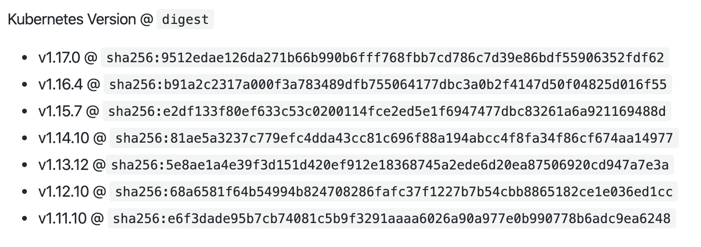
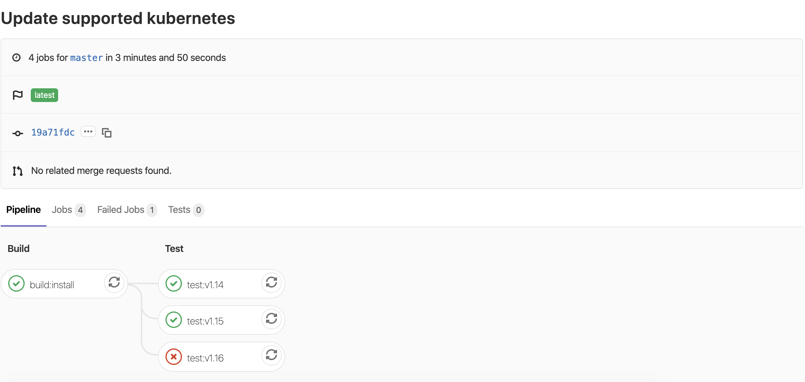
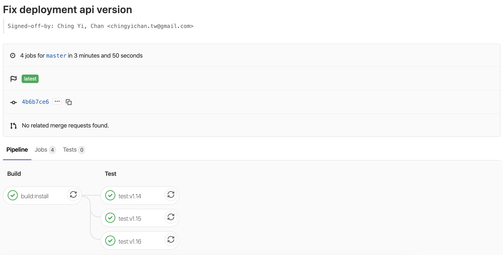

# Kubernetes in Docker (kind)

[kind](https://kind.sigs.k8s.io/) 是 Kubernetes 下的一個子專案，它其實是 Kubernetes IN Docker 的縮寫。

> kind is a tool for running local Kubernetes clusters using Docker container “nodes”.
> kind was primarily designed for testing Kubernetes itself, but may be used for local development or CI.

在 kind 最初是被設計用來測試 Kubernetes 用的，畢竟要架設一個可用的最小 Kubernetes 在過去並不是那麼容易，並且它目標只要有 Docker 的環境就能執行。運用 kind 搭配指定的 Kubernetes image 快速建立出特定版本的 Kubernetes 以便快速地執行各種測試。

因為有 Docker 就能跑的設計，讓它也成為在本地端開發的選項之一。開發者不用特別裝特定的 VM 或是得處理因為安裝開發環境而弄亂自己的開發環境。於是，kind 也被廣泛使用在 CI 的情境。舉例來說，我們可以使用 gitlab ci 搭配 docker runner 與 kind 搭建 Kubernetes 測試環境。

## kind in 5 minutes

kind 安裝方式相當簡單，直接在 [release](https://github.com/kubernetes-sigs/kind/releases) 頁面下載執行檔回來用即可。

```
kind creates and manages local Kubernetes clusters using Docker container 'nodes'

Usage:
  kind [command]

Available Commands:
  build       Build one of [base-image, node-image]
  completion  Output shell completion code for the specified shell (bash or zsh)
  create      Creates one of [cluster]
  delete      Deletes one of [cluster]
  export      Exports one of [kubeconfig, logs]
  get         Gets one of [clusters, nodes, kubeconfig]
  help        Help about any command
  load        Loads images into nodes
  version     Prints the kind CLI version

Flags:
  -h, --help              help for kind
      --loglevel string   DEPRECATED: see -v instead
  -q, --quiet             silence all stderr output
  -v, --verbosity int32   info log verbosity
      --version           version for kind

Use "kind [command] --help" for more information about a command.
```



配合安裝的 kind 版本，在 release notes 上查出建議的 image 對照表。用它能建出適當版本的 kubernetes

```
kind create cluster --image kindest/node:v1.16.4@sha256:b91a2c2317a000f3a783489dfb755064177dbc3a0b2f4147d50f04825d016f55
```

```
(⎈ N/A:N/A)➜  ~ kind create cluster --image kindest/node:v1.16.4@sha256:b91a2c2317a000f3a783489dfb755064177dbc3a0b2f4147d50f04825d016f55

Creating cluster "kind" ...
 ✓ Ensuring node image (kindest/node:v1.16.4) 🖼
 ✓ Preparing nodes 📦
 ✓ Writing configuration 📜
 ✓ Starting control-plane 🕹️
 ✓ Installing CNI 🔌
 ✓ Installing StorageClass 💾
Set kubectl context to "kind-kind"
You can now use your cluster with:

kubectl cluster-info --context kind-kind

Have a question, bug, or feature request? Let us know! https://kind.sigs.k8s.io/#community 🙂
```

```
(⎈ N/A:N/A)➜  ~ kind create cluster --image kindest/node:v1.15.7@sha256:e2df133f80ef633c53c0200114fce2ed5e1f6947477dbc83261a6a921169488d

Creating cluster "kind" ...
 ✓ Ensuring node image (kindest/node:v1.15.7) 🖼
 ✓ Preparing nodes 📦
 ✓ Writing configuration 📜
 ✓ Starting control-plane 🕹️
 ✓ Installing CNI 🔌
 ✓ Installing StorageClass 💾
Set kubectl context to "kind-kind"
You can now use your cluster with:

kubectl cluster-info --context kind-kind

Have a nice day! 👋
```

有了 kind 後，接著就能直接用 kubectl 來操作它，它建立了單 node 的 kubernetes

```
(⎈ kind-kind:default)➜  ~ kubectl get node
NAME                 STATUS   ROLES    AGE    VERSION
kind-control-plane   Ready    master   3m3s   v1.15.7
```

並裝了這些東西：

```
(⎈ kind-kind:default)➜  ~ kubectl get all --all-namespaces
NAMESPACE            NAME                                             READY   STATUS    RESTARTS   AGE
kube-system          pod/coredns-5d4dd4b4db-n8wpl                     1/1     Running   0          2m31s
kube-system          pod/coredns-5d4dd4b4db-wxtd9                     1/1     Running   0          2m31s
kube-system          pod/etcd-kind-control-plane                      1/1     Running   0          91s
kube-system          pod/kindnet-klbxt                                1/1     Running   0          2m31s
kube-system          pod/kube-apiserver-kind-control-plane            1/1     Running   0          109s
kube-system          pod/kube-controller-manager-kind-control-plane   1/1     Running   0          114s
kube-system          pod/kube-proxy-qhrm5                             1/1     Running   0          2m31s
kube-system          pod/kube-scheduler-kind-control-plane            1/1     Running   0          112s
local-path-storage   pod/local-path-provisioner-d4947b89c-nv667       1/1     Running   0          2m31s

NAMESPACE     NAME                 TYPE        CLUSTER-IP   EXTERNAL-IP   PORT(S)                  AGE
default       service/kubernetes   ClusterIP   10.96.0.1    <none>        443/TCP                  2m48s
kube-system   service/kube-dns     ClusterIP   10.96.0.10   <none>        53/UDP,53/TCP,9153/TCP   2m46s

NAMESPACE     NAME                        DESIRED   CURRENT   READY   UP-TO-DATE   AVAILABLE   NODE SELECTOR                 AGE
kube-system   daemonset.apps/kindnet      1         1         1       1            1           <none>                        2m43s
kube-system   daemonset.apps/kube-proxy   1         1         1       1            1           beta.kubernetes.io/os=linux   2m46s

NAMESPACE            NAME                                     READY   UP-TO-DATE   AVAILABLE   AGE
kube-system          deployment.apps/coredns                  2/2     2            2           2m46s
local-path-storage   deployment.apps/local-path-provisioner   1/1     1            1           2m42s

NAMESPACE            NAME                                               DESIRED   CURRENT   READY   AGE
kube-system          replicaset.apps/coredns-5d4dd4b4db                 2         2         2       2m31s
local-path-storage   replicaset.apps/local-path-provisioner-d4947b89c   1         1         1       2m31s
```

## 在 CI 中執行

運用 kind 只要有 docker 就能執行的特性，我們可以試著把它放入支援 docker 的 CI 服務中執行。要在 gitlab ci 中執行 docker 指令，我們需要使用到 docker in docker 的做法，對細節有興趣的朋友可以直接看[範例](https://gitlab.com/qrtt1.infuseai/kind-ci-sample)，概念其實只有：

* 替 ci job 指定一個裝好 docker 工具的 image
* 啟動 dockerd 放在背景跑，並確認 docker 指令能正常運作
* 安裝測試所需的工具：kind 與 kubectl
* 建立好 kubernetes cluster 後，進行一些實際的操作確認有沒有什麼東西壞掉了

## 相容性測試

由於 Kubernetes 本身與各式相依的專案還在快速發展的階段，為了確認各個環節的相容性常，常需要將特定的專案或相依的函式庫在不同的 Kubernetes 版本中安裝測試。

對現代化的 CI 來說 matrix build 是相當基本的功能，我們能用個簡單的 Deployment 來展示相容性問題：

```yaml
apiVersion: extensions/v1beta1
kind: Deployment
metadata:
  name: nginx-deployment
  labels:
    app: nginx
spec:
  replicas: 3
  selector:
    matchLabels:
      app: nginx
  template:
    metadata:
      labels:
        app: nginx
    spec:
      containers:
      - name: nginx
        image: nginx:1.7.9
        ports:
        - containerPort: 80
```

選用了一個即將被移除的版本 `extensions/v1beta1` 作為案例，在實際的情境它可能是：

* 不同語言實作的 client
* 同一個版本的 Kubernetes Object 在不同版本的 Cluster 有著不同的行為
* 你的軟體安裝是否能依不同 Kubernetes 版本自動調整


多版本測試設定如下：

```yaml
test:v1.14:
  <<: *vendor_test_job
  variables:
    KIND_NODE_TAG: v1.14.10@sha256:81ae5a3237c779efc4dda43cc81c696f88a194abcc4f8fa34f86cf674aa14977

test:v1.15:
  <<: *vendor_test_job
  variables:
    KIND_NODE_TAG: v1.15.7@sha256:e2df133f80ef633c53c0200114fce2ed5e1f6947477dbc83261a6a921169488d

test:v1.16:
  <<: *vendor_test_job
  variables:
    KIND_NODE_TAG: v1.16.4@sha256:b91a2c2317a000f3a783489dfb755064177dbc3a0b2f4147d50f04825d016f55
```

在這個 `.gitlab-ci.yml` 片段中，僅僅將標準範本的 kind 建立 cluster 指令參數化，透過環境變數填入指定的版本：

```
kind create cluster --image kindest/node:$KIND_NODE_TAG
```

日後的維護就只是：

1. 增加新的 use case
2. 移動支援的 Kubernetes 版本範圍


例如，加一組 `v1.17` 的版本：

```
test:v1.17:
  <<: *vendor_test_job
  variables:
    KIND_NODE_TAG: v1.17.0@sha256:9512edae126da271b66b990b6fff768fbb7cd786c7d39e86bdf55906352fdf62
```

## 案例展示

在 [v1.15](https://github.com/kubernetes/kubernetes/blob/master/CHANGELOG-1.15.md#deprecations-and-removals) 的 Release Notes 中提到：

> - DaemonSet, Deployment, and ReplicaSet resources will no longer be served from `extensions/v1beta1`, `apps/v1beta1`, or `apps/v1beta2` in v1.16. Migrate to the `apps/v1` API, available since v1.9. Existing persisted data can be retrieved via the `apps/v1` API.

所以，我們預期這次選用的 Deployment 範例會爆炸：



查詢 job 的記錄，會發現這樣的錯誤：

> error: unable to recognize "nginx-deployment.yaml": no matches for kind "Deployment" in version "extensions/v1beta1"

如果是一個真實的情境，就是我還不知道哪些東西升級後會有問題，當它有問題時，我回頭看一下 Release Note，原來應該改成 `apps/v1` 它在 `v1.9` 就支援了，我改成它可以放心地支援目前我所有的版本。[修正後的版本](https://gitlab.com/qrtt1.infuseai/kind-ci-sample/commit/4b6b7ce633c7ecf8616ae254ea57fd94e3b22bd1)，就讓整個 pipeline 內的測試都通過囉：



## 結語

在 Kubernetes 快速發展與軟體署部環境漸漸往它靠攏的潮流，要開發出品質穩定的服務、軟體真是相當大的挑戰。還好有 kind 這樣簡單易用的測試㻲境建構工具，能輔助開發者簡化測試環境準備的部分。

我們只需要再付出一點努力，維護 use case 並隨著每 3 至 6 個月，調整一下要測試的 Kubernetes 版本，這是相當值得投資的基礎建設。