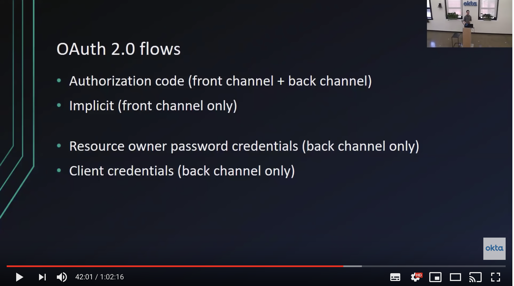

# 電影欣賞《OAuth 2.0 and OpenID Connect (in plain English)》

[OAuth 2.0 and OpenID Connect (in plain English)](https://youtu.be/996OiexHze0) 用很淺顯易懂的例子解說 OAuth 2.0 的應用以及為何需要 OpenID Connect 的原因。

## 過去的開發者是怎麼實作 Identity 的呢？

由最簡單的 [Simple Login (Form authentication) 2:10](https://youtu.be/996OiexHze0?t=130) 說起，這是許多人在 Web 開發的練習過程中會實作的認證方式，然而，這樣的實作方式有些 [缺點 (downsides) 3:32](https://youtu.be/996OiexHze0?t=212)，首先會遇到的基本的 Security 問題，我們該如何正確處理使用者的敏感資料，特別是密碼該怎麼存才符合 best practice？實作出來的東西好不好維護，有瑕玼時好不好改寫呢？由今日 (2018) 回顧過去的實作，也許我們該放棄自行實作 Authentication，大力擁抱符合工業標準的 OAuth 2.0 與 OpenID Connect。

[OAuth 技術中有著太多令人困惑的資訊 4:31](https://youtu.be/996OiexHze0?t=271)，就在幾週前我開始學習相關技術時，就陷入了對各種術語困惑的窘境，即使到了今天，我依然感到有些混亂。如果你試著透過 Google 在網路上查詢相關的資料來學習，在一開始先困擾你的是術語與行話太多，如果你還沒有真的理解它如何運作，那多半是一頭霧水的。接著，在你似懂非懂之際，還會遭遇了網上各種『建議』，有些已經過時了，但沒有概念去挑出哪些是有用的建議。... 所以，我今天主要的目標是儘可能少一點的術語，試著帶給大家少一點的困惑。

[假設，我們有個時光機! 6:40](https://youtu.be/996OiexHze0?t=400)，帶我們回到 10 多年前，大約在 2006 至 2007 之間。這真是一個很久的時間，在那個年代 Smart Phone 還沒出現。在那個年代的 Web Application 實作 Login 的 best practice 跟現在是截然不同的。

> [IPhone 2G](https://zh.wikipedia.org/wiki/IPhone_2G) 於 2017 年 1 月問世

[Identity use cases (pre-2010) 7:21](https://youtu.be/996OiexHze0?t=441)，有大家都熟悉的 Simple login 與實作 SSO 用的 SAML 協定，那麼該怎麼做手機上的認證 (Mobile app login) 或委派授權 (Delegated authorization) 還沒有適當的做法。其中 *Delegated authorization* 其實是比較偏學術上的名詞，聽起來比較枯躁一些，但它是這次分享的主要焦點 (也就是 OAuth 2.0 的部分)。

[The delegatd authorization problem 9:21](https://youtu.be/996OiexHze0?t=561)，就是

> 如何讓某個網站存取我的資料，但不需要給它我的密碼

[在 10 多年前 10:20](https://youtu.be/996OiexHze0?t=620)，還沒有好的方式來處理這樣的問題，於是就用了壞的方法來實作它囉：

由現在回頭看這例子，實在太糟了，但在當時卻是相當普遍的做法。舉例來說，它為了取得你 Google 上的聯絡人，他要求了你的 Gmail 帳號與密碼，它會替你登入你的 Gmail 帳號，並取得它需要的資料。這真的是個相當糟的做法，在此時此刻你不該再這麼實作了。不過，這是一個相當好的例子，來展示一下過去的人們怎麼處理這樣的問題。

## 運用 OAuth 實作委派授權

[接著，我們來談談該怎麼正確地解決這個問題 13:02](https://youtu.be/996OiexHze0?t=782)：Delegated authorization with OAuth 2.0

(講者：這張圖在影片中大約會出現 5 次，由最抽象層次貼近純英文的解說，一次一次展開一點細節。每回會附上些許的 OAuth 概念或術語)

前情提要：

* 我信任 Gmail 證認而且也信任 Yelp，願意授權它存取我在 Gmail 中的聯絡人資料
* 在 Yelp 的網站上，它提供 "Connect with Google" 的功能 (這功能就是即將介紹的 OAuth Flow)

示意圖的流程：

1. [當使用者按下 "Connect with Google" 後 13:48](https://youtu.be/996OiexHze0?t=828)，它會 redirect 到 Google 的 domain
2. 當使用者被導入 Google 頁面後，它會要求使用者登入。(與舊時代的實作相比，這顯然好多了。使用者是給帳密給了 Google 而不是 Yelp)
3. 登入後，Google 頁面接著會詢問使用者，是否願意授權 Yelp 存取 *public profile and contacts*
4. 使用者同意 (或不同意)，網頁會導回 Yelp 的 RedirectURI (yelp.com/callback)
5. (這步就是比較 magic 的部分了，因為使用者不會看到，在背景發生的) Yelp 向 Google 取得了聯絡人資訊

在後續的解說，我們會帶入正確的術語，解析目前 *magic* 的部分。

[OAuth 2.0 terminology 15:51](https://youtu.be/996OiexHze0?t=951)，這些術語雖然看起來有點嚇人，但它們只是現實事物的另一種稱呼方式：

* Resource owner：就是實際的使用者，擁有資料的那個人。也就是實際的 Application 想要索取資料的對象。舉例來說，我有通訊錄在 Google 網站上，我是這項資源 (Resource) 的擁有者，並且我是那個可以決定這些資源可以被誰存取的人
* Client：其實就是另一種指稱 Applicaion 的方式，以我們目前的例子 Yelp 就是 Client，就是那個想取得資料的 Application
* Authorization server：是個負責顯示『同意書』的系統，就是使用者決定 Yes/No 的那一頁。目前的例子就是 accounts.google.com
* Resource server：實際存儲資料的 Server，目前的例子就是 Google API Server。有時候 Authorization server 與 Resource server 是放在一起的，多數的情況它們是獨立的。
* Authorization grant：當使用者同意後，Client 會收到的授權訊息。
* Redirect URI：Authorization server 接收了 Client 的請求後，歷經各種流程後，它可以由最初 Client 帶的 Redirect URI 知道要回去哪裡，它有時也被稱為 callback。
* Access token：這才是 Client 真正需求的東西，它是幫助 Client 向 Resource server 取得被授權資料的重要參數。(也就是上一段提到的 *magic* 發生的部分)

[讓我們用新的概念，再看一次整個 flow 18:54](https://youtu.be/996OiexHze0?t=1134)

1. 由 Client 開始，由我 (Resource owner) 按下 "Connect with Google" 鈕
2. 我被 redirect 至 accounts.google.com (Authorization server)，實務上只要是支援 OAuth flow 的都行，例如 Facebook 的 Authorization server

  > 在進入下一步前，先看看 Client 送給 Authorization server 的參數，一個是 Redirect URI 讓 Authorization server 知道，最後要返回的地點。還有 Response type 該是什麼，以目前的例子，我們要求 *code*。它全稱是 Authorization code，在 spec 上就是 *Authorization Code Grant Flow*，它表示完成所有流程後 Client 會得到一個 *code*

3. 接著詢問使用者是否同意授權給 Yelp 權限
4. 透過 Redirect URI 導回 Yelp

  > Client 會得到 Authorization code，這是一開始 Client 向 Authorization server 要求的東西。基本上，這個 code 沒有太大的功能，它只能被用來取得 access token。

5. Client 使用 code 跟 Authorization server 交換 access token
6. 最後，得到 access token 的 Client 使用它向 Resource server 取得資料

> 畫面上虛線的流程，即為先前一展示的 *magic* 的部分

[上述的流程圖，基本上就是 OAuth Flow 完整的流程了 20:03](https://youtu.be/996OiexHze0?t=1323)，後續的內容只是針對細節再多加介紹。

## Scope 與 Consent Screen

[More OAuth 2.0 terminology](https://youtu.be/996OiexHze0?t=1376) 接著再多介紹 2 個術語：
* Scope：Authorization server 有一些它自訂的 scope，例如 contacts.read、contacts.write 或是 email.read、email.write，各種的授權內容是各自的系統定義的。當 Client 開始 flow 時，可以表示，它只在乎某些 scope，像它只想要能讀取通訊錄，也可能它想要各多的 scope，這視應用的情境而定。
* Consent：Client 送出請求後，使用者同意畫面 (Consent screen)，同時會將請求的 scope 表列出來給使用者查看。

有了新的概念後，[我們再看一次流程圖 24:49](https://youtu.be/996OiexHze0?t=1489)，沒有太大的變化，除了一開始 Client 發出請求的部分，多出了 `Scope: profile contacts`。可以注意到，多個 scope 是以空白相隔，Yelp 要求讀取 public profile 與 contacts。這也是為什麼在 Consent Screen 顯示 "Allow Yelp to access your *public profile and contacts*?"

## Front channel vs Back channel

[提問：為什麼我們需要取得 code 再交換 access code？為什麼我們不能直接使用 code 或直接取得 access code？26:30](https://youtu.be/996OiexHze0?t=1590)，這是個相當棒的問題，也正是下一階段要講解的主題。關於這麼做的提示，其實是流程圖中的虛線與實線之別。

[我們就來談談什麼是 Back channel 與 Front channel 27:08](https://youtu.be/996OiexHze0?t=1628)，先來說一下 highly secure channel，它其實就是 2 個 Server 間的通訊，例如 Yelp 與 Google 之間的通訊，在 https 保護下，互相傳遞訊息。而 front channel 就會是屬於在使用者端發生的事，像是瀏覽器。使用者透過瀏覽器發出請求，儘管算是安全的，但它的任何動作都是可以被檢視、查閱的，例如使用 Developer tools 開啟 console 來查看各種事物。因此，我們不太會將敏感的資料，直接放在使用者端有機會取得的地方。我們不能完全信任瀏覽器，所以它被視會 less secure channel，這也是為什麼流程被設計成這樣子。

[有了 Back / Font channel 的概念後，再來看一次流程圖 29:28](https://youtu.be/996OiexHze0?t=1768)，上面這些步驟都是發生在 front channel，這意謂著它透過瀏覽器位置重導來完成的。這部分的資料，即使有人開啟 Developer tool 去挖堀，我一點都不在乎。儘管有人去研究它經過了哪些 URL，或是 RedirectURI 是填什麼，Client 要求了什麼 Response type？這些都沒關係，沒有任何敏感資料在裡面。

接著，要交換 access code 的流程，改到 back channel 中，這主要是防止有人利用瀏覽器 plugin 偷看 access token (也可能是被裝了惡意程式)，透過 access code 來做些什。當交換 access token 的行為不是發生在瀏覽器時，使用者端就無法取得這組機密的資料 (secret key)。同理，接著向 Resource server 取得資料的動作也要用到 access token，我們也將它放在 back channel 處理。這樣的情境是有較高的全安性的。

## OAuth authorization flow demo

[在 34:00 進入 demo 的時間](https://youtu.be/996OiexHze0?t=2040)，使用 https://oauthdebugger.com/ 來展示 OAuth flow。

以 Google 的 OAuth 為例，在 Google 註冊好 OAuth Client ID 後，就能將相關的資料填進 Debug Tool 使用：

最終，它會替我們組出 Client 要向 Authorization Server 發送的 HTTP Request：

按下送出，轉接到使用者授權頁面：

使用者同意後，導回了 Client 端 (Debug Tool)，成功取得 Authorization code：

假設使用者沒有同意授權，[相關的 error 也會由 Redirect URI 的參數回傳 39:34](https://youtu.be/996OiexHze0?t=2374)。若是成功取得 *code*，那就要接著執行交換 access token 的流程，Debug Tool 會回下列的樣版讓你填寫：

若是接著完成 flow 取得 access token 那就能向 Resource Server 要資料囉！

## OAuth 2.0 flows

> 對各種 flow 有興趣的朋友，推薦閱讀[鴨七的 OAuth 2.0 筆記](https://blog.yorkxin.org/2013/09/30/oauth2-1-introduction.html)

先前所展示的是 Authorization code grant flow，[實際上還有其它種類的 flow 41:56](https://youtu.be/996OiexHze0?t=2516)。

* Authorization code：這個 flow 將敏感資料放在 back channel 處理，相對來說是較安全實作
* [Implict 42:10](https://youtu.be/996OiexHze0?t=2530)：這個 flow 常用在沒有 back channel 的情境，例如純粹前端的實作，配合第 3 方的 API Server。(這 flow 沒有 exchange code 的流程，直接得到 access token)

[其餘還有 2 個 flow 只用到 back channel](https://youtu.be/996OiexHze0?t=2584)：

* Resource owner password credentials 
* Client credentials

由於他們不要使用到 front channel，換句話說它沒有需要使用介入的流程，單純是後端 server 之間的對敲。

[Implict flow 43:54](https://youtu.be/996OiexHze0?t=2634) 的流程跟先前的只有微小的不同，首先是 Response type 換成了 *token*，由於沒有 back channel 就不需要 Redirect URI，最後 Client 只有 front channel，向 Resource server 要資料的行為就改在 front channel 執行 (注意：先前的流程它是虛線，現在是實線的)。

## OpenID Connect 

在 2014 的前後 OAuth 的成功已經讓它取代了過去實作 Identity 的方式，但它其實是被設計用來解決授權的問題，而不是認證 (Authentication) 的問題。在 OAuth flow 中壓根不在乎使用者是誰，對 Client 來說要知道現在授權的使用者是誰，[OAuth 並沒有提供標準的方法 47:47](https://youtu.be/996OiexHze0?t=2867)。

所以，相對的專家就討論起了這個問題，反正它就只是缺了身份認證需要的資訊，[那我們稍為修改一下規格來符合這個需求唄 48:30](https://youtu.be/996OiexHze0?t=2910)。加上的東西也不算多，請見下圖：

單純看功能有點抽象，直接看 flow 的差異就知道：

* 流程上一樣，但 scope 可以加上 openid，回傳的資料就會包含 ID token
* ID token 有基本的使用者資訊，若還是不足，可以再問標準的 endpoint `/userinfo`

接著講者開啟了 [OpenID Connect Debugger 52:30](https://youtu.be/996OiexHze0?t=3150) 展示新的流程。

> 在 2020 的今日，Google 早就支援 OpenID Connect，可以使用先前的 OAuth Debug Tool 操作 OAuth flow 就會有相關訊息。(許多 OAuth 實作，即使採用 code flow，也會自動被加上 openid scope)

[針對 ID token 的展示 53:41](https://youtu.be/996OiexHze0?t=3221) 主要是介紹 jwt 格式，以及方便的 https://jwt.io/ 

## 各種 flow 的使用情境

在演講的最後，簡單說明一下 [OAuth flow 適合的各種場景 57:20](https://youtu.be/996OiexHze0?t=3440)

## 參考資料

趁著年假閒閒，[想起了同事曾介紹過這個 Talk](https://www.facebook.com/popcornylu/posts/10213888813204094) 把它拿出來再複習了一次，看起來挺適合做電影欣賞的活動，於是就整理了這篇文章。

## 廣告：電影欣賞社

電影欣賞社是 twjug-lite 的虛擬活動主題，它是一種讓大家來欣賞 Tech Talk 的分享型式。這篇文章正好作為一個示範的例子：

1. 整理 timecode
2. 整理的型式不拘，可以單純對照講者投影片的頁數跟時間，也可以是稍加說明，結集成文章的型式
3. 衍生應用，多數的 Tech Talk 都有些概念與實例可以抽出『精華』，拿來煉成二創分享的材料。也可以取出其中的例子做成 workshop
4. 欣賞講者如何按排內容

