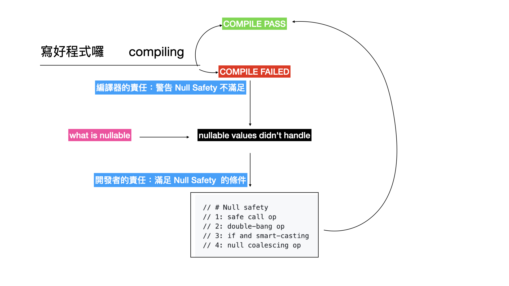

# 技術型讀書會的導讀

最近參加 [Kotlin 讀書會](https://www.facebook.com/shengyoufan/posts/10217385037839242)，進行的方式是先由主揪開場，再加接由導讀者進行導讀。在導讀過程中，或是導讀之後會進行討論。由於疫情的關係，這是個純線上參與的讀書會，人數挺多的，但實際上參與討論的人並沒有很多。

以實體讀書會的經驗來說，能收納的人數因受實體場地限制的關係，通常是 10 人下的小型讀書團體，例如，以能租到的小型會議室的座位數量為主要限制，也可能是在咖啡廳、飲料店內能容納的一桌為限。這樣的小型團體進行的讀書會，比較有輪流分享觀點的機會。當場景轉換到線上的情況，人數是浮動的 30 至 50 人左右，若沒有硬性規定人人得發表所讀的內容，那就得把握成為『導讀者』的機會了。

通常，獲得最多的人，就是當日的『導讀者』，因為這除了『讀』還有『寫』的過程，其實這個『寫』並不是指拿著筆在紙上寫些人麼，而是相對於把資料由書上『輸入』腦中，有著把『腦中的所得』再輸出的歷程。人類通常是經歷這樣知識的再活化而習得新的技能。

## 導讀的準備

要準備一場導讀並不難，只要有讀過書，忠實地將內容傳達出來就好，這至少會讓『沒有讀書』就來參加讀書會的人覺得有所幫助。然而，這樣的品質，是多數導讀者自己無法接受的，讀第一回合，獲得流水帳似的成果，這是必要的準備工作而已。這只是盡到了旅遊行程安排的，實地探訪的基本責任罷了。

那該怎麼做才是有基本品質的導讀呢？不妨先想想期望的結果！

* 閱讀：理解該章節的重點、章節『名稱』(與各小節的標題) 在導讀完後，自己與聽眾能否用一小段的句子描述它？盡可能精簡又易懂地向第 3 人介紹它
* 知識重組：獲得新的觀點並能應用，往往我們能由書上得到一些新的概念與適當的例子，是否有將這些材料串起來，向聽眾介紹讓他們能舉一反三 (並創造練習的機會)
* 導讀準備：經過上面階段的資料蒐集後，要將資料整理成適合導讀的型式。最終，我們會輸出一份投影片，但呈現的型式並不限於投影片，型式是不重要的，而是在這階段得剔除不必要的雜訊，把內容濃縮成 10 分鐘內可以講完的長度，並讓人好理解。

## 閱讀

作為讀書會的一員，不管有沒有作為導讀擔當，閱書是最重要的例行工作。只要花點時間，一邊看著書上的文字，一邊開著 IDE 打打程式碼。驗證一下書上的內容與陳述是否吻合。過程中，順便認識一些關鍵字。

以 [《Kotlin Programming: The Big Nerd Ranch Guide》](https://www.amazon.com/Kotlin-Programming-Nerd-Ranch-Guide/dp/0135161630) 的第六章為例，進行『閱讀』活動，並將過程記錄下來。

過程中，摘要的關鍵字如下：

```
// 宣告變數時，可決定 null 允不允許
// var foo
// val bar

// null safety in compile time

// [source code] -> compile -> [null safety, nullable] -> byte code


// # nullability
// nullable vs non-nullable
// steed -> nullable
// hp -> non-nullable
// checking non-nullable at compile-time
//                          -> compile-time errors

// nullable -> type with "?"
// example: String?

// # Null safety
// 1: safe call op
// 2: double-bang op
// 3: if and smart-casting
// 4: null coalescing op
```

https://www.youtube.com/playlist?list=PLRle6wVrCU6PdSPm8Gupb6j6IHB3w0GCi

這個活動，沒有太多特別之處，只是平實地，一頁一頁讀過，並動手打打程式，跑看看跟理解的一不一致。由於單純是為了弄個閱讀的例子，並沒有讀完第六章，我們在 Exceptions 之前停了下來。這只是為了鋪陳該有的基礎準備工作。

## 知識重組

https://www.youtube.com/watch?v=KY9soqhhXHY

在閱讀的活動中，我們獲得了許多新的『詞彚』，得回頭再次檢視這些詞彚如何影響我們的行動。最終，我們會用這些材料來輸出導讀的成果『概念傳達』。

我推薦一個簡單的整理風格，那就是：

* 概念：抽象名詞，通常是書上介紹的新觀念 (你還沒看書前，可能不認得它)
* 事實：具體存在的事物，例如 `var foo:String` 這是一個 non-nullable 的變數
* 程序：包含『情境』的實作流程，它可以是各種試誤，或是組合知識的行動成果


概念：
* null
* null safety
* compile time vs runtime 
* nullable vs non-nullable
* Null safety: handle unsafe situation for nullable values

事實：
* null
* nullable: example: steed
* non-nullable: example: health point
* checking non-nullable at compile-time
  -> compile-time errors
* nullable -> type with "?", example: String?

程序：

* 以簡單的範例開始，進行一些針對『概念』上驗證的要求

```kotlin
fun main(args: Array<String>) {
    var signatureDrink = "Buttered Ale"
```

1. 變 `signatureDrink` 是 nullable 還是 non-nullable ?
2. 如果它是 non-nullable 該如何變成 nullable

```
var signatureDrink: String? = "Buttered Ale"
```

>> 我們如何處理 unsafe 的情況

```
// # Null safety
// 1: safe call op
// 2: double-bang op
// 3: if and smart-casting
// 4: null coalescing op
```


## 導讀準備的產物

https://www.youtube.com/watch?v=9I3T0m4TvDQ&feature=youtu.be

當上述的準備工作完成後，就是開始準備 talk 的階段。先前我們推薦知識重組的順序是：

```
概念 -> 事實 -> 程序
```

當向其他人傳遞知識的時候，用我推薦這樣的順序（相反的順序）：

```
程序 -> 實事 -> 概念
```

因為，『程序』包含著情境，吸收知識的人，可以知道自己是在『何時』參與整個流程，而他自身扮演了什麼樣的角色。會有點以第一人稱參與故事的感覺，不會是單純的旁觀者，以致不小心出神而沒跟上主題。

以第六章的例子來說，整個時序就是當程式設計師寫了個段落為起，再來經歷了 compiling 中間會發生一些事件，隨著實作內容的好壞，開發者得介入修改程式碼，以達到 Kotlin 期望的 Null Safety。

這些知識，都是由書上歸納出來的，完全沒有什麼原創的想法在裡面，只是換句話說來跟閱讀者說明罷了。




## 結語

讀書會導讀是個很好的練習機會，能讓我們練習由『結構化』的素材，準備一個精華版本的知識，方便將它再傳達給別人。這跟一般的 conference 演講準備是大同小異的，只是 conference 的素材可能是多種來源的匯集，並儘力提供更多原創的觀點，或呈現的方式。

只要你能熟悉這樣的流程，準備起各種技術的 talk 應該都能讓聽眾有所收穫。
