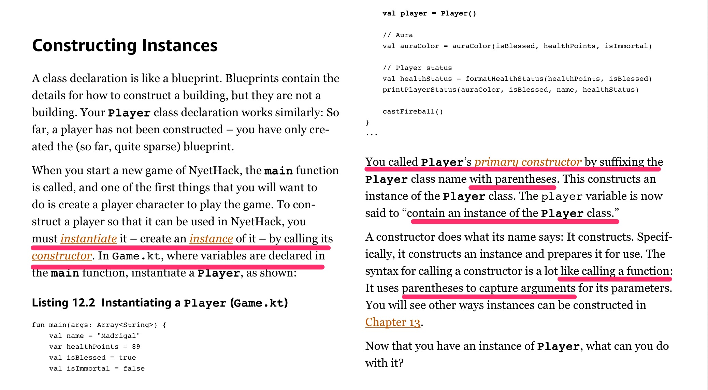
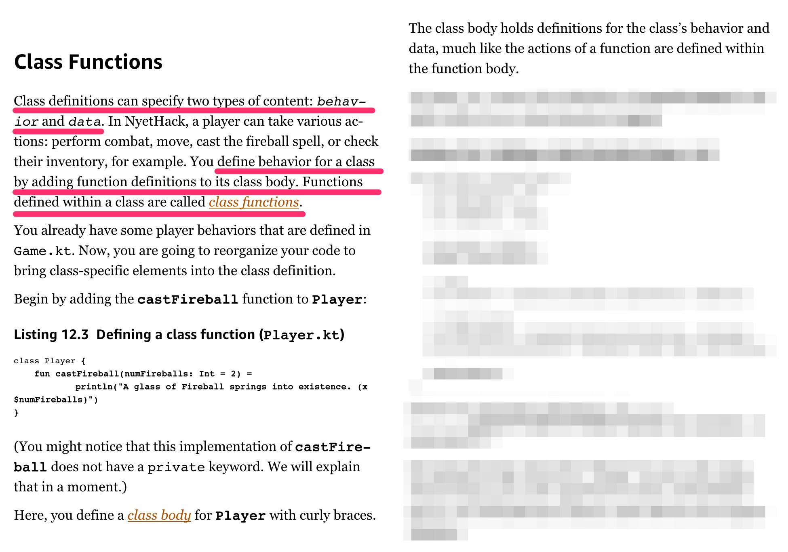

Kotlin 讀書會 - CH 12 :: Defining Classes

目前讀書會的進度接近尾聲囉！由於前幾週的內容過於豐富，短短的時間內對於導讀與閱讀都是很吃力的工作。想要多了解這重要的後面幾點，還是得為自己細讀幾回。

# 關鍵字

依循先前介紹過的[導讀小秘訣](https://medium.com/@qrtt1/%E6%8A%80%E8%A1%93%E5%9E%8B%E8%AE%80%E6%9B%B8%E6%9C%83%E7%9A%84%E5%B0%8E%E8%AE%80-74350ed08ac1)，先蒐集一下書上的關鍵字。因為，我們可以用這些關鍵字來發展活動，或是質問自己是否懂了沒。遇到「動詞」，那就會有個具體的動作需要練習，或描述怎麼做到的；遇到「名詞」那就是有個術語需要被解說，也就是得說明出它的概念，並能對應上具體的存在 (某個事實)。

## Define Class (v)

* Constructing Instances (v-ing)
* instantiate (v)
* constructor (n)
* primary constructor (n)

## Class functions (n)

* class' behavior and data (n)
* class functions (n)
* class body (n)

## Visibility and Encapsulation (n)

* internal (adj)
* class property (n)
* property getter and setter (customization) (n) -> field keyword
* computed property (n)

# 影片記錄

### 關鍵字介紹

### OUTPUT 練習介紹

### 讀書內容練習

配合概念說明，與實際動作的操作來互相解說行為與概念。

