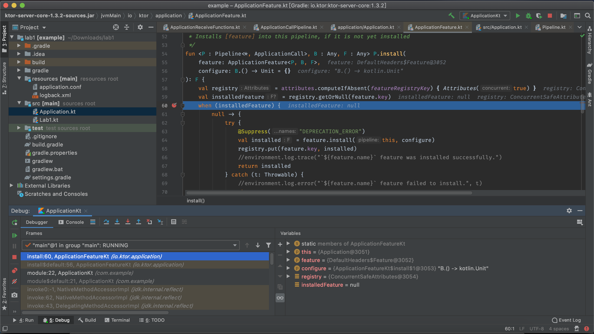

# ktor 是怎麼打造出來的 [2]

在前一篇文章我們透過解說 kotlin 基本語法複習的方式來說明實作 DSL 常用的語法。現在，我們稍為深入一下 ktor 應用程式是怎麼執行到 install 的呢？而 install 又做了什麼事情。

```kotlin
fun Application.module(testing: Boolean = false) {
    install(DefaultHeaders)
    // ... (skip) ...
}
```

先將目前的視野鎖定在這幾行程式，在 module function 內，呼叫了 install `DefaultHeaders` Feature。那麼，我們可以試著提問一下：

* 什麼樣的類別「夠格」被稱作 Feature？
* install 會做些什麼？

## install 函式

```kotlin
/**
 * Installs [feature] into this pipeline, if it is not yet installed
 */
fun <P : Pipeline<*, ApplicationCall>, B : Any, F : Any> P.install(
    feature: ApplicationFeature<P, B, F>,
    configure: B.() -> Unit = {}
): F {
    val registry = attributes.computeIfAbsent(featureRegistryKey) { Attributes(true) }
    val installedFeature = registry.getOrNull(feature.key)
    when (installedFeature) {
        null -> {
            try {
                @Suppress("DEPRECATION_ERROR")
                val installed = feature.install(this, configure)
                registry.put(feature.key, installed)
                //environment.log.trace("`${feature.name}` feature was installed successfully.")
                return installed
            } catch (t: Throwable) {
                //environment.log.error("`${feature.name}` feature failed to install.", t)
                throw t
            }
        }
        feature -> {
            //environment.log.warning("`${feature.name}` feature is already installed")
            return installedFeature
        }
        else -> {
            throw DuplicateApplicationFeatureException("Conflicting application feature is already installed with the same key as `${feature.key.name}`")
        }
    }
}
```

對照 install 的實作，能夠格稱為 Feature 的類別，我們目前的線索為，它的型別為 ApplicationFeature，而它的 3 個 Generic Type 參數的命名，依據我們目前的情境，就相當易懂了：

* P 即為 Pipeline (我們在前一篇文章驗證過這件事)
* B 即為 Block，因為它是個 Configuration 的 Receiver，寫法作就是俗稱的 Lambda/Block
* F 即為 Feature，它在 Return Type 的位置，也就是 Feature 類別被實體化的物件參考

如果對用「眼睛」追程式碼不太有自信的朋友，那透過 Debugger 會是個很棒的方式：



在 Debugger 畫面的右下，可以看出列出來的變數名稱。已知 P 是此函式的所屬類別，所以 this 即為 P 的物件參考，那它就是 Application (在前一篇我們知道它繼承了 Pipeline)，而 configure 參數它有替我們標出是個 B 泛型型別 Receiver；最後的 feature 參數，它是 DefaultHeaders 內的 Feature 物件 (劇透，這就是 companion object)。

探索完參數之後，它的實作也很簡單。以 attributes 來說，它就只是一個預先建立的 Attributes 物件：

```kotlin
// 你可以在 Pipeline.kt 內找到它：
val attributes = Attributes(concurrent = true)

// 你可以在 ApplicationFeature.kt 內找到它
private val featureRegistryKey = AttributeKey<Attributes>("ApplicationFeatureRegistry")
```

```kotlin
    val registry = attributes.computeIfAbsent(featureRegistryKey) { Attributes(true) }
    val installedFeature = registry.getOrNull(feature.key)
```

Attributes 與 AttributeKey 相當易讀，我們就不帶著大家追入，直接感受它的語意就行了。看到「屬性 Attribute」，按常理它會有名稱與他的值。以 Java 來實作的話，大一致上會使用 Map 語意。因此，他實作分為二種，一種是需要併行處理 (concurrent) 的情況，另一種則是不需要併行處理的情況，對應的實作類別就會對上 ConcurrentHashMap 與 HashMap。

在 Java 的容器中，也支援使用 Generic Type 來標示容器的 Key 與 Value 的型別，ktor 實作上並沒有直接這樣子使用。它另外增加了 AttributeKey 透過它來達成同一個 Attributes 容易可以有不同型別的 Key。registry 的 Key 其實就會是：

```kotlin
// 你可以在 ApplicationFeature.kt 內找到它
private val featureRegistryKey = AttributeKey<Attributes>("ApplicationFeatureRegistry")
```

接下來的重點是，取得了 registry 後，能由它查詢是否有已安裝的 Feature，如果沒有就呼叫 feature 的 install 函式生一個出來：

```kotlin
try {
    @Suppress("DEPRECATION_ERROR")
    val installed = feature.install(this, configure)
    registry.put(feature.key, installed)
    //environment.log.trace("`${feature.name}` feature was installed successfully.")
    return installed
} catch (t: Throwable) {
    //environment.log.error("`${feature.name}` feature failed to install.", t)
    throw t
}
```

到目前為止，install 的流程算是結束了。因為具體的邏輯，只是把 Feature 初始化的過程委派 (delegation) 給 feature 的 install 函式。install 本身就是負責呼叫它，並將它註冊進 registry 內罷了。

## 成為 Feature 的資格

在 ktor 官方文件中 [Creating Custom Feature](https://ktor.io/advanced/features.html) 提供如何實作自己的 Feature，依著它寫的內容就能成功了。在這頁它提示了幾個重點：

* Feature 類別會在多個 thread 共用，所以必需以 thread-safe 的目實來實作。(強烈推薦設計成 immutable 物件避免發生非預期的副作用)
* 提供 Configuration 類別來放置 install 時要設定的參數，只有這部分的設計提供變更參數。
* 提供 compansion object 實作介面 ApplicationFeature (雖然沒硬性規定，但此 compansion object 命名為 Feature 是慣例)
* 透過 pipeline.intercept 參與 pipeline 的流程

以 DefaultHeaders Feature 為例，它的 compansion object 實作為：

```kotlin
companion object Feature : ApplicationFeature<Application, Configuration, DefaultHeaders> {
    private const val DATE_CACHE_TIMEOUT_MILLISECONDS = 1000

    private val GMT_TIMEZONE = TimeZone.getTimeZone("GMT")!!

    private val calendar = object : ThreadLocal<Calendar>() {
        override fun initialValue(): Calendar {
            return Calendar.getInstance(GMT_TIMEZONE, Locale.ROOT)
        }
    }

    override val key = AttributeKey<DefaultHeaders>("Default Headers")

    override fun install(pipeline: Application, configure: Configuration.() -> Unit): DefaultHeaders {
        val config = Configuration().apply(configure)
        if (config.headers.getAll(HttpHeaders.Server) == null) {
            val applicationClass = pipeline.javaClass

            val ktorPackageName: String = Application::class.java.`package`.implementationTitle ?: "ktor"
            val ktorPackageVersion: String = Application::class.java.`package`.implementationVersion ?: "debug"
            val applicationPackageName: String = applicationClass.`package`.implementationTitle ?: applicationClass.simpleName
            val applicationPackageVersion: String = applicationClass.`package`.implementationVersion ?: "debug"

            config.headers.append(HttpHeaders.Server, "$applicationPackageName/$applicationPackageVersion $ktorPackageName/$ktorPackageVersion")
        }

        val feature = DefaultHeaders(config)
        pipeline.intercept(ApplicationCallPipeline.Features) { feature.intercept(call) }
        return feature
    }
}
```

在 object header 部分使用的 3 個 Generic Type 如先前說的，即為 Pipeline、Configuration 與 Feature 本身。它有二處的 override，其一是 key 屬性，再來是 install 函式。也就是先前看到的 ApplicationFeature.install 函式內使用的 feature.key 與 feature.install：

```kotlin
try {
    @Suppress("DEPRECATION_ERROR")
    val installed = feature.install(this, configure)
    registry.put(feature.key, installed)
    //environment.log.trace("`${feature.name}` feature was installed successfully.")
    return installed
} catch (t: Throwable) {
    //environment.log.error("`${feature.name}` feature failed to install.", t)
    throw t
}
```

回到 feature.install 函式本身，它的責任是提供正確的 Key 與初始化 Feature 物件，並設定好它的 Configuration，最重要的一步是註冊攔截器：

```kotlin
override fun install(pipeline: Application, configure: Configuration.() -> Unit): DefaultHeaders {
    val config = Configuration().apply(configure)
    if (config.headers.getAll(HttpHeaders.Server) == null) {
        // ... (skip) ... 設定額外的 config
    }

    // 建立 DefaultHeaders 物件
    val feature = DefaultHeaders(config)

    // 註冊攔截器 (interceptor)
    pipeline.intercept(ApplicationCallPipeline.Features) { feature.intercept(call) }
    return feature
}
```

目前到這一步我們完成了一個 Feature 的安裝流程，但還沒真正見識到它如何發揮功用的。要討論它如何作用的，我們會在另一篇討論攔截器。目前只要先將焦點放在一個 Feature 如何被註冊，同時注意它必需要 thread-safe 的實作，最後意識到 ktor 有 Pipeline 與 Interception 的設計，讓實作 Feature 的開發者能在既有的 ktor 基礎建設加上新的功能。

## 語法摘要 

在這一次的 Code Trace 流程中，我們複習 compansion object 的用法，透過它讓我們能替一個類別，建立預先存在的物件，透過它來替外圍的物件初始化，這也是為什麼 CustomFeature 內會有個 compansion object Feature。

同時，也見識到了 interface 代表的「合約」精神，背後的具體實作是誰並不重要，而是它承擔了合約 (ApplicationFeature) 內載明的事項，提供了 Key 與 install 函式。