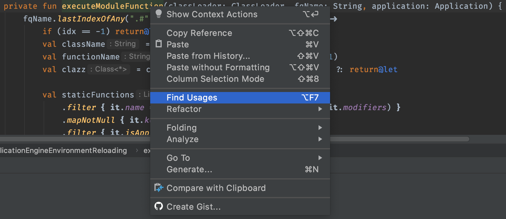
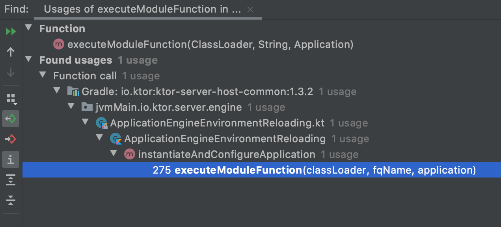

# ktor 是怎麼打造出來的 [3]

透過前二篇文章，我們一起由第 1 個 module function 內用的基礎語法，一直追蹤到 ApplicationFeature 的 install 函式實作。這些都是單純以「靜態」的方式去閱讀，去發堀程式碼的內容。在進入 ktor 的核心設計之前，我們先來認識一些小撇步，幫助我們追蹤一些靜態讀碼時較不易知道的部分。

## Call Stack

除了透過閱讀程式碼來理解實作之外，如果有執行期 (runtime) 的一些資料，那會更讓我們對目前研究的專案有個大概的輪廓，能多加一個視角去理解目前研究的專案。提到執行期的行為，老鳥多半會想到開 Debugger 去設 Breakpoint，新手大概會試著插一些 println 將想看的資料印出來。無論你選哪種方法，只要有助於你增進程式的理解，都是好方式 (但儘可能往有效率的方向移動)。

我是 kotlin 語言的初學者，但我不是程式語言的新手，身體有著新舊摻半的思維。直覺上開 Debug 模式是最快理解它的方式。那問題是「經驗者」為何覺得 Debug 有效，特別是我們沒有再追尋特定的 Bug 的時候，我們仍然依賴著 Debugger。不過，這時運用 Debug 模式追的主要不是變數內容的變化，而是函式間相互呼叫的關係。

```kotlin
fun Application.module(testing: Boolean = false) {
    install(DefaultHeaders)
    // ... (skip) ...
}
```

以上面這段 code 來說，其實我們也會想知道 module 函式被誰呼叫的，而 install 又是由哪邊呼叫來的。這個一層一層呼叫的概念，根源則是 Call Stack。函式庫呼叫與變數的生命週期控制的核心，其實就是依賴著把目前的狀態 (它可能被稱為一個 Frame) 一層一層堆入 Stack 中，呼叫完再一層一層彈粗乃。概念的演示推薦觀看影片：

https://www.youtube.com/watch?v=5xUDoKkmuyw&feature=emb_title

現在問題是，我們要怎麼有效率地取得一些 Call Stack 資訊，讓我們能快速有個粗略地了解呢？提供個簡單粗爆的方式：

```kotlin
fun Application.module(testing: Boolean = false) {
    install(DefaultHeaders) {
        // 透過拋出 Exception 讓它把整個 stack trace 印出來
        throw Exception("Oops")
    }
    // ... (skipp) ...
}    
```

範例的結果如下：

```
Exception in thread "main" java.lang.reflect.InvocationTargetException
	at java.base/jdk.internal.reflect.NativeMethodAccessorImpl.invoke0(Native Method)
	at java.base/jdk.internal.reflect.NativeMethodAccessorImpl.invoke(NativeMethodAccessorImpl.java:62)
	at java.base/jdk.internal.reflect.DelegatingMethodAccessorImpl.invoke(DelegatingMethodAccessorImpl.java:43)
	at java.base/java.lang.reflect.Method.invoke(Method.java:566)
	at kotlin.reflect.jvm.internal.calls.CallerImpl$Method.callMethod(CallerImpl.kt:97)
	at kotlin.reflect.jvm.internal.calls.CallerImpl$Method$Static.call(CallerImpl.kt:106)
	at kotlin.reflect.jvm.internal.KCallableImpl.callDefaultMethod$kotlin_reflection(KCallableImpl.kt:166)
	at kotlin.reflect.jvm.internal.KCallableImpl.callBy(KCallableImpl.kt:110)
	at io.ktor.server.engine.ApplicationEngineEnvironmentReloading.callFunctionWithInjection(ApplicationEngineEnvironmentReloading.kt:384)
	at io.ktor.server.engine.ApplicationEngineEnvironmentReloading.executeModuleFunction(ApplicationEngineEnvironmentReloading.kt:330)
	at io.ktor.server.engine.ApplicationEngineEnvironmentReloading.access$executeModuleFunction(ApplicationEngineEnvironmentReloading.kt:33)
	at io.ktor.server.engine.ApplicationEngineEnvironmentReloading$instantiateAndConfigureApplication$1$$special$$inlined$forEach$lambda$1.invoke(ApplicationEngineEnvironmentReloading.kt:275)
	at io.ktor.server.engine.ApplicationEngineEnvironmentReloading$instantiateAndConfigureApplication$1$$special$$inlined$forEach$lambda$1.invoke(ApplicationEngineEnvironmentReloading.kt:33)
	at io.ktor.server.engine.ApplicationEngineEnvironmentReloading.avoidingDoubleStartupFor(ApplicationEngineEnvironmentReloading.kt:310)
	at io.ktor.server.engine.ApplicationEngineEnvironmentReloading.access$avoidingDoubleStartupFor(ApplicationEngineEnvironmentReloading.kt:33)
	at io.ktor.server.engine.ApplicationEngineEnvironmentReloading$instantiateAndConfigureApplication$1.invoke(ApplicationEngineEnvironmentReloading.kt:274)
	at io.ktor.server.engine.ApplicationEngineEnvironmentReloading$instantiateAndConfigureApplication$1.invoke(ApplicationEngineEnvironmentReloading.kt:33)
	at io.ktor.server.engine.ApplicationEngineEnvironmentReloading.avoidingDoubleStartup(ApplicationEngineEnvironmentReloading.kt:290)
	at io.ktor.server.engine.ApplicationEngineEnvironmentReloading.instantiateAndConfigureApplication(ApplicationEngineEnvironmentReloading.kt:272)
	at io.ktor.server.engine.ApplicationEngineEnvironmentReloading.createApplication(ApplicationEngineEnvironmentReloading.kt:125)
	at io.ktor.server.engine.ApplicationEngineEnvironmentReloading.start(ApplicationEngineEnvironmentReloading.kt:245)
	at io.ktor.server.netty.NettyApplicationEngine.start(NettyApplicationEngine.kt:126)
	at io.ktor.server.netty.EngineMain.main(EngineMain.kt:26)
	at com.example.ApplicationKt.main(Application.kt:17)
Caused by: java.lang.Exception: Oops
	at com.example.ApplicationKt$module$1.invoke(Application.kt:23)
	at com.example.ApplicationKt$module$1.invoke(Application.kt)
	at io.ktor.features.DefaultHeaders$Feature.install(DefaultHeaders.kt:83)
	at io.ktor.features.DefaultHeaders$Feature.install(DefaultHeaders.kt:69)
	at io.ktor.application.ApplicationFeatureKt.install(ApplicationFeature.kt:64)
	at com.example.ApplicationKt.module(Application.kt:22)
	at com.example.ApplicationKt.module$default(Application.kt:21)
	... 24 more

Process finished with exit code 1
```

日常開發時，對噴 Exception 這件事感到害怕，但在追程式碼時，我們會感激有這樣的資訊。因為，這就是程式執行到某行時的完整 Call Stack。在這有點長的 Call Stack 中，我們要先區分出哪部分是我們需要關心的。簡單的判斷原則，先關心我們在意的 package 名稱，例如 io.ktor 開頭的，以及我們目前範例用的 com.example：

```kotlin
	at io.ktor.server.engine.ApplicationEngineEnvironmentReloading.callFunctionWithInjection(ApplicationEngineEnvironmentReloading.kt:384)
	at io.ktor.server.engine.ApplicationEngineEnvironmentReloading.executeModuleFunction(ApplicationEngineEnvironmentReloading.kt:330)
	at io.ktor.server.engine.ApplicationEngineEnvironmentReloading.access$executeModuleFunction(ApplicationEngineEnvironmentReloading.kt:33)
	at io.ktor.server.engine.ApplicationEngineEnvironmentReloading$instantiateAndConfigureApplication$1$$special$$inlined$forEach$lambda$1.invoke(ApplicationEngineEnvironmentReloading.kt:275)
	at io.ktor.server.engine.ApplicationEngineEnvironmentReloading$instantiateAndConfigureApplication$1$$special$$inlined$forEach$lambda$1.invoke(ApplicationEngineEnvironmentReloading.kt:33)
	at io.ktor.server.engine.ApplicationEngineEnvironmentReloading.avoidingDoubleStartupFor(ApplicationEngineEnvironmentReloading.kt:310)
	at io.ktor.server.engine.ApplicationEngineEnvironmentReloading.access$avoidingDoubleStartupFor(ApplicationEngineEnvironmentReloading.kt:33)
	at io.ktor.server.engine.ApplicationEngineEnvironmentReloading$instantiateAndConfigureApplication$1.invoke(ApplicationEngineEnvironmentReloading.kt:274)
	at io.ktor.server.engine.ApplicationEngineEnvironmentReloading$instantiateAndConfigureApplication$1.invoke(ApplicationEngineEnvironmentReloading.kt:33)
	at io.ktor.server.engine.ApplicationEngineEnvironmentReloading.avoidingDoubleStartup(ApplicationEngineEnvironmentReloading.kt:290)
	at io.ktor.server.engine.ApplicationEngineEnvironmentReloading.instantiateAndConfigureApplication(ApplicationEngineEnvironmentReloading.kt:272)
	at io.ktor.server.engine.ApplicationEngineEnvironmentReloading.createApplication(ApplicationEngineEnvironmentReloading.kt:125)
	at io.ktor.server.engine.ApplicationEngineEnvironmentReloading.start(ApplicationEngineEnvironmentReloading.kt:245)
	at io.ktor.server.netty.NettyApplicationEngine.start(NettyApplicationEngine.kt:126)
	at io.ktor.server.netty.EngineMain.main(EngineMain.kt:26)
	at com.example.ApplicationKt.main(Application.kt:17)
Caused by: java.lang.Exception: Oops
	at com.example.ApplicationKt$module$1.invoke(Application.kt:23)
	at com.example.ApplicationKt$module$1.invoke(Application.kt)
	at io.ktor.features.DefaultHeaders$Feature.install(DefaultHeaders.kt:83)
	at io.ktor.features.DefaultHeaders$Feature.install(DefaultHeaders.kt:69)
	at io.ktor.application.ApplicationFeatureKt.install(ApplicationFeature.kt:64)
	at com.example.ApplicationKt.module(Application.kt:22)
	at com.example.ApplicationKt.module$default(Application.kt:21)
	... 24 more
```

剩下的行數雖然多，但如果只看它經過了哪些類別，依序是：

* ApplicationEngineEnvironmentReloading
* NettyApplicationEngine
* EngineMain
* ApplicationKt
* DefaultHeaders

去掉我們已經看過的 ApplicationKt 與 DefaultHeaders，其實只有 ApplicationEngineEnvironmentReloading、NettyApplicationEngine 與 EngineMain 是需要認識的新朋友。

## EngineMain

```kotlin
fun main(args: Array<String>): Unit = io.ktor.server.netty.EngineMain.main(args)
```

在我們手上的原始碼，main 的實作就是用 EngineMain，透過 Call Stack 知道了由 [EngineMain](https://github.com/ktorio/ktor/blob/1.3.2/ktor-server/ktor-server-netty/jvm/src/io/ktor/server/netty/EngineMain.kt) 到 Application.module 中間經過的歷程。這個類別在 Call Stack 中只佔了一行，可以先期望它本身的實作應該不會太複雜 (至少行數應該不會太多)，它的 main 函式其實只有這幾行，處理參數後，建立 engine 然後啟動它：

```kotlin
fun main(args: Array<String>) {
    val applicationEnvironment = commandLineEnvironment(args)
    val engine = NettyApplicationEngine(applicationEnvironment) { loadConfiguration(applicationEnvironment.config) }
    engine.addShutdownHook {
        engine.stop(3, 5, TimeUnit.SECONDS)
    }
    engine.start(true)
}
```

你會發現不同實作的 engine 其實都大同小異，那麼它的 commandLineEnvironment 就是真正處理設定檔的功能，能翻閱官方文件 [Configuring the Server](https://ktor.io/servers/configuration.html) 對照看看，是不是參數都出現在檔案內了。

## NettyApplicationEngine

ktor 提供了許多不同 engine 的實作，在目前我透過 IDE 產生的專案，它替我選擇了 Netty 的實作。[NettyApplicationEngine](https://github.com/ktorio/ktor/blob/1.3.2/ktor-server/ktor-server-netty/jvm/src/io/ktor/server/netty/NettyApplicationEngine.kt) 約二百行，雖然長度不大，但在看它的程式碼時，其實不需要過度追蹤細節，除非你想研究一個 engine 怎麼創造出來的。

在我們還沒打算深入它前，其實單純看它的「合約」部分就好了。它要實作哪些 interface 或是繼承了什麼類別：

```kotlin
class NettyApplicationEngine(environment: ApplicationEngineEnvironment, configure: Configuration.() -> Unit = {}) :
    BaseApplicationEngine(environment) {
    // ... (skip) ...
}
```

對應官方文件 [Create a custom ApplicationEngine](https://ktor.io/advanced/engines.html)，能知繼承 BaseApplicationEngine 承擔了 ApplicationEngine 介面的規定的責任，得實作 start 與 stop 函式。在過程中，最重要的一件事就是設定如何處理來自 Client 的 Request (以目前的情境來說，就是 Http Request)。


## ApplicationEngineEnvironmentReloading

ApplicationEngineEnvironmentReloading 在 Call Stack 中佔據了大多數的篇幅，瀏覽了它呼叫的 method 後，我們能看出  executeModuleFunction 應該就是實際會呼叫 Application.module 的函式。這時用 IDE 的 *Find Usages* 功能，進行靜態分析，找出它的呼叫者： 



可以看出，它是被 instantiateAndConfigureApplication 呼叫，我們可以用多次的 *Find Usage* 反覆操作，找出更上游的呼叫者來驗證 Call Stack：



我們知道 ApplicationEngineEnvironmentReloading 是實際產生 Application 物件的人：

```kotlin
private fun instantiateAndConfigureApplication(classLoader: ClassLoader): Application {
    val application = Application(this)
    safeRiseEvent(ApplicationStarting, application)

    avoidingDoubleStartup {
        moduleFunctionNames?.forEach { fqName ->
            avoidingDoubleStartupFor(fqName) {
                executeModuleFunction(classLoader, fqName, application)
            }
        }
    }

    if (watchPatterns.isEmpty()) {
        modules.forEach { it(application) }
    }

    safeRiseEvent(ApplicationStarted, application)
    return application
}
```

建立 Application 物件的主要參數就是 ApplicationEngineEnvironmentReloading 本身，那就是在 EngineMain 內見過的：

```kotlin
val applicationEnvironment = commandLineEnvironment(args)
```

## 追蹤成果摘要

我們的程式會透過 EngineMain 啟動，在啟動時它會透過 commandLineEnvironment 來讀取必要的設定檔，建出 ApplicationEngineEnvironmentReloading。ApplicationEngineEnvironmentReloading 是一個重要的基礎建設，實際上執行被註冊的 module 的功能，就是由它實作的。

在這篇文章，我們加入了新的追蹤技巧，利用 Exception 噴出 Call Stack 來快速知道函式間呼叫的上下關係。將這個關係當作「旅遊地圖」再去探訪新的景點，獲得新的資訊。

