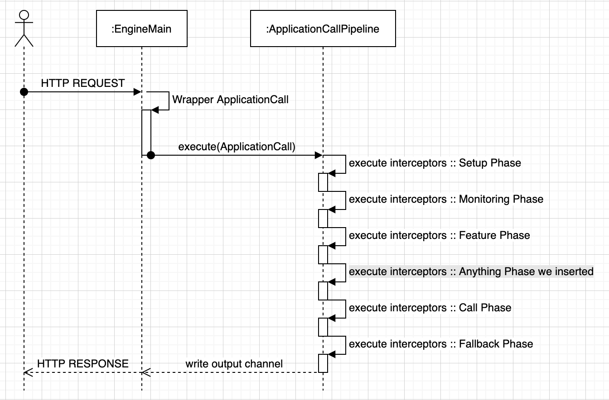

# ktor 是怎麼打造出來的 [4]

在上一篇我們利用了 Call Stack 探索完由程式啟動的流程：

* EngineMain 建立 ApplicationEnvironment
* ApplicationEnvironment 透過設定檔 application.conf 得知 module 是 Application.module
* ApplicationEnvironment 啟動，並執行 Application.module

後續的動作就是接入了第二篇文章的 install 函式的內容，今天要接著談 install 函式內呼叫的 `pipeline.intercept` 函式的功能。但我們不會太深入說明各別的 Feature 內的 intercept 做了什麼事，而是單純理解 ktor 核心 API 提供給我們的工具。


## 先由原始碼感受它的功能

以 [DefaultHeaders 的 install 函式為例](https://github.com/ktorio/ktor/blob/1.3.2/ktor-server/ktor-server-core/jvm/src/io/ktor/features/DefaultHeaders.kt#L82)：

```kotlin
override fun install(pipeline: Application, configure: Configuration.() -> Unit): DefaultHeaders {
    val config = Configuration().apply(configure)
    if (config.headers.getAll(HttpHeaders.Server) == null) {
        // ... (skip) ...
    }

    val feature = DefaultHeaders(config)
    pipeline.intercept(ApplicationCallPipeline.Features) { feature.intercept(call) }
    return feature
}
```

對應到本次的主要，我們要來研究 `pipeline` 這個物件的功用。表面上它是 Application 類別，但實際上它繼承了 Pipeline 類別。而 Pipeline 屬於 ktor 核心 API 的其中一組類別，原始碼所及之處都有它的身影存在。[intercept](https://github.com/ktorio/ktor/blob/1.3.2/ktor-utils/common/src/io/ktor/util/pipeline/Pipeline.kt#L272) 函式的原始碼如下：

```kotlin
/**
 * Adds [block] to the [phase] of this pipeline
 */
fun intercept(phase: PipelinePhase, block: PipelineInterceptor<TSubject, TContext>) {
    val phaseContent = findPhase(phase)
        ?: throw InvalidPhaseException("Phase $phase was not registered for this pipeline")

    if (tryAddToPhaseFastpath(phase, block)) {
        interceptorsQuantity++
        return
    }

    phaseContent.addInterceptor(block)
    interceptorsQuantity++
    resetInterceptorsList()

    afterIntercepted()
}
```

我們先單純由程式碼來臆測一下，它大概是做什麼事情。首先，它有 2 個參數，一個是名為 phase 的 PipelinePhase 型別；一個是名為 block 的 PipelineInterceptor 型別。由於，我們還沒有追入其他 Source Code，還不知道它們是類別還是介面或其它可能，先用型別來稱呼它。

phase 就是階段，它透過 findPhase 函式尋找是否有該階段的存在。所以，在呼叫 intercept 前，要尋找的 phase 就必需存在了。這表示，肯定有人替我們建立好需要的階段。尋找出對應的 phaseContent，而 phaseContent 也有 addInterceptor 方法，能讓我們將 block 加入。

但在讀完上面這段程式後，對應回呼叫的案例，似乎有一點怪怪的，跟我們期望不太一致：

```kotlin
pipeline.intercept(ApplicationCallPipeline.Features) { feature.intercept(call) }
```

以 `block/lambda` 的型式來說，我們會期望在第 2 個參數看到的是 Receiver：

```kotlin
// 我們目前看到的簡單參數
fun intercept(phase: PipelinePhase, block: PipelineInterceptor<TSubject, TContext>) {}

// 我們期望看到的 Receiver
fun intercept(phase: PipelinePhase, block: PipelineInterceptor<TSubject, TContext>.() -> Unit) {}
```

進一步追入原始碼，得知它利用 [typealias](https://kotlinlang.org/docs/reference/type-aliases.html) 定義了 suspend Receiver 成為一個簡單的型別：

```kotlin
/**
 * Represents an interceptor type which is a suspend extension function for context
 */
typealias PipelineInterceptor<TSubject, TContext> = suspend PipelineContext<TSubject, TContext>.(TSubject) -> Unit
```

## 追蹤原始碼的局限

以 ktor 來說，相較於其他歷史悠久的專案，它非常的迷你 (專案內的 `.kt` 檔總行數不超過 15 萬行)，在這種剛起步的專案，還沒有跟太多方的需求妥協時，它整體的實作是相對單純的。

由第一篇文章到目前為止，我們幾乎僅利用了學習過的 kotlin 語法與一些程式碼追蹤技巧試圖去弄懂 ktor 內的機制。我們可以反覆利用這樣的技巧去看懂一個開源專案的部分內容，特別是在對於程式流程掌握的部分。我們雖然體驗到了把原始碼看懂那個瞬間的樂趣，但這樣的活動會遇到「缺乏知識」而遇上的瓶頸。什麼樣的知識是單純依賴語法追蹤難以掌握的呢？

設計。不管是架構上設計的思維，或是人為刻意訂定的術語，這些要看文件閱讀來補充。其中，還隱含著已經應用已久的 Desgin Pattern，這在專案的設計文件可能不會特別提它，因為那只是實作時順勢而為的結果。如同最初的文章提到的，ktor 其實核心是 [Intercepting filter pattern](https://en.wikipedia.org/wiki/Intercepting_filter_pattern)：

> Intercepting Filter is a JavaEE pattern which creates pluggable filters to process common services in a standard manner without requiring changes to core request processing code. The filters intercept incoming requests and outgoing responses, allowing preprocessing and post-processing, and these filters can be added or removed unobtrusively without changing existing code.

Intercepting Filter 主要的目的在提供一種 pluggable 的機制，讓程式的核心在不修改既有程式碼的前提下，動態增減處理 request 到 response 中的流程。所以，先前看到的 install 函式，就是在安裝外掛 (plugin)，而安裝外掛主要的實作依賴 pipeline.intercept 函式，它會幫我們 `addInterceptor` 至 pipeline 內。

基於這些原因，大多數是專案開發者人為的選擇，我們其實可以省下力，不要花太多時間透過追蹤原始碼來理解它。應該先查查有沒有設計文件，或是給開發者看的使用文件，在更順利的情況會有易懂的測試案例。

## 什麼是 Pipeline

[Pipeline 的文件](https://ktor.io/advanced/pipeline.html)被放在 ktor 官網中進階 (Advanced) 的區域，但這其實不是說它很難的意思，而是作為一般使用 ktor 的人不是必要的知識。像我們這樣，打算理解它的核心設計的實作與原始碼愛好者才會有動機一探究竟。

現在已知 Application 啟動後，會設定好 Engine 與執行 Application.module 進行設定，那麼 Engine 獲得使用者打來的 HTTP Request 後的事就如 Pipeline 文件說明的。ktor 會透過 ApplicationCallPipeline 來回應使用者的請求。文件的前半段在描述 Pipeline API 的使用方式，後半段在說明 ApplicationCallPipeline 的結構。

> A Ktor Application is an ApplicationCallPipeline. This is the main pipeline used for web backend applications handling http requests.

為了方便理解這句話，畫一張極簡化的 Sequence Diagram 示意：



```kotlin
open class ApplicationCallPipeline : Pipeline<Unit, ApplicationCall>(Setup, Monitoring, Features, Call, Fallback) {
    // ... (skip) ...
}
```

ApplicationCallPipeline 繼承 Pipeline 時，預先配置 Setup、Monitoring、Features、Call 與 Fallback，共五個預設的 PipelinePhase。其中的 Features 是多數 ktor feature 會去攔截的 PipelinePhase。

ApplicationCallPipeline 的 Context 為 ApplicationCall，通常我們看到 Context 時，可以把它視為是「可變」狀態的封裝物件。實作函式庫或應用程式框架時，處理流程的 API 都是無狀態的。狀態就會透過這樣的 Context 物件隔離，ApplicationCall 就是用來隔離外界 Input/Output 與系統核心的物件。

看著圖的最外層，可見 Input 為 HTTP Request，而 Output 為 HTTP Response。它們都被包在 ApplicationCall 之內： 

```kotlin
interface ApplicationCall {
    /**
     * Application being called
     */
    val application: Application

    /**
     * Client request
     */
    val request: ApplicationRequest

    /**
     * Server response
     */
    val response: ApplicationResponse

    /**
     * Attributes attached to this instance
     */
    val attributes: Attributes

    /**
     * Parameters associated with this call
     */
    val parameters: Parameters
}
```

直接看它的原始碼，是一個簡單的 interface，明確有著 request 與 response 二個屬性，另外還有：

* application：就是 Application (Pipeline) 物件本身。這表示，我們也可以利用 ApplicationCall 變更 Pipeline 的內容
* attributes：這設計其實挺像 Servlet 的屬性，我們可以在多個 Pipeline/Interceptors 傳遞暫存資料就靠它了
* parameters：在 HTTP 情境的前提下，這其實就是 URL 所帶的 Query String 解析後的結果


## 模擬呼叫

[Pipeline 的文件](https://ktor.io/advanced/pipeline.html)有展示 Pipeline 使用的程式片段，基於前一段的描述，我們其實可以把它寫成實際可以執行的程式：

```kotlin
// 不管怎麼樣，我們都需要 ApplicationCallPipeline，那就直接把它的實體建立出來
val pipeline = ApplicationCallPipeline()

// 呼叫 execute 時，需要有 ApplicationCall 物件，但它是個 interface，[暱名類別的物件實體 (an object of an anonymous class )](https://kotlinlang.org/docs/reference/object-declarations.html)：

// (在呼叫前，應該要有一些 interceptor 安裝好)

// 實作都先留白就行了：
pipeline.executeBlock(object : ApplicationCall {
    override val application: Application
        get() = TODO("Not yet implemented")
    override val attributes: Attributes
        get() = TODO("Not yet implemented")
    override val parameters: Parameters
        get() = TODO("Not yet implemented")
    override val request: ApplicationRequest
        get() = TODO("Not yet implemented")
    override val response: ApplicationResponse
        get() = TODO("Not yet implemented")
})
```

executeBlock 是我們自訂的 Extension Function 為了把它包在 coroutine 的 runBlocking 內而已：

```kotlin
fun Pipeline<Unit, ApplicationCall>.executeBlock(call: ApplicationCall) = runBlocking { execute(call) }
```

我們建起了可以執行的程式，只是目前還沒有替它加入 Interceptor，所以沒有任何事情會發生，在加入下列程式碼後，我們可以執行它，並觀察結果：

```kotlin
pipeline.intercept(ApplicationCallPipeline.Call) {
    println("call 1")
}

pipeline.intercept(ApplicationCallPipeline.Setup) {
    println("setup 1")
}
```

即使，Call Phase 的攔截器註冊在前，但 Setup Phase 的優先序比較高，結果會先看到 "setup 1" 再來才是 "call 1"，你可以繼續修改它，並做不同的實驗，[完整的範例請由此連結觀看](https://gist.github.com/qrtt1/626b3d0f5f356e15884dd386bbfaf0da)。

## ktor 閲讀總結

在這篇文章開始由「設計」的角度出發，因為我們知道單純閱讀程式碼有機會弄懂 ktor，但參考 ktor 的設計觀與背後的 Design Pattern 會更加有效率。學習過語言的基礎語法能讀懂很多東西，這絕對是個很棒的練習。但是同時，我們要儘可能利用各種資源去解讀手上的材料，才不會落入「手中有槌子，把所有東西當釘子處理」的謬誤。

在是「ktor 是怎麼打造出來的」系列的最後一篇文章，這系列的最原始動機是

> 我們一起參加了 kotlin 讀書會，紮實地讀完了一初入門的 kotlin 書籍。那麼接下來我們要怎麼應用這些所學呢？

基於這個動機，我想要跟一起經歷過這讀書會，或有興趣一起讀 source code 的朋友，展示一下讀原始碼的經驗。因為，接下來讀書會有規劃了不少主題的學習小組。那些東西都很棒，但以我偏愛選自己的路線的搞怪特性，我想跟大家說「你們讀了那麼多語法，其實幾乎可以征服世界了」(誤)

就有點像，我們學外語，不會單純寫作業而進步，而是得去真實世界看一下 native speaker 怎麼用它，如果機會適合，我們能直接與之對談進步會更快。