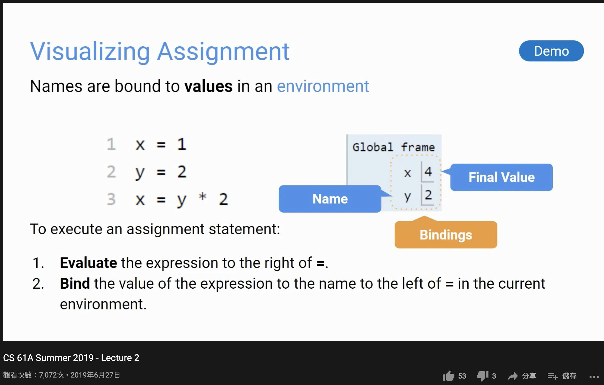
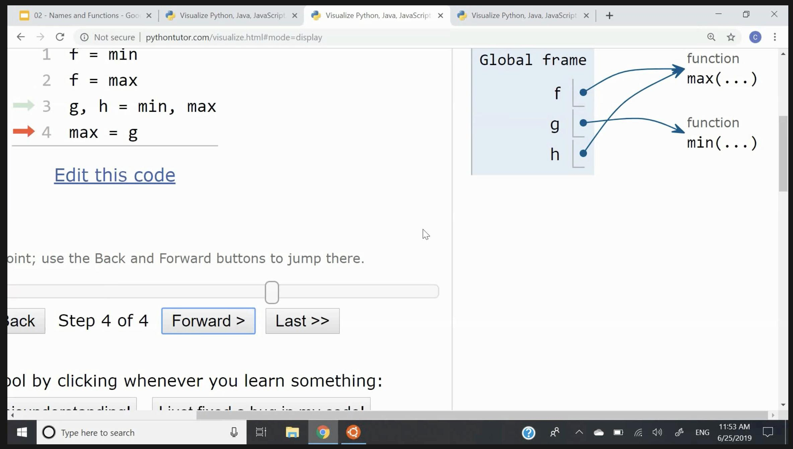
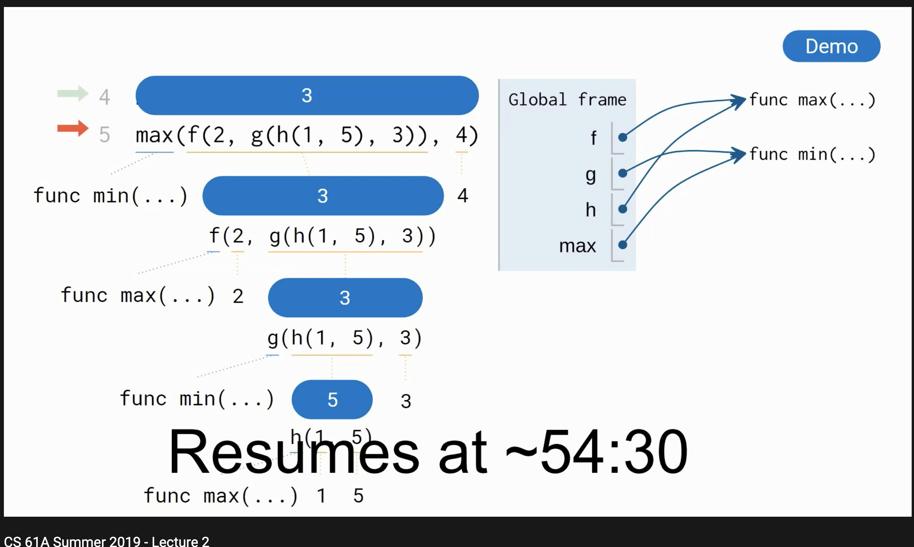

# 學習程式語言也順便學習 Python (cs61a)

Python 作為容易上手的語言之一，蠻容易在初學階段建立起信心，還有「會寫程式的錯覺」！畢竟，新手會學起有成就感的原因就是：東西會動。但東西看似會動跟你掌握了程式語言的共通常識其實是不太一樣的。

如果想要掌握泛用型程式語言的共通知識，無論你是新學習 Python 或再次學習 Python 或「再次複習」。我會推薦 [cs61a 課程](https://cs61a.org/)，作為認識程式語言的通識。

## 喜歡 cs61a 的一些原因

推薦的內容使用[「CS61A 2019 SUMMER 舊」錄影](https://www.youtube.com/playlist?list=PLXN9vwbk5m7buBvROwNxM6H4zGe7w5hjb)，別忘了去課程首頁尋找最新的資訊呦！

一起手，就開宗名義講 frame 跟 binding，沒有那個書上都會介紹的、曖昧模糊的 variable scoping，畢竟，背後實作就是 frame，那就直接用這明確有邊界的具體事實討論。

所謂的 assignment 是怎麼回事呢？就是建立新 binding 囉！而 binding 就是 name 與 value 的 pair：

配合 expression evaluate 的流程，來學習程式怎麼執行的：

這堂課的 style 大致是這樣，而期末考也是在處理使用這些「概念」，並不是要人「記憶」一堆的既有事實 (怎麼用 ooo function，API 怎麼用叫什麼名字..)，是通用的程式語言概念。只是不同語言對 frame 的邊界不一定一致，還有 type system 也不同，但這些個別差異不影響學習者對於「程式語言」有個常識性地掌握。

這類的知識是 Transferable Skills，可以讓你在相似情境「舉一反三」，才會有因為學了 **X**，而學 **Y** 時能比較快上手的感覺。

## 思路具現化

我們可以看到 cs61a 的教學輔助系統，將一些過去我們「閱讀了學習材料」，得在腦中自己「成像」圖示，具體的實作出來，用這套輔助系統可以讓「學習者」有如使用 **Debugger** 一樣，可以用眼前的事實，核對腦中的想像。

最終的目標跟使用其他學習材料一樣，將習得的思考歷程在腦中快速重現，並且能依情境自行調整內容。他這樣的作法，減少了學習材料中語意 ambiguous (模糊的) 部分，更確實地將概念以較少失真的方式傳遞給學習者。
