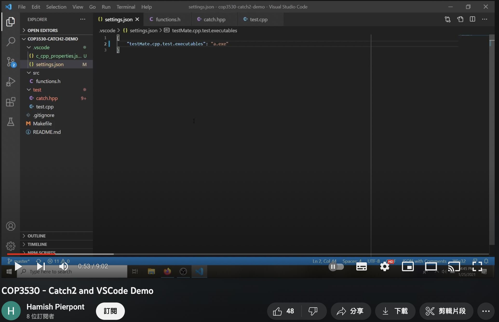
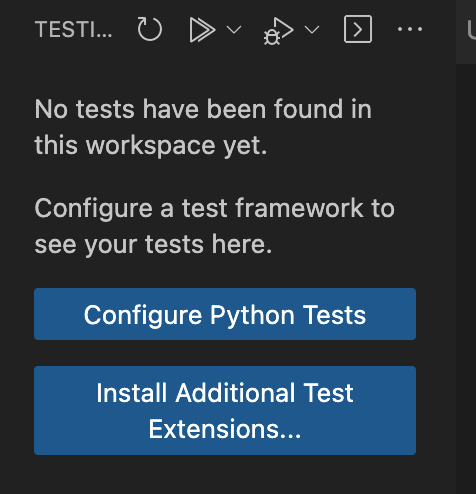
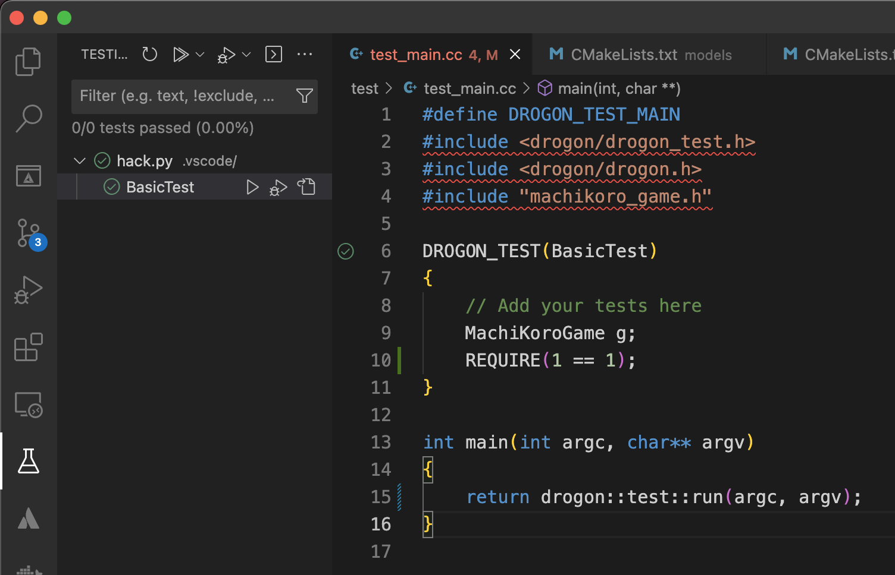
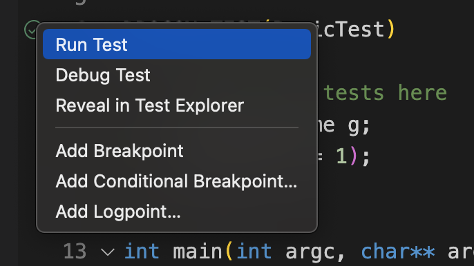
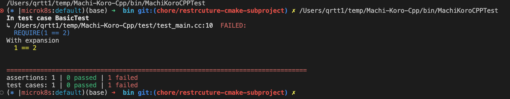

# DrogonTest 準備好上戰場了嗎？

在[遊戲微服務計劃](https://www.notion.so/Game-as-a-Service-e636a20876e6484ba0b758fdeaee06f0)觀光到 [骰子街CPP](https://github.com/Game-as-a-Service/Machi-Koro-Cpp) 專案時，對他使用的 Framework 產生了一點興趣。不過，倒不是 Web Framework 本身，畢竟當初選擇以初級 Web 開發者的身份踏入職場的我，見過太多 Web Framework 了，這換個語言再做一次的事情，是吸引不了我的目光的！

但它選用的 Test Framework 是來自 **[Drogon, the fast C++ web framework](https://drogon.org/)** 的 [DrogonTest](https://github.com/drogonframework/drogon/wiki/ENG-18-Testing-Framework)，倒是讓我起了一點興趣。畢竟，Test Framework 除了要好寫之外，還得有好的 IDE 支援。若是評價它是否準備好實戰了嗎？答案是否定的，因為目前為止還沒有開發環境能支援它。

於是，看著文件中的陳述是合理，並不是因為謙虛：

> You don't have to use DrogonTest for your application. Use whatever you are comfortable with. But it is an option.


沒有開發環境支援，實在是太不 **comfortable** 了啊！同時，**這是還無法支援它**。

## 熱門的 Test Framework 有哪些？

調查熱門的 Test Framework 的方式很簡單，只要看常見的開發環境支援哪些就行了。

像是 MSDN 中介紹在 **Visual Studio** 中實作測試的文件 [Write unit tests for C/C++ in Visual Studio](https://learn.microsoft.com/en-us/visualstudio/test/writing-unit-tests-for-c-cpp?view=vs-2022)，有提到的，不需額外安裝東西，即內建支援的 Test Framework：

- Microsoft Unit Testing Framework for C++
- Google Test
- Boost.Test
- CTest

在 [JetBrains 的 Clion 對 Test Framework 整合支援的文件](https://www.jetbrains.com/help/clion/unit-testing-tutorial.html)中提到的是：

- Google Test
- Boost.Test
- Catch2
- Doctest

那麼，在勤儉持家開發流派的 VSCode 是需要加裝 Extension 來支援的，我們以五星好評的 [C++ TestMate](https://marketplace.visualstudio.com/items?itemName=matepek.vscode-catch2-test-adapter) 為例，它支援的是：

- Catch2
- Google Test
- Doctest

以上面三組清單作為投票的選項，獲得 2 票以上者為：

- Google Test：3 票
- Boost.Test：2 票
- Catch2：2 票
- Doctest：2 票

簡單地結論，如果你要滿足同事有不同的開發環境需求，大致以這些清單內的內容去選擇就行了。

## 我們有機會讓 DrogonTest 被支援嗎？

萬一，你是 DrogonTest 的真愛粉，那肯定會朝著讓它能被大眾使用的方向推進。要達到這目標，得想辦法做的事情是，如果現有的開發環境不支援，我們是不是可以讓它被支援呢？要做到這件事，手邊的材料是否足夠呢？

為了要研究開發環境如何支援 Test Framework，我們最好得有 Source Code 能查閱，才好觀察它是怎麼實作的。幸運的是，大多數的 VSCode Extension 都是 Open Source 的專案，直接開進 [C++ TestMate 的 GitHub](https://github.com/matepek/vscode-catch2-test-adapter) 參觀了啊！

在腦衝爬 Code 之前，我們先研究一下它是如何運作起來的。這會讓我們在爬 Code 時會比較有方向感一點。首先，C/C++ 的測試需要先被編譯成可執行檔，然後你的開發環境會去執行這個檔案。但是你的開發環境是如何知道執測檔的位置呢？

[https://www.youtube.com/watch?v=QNUj4IPVOPA&t=21s](https://www.youtube.com/watch?v=QNUj4IPVOPA&amp;t=21s)



在查看了影片跟手冊之後，我們知道有 2 個參數可以設定測試的執行檔：

- testMate.cpp.test.executables
- testMate.cpp.test.advancedExecutables

這 2 個參數功能一樣，只是一個可以設比較多一點額外的參數，例如：執行時的工作目錄。這對我們來說，是個相當實用的資訊，我們可以寫一個假的檔，讓它餵參數看看。在 `.vscode/settings.json` 設定好我們的間諜：

```json
{
    "testMate.cpp.test.advancedExecutables": [".vscode/hack.py"]
}
```

還有我們的間諜本人 (記得要 `chmod +x`)：

```python
#!/usr/bin/env python
import sys
import os

def lprint(message: str):
    log_file = os.path.join(os.path.dirname(__file__), "log.txt")
    with open(log_file, "a+") as fh:
        fh.write(f"{message.strip()}\n")

if __name__ == "__main__":
    lprint(f"INVOKE START: {sys.argv}")

    os.exit(0)
```

打開 Test Panel 按一下 `Refresh` 再打開 Log 看看：



在 `log.txt` 會看到 `C++ TestMate` 下的指令：

```bash
INVOKE START: ['/Users/qrtt1/temp/Machi-Koro-Cpp/.vscode/hack.py', '--help']
INVOKE START: ['/Users/qrtt1/temp/Machi-Koro-Cpp/.vscode/hack.py', '--help']
```

看到了 `--help` 似乎是個幫助我們定位功能起點的好方法，畢竟要同時支援不同的 Test Framework 先問一下 Help 看它印什麼最快囉！於是，在 [ExecutableFactory.ts](https://github.com/matepek/vscode-catch2-test-adapter/blob/master/src/framework/ExecutableFactory.ts) 中找到了 `--help` 執行的程式碼：

```tsx
const runWithHelpRes = await this._shared.taskPool.scheduleTask(async () => {
  if (checkIsNativeExecutable) await c2fs.isNativeExecutableAsync(this._execPath);

  return this._spawner.spawnAsync(this._execPath, ['--help'], this._execOptions, this._shared.execParsingTimeout);
});
```

在同一隻程式中，我們可以觀察到它就依賴著 `runWithHelpRes.stdout` 的內容，目前看到的輸出會是搭配哪一組 Test Framework 的 Executor。下列截取的程式片它採用典型的正規表示式來決定：

```tsx
  catch2: {
    priority: 10,
    regex: /Catch2? v(\d+)\.(\d+)\.(\d+)\s?/,
    create: (sharedVarOfExec: SharedVarOfExec, match: RegExpMatchArray) =>
      new Catch2Executable(sharedVarOfExec, parseVersion123(match)),
  },
  gtest: {
    priority: 20,
    regex:
      /This program contains tests written using .*--(\w+)list_tests.*List the names of all tests instead of running them/s,
    create: (sharedVarOfExec: SharedVarOfExec, match: RegExpMatchArray) =>
      new GoogleTestExecutable(sharedVarOfExec, match[1] ?? 'gtest_'),
  },
```

所以，我們只要試著回應它其中一組就行了。間諜先生請易容成 Catch2 吧！查好了 Catch2 目前最新的版號後，稍為擴充一下 `hack.py` 的內容：

```tsx
if __name__ == "__main__":
    lprint(f"INVOKE START: {sys.argv}")

    if len(sys.argv) < 2:
        os.exit(0)

    last_command = sys.argv[-1]
    # Tell the C++ TestMate we are Catche2
    if last_command == "--help":
        print("Catch2 v3.2.1\n")
        os.exit(0)
```

新的 log 內容為：

```tsx
INVOKE START: ['/Users/qrtt1/temp/Machi-Koro-Cpp/.vscode/hack.py', '--help']
INVOKE START: ['/Users/qrtt1/temp/Machi-Koro-Cpp/.vscode/hack.py', '--help']
INVOKE START: ['/Users/qrtt1/temp/Machi-Koro-Cpp/.vscode/hack.py', '[.],*', '--verbosity', 'high', '--list-tests', '--reporter', 'xml']
```

看起來，它會試著下 `--list-tests` 來取得目前所有測試的項目，並且指定輸出為 XML 格式。我們得去弄一份 Report 讓間諜參考一下。這件事本身不難，因為 Catch2 也是個 Open Source 專案，直接把它弄回來，將他自己的 [SelfTest](https://github.com/catchorg/Catch2/tree/devel/tests/SelfTest) 編譯好拿來用就行了：

```bash
./out/build/basic-tests/tests/SelfTest "[.],*" --verbosity high --list-tests --reporter xml
```

會得到一個[巨大的 XML](https://gist.github.com/qtysdk/0df92100b4bcc028ce2fd6f6f34803fb)，我們保留完整的結構，截取頭二組示意：

```xml
<?xml version="1.0" encoding="UTF-8"?>
<MatchingTests>
  <TestCase>
    <Name>is_unary_function</Name>
    <ClassName/>
    <Tags>[clara][compilation]</Tags>
    <SourceInfo>
      <File>/Users/qrtt1/Downloads/Catch2/tests/SelfTest/IntrospectiveTests/Clara.tests.cpp</File>
      <Line>15</Line>
    </SourceInfo>
  </TestCase>
  <TestCase>
    <Name>Clara::Arg supports single-arg parse the way Opt does</Name>
    <ClassName/>
    <Tags>[arg][clara][compilation]</Tags>
    <SourceInfo>
      <File>/Users/qrtt1/Downloads/Catch2/tests/SelfTest/IntrospectiveTests/Clara.tests.cpp</File>
      <Line>44</Line>
    </SourceInfo>
  </TestCase>
</MatchingTests>
```

對應回 [Clara.tests.cpp](https://github.com/catchorg/Catch2/blob/223d8d638297454638459f7f6ef7db60b1adae99/tests/SelfTest/IntrospectiveTests/Clara.tests.cpp#L15) 的第 15 行的測試案例：

```cpp
TEST_CASE("is_unary_function", "[clara][compilation]") {
    auto unary1 = [](int) {};
    auto unary2 = [](std::string const&) {};
    auto const unary3 = [](std::string const&) {};
    auto unary4 = [](int) { return 42; };
    void unary5(char);
    double unary6(long);

    double binary1(long, int);
    auto binary2 = [](int, char) {};
    auto nullary1 = []() {};
    auto nullary2 = []() {return 42;};

    STATIC_REQUIRE(Catch::Clara::Detail::is_unary_function<decltype(unary1)>::value);
    STATIC_REQUIRE(Catch::Clara::Detail::is_unary_function<decltype(unary2)>::value);
    STATIC_REQUIRE(Catch::Clara::Detail::is_unary_function<decltype(unary3)>::value);
    STATIC_REQUIRE(Catch::Clara::Detail::is_unary_function<decltype(unary4)>::value);
    STATIC_REQUIRE(Catch::Clara::Detail::is_unary_function<decltype(unary5)>::value);
    STATIC_REQUIRE(Catch::Clara::Detail::is_unary_function<decltype(unary6)>::value);

    STATIC_REQUIRE_FALSE(Catch::Clara::Detail::is_unary_function<decltype(binary1)>::value);
    STATIC_REQUIRE_FALSE(Catch::Clara::Detail::is_unary_function<decltype(binary2)>::value);
    STATIC_REQUIRE_FALSE(Catch::Clara::Detail::is_unary_function<decltype(nullary1)>::value);
    STATIC_REQUIRE_FALSE(Catch::Clara::Detail::is_unary_function<decltype(nullary2)>::value);
    STATIC_REQUIRE_FALSE(Catch::Clara::Detail::is_unary_function<int>::value);
    STATIC_REQUIRE_FALSE(Catch::Clara::Detail::is_unary_function<std::string const&>::value);
}
```

所以，我們只要模仿這樣的結構輸出即可：

- 測試的名稱
- 標簽 (沒有，就仿 ClassName 留白吧)
- 原始檔資訊

以骰子街的測試為例，第 6 行開始是 BasicTest：

```cpp
DROGON_TEST(BasicTest)
{
    // Add your tests here
    MachiKoroGame g;
    REQUIRE(1 == 1);
}
```

在 `hack.py` 追加下列內容：

```python
if '--list-tests' in sys.argv:
        # Show list-test
        data = """
    <?xml version="1.0" encoding="UTF-8"?>
    <MatchingTests>
    <TestCase>
        <Name>BasicTest</Name>
        <ClassName/>
        <Tags/>
        <SourceInfo>
        <File>/Users/qrtt1/temp/Machi-Koro-Cpp/test/test_main.cc</File>
        <Line>6</Line>
        </SourceInfo>
    </TestCase>
    </MatchingTests>
        """.strip()
        print(data)
        os.exit(0)
```

再次 `Refresh` 之後，`C++ TestMate` 認得了我們的測試，並且在第 6 行多了按鈕可以單獨執行測試：





後續，我也試著做「假的」測試結果給它，但我們先到這裡打住就好。

## DrogonTest 還缺少什麼？

單純以符合 `C++ TestMate` 的需求，我們可以試著偽裝成 `Catch2` 的測試結果，但它的測試結果需要的資訊，在 DrogonTest 並沒有完全提供。

以下列測試為例：

```xml
./out/build/basic-tests/tests/SelfTest "Vector Approx matcher -- failing" --reporter xml --durations yes
```

Catch2 可以提供 Expected 與 Actual 的結果，還有對應回原始測試案例的**檔案與行數**：

```xml
<?xml version="1.0" encoding="UTF-8"?>
<Catch2TestRun name="SelfTest" rng-seed="2839170281" xml-format-version="2" catch2-version="3.2.1" filters="&quot;Vector Approx matcher -- failing&quot;">
  <TestCase name="Vector Approx matcher -- failing" tags="[.][approx][failing][matchers][vector]" filename="/Users/qrtt1/Downloads/Catch2/tests/SelfTest/UsageTests/Matchers.tests.cpp" line="636">
    <Section name="Empty and non empty vectors are not approx equal" filename="/Users/qrtt1/Downloads/Catch2/tests/SelfTest/UsageTests/Matchers.tests.cpp" line="638">
      <Expression success="false" type="CHECK_THAT" filename="/Users/qrtt1/Downloads/Catch2/tests/SelfTest/UsageTests/Matchers.tests.cpp" line="640">
        <Original>
          empty, Approx( t1 )
        </Original>
        <Expanded>
          {  } is approx: { 1.0, 2.0 }
        </Expanded>
      </Expression>
      <OverallResults successes="0" failures="1" expectedFailures="0" durationInSeconds="0.000184"/>
    </Section>
    <Section name="Just different vectors" filename="/Users/qrtt1/Downloads/Catch2/tests/SelfTest/UsageTests/Matchers.tests.cpp" line="642">
      <Expression success="false" type="CHECK_THAT" filename="/Users/qrtt1/Downloads/Catch2/tests/SelfTest/UsageTests/Matchers.tests.cpp" line="644">
        <Original>
          v1, Approx( v2 )
        </Original>
        <Expanded>
          { 2.0, 4.0, 6.0 } is approx: { 1.0, 3.0, 5.0 }
        </Expanded>
      </Expression>
      <OverallResults successes="0" failures="1" expectedFailures="0" durationInSeconds="5.4e-05"/>
    </Section>
    <OverallResult success="false" durationInSeconds="0.000367"/>
  </TestCase>
  <OverallResults successes="0" failures="2" expectedFailures="0"/>
  <OverallResultsCases successes="0" failures="1" expectedFailures="0"/>
</Catch2TestRun>
```

我們可以單純提供測試有沒有通過，先忽略「友善」的提示部分。但 DrogonTest 無法提供測試案例的**行數**，這變成我們得額外準備測試案例清單與檔案對應行數的列表才行。這是目前最困擾的部分，至於能不能提示使用者**期望**與**現實**的不同，只是呈現結果不是「結構」化的資料，要做起來並不太困難：



總結來說，它缺少的是：

- 測試案例的原始檔資料：哪一個檔案與在哪一行
- 結構化的檔案輸出格式：可以是 XML 或 json 或 yaml 都是能接受的選項，或直接輸出成 Catch2 格式。
