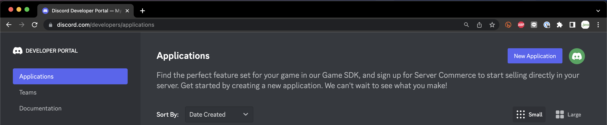
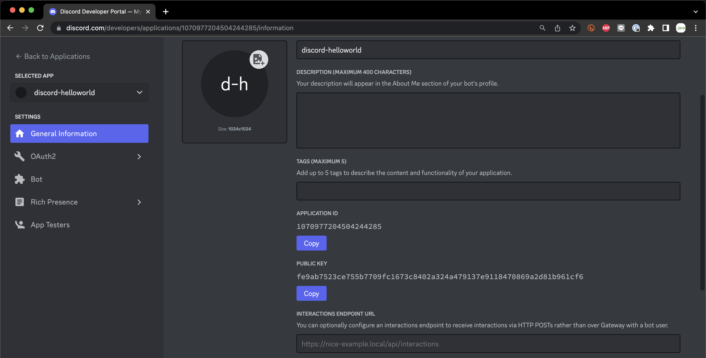
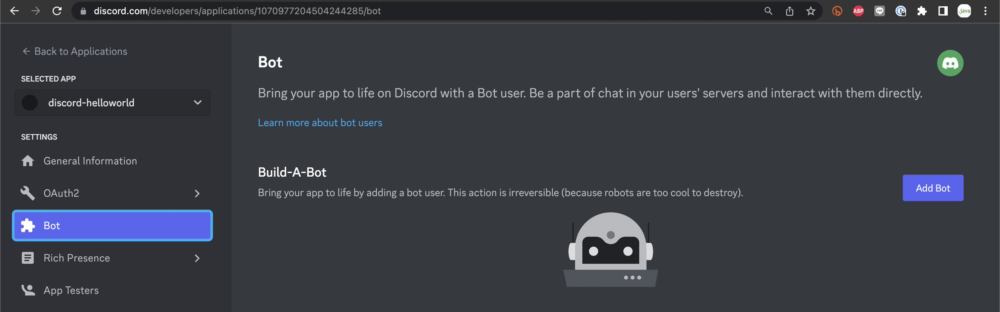
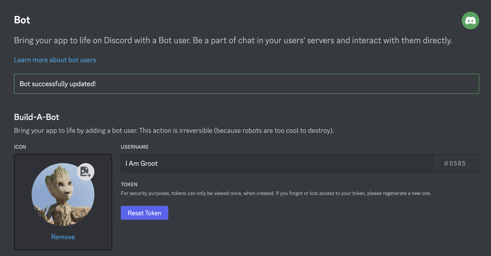
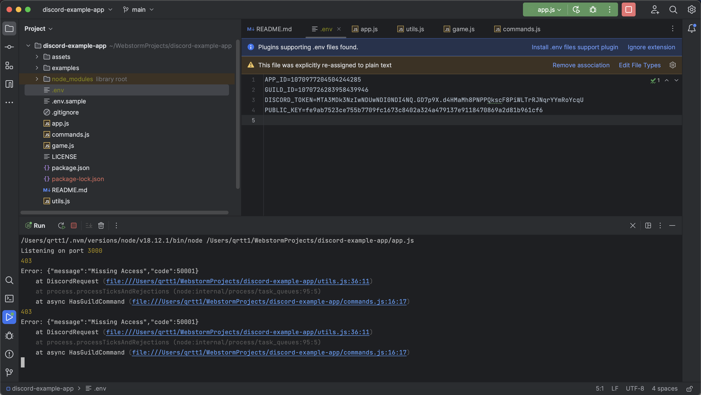
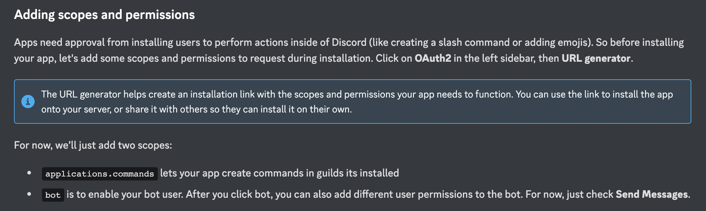
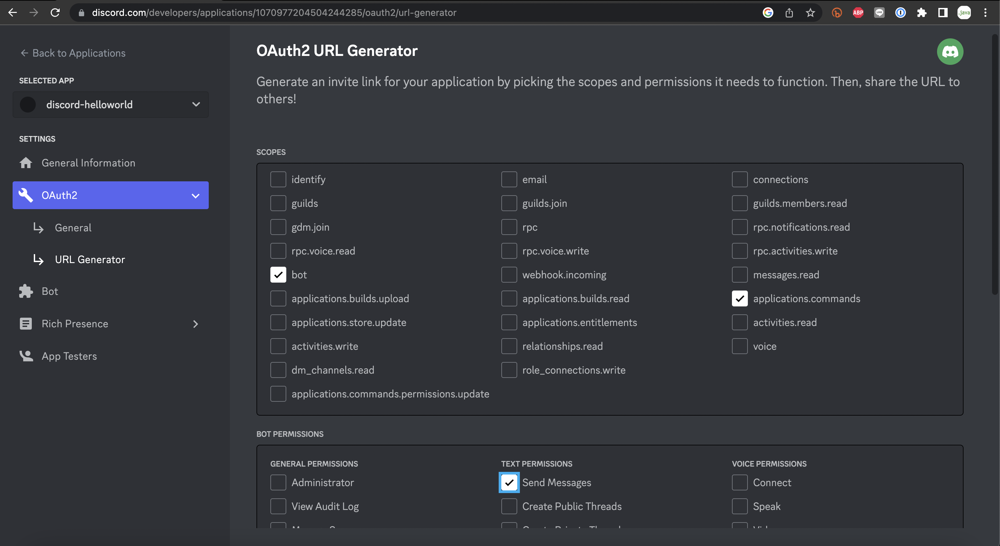
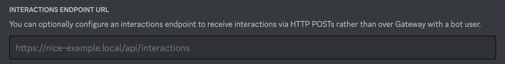
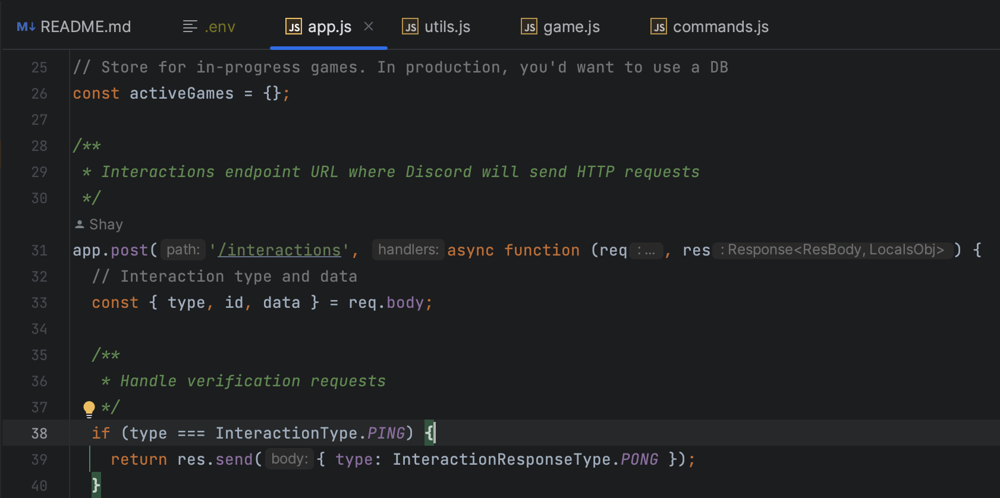
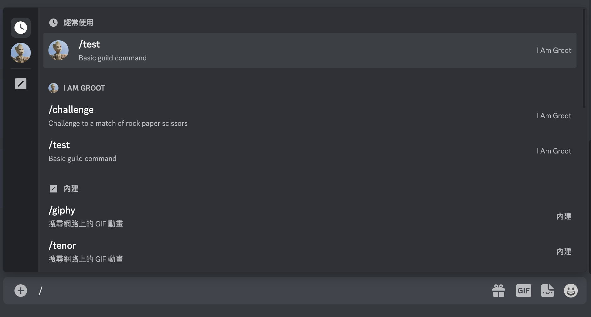

# 跟著 Discord 官方教學啟動範例程式

[Discord Developer Portal - API Docs for Bots and Developers](https://discord.com/developers/docs/getting-started)

Discord 開發者文件內的 `getting-started` 提供了第一個簡單的範例程式，這也是多數依著官方文件學習的人會來的第一個地方。在這份官方教學中，有提供一個 [GitHub Repo](https://github.com/discord/discord-example-app) 只要下載回來，再簡單地設定一下就能夠使用範例中的 Discord 機器人。

即使官方教學中，該說明的事項都有交待清楚了，但對於未獲得經驗的人，第一次操作起來還是有點手忙腳亂，於是簡單寫個文件記錄一下操作的流程。

## 取得專案與完成設定

取得專案本身是相當容易的，至少對於已經會使用 git 的開發者來說，就只是一個 git clone 的動作罷了，而問題是取得了之後，要將 `.env` 填上。這件事本身並不困難，但就是要花時間習慣一下 Developer Portal 的位置。

依著範例程式說明文件，我們只要取得原始碼後，當一般的 `node.js` 專案處理就行了：

```bash
git clone https://github.com/discord/discord-example-app.git
```

```bash
cd discord-example-app
npm install
```

這倒是目前最容易的部分，因為下一步的 [Get App credentials](https://github.com/discord/discord-example-app#get-app-credentials) 有些前置條件得先完成。先參考一下 [.env.sample](https://github.com/discord/discord-example-app/blob/main/.env.sample) 的內容：

```bash
APP_ID=<YOUR_APP_ID>
GUILD_ID=<YOUR_GUILD_ID>
DISCORD_TOKEN=<YOUR_BOT_TOKEN>
PUBLIC_KEY=<YOUR_PUBLIC_KEY>
```

在這個範例專案中，有 4 個參數需要被填上，他們填法的說明在 [Add credentials](https://discord.com/developers/docs/getting-started#adding-credentials) 小節中有提到。但對於第一次看文件的人，會有一點資訊量過大，所以才會寫個筆記記錄「只有一條路線的 Happy Path」，先來理解參數的來源。

- 建立 Discord Application 後會得到
  - APP_ID
  - DISCORD_TOKEN
  - PUBLIC_KEY
- 建立或使用既有的 Discord Server
  - 由 Server 的 URL 取得 GUILD_ID

## 建立 Application 與準備環境變數

進入 Developer Portal 後 (也許你要先啟用開發者模式)，會有個 `New Application` 可以建立新的 Discord Application：



建立完成後，它會自動導入 General Information 頁，你就能獲得：

- APP_ID
- PUBLIC_KEY

這些是機敏資料，請保持它不讓其他人知道 (在文件釋出的同時，此 Application 已刪除)：



再來，點開 Bot 頁籤，我們需要有一個 Bot User 才行，因為 `.env` 內的 DISCORD_TOKEN 就是 Bot User 的 Token。在新的 Application 內的 Bot 頁面如下，點選 `Add Bot` 建立你的 Bot User：



建出 Bot User 後，按下 `Reset Token` 獲得新的 Token (它只有產生時會顯示，沒有其它方式查詢，請妥善保存。遺失時，就只能重生囉)：



經過上述流程後，除了 `GUILD_ID` 都填上了，而 GUILD 在手冊中的說明是：channels 與 users 的集合，換句話說也就是一個 Discord Server。因此，他的文件說明是，你找出你打算安裝 Application 的 Discord Server URL：

```bash
https://discord.com/channels/5566666666666666666/1070726283958439949
```

以上面的 URL 為例，位於 `/channels` 後第 1 節的 `5566666666666666666` 就是 `GUILD_ID`。

## 初次啟動應用程式

你可以在命令列執行：

```bash
node app.js
```

或在 IDE 中啟動 `app.js` 來啟動 Discord Application：



由於，我們並沒有真的完成範例程式中的「安裝說明」部分，會有錯誤是正常的。流程中，我們故意留下這個未完成的部分，為了要認識這個常見的錯誤訊息：

```bash
/Users/qrtt1/.nvm/versions/node/v18.12.1/bin/node /Users/qrtt1/WebstormProjects/discord-example-app/app.js
Listening on port 3000
403
Error: {"message":"Missing Access","code":50001}
    at DiscordRequest (file:///Users/qrtt1/WebstormProjects/discord-example-app/utils.js:36:11)
    at process.processTicksAndRejections (node:internal/process/task_queues:95:5)
    at async HasGuildCommand (file:///Users/qrtt1/WebstormProjects/discord-example-app/commands.js:16:17)
403
Error: {"message":"Missing Access","code":50001}
    at DiscordRequest (file:///Users/qrtt1/WebstormProjects/discord-example-app/utils.js:36:11)
    at process.processTicksAndRejections (node:internal/process/task_queues:95:5)
    at async HasGuildCommand (file:///Users/qrtt1/WebstormProjects/discord-example-app/commands.js:16:17)
```

若你去 Google 查詢，會知道因為你的 Application 權限不足，所以有一些功能在使用時被拒絕了。

請先回到教學文件，查閱一下 [Adding scopes and permissions](https://discord.com/developers/docs/getting-started#adding-scopes-and-permissions) 的內容：



它說要使用 `OAuth2` 內的 `URL generator` 來設定權限，也有說明要指定的權限內容，勾選的參考畫面如下：



選完後，在最下方會出現一個 URL：

```bash
https://discord.com/api/oauth2/authorize?client_id=1070977204504244285&permissions=2048&scope=applications.commands%20bot
```

當初，我在閱讀教學文件時，並不知道這個 URL 要如何使用，因為範例程式的設定檔不會用到。那麼要怎麼用呢？其實，就只是開啟 Browser 去使用它就行了：

<https://www.youtube.com/watch?v=SzaFHil964I>


完成授權後，應用程式就可以正常啟動囉。

## 設定 interactions URL

這個範例程式，有提供與使用者互動的功能。為了達到這個功能，我們使用的範例程式是一個簡單的 Web Application，它會開一個 HTTP Server 並等得 Discord 的互動。如果你還記得先前提到的 `General Information`，它正好是設定 interactions url 的地方：



問題來了，如果要能 Discord 能夠訪問我們的 HTTP Server，那就得準備一個可以公開存取的網址。為了達到這個目的，文件上提供二個建議：

- 部置在公開的 Server 上
- 使用 ngrok，透過他的代理機制讓我們 local 的 HTTP Server 能被公開存取

在這我選擇用比簡單的 `ngork` 來滿足條件：

```bash
ngrok                                                                                                                                                                                                              (Ctrl+C to quit)
                                                                                                                                                                                                                                   
Add Single Sign-On to your ngrok dashboard via your Identity Provider: https://ngrok.com/dashSSO                                                                                                                                   
                                                                                                                                                                                                                                   
Session Status                online                                                                                                                                                                                               
Account                       Ching-Yi Chan (Plan: Free)                                                                                                                                                                           
Version                       3.1.1                                                                                                                                                                                                
Region                        Japan (jp)                                                                                                                                                                                           
Latency                       -                                                                                                                                                                                                    
Web Interface                 http://127.0.0.1:4040                                                                                                                                                                                
Forwarding                    https://71ff-118-160-147-135.jp.ngrok.io -> http://localhost:3000                                                                                                                                    
                                                                                                                                                                                                                                   
Connections                   ttl     opn     rt1     rt5     p50     p90                                                                                                                                                          
                              0       0       0.00    0.00    0.00    0.00
```

你會看到 ngork 替我們產生的 URL：

```bash
https://71ff-118-160-147-135.jp.ngrok.io
```

接著依著教學的說明，我們得在設定頁填上：

```bash
[https://af3a-118-160-147-135.jp.ngrok.io](https://af3a-118-160-147-135.jp.ngrok.io/)/interactions
```

如果你想問為什麼是 `/interactions` ？因為，程式就是這麼寫的：



## 打完收工

一切就續後，程式就可以使用囉：




這篇簡短的筆記，記錄了依著官文教學啟動 Discord Application 的步驟，再補上一些自己覺得需要的小細節。我們樸實地走完了 `Hello World` 的安裝，作為開始學習開始 Discord Application 的起點。
