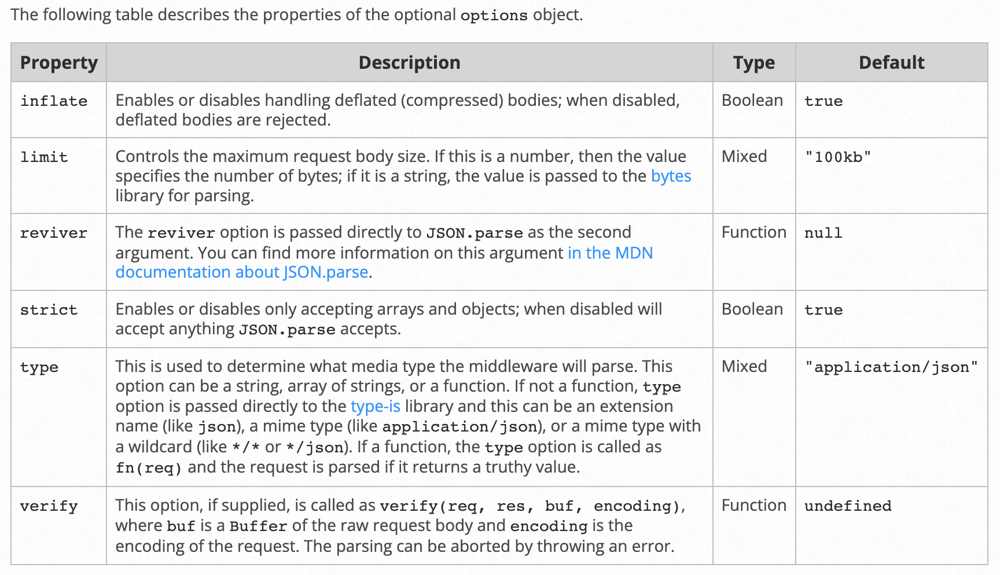

# Discord 基礎範例調查兵團 [1]

在前一篇文章[跟著 Discord 官方教學啟動範例程式](https://hackmd.io/@iD40lBm-QAqgh62DVHbjPA/B1UUUU53s)，我們啟動了官方教學文件的第一個 Discord 應用程式。儘管我們什麼都沒有做，但得到了一個**具體的實例**可以作為「研究與學習」Discord 應用程式開發的立足點。

## 開大門走大路

在 [Getting Started app for Discord](https://github.com/discord/discord-example-app) 中的程式啟動說明如下：

```bash
node app.js
```

即使沒有 node.js 開發經驗的人，也可以看得出來這就是所謂的「正門」：應用程式的進入點。作為研究一份陌生的程式，看看他怎麼開頭應該會有點幫助。幸運的是，我們將所有的細節摺疊起來後，竟然只有短短的幾行：


他在第 19 行，建立了一個 `express app` 中間做了一點設定，在最後的 178 行，還呼叫了 `listen` 函式。挺符合我們對他的期望：一個簡易的 HTTP Server。可以先猜測 `express` 可能就是 node.js 用來建立 Web 應用程式的第三方 library。

有了這個猜想，我們可以簡單地組合一下關鍵字，拿去 Google 一下：

```bash
nodejs express
```


看起來這似乎是個熱門的 library (因為要社群的群體夠大，才有機會出現英文以外的說明)。知道來源了，讓我們逛一逛他的基礎教學唄：<https://expressjs.com/en/starter/hello-world.html>


在 `Hello world` 的範例，看起來跟我們拿到的 Discord 學習範例的結構是相似的，只是他在第 5 行用的是 `app.get` 接收一個 `HTTP GET` 的請求。而我們的 Discord 學習範例是使用 `app.post` 推論，大概會是接收 `HTTP POST` 的請求：

```jsx
app.post('/interactions', async function (req, res) {
  // Interaction type and data
  const { type, id, data } = req.body;
  // ... skipped ...
}
```

為了驗證我們的推論，進一步查詢 [API Reference](https://expressjs.com/en/4x/api.html)：他的 `express` 物件實作了各種 HTTP Method 讓開發者使用，這些 method 被稱為 `routing methods`：


獲得了上述的知識後，我們可以重新描述範例程式：

> 在 express app 中，實作針對路徑 `/interactions` 的 routing


```jsx
app.post('/interactions', async function (req, res) {
  // Interaction type and data
  const { type, id, data } = req.body;
  // ... skipped ...
}
```

而他的 callback 參數就放 `middleware function` 即可，以我們的範例程式來說，看得了一個 callback 函式，有 `req` 與 `res` 變數，參考一下文件中的使用範例：

```jsx
app.post('/', function (req, res) {
  res.send('POST request to homepage')
})
```

可以推論：

- req 即為 HTTP Request 的封裝
- res 即為 HTTP Response 的封裝

## 試著深入一點點

對於**好奇的調查兵團**，除了文件上的說明當然極有興趣知道，他在 Runtime 時會是什麼物件。這件事很容易，因為我們有可以玩的實例了，只要 Debugger 開下去就會知道：


他們分別是 `IncomingMessage` 與 `ServerResponse`。進一步，他是一個 Open Source 專案，你還可以去他的 GitHub Repo 上查一下這些物件如何建立出來的：


看起來，分別自 `lib/request.js` 與 `lib/response.js`，但我們就先不深入了，畢竟主要是先探索一下對理解 Discord 範例程式有用的知識，目前深入太多層了，要提醒自己適時地停下，若將層數寫出來，大概會是：

- Discord 範例程式
- express 文件
- express 的 routing 寫法
- routing method 中的 callback 函式的用法
- callback 函式的參數到底是什麼呢？

在心中大致有底後，我們小結一下目前的發現。在 Discord 範例中：

- 它利用 express library 提供了一個簡單的 Web 應用程式
- 針對 `/interactions` URI，處理 HTTP POST 的請求

## 退回一步，檢查遺漏項目

在理解完基本的 routing method 實作後，我們似乎還有一些遺漏的部分沒有去弄懂：

```jsx
// Create an express app
const app = express();
// Get port, or default to 3000
const PORT = process.env.PORT || 3000;
// Parse request body and verifies incoming requests using discord-interactions package
app.use(express.json({ verify: VerifyDiscordRequest(process.env.PUBLIC_KEY) }));
```

那個 `app.use` 是什麼東西呢？利用 API Reference 上附的搜尋功能，可以很快找到我們感興趣的文件：


他說 `app.use` 是去載入 `middleware` 用的。那麼問題來了 middleware 是什麼呢？繼續點開 middleware 的連結：


文件上表示 `middleware` 是一種函式，它可以存取 `requet object` 還有 `response object` 以及 `next` 函式。我們可以用它來：

- 執行任何東西
- 變更 request 或 response 的內容
- 結果 `request-response` 的 cycle (白話的意思，就是完成 request 並以 response 回應給 HTTP Client)
- 呼叫 `下一個` middleware

這裡可以看到，它範例的 `middleware callback` 比我們先前看到的多一個 `next`，他呼叫 `next()` 來繼續 `request-response` 的流程。有沒有感受到 Chain of Responsibility 了呢？再看 [Using middleware](http://expressjs.com/en/guide/using-middleware.html) 的說明，在不同的地方都有實作 middleware 的 interface。所以，除了我們剛剛範例看到的 routing middleware 之外，還有這些：


因此，我們終於知道了 `app.use` 就是 Application-level middleware。他提供了一個記錄 Request Time 的範例：

```jsx
const express = require('express')
const app = express()

const requestTime = function (req, res, next) {
  req.requestTime = Date.now()
  next()
}

app.use(requestTime)

app.get('/', (req, res) => {
  let responseText = 'Hello World!<br>'
  responseText += `<small>Requested at: ${req.requestTime}</small>`
  res.send(responseText)
})

app.listen(3000)
```

由於 `requestTime` callback 內呼叫了 `next()`。因此 middleware 把任務交棒給下一個 middleware 了，就輪到了 `app.get` 處理。而 `app.get` 並沒有再次申明要有下一個 middleware，所以它就是 `request-response` cycle 的終點了。

## express.json middleware

弄明白了 `app.use` 是個 Application-level middleware 後，下一個問題就是 `express.json` 這個 middleware 的功能是什麼？同樣的，利用 API Reference 繼續查詢。


由它的說明看起來 `express.json` 是一個內建的 middleware function，它會看 Request 物件的 `Content-Type` 將符合 JSON 格式的 Request 轉成 Javascript  物件。同時，它也會看 Request Header 有沒有標示為壓縮的資料，如果有就自動解壓縮。

除了上述基本的功能，還可以知道它提供 Configuration 可以讓開發者填入一些參數，例如 Discord 範例程式中用到的 `verify` 就要填寫一個函式：



依名稱來看 `verify` 應該是用來驗證 Request 內容之用，搭配範例程式填入的函式名，推測應該為驗證來自 Discord Server 的 Request 是否合法：

```jsx
app.use(express.json({ verify: VerifyDiscordRequest(process.env.PUBLIC_KEY) }));
```

> 研究到此，可以先簡單記一個 TODO，要在 `VerifyDiscordRequest` 學習如何驗證來自 Discord Server 的 Request 是否合法。


## 回到 Discord 的部分

大致理解完 Application 層級的相依工具後，我們可以回到 Discord 本身的 Domain Knowledge 了。要深入的目標很明確：

- `VerifyDiscordRequest` 在驗證什麼？
- `/interactions` 提供哪些功能。

這部分的探索，我們會再拍一集解說 (老高化!?)
