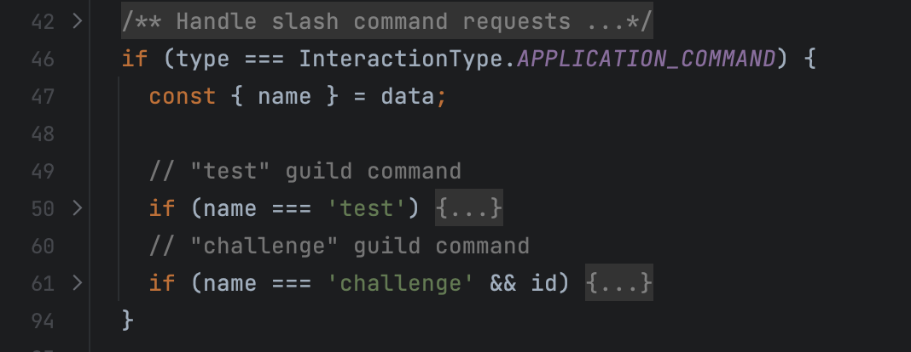

# Discord 基礎範例調查兵團 [2]

在上回的調查中，我們大致走完了 `express` library 的使用方式。在這一輪的調查期望可以對 Discord 本身的 Domain Knowledge 有更多的理解。接續著上回提到的事項：

- `VerifyDiscordRequest` 在驗證什麼？
- `/interactions` 提供哪些功能。

## VerifyDiscordRequest

`VerifyDiscordRequest` 的實作相當精簡，因為它主要的邏輯來自 discord-interactions 函式庫提供的 `verifyKey` 方法：

```jsx
export function VerifyDiscordRequest(clientKey) {
  return function (req, res, buf, encoding) {
    const signature = req.get('X-Signature-Ed25519');
    const timestamp = req.get('X-Signature-Timestamp');

    const isValidRequest = verifyKey(buf, signature, timestamp, clientKey);
    if (!isValidRequest) {
      res.status(401).send('Bad request signature');
      throw new Error('Bad request signature');
    }
  };
}
```

深入程式前，我們可以回頭核對一下開發者文件的說明，同樣也請多多利用各手冊提供的搜尋功能。那麼該查哪些關鍵字呢？有幾個思路：

- 一是把函式名字拆成動詞片語來查：verify discord request
- 另一種是，查最獨一無二又不會變化的字串。例如：`X-Signature-Ed25519` 與 `X-Signature-Timestamp`


查詢的結果會進入 interactions 的 [Security and Authorization](https://discord.com/developers/docs/interactions/receiving-and-responding#security-and-authorization) 章節：


說明文字截錄如下：

> The internet is a scary place, especially for people hosting open, unauthenticated endpoints. If you are receiving Interactions via outgoing webhook, there are some security steps you must take before your app is eligible to receive requests.


Every Interaction is sent with the following headers:

* `X-Signature-Ed25519` as a signature
* `X-Signature-Timestamp` as a timestamp

Using your favorite security library, you must validate the request each time you receive an [interaction](https://discord.com/developers/docs/interactions/receiving-and-responding#interaction-object). If the signature fails validation, respond with a `401` error code. Here's a couple code examples


大意是說：網路是一個壞人多多的可怕地方，開發者有責任去驗證每一次來自 Webhook 的 Request，驗不過就回 HTTP Code 401。驗證的參數來自二個自訂 header，驗證的步驟請參考範例與 `你最喜歡的 security library` 實作。

開發文件上有提供 node.js 與 Python 版本的範例：

```jsx
const nacl = require('tweetnacl');

// Your public key can be found on your application in the Developer Portal
const PUBLIC_KEY = 'APPLICATION_PUBLIC_KEY';

const signature = req.get('X-Signature-Ed25519');
const timestamp = req.get('X-Signature-Timestamp');
const body = req.rawBody; // rawBody is expected to be a string, not raw bytes

const isVerified = nacl.sign.detached.verify(
  Buffer.from(timestamp + body),
  Buffer.from(signature, 'hex'),
  Buffer.from(PUBLIC_KEY, 'hex')
);

if (!isVerified) {
  return res.status(401).end('invalid request signature');
}
```

```python
from nacl.signing import VerifyKey
from nacl.exceptions import BadSignatureError

# Your public key can be found on your application in the Developer Portal
PUBLIC_KEY = 'APPLICATION_PUBLIC_KEY'

verify_key = VerifyKey(bytes.fromhex(PUBLIC_KEY))

signature = request.headers["X-Signature-Ed25519"]
timestamp = request.headers["X-Signature-Timestamp"]
body = request.data.decode("utf-8")

try:
    verify_key.verify(f'{timestamp}{body}'.encode(), bytes.fromhex(signature))
except BadSignatureError:
    abort(401, 'invalid request signature')
```

觀察了上述的範例，他所挑選的 Security Library 應該跟 `nacl` 有關，因為與 verify key 相關的實作都是來自至此 Library。不迥，這個 Context 還不夠明確，因為通常驗證的方法，會是一種「演算法」名稱，若在開發者文件中直接指出是哪一種驗證演算法會更方便，可以讓想在自己熟悉的語言實作相同功能的人，快速找到對應的 solution。或是期待 `nacl` 也有對應的實作，在想用的語言上面了。

為了想知道更多，我們可以查看這些 Open Source 專案的實作：

<https://github.com/pyca/pynacl/blob/main/src/nacl/signing.py#L59-L66>

```python
class VerifyKey(encoding.Encodable, StringFixer):
    """
    The public key counterpart to an Ed25519 SigningKey for producing digital
    signatures.
    :param key: [:class:`bytes`] Serialized Ed25519 public key
    :param encoder: A class that is able to decode the `key`
    """
```

在這得，我們可以歸納出關鍵字：

- Ed25519
- SigningKey
- verify (搭上我們原本要做的動作)
- ____ (填上你想要找的語言實作)

```python
Ed25519 SigningKey verify rust
```


有了這些資訊，我們可以先結束 `VerifyDiscordRequest` 的探索，因為已經知道：

- 為什麼需要驗證它？
- 驗證它需要的參數由哪而來？(二個 header 與 public key)
- 用什麼樣的演算法 (Library) 去驗證它

## Interactions 的實作


由上述的程式片段可知，在經過 `express.json` middleware 後，`req.body` 會是轉換好的 Javascript 物件。在第 33 行，透過**解構賦值** (Destructuring assignment) 的語法取出其中的 `type` `id` 與 `data` 欄位，若你還好奇有哪些欄位，可以查看看手冊，或簡單透過 Debugger 查看：


上述 `body` 內看到的欄位，應該也要與手冊上的一致才是：

<https://discord.com/developers/docs/interactions/receiving-and-responding>


進一步查詢 Interaction Type 共有 5 種，在範例程式實作了其中 3 種：

- PING
- APPLICATION_COMMAND
- MESSAGE_COMPONENT

## PING/PONG 乒乓

```python
if (type === InteractionType.PING) {
  return res.send({ type: InteractionResponseType.PONG });
}
```

PING 與 PONG 的 request-response 是所有 interaction 實作中最簡單的，他是 Discord Server 用來檢查你的 Discord Application 有沒有活著用的功能，手上冊 [receiving an interaction](https://discord.com/developers/docs/interactions/receiving-and-responding#receiving-an-interaction) 有這樣的說明：

> When you attempt to save a URL, we will send a `POST` request to that URL with a `PING` payload. The `PING` payload has a `type: 1`. So, to properly ACK the payload, return a `200` response with a payload of `type: 1`:


```python
@app.route('/', methods=['POST'])
def my_command():
    if request.json["type"] == 1:
        return jsonify({
            "type": 1
        })
```

我們也會發現，在開發手冊上的範例程式，並不總是附上 node.js 與 Python 的範例，像這個例子只有 Python 的範例 (看起來像是以 `flask` 為例子寫成的)。總之，在這個例子裡，我們學習到 interaction 的回應，大致會有個 `type`。再翻翻文件，你可以在 [Responding to interactions](https://discord.com/developers/docs/interactions/receiving-and-responding#responding-to-an-interaction) 查到可以用的 return type，其中的 `PONG` 回對應的值就是 `1`， 回應一個 `PING` 的 Ack：


## Application Command

接在乒乓之後的是 Application Command 的實作，它就是對應至 `/` command 的部分了：


依據開發文件的說明，會有三種類型的 Application Command，我們目前使用的是 `CHAT_INPUT`，但會晚一點再繼續研究它，因為我們目前的 scope 在處理 Application Command 的 `回應`，而不是新增。



在程式的第 47 行，先由 data 中取得了 `name` 欄位，以確認使用者是用哪一個 command。除了 `PING` 沒有 `data` 可用之外，其他 `type` 的 interaction 都會有 `data` 欄位，而 data 的結構由 `type` 決定，我們可以在手冊查到它們應有的內容，例如 [Application Command Data Structure](https://discord.com/developers/docs/interactions/receiving-and-responding#interaction-object-application-command-data-structure)：


我們先由單純的 `test` command 來看，它回應 `hello world` 與一個隨機的 emoji：

```jsx
// "test" guild command
if (name === 'test') {
  // Send a message into the channel where command was triggered from
  return res.send({
    type: InteractionResponseType.CHANNEL_MESSAGE_WITH_SOURCE,
    data: {
      // Fetches a random emoji to send from a helper function
      content: 'hello world ' + getRandomEmoji(),
    },
  });
}
```

使用起來像是這樣：


運用 CHANNEL_MESSAGE_WITH_SOURCE 回應 Discord Server 是最直接的方式，你可以看到它不需要特別指出，要回應的是哪一則 message。儘管是實作內容較多的 `challenge` command 也是使 CHANNEL_MESSAGE_WITH_SOURCE 回應，只是再多了個 `components` 的欄位：

```jsx
// "challenge" guild command
if (name === 'challenge' && id) {
  const userId = req.body.member.user.id;
  // User's object choice
  const objectName = req.body.data.options[0].value;

  // Create active game using message ID as the game ID
  activeGames[id] = {
    id: userId,
    objectName,
  };

  return res.send({
    type: InteractionResponseType.CHANNEL_MESSAGE_WITH_SOURCE,
    data: {
      // Fetches a random emoji to send from a helper function
      content: `Rock papers scissors challenge from <@${userId}>`,
      components: [
        {
          type: MessageComponentTypes.ACTION_ROW,
          components: [
            {
              type: MessageComponentTypes.BUTTON,
              // Append the game ID to use later on
              custom_id: `accept_button_${req.body.id}`,
              label: 'Accept',
              style: ButtonStyleTypes.PRIMARY,
            },
          ],
        },
      ],
    },
  });
}
```

## Message Component

Message Component 是一個迷你的 GUI 系統，讓你製作簡單的使用者互動選項的工具：

<https://discord.com/developers/docs/interactions/message-components>


若是拿上方的 `MessageComponentTypes.ACTION_ROW` 來對照手冊的說明，你會看到它是一個包含其他 Component 的容器罷了，這也是為什麼後續還得實作 `InteractionType.MESSAGE_COMPONENT` 的原因，因為 Discord Server 會再來詢問，特定使用者按下的 Request，該組什麼新的選項出來。這其中的細節，我們會在下一篇文章繼續研究。
