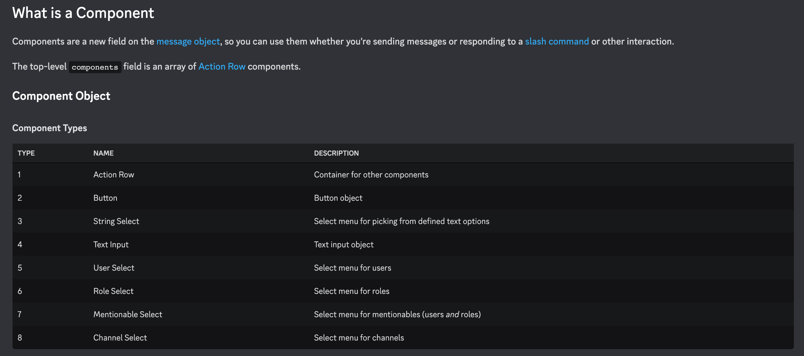

# Discord 基礎範例調查兵團 [3]

在上一篇文章，我們開始閱讀了 challenge command 的程式，但還沒進展到理解它的內涵的部分。為了讓大家容易理解，可以先看一下 demo 影片：



## Challenge command

`challenge` 的用法是先觸發 `/challenge` 指令，接著他會跳出選單：


最後，送出內容後，會再有個 `Accept` 的 Button 可以按：


按下去後，原始的訊息刪除，進行選擇然後得到結果：


```jsx
// "challenge" guild command
if (name === 'challenge' && id) {
  const userId = req.body.member.user.id;
  // User's object choice
  const objectName = req.body.data.options[0].value;

  // Create active game using message ID as the game ID
  activeGames[id] = {
    id: userId,
    objectName,
  };

  return res.send({
    type: InteractionResponseType.CHANNEL_MESSAGE_WITH_SOURCE,
    data: {
      // Fetches a random emoji to send from a helper function
      content: `Rock papers scissors challenge from <@${userId}>`,
      components: [
        {
          type: MessageComponentTypes.ACTION_ROW,
          components: [
            {
              type: MessageComponentTypes.BUTTON,
              // Append the game ID to use later on
              custom_id: `accept_button_${req.body.id}`,
              label: 'Accept',
              style: ButtonStyleTypes.PRIMARY,
            },
          ],
        },
      ],
    },
  });
}
```

在 challenge 的回應中，只有這樣的內容，它是怎麼對應至上述的操作流程呢？答案很簡單，最開始進行遊戲設置的選項，並不是在這裡實作的。那些選項是在「安裝」command 時設定進去的（請參考 `commands.js`），我們將它擱置在一旁先，繼續研究 interaction 的部分：

```jsx
// Command containing options
export const CHALLENGE_COMMAND = {
  name: 'challenge',
  description: 'Challenge to a match of rock paper scissors',
  options: [
    {
      type: 3,
      name: 'object',
      description: 'Pick your object',
      required: true,
      choices: createCommandChoices(),
    },
  ],
  type: 1,
};
```

回到了使用者執行了 challenge 後，Discord 顯示 `Accept` 按鈕的話題。這一段顯然是 `components` 欄位的內容。其中的 `InteractionResponseType.CHANNEL_MESSAGE_WITH_SOURCE` 與 `content` 是我們已經透過 `/test` 理解的部分，它很單純是回傳文字給使用者。接著，我們得弄懂的是 `components` 欄位該如何使用。

## Message components

<https://discord.com/developers/docs/interactions/message-components>

> Message components—we'll call them "components" moving forward—are a framework for adding interactive elements to the messages your app or bot sends. They're accessible, customizable, and easy to use.


我們再次 zoom-in 一點，專注在 `Accept` 顯示的部分：

```
return res.send({
  type: InteractionResponseType.CHANNEL_MESSAGE_WITH_SOURCE,
  data: {
    // Fetches a random emoji to send from a helper function
    content: `Rock papers scissors challenge from <@${userId}>`,
    components: [
      {
        type: MessageComponentTypes.ACTION_ROW,
        components: [
          {
            type: MessageComponentTypes.BUTTON,
            // Append the game ID to use later on
            custom_id: `accept_button_${req.body.id}`,
            label: 'Accept',
            style: ButtonStyleTypes.PRIMARY,
          },
        ],
      },
    ],
  },
});
```

依開發手冊的說明 `ACTION_ROW` 是一個最頂層的 components，也就是它得在整個 Component Tree 的 Root：



文件告訴了我們一些規則：

- 一個 message 最多有 5 個 Action rows
- Action rows 可以容其其他 component，但不能包含 Action rows (換句話說，Action rows 只能在最頂層)


接下來，文件也介紹了 Custom ID，也跟我們說了一些規則：

- 除了 Action rows，component 必定有 `custom_id` ，內容由開發者定義。
- `custom_id: click_me` 這個例子，如果是設在 Button，當 Button 被按時，interaction 會收到值為 `click_me` 的 custom_id。
- custom_id 必需是獨一無二的，就算來自則一擇 message 的不同 component，也不該使用同樣的 custom_id。
- custom_id 最長可以放 100 字元，開發者可以放便地用他來管理狀態或重要資料。


繼續讀到 Button 的說明，發現除了我們範例用的 `Primary` Button，還有一種 `Link` Button 來放 URL 的。看起來他是一個特殊案例，不能放 `custom_id` 而被要求得放 `url`：


有了上述的資料後，再回頭看一下範例中的 `custom_id`：

```jsx
// Create active game using message ID as the game ID
  activeGames[req.body.id] = {
    id: userId,
    objectName,
  };
```

```jsx
custom_id: `accept_button_${req.body.id}`,
```

這裡實作，他展示了「管理狀態」的意義。在「發起挑戰」之後，將 message id 作為這一場遊戲的 `game id` ，並且讓 `Accept` Button 的 custom_id 包含 `game id` 的內容，以便在後與的 Message component 處理中能夠識別出，後續的動作是針對哪一個 `game id` 來做的。

## 回應 message component


在後續的程式，我們可以看到它都是 `prefix` 與 `game_id` 的結合。流程大致為：

- 發起挑戰的人，先選定他要出什麼 (這是一個 `剪刀、石頭、布` 遊戲的變形版本)
- 接受挑戰的人，選定要出的內容。
- 最後，顯示遊戲結果。

若我們將上述的流程，對應的實作展開會是：

- 發起人在 Discord Client 使用 `/challenge` → (已決定出牌內容) interaction 處理 Application command → 顯示 `Accept` Button (`custom_id: accept_button_{game_id}`)
- 挑戰者在 Discord Client 按下 `Accept` Button → interaction 處理 Message component
  - 當 custome_id 符合 `accept_button_{game_id}` → 顯示選項給挑戰者選擇 (`custom_id: select_button_{game_id}`)
- 挑戰者，由選單選擇出牌內容，送出  `custom_id: select_button_{game_id}` → interaction 處理 Message component
  - 當 custome_id 符合 `select_button_{game_id}` → 宣佈遊戲結果

## 遊戲互動中的 API Call

若你看過 Demo 影片，會發現隨著遊戲進行，使用者的 Message 是會被刪除或修改內容的。這部分就不是單純靠 interaction 的 response 來進行的，而是透過直接的 API Call 去向 Discord Server 請求變更。

個別的 API 呼叫方式，其實查文件就行了。我們有興趣的依然是「機制」的部分，也就是它該如何正確的使用？要有哪些參數呢？

我們再次拿出 `accept_button_` 處理的部分，然後刪去 Message Component 的細節，再來看一次：

```jsx
if (componentId.startsWith('accept_button_')) {
  // get the associated game ID
  const gameId = componentId.replace('accept_button_', '');
  // Delete message with token in request body
  const endpoint = `webhooks/${process.env.APP_ID}/${req.body.token}/messages/${req.body.message.id}`;
  try {
    await res.send({
      type: InteractionResponseType.CHANNEL_MESSAGE_WITH_SOURCE,
      data: { /* skipped */ },
    });
    // Delete previous message
    await DiscordRequest(endpoint, { method: 'DELETE' });
  } catch (err) {
    console.error('Error sending message:', err);
  }
}
```

看起來重點只有二句：

```jsx
// Delete message with token in request body
const endpoint = `webhooks/${process.env.APP_ID}/${req.body.token}/messages/${req.body.message.id}`;

// Delete previous message
await DiscordRequest(endpoint, { method: 'DELETE' });
```

對應至文件，就是 `Delete Webhook Message` 的用法：


但 DiscordRequest 內怎麼實作的呢？我們會驗證外來的 Request，對應至 Discord Server 也會驗證我們是不是合法的 Request，也許在 `DiscordRequest` 的實作可以找到答案：

```jsx
export async function DiscordRequest(endpoint, options) {
  // append endpoint to root API URL
  const url = 'https://discord.com/api/v10/' + endpoint;
  // Stringify payloads
  if (options.body) options.body = JSON.stringify(options.body);
  // Use node-fetch to make requests
  const res = await fetch(url, {
    headers: {
      Authorization: `Bot ${process.env.DISCORD_TOKEN}`,
      'Content-Type': 'application/json; charset=UTF-8',
      'User-Agent': 'DiscordBot (https://github.com/discord/discord-example-app, 1.0.0)',
    },
    ...options
  });
  // throw API errors
  if (!res.ok) {
    const data = await res.json();
    console.log(res.status);
    throw new Error(JSON.stringify(data));
  }
  // return original response
  return res;
}
```

`DiscordRequest` 是範例程式中的一個函式，內容看起來不長。只要看一下，就明白他是如何驗證的了，其實就是在 Header 放置 Authorization 資訊：

```jsx
Authorization: `Bot ${process.env.DISCORD_TOKEN}`
```

有了這些概念後，我們就能快速地打個 `curl` 驗證一下：

```bash
curl \
-H "Authorization: Bot $DISCORD_TOKEN" \
-H "Content-Type: application/json; charset=UTF-8" \
https://discord.com/api/v10/guilds/$GUILD_ID/channels 
```

```json
[
  {
    "id": "1070726283958439947",
    "type": 4,
    "name": "文字頻道",
    "position": 0,
    "flags": 0,
    "parent_id": null,
    "guild_id": "1070726283958439946",
    "permission_overwrites": []
  },
  {
    "id": "1070726283958439948",
    "type": 4,
    "name": "語音頻道",
    "position": 0,
    "flags": 0,
    "parent_id": null,
    "guild_id": "1070726283958439946",
    "permission_overwrites": []
  },
  {
    "id": "1070726283958439949",
    "last_message_id": "1072177624916435085",
    "type": 0,
    "name": "一般",
    "position": 0,
    "flags": 0,
    "parent_id": "1070726283958439947",
    "topic": null,
    "guild_id": "1070726283958439946",
    "permission_overwrites": [],
    "rate_limit_per_user": 0,
    "nsfw": false
  },
  {
    "id": "1070726283958439950",
    "last_message_id": null,
    "type": 2,
    "name": "一般",
    "position": 0,
    "flags": 0,
    "parent_id": "1070726283958439948",
    "bitrate": 64000,
    "user_limit": 0,
    "rtc_region": null,
    "guild_id": "1070726283958439946",
    "permission_overwrites": [],
    "rate_limit_per_user": 0,
    "nsfw": false
  }
]
```

## 調查的完結

在這幾回的調查中，我們會到了：

- 建立簡單的 HTTP Server 與設定 Discord 的 incoming webhook 處理 interaction
- 驗證 webhook 接收的 HTTP Request 是否合法
- 認識了不同的 interaction types (全部 5 種內的 3 種)。
- 學習到 message 回應，除了文字還可以使用 Message Component 來組出豐富的選項
- 透過 Message Component 的 custom_id 做狀態管理
- 知道如何純粹地呼叫 Discord API

在這個腳踏實驗，走一步記錄一步的歷程中，對於 Discord 應用程式的實作，有一定程度的理解。應該能減少後續，學習其他封裝好的 Library 而有的「不透明感」。因為，無論如何封裝，本質就是 HTTP 協定之間的 Request 與 Response 罷了。

PS. Gateway 是另一個議題，也許得再找別的範本來學習。
