# 也來讀讀 Open Source 函式庫怎麼實作 Discord Gateway 的部分

<https://discord.com/developers/docs/topics/gateway>

> The Gateway API lets apps open secure WebSocket connections with Discord to receive events about actions that take place in a server/guild, like when a channel is updated or a role is created. There are a few cases where apps will *also* use Gateway connections to update or request resources, like when updating voice state.


> The Gateway is Discord's form of real-time communication used by clients (including apps), so there are nuances and data passed that simply isn't relevant to apps. Interacting with the Gateway can be tricky, but there are [community-built libraries](https://discord.com/developers/docs/topics/community-resources#libraries) with built-in support that simplify the most complicated bits and pieces. If you're planning on writing a custom implementation, be sure to read the following documentation in its entirety so you understand the sacred secrets of the Gateway (or at least those that matter for apps).


由文件的說明來看 Gateway API 可以用來進行「即時更新」，還有一些極少的情境只有 Gateway API 有支援，像是 `updating voice state`。不過，與 Gateway 的互有多許多細節要處理，建議使用社群已經開發好的函式庫，除非你想要自己修改相關的細節才會需要看 Gateway API 的相關文件。

## 盤點一下現有的資源

由於，我們並不打算從無到有去建立 Discord Gateway API 的函式庫，而是以想要理解它的角度出發，那麼我們直接研究社群已經有的函式庫會是比較好的做法。先來列一下聽過或是試過的函式庫唄！

先前第一次寫 Discord Bot 時，用的是網路上找來的 Python 範例，它用的是 `discord.py`：

```jsx
[https://discordpy.readthedocs.io/en/stable/](https://discordpy.readthedocs.io/en/stable/)
```

週二的讀書會聽到的「全民知識王」分享，使用的是 `DiscordKT`

```jsx
[https://github.com/DiscordKt/DiscordKt](https://github.com/DiscordKt/DiscordKt)
```

我們可以利用上述函式庫的其中一個，建立出基本的範例程式，再來針對文件上的說明進行 trace code。那 trace 的目標會是什麼呢？至少先能理解文件上的[建立 Connection 流程](https://discord.com/developers/docs/topics/gateway#connections)唄：

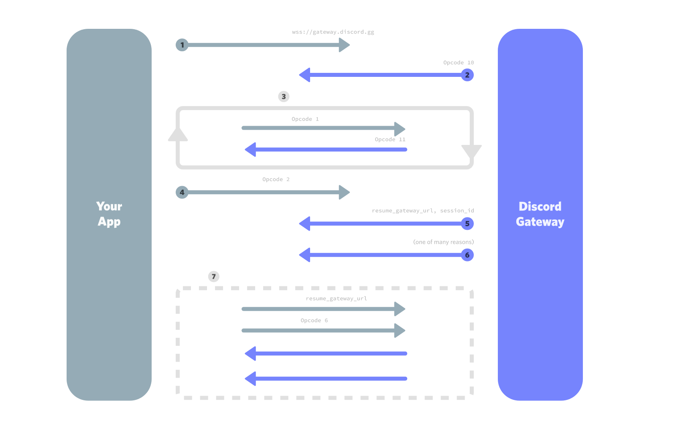

## 建立實驗用專案

在目前可見範圍內的函式庫有 Python 實作的與 Kotlin 實作的，簡單地決定是選擇 Python 實作的。因為他的文件寫得比較多一點。[Getting Started](https://discordpy.readthedocs.io/en/stable/quickstart.html) 的範例也很容易發現：

```python
# This example requires the 'message_content' intent.

import discord

intents = discord.Intents.default()
intents.message_content = True

client = discord.Client(intents=intents)

@client.event
async def on_ready():
    print(f'We have logged in as {client.user}')

@client.event
async def on_message(message):
    if message.author == client.user:
        return

    if message.content.startswith('$hello'):
        await message.channel.send('Hello!')

client.run('your token here')
```

針對他的範例，我們稍作改寫。寫一個 module `__main__` checking 與使用環境變數取得 token：

```python
if __name__ == '__main__':
    client.run(os.environ.get('DISCORD_TOKEN'))
```

程式可以正常啟動：

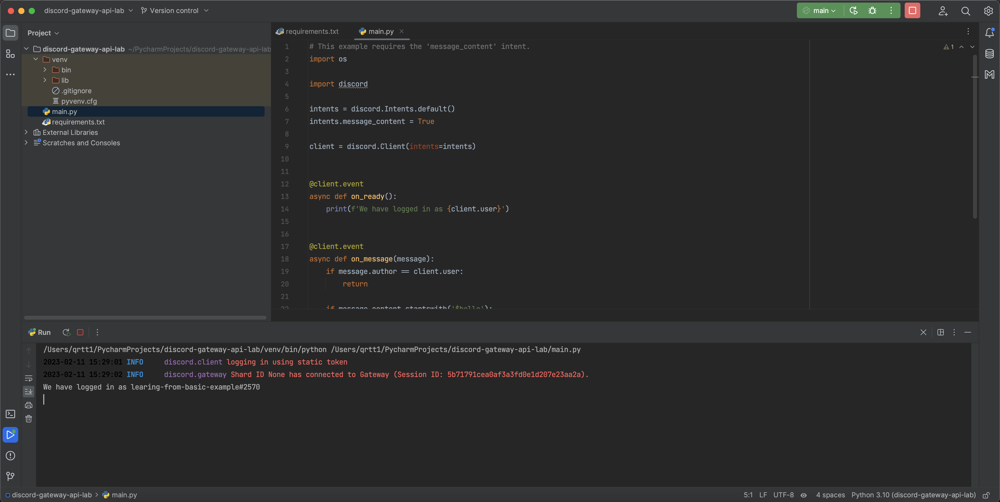

頻道也能看到 Bot 的回應：

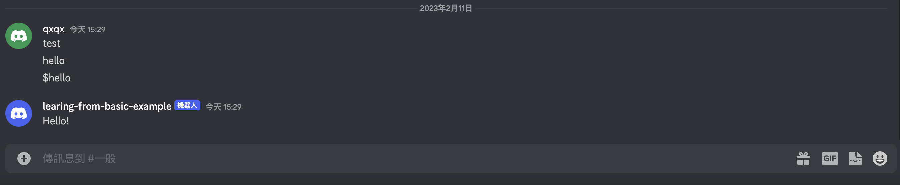

只要能做到這步，我們就算是踏上研究的起點了。再來就是 trace code 與理解文件上的描述的工作。

## 程式的輪廓

我們的 `getting-started` 程式並不長，它看起來主要的功能是去收 `使用者傳來的訊息` 並且做出適當的回應而已：

```python
@client.event
async def on_message(message):
    if message.author == client.user:
        return

    if message.content.startswith('$hello'):
        await message.channel.send('Hello!')
```

除了這部分，還有一開始的 `當一切都準備好時，印一點訊息` 的功用：

```python
@client.event
async def on_ready():
    print(f'We have logged in as {client.user}')
```

還有個明顯到不行的程式進入點：

```python
if __name__ == '__main__':
    client.run(os.environ.get('DISCORD_TOKEN'))
```

與最開始的參數設定、建立 Client 物件：

```python
intents = discord.Intents.default()
intents.message_content = True

client = discord.Client(intents=intents)
```

我們可以將上面的區塊都作為要 trace code 的對象，他們最終都是要追的部分，就來選個比較感興趣的部分優先，或是覺得「簡單」的優先也不錯。畢竟，我們也需有一點 small success 來建立對 trace code 的信心。

以下是我打算追蹤的優先序（至少第一輪打算這麼做，再層入下一層時可能有不同的順序）：

- `@client.event` 這個 Decorator 的實作
- `client.run( ... )` 的實作
- Gateway event 與 callback function 是如何對應的？(特別是 signature 的部分)
- client 物件的建立與 intents

## Event Decorator

```python
@client.event
async def on_ready():
    print(f'We have logged in as {client.user}')
```

我們知道，在 Python 中有提供 `@` 語法，可以讓你在 `既有的函式` 再包一層 decorator。我們通常用它來幫原來的函式增加一些行為，或是用它來做權限控管，當然要做一些 `連動` 的行為也是可以的。

Discord Gateway API 基質上是 `Event Driven` 的設計，當 Client 端連上了 Gateway 後，就是等待事件送來，並且再視情況做出回應。所以，利用 decorator 對事件的綁定是相當合理的。它的實作如下：

```python
def event(self, coro: Coro, /) -> Coro:
    """A decorator that registers an event to listen to.

    You can find more info about the events on the :ref:`documentation below <discord-api-events>`.

    The events must be a :ref:`coroutine <coroutine>`, if not, :exc:`TypeError` is raised.

    Example
    ---------

    .. code-block:: python3

        @client.event
        async def on_ready():
            print('Ready!')

    .. versionchanged:: 2.0

        ``coro`` parameter is now positional-only.

    Raises
    --------
    TypeError
        The coroutine passed is not actually a coroutine.
    """

    if not asyncio.iscoroutinefunction(coro):
        raise TypeError('event registered must be a coroutine function')

    setattr(self, coro.__name__, coro)
    _log.debug('%s has successfully been registered as an event', coro.__name__)
    return coro
```

如果去掉程式的 `註解` 還有 `pre-condition`，那其實只剩下三行。有沒有覺得異常地簡單呢？

```python
def event(self, coro: Coro, /) -> Coro:
    setattr(self, coro.__name__, coro)
    return coro
```

先不管語法上有沒有看懂，我們來猜一下。那個 `Coro`，是不是就是 `on_ready` 函式本身呢？

```python
@client.event
async def on_ready():
    print(f'We have logged in as {client.user}')
```

在有了「可以跑的程式」作為研究的材料，當然要使用 trace code 的好伙伴：Debugger。

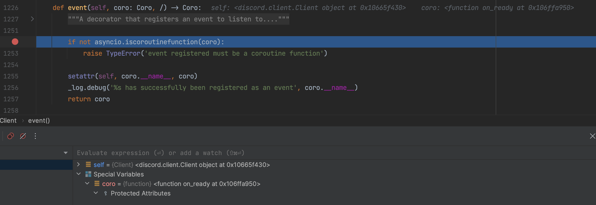

你可以明確地由 Debugger 內的變數列中看到，那就是我們的 `on_ready` 函式。同時，我們也獲得了一個冷知識，函式可以透過 `__name__` 取得名稱。為了慶祝這難得獲得新知的時刻，寫個小程式驗證一下想法唄：

```python
def forever_5566():
    pass

if __name__ == '__main__':
    print(forever_5566.__name__)
```

毫無意外的是印出 `forever_5566`。

回到 Event register 功能本身，那個 `setattr` 是什麼呢？

```python
def event(self, coro: Coro, /) -> Coro:
    setattr(self, coro.__name__, coro)
    return coro
```

這也是常見的 Python 內建函式，若以 Python 的語法直翻，我們本來要做的事情就是：

```python
# 將 `on_ready` 函式，設定為 client 物件的 `on_ready` 屬性
client.on_ready = on_ready
```

但是以「函式庫」的角度，我們並不知道「使用者」會註冊哪些函式，所以後有動態一點的方式來設定物件的屬性。那麼 `setattr` 就是這樣的用途，第 1 個參數是要設定的對象，第 2 個參數是屬性名稱，最後一個參數是屬性的值。

而第一個參數填上了 `self` 主要是 `event` 函式是 `Client` 類別的一個方法，因此它的 `self` 就會是建好的 `client` 物件本身。相信大家對於第 2 個值的屬性名稱不會有太多疑問，但第 3 個是屬性的值，它填寫的是 `函式` 本身。如果你有 `C/C++` 的函式指標的概念，相信會很好理解。假設沒有，那我們可以寫點簡單的範例玩看看：

```python
def func1():
    print("it is func1")

def func2(name: str):
    print(f"Hello, {name}")

class Foo:
    def __init__(self):
        setattr(self, func1.__name__, func1)
        setattr(self, func2.__name__, func2)

if __name__ == '__main__':
    client = Foo()
    getattr(client, "func1")()
    getattr(client, "func2")("5566")
```

在這個例子，我們使用剛剛學到的 `setattr` 把函式註冊給 `Foo` 類別，然後執行時，使用 `getattr` 以「名稱」的方式獲得 `已註冊的函式` 。獲得了函式之後，我們就可以 `正常地使用 Python 的呼叫函式語法` 去使用它們了：

```python
getattr(client, "func2")("5566")
```

有沒有發現，所謂的正常呼叫函式的語法只是加上了 `( .... )` 一組小括弧，再看情況填上了函式所需的參數。當然，它就是正常的函式呼叫，如果你的參數沒有對上應該有的值，它也應當正常地出錯。

到目前為止，我們明白了 Event Decorator 內做的事情。只要我們再研究完 `client.run(...)` 應該就可以理解它怎麼呼叫這些 Event Handler 的。

## Run 該如何 Run 呢？

透過 `@client.event` 綁定好 Event Handler 後，接下來要串起完整的機制就得先讓程式「跑起來」開始「聽」來自 Gateway 的 Event。

<https://github.com/Rapptz/discord.py/blob/v2.1.1/discord/client.py#L748-L833> 我們同樣，去掉註解，只留下實作本身來研究 `run`：

```python
def run(
    self,
    token: str,
    *,
    reconnect: bool = True,
    log_handler: Optional[logging.Handler] = MISSING,
    log_formatter: logging.Formatter = MISSING,
    log_level: int = MISSING,
    root_logger: bool = False,
) -> None:

    async def runner():
        async with self:
            await self.start(token, reconnect=reconnect)

    if log_handler is not None:
        utils.setup_logging(
            handler=log_handler,
            formatter=log_formatter,
            level=log_level,
            root=root_logger,
        )

    try:
        asyncio.run(runner())
    except KeyboardInterrupt:
        return
```

若是再去掉主要目標無關的 logging 處理，其實只剩下。有沒有覺得，事情突然變簡單了呢？：

```python
def run(
    self,
    token: str,
    *,
    reconnect: bool = True,
    log_handler: Optional[logging.Handler] = MISSING,
    log_formatter: logging.Formatter = MISSING,
    log_level: int = MISSING,
    root_logger: bool = False,
) -> None:

    async def runner():
        async with self:
            await self.start(token, reconnect=reconnect)

    try:
        asyncio.run(runner())
    except KeyboardInterrupt:
        return
```

`run` 函式的參數雖然多，但冷靜想想，多數是跟 logging 相關的。其中有一個星號 `*`，它是標示 `在此之後的參數，都是 keyword parameters`，並且它們都必需有預設值。另一種標示，是 `/`。若是回頭看 `@client.event` 的宣告：

```python
def event(self, coro: Coro, /) -> Coro:
    # ...skipped...
    return coro
```

在最後的 `/` 是標示 `在此之前的參數，都是 positional-only parameters`。所以，只能依序填上，不能用 `event(coro=foo)` 這樣的寫法去填它。基於上述的概念，我們再次簡化一下要閱讀的內容，它只剩下了：

```python
def run(
    self,
    token: str,
    *,
    reconnect: bool = True,
) -> None:

    async def runner():
        async with self:
            await self.start(token, reconnect=reconnect)

    try:
        asyncio.run(runner())
    except KeyboardInterrupt:
        return
```

最後留下來的參數都很容易理解。`token` 就是放 Discord Bot 用的 token，而 `reconnect` 看起來就是要不要開啟斷線重連，而它的預設值是 `True`。那程式的本身，需要一些 Python 非同步編程 (Asynchronous programming) 的知識：

- asyncio 函式庫的用法
- async 與 await 的使用
- 相關的概念

儘管你也許還沒有學過 asyncio 如何使用，但它其實不太影響「閱讀」。單純地閱讀，並不用替語法、語意正確負責。先來看看簡單的部分：

```python
try:
    asyncio.run(runner())
except KeyboardInterrupt:
    return
```

它用 `asyncio.run` 函式去執行 `async` 函式 `runner`。這麼做只因為 co-rountine 只能在 async context 內執行罷了 (精確地說，它跑上 event loop 內)。而這突如其來的 `co-rountine` 是指：

```python
async def runner():
    async with self:
        await self.start(token, reconnect=reconnect)
```

它單純將原本的 `def runner()` 加上了 `async` 關鍵字。一旦有了 `async` 的宣告，它就不再是單純的函式，而是一個可以被 `暫停` 的函式 (a.k.a. `co-rountine`)。在 async context 內，就可以使用 `async` / `await` 關鍵字了。`await` 就是等待執行的 `co-rountine` 收工的意思。那麼，去掉非同步的相關的寫法，它其實就是呼叫 `Client.start` 然後等待它結束罷了。所以，我們知道 `Client.run` 其實是把實作委派給 `Client.start`。

除了這些，我們還注意到一個細節，它用了 `async with` ([參考文件](https://docs.python.org/3.9/reference/compound_stmts.html#async-with))。那就是它配合了 Context Manager 進行資源的初始化與清理的流程。就像我們平時寫的檔案操作相似，只是它是 `非同步` 的版本。看一下下面的例子，由於 `open` 函式有實作 Context Manager，所以進入 `with` block 時，它會產生 File Handler，而離開此 block 時，它會自動呼叫 `out.close()` 進行資源回收。：

```python
with open("foo.txt", "w") as out:
    out.write("I wanna play a game")
```

所以，我們應該再多看在 Client 類別中實作的 `async` Context Manager 在忙些什麼。

```python
class AsyncContextManager:
    async def __aenter__(self):
        await log('entering context')

    async def __aexit__(self, exc_type, exc, tb):
        await log('exiting context')
```

已知，針對 async 版本的初始化與清理的 callback 函式分別為：

- **aenter**
- **aexit**

對應至 Client 中的實作為：

```python
async def __aenter__(self) -> Self:
    await self._async_setup_hook()
    return self

async def __aexit__(
    self,
    exc_type: Optional[Type[BaseException]],
    exc_value: Optional[BaseException],
    traceback: Optional[TracebackType],
) -> None:
    if not self.is_closed():
        await self.close()
```

其中 `__aexit__` 很好理解，如果要結束時，有東西還沒有 `close`，那應該呼叫一下 `close`。而 `__aenter__` 進入 `async with` 的 block 要做的事又再委派給了 `_async_setup_hook`，那就再追進去看看囉：

```python
async def _async_setup_hook(self) -> None:
        # Called whenever the client needs to initialise asyncio objects with a running loop
        loop = asyncio.get_running_loop()
        self.loop = loop
        self.http.loop = loop
        self._connection.loop = loop

        self._ready = asyncio.Event()
```

內容也相當簡單，由於 `async with` 是被 `asyncio.run` 建立出來的，在這時它已經有了 Event Loop。它把現行的 Event Loop 指派給需要參與 Async Task 的相關物件。然後，設定 `_ready` 狀態為 `False` (Event 物件預設值是 `False`)。

到目前為止，我們探索了 `Client.run` 知道多數的實作在建立 Async Context 罷了，跟 Discord 相關的部分不多。而它的主要邏輯，委派給了 `Client.start`。那麼 start 中到底寫了什麼呢？

```python
async def start(self, token: str, *, reconnect: bool = True) -> None:
    """|coro|

    A shorthand coroutine for :meth:`login` + :meth:`connect`.

    ...skipped...
    """
    await self.login(token)
    await self.connect(reconnect=reconnect)
```

看起來很 easy，其實是簡化了 API 呼叫，把 `login` 與 `connect` 結合在一起罷了。

## Login 該怎麼登入呢？

下面為去掉函式 doc-string 簡化版本 login 函式：

```python
async def login(self, token: str) -> None:
    _log.info('logging in using static token')

    if self.loop is _loop:
        await self._async_setup_hook()

    if not isinstance(token, str):
        raise TypeError(f'expected token to be a str, received {token.__class__.__name__} instead')
    token = token.strip()

    data = await self.http.static_login(token)
    self._connection.user = ClientUser(state=self._connection, data=data)
    self._application = await self.application_info()
    if self._connection.application_id is None:
        self._connection.application_id = self._application.id

    if not self._connection.application_flags:
        self._connection.application_flags = self._application.flags

    await self.setup_hook()
```

我們關心的登入動作，似乎只有一句：

```python
data = await self.http.static_login(token)
```

這一句會對應到 Connection Lifecycle 中的哪一部分呢？依常理來想，應該會是到第 5 步，得到 `Ready event`：

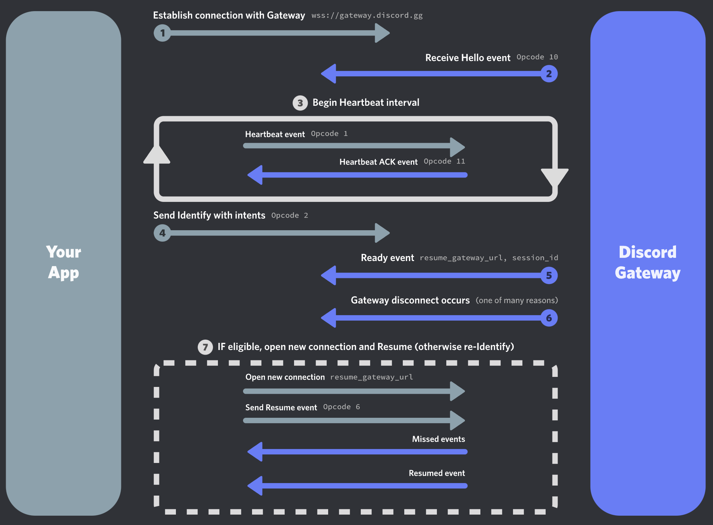

直接來[看一下它的實作](https://github.com/Rapptz/discord.py/blob/v2.1.1/discord/client.py#L548)，對應我們的猜想是不是對的 [static_login](https://github.com/Rapptz/discord.py/blob/8c66c182f7e9401e0bd40cf8b2212df29f5fd6a5/discord/http.py#L784) 的實作如下：

```python
async def static_login(self, token: str) -> user.User:
    # Necessary to get aiohttp to stop complaining about session creation
    if self.connector is MISSING:
        self.connector = aiohttp.TCPConnector(limit=0)

    self.__session = aiohttp.ClientSession(
        connector=self.connector,
        ws_response_class=DiscordClientWebSocketResponse,
        trace_configs=None if self.http_trace is None else [self.http_trace],
    )
    self._global_over = asyncio.Event()
    self._global_over.set()

    old_token = self.token
    self.token = token

    try:
        data = await self.request(Route('GET', '/users/@me'))
    except HTTPException as exc:
        self.token = old_token
        if exc.status == 401:
            raise LoginFailure('Improper token has been passed.') from exc
        raise

    return data
```

同樣的，我們先試著忽略不太關心的部分，這回不關心的部分就是組關 HTTP 的 Request 與 Response 的細節，那麼對於 Login 來說，關鍵只有：

```python
old_token = self.token
self.token = token

try:
    data = await self.request(Route('GET', '/users/@me'))
except HTTPException as exc:
    self.token = old_token
    if exc.status == 401:
        raise LoginFailure('Improper token has been passed.') from exc
    raise
```

換句話說，所謂的 Login 的動作，是將 `token` 設定給 `Client` 並利用 `GET /users/@me` 的結果，確認一下 `token` 是不是真的可以用而已。這段的實作，還沒有開始進行 WebSocket 的連結，跟我一開始的「猜想」是不同的。那麼直接使用 WebSocket 與 Discord Gateway 連線的部分，大概會是 `connect` 的動作了。

## Connect 起來了啊！

已知 Login 單純驗證 Bot 的 `token` 可不可用後，我們[繼續研究 `connect` 的實作](https://github.com/Rapptz/discord.py/blob/v2.1.1/discord/client.py#L591)，在去除了 doc-string 後，依然有一點長的 `connect` 函式：

```python
async def connect(self, *, reconnect: bool = True) -> None:
    backoff = ExponentialBackoff()
    ws_params = {
        'initial': True,
        'shard_id': self.shard_id,
    }
    while not self.is_closed():
        try:
            coro = DiscordWebSocket.from_client(self, **ws_params)
            self.ws = await asyncio.wait_for(coro, timeout=60.0)
            ws_params['initial'] = False
            while True:
                await self.ws.poll_event()
        except ReconnectWebSocket as e:
            _log.debug('Got a request to %s the websocket.', e.op)
            self.dispatch('disconnect')
            ws_params.update(sequence=self.ws.sequence, resume=e.resume, session=self.ws.session_id)
            if e.resume:
                ws_params['gateway'] = self.ws.gateway
            continue
        except (
            OSError,
            HTTPException,
            GatewayNotFound,
            ConnectionClosed,
            aiohttp.ClientError,
            asyncio.TimeoutError,
        ) as exc:

            self.dispatch('disconnect')
            if not reconnect:
                await self.close()
                if isinstance(exc, ConnectionClosed) and exc.code == 1000:
                    # clean close, don't re-raise this
                    return
                raise

            if self.is_closed():
                return

            # If we get connection reset by peer then try to RESUME
            if isinstance(exc, OSError) and exc.errno in (54, 10054):
                ws_params.update(
                    sequence=self.ws.sequence,
                    gateway=self.ws.gateway,
                    initial=False,
                    resume=True,
                    session=self.ws.session_id,
                )
                continue

            # We should only get this when an unhandled close code happens,
            # such as a clean disconnect (1000) or a bad state (bad token, no sharding, etc)
            # sometimes, discord sends us 1000 for unknown reasons so we should reconnect
            # regardless and rely on is_closed instead
            if isinstance(exc, ConnectionClosed):
                if exc.code == 4014:
                    raise PrivilegedIntentsRequired(exc.shard_id) from None
                if exc.code != 1000:
                    await self.close()
                    raise

            retry = backoff.delay()
            _log.exception("Attempting a reconnect in %.2fs", retry)
            await asyncio.sleep(retry)
            # Always try to RESUME the connection
            # If the connection is not RESUME-able then the gateway will invalidate the session.
            # This is apparently what the official Discord client does.
            ws_params.update(
                sequence=self.ws.sequence,
                gateway=self.ws.gateway,
                resume=True,
                session=self.ws.session_id,
            )
```

我們依著相似的思路來去除雜訊。也許你已經可以抓到 trace code 的節奏，內容的剔除或保留大致是：

- 留下 Happy Path 的內容
- 去掉膠水 (glue code) 的部分，像是為了發 HTTP Request 要做的一些瑣事
- 通常不太重要的「註解」，不用懷疑，多數時候我其實不太看註解，除非 code 醜到不看註解不行。
- 相對於 Happy Path 的部分，Exception Handling 通常可以先忽略

以目前的程式碼，我們單純將 Exception Handling 去掉，思路就會清晰起來：

```python
async def connect(self, *, reconnect: bool = True) -> None:
    backoff = ExponentialBackoff()
    ws_params = {
        'initial': True,
        'shard_id': self.shard_id,
    }
    while not self.is_closed():
        try:
            coro = DiscordWebSocket.from_client(self, **ws_params)
            self.ws = await asyncio.wait_for(coro, timeout=60.0)
            ws_params['initial'] = False
            while True:
                await self.ws.poll_event()
        except ReconnectWebSocket as e:
            _log.debug('Got a request to %s the websocket.', e.op)
            self.dispatch('disconnect')
            ws_params.update(sequence=self.ws.sequence, resume=e.resume, session=self.ws.session_id)
            if e.resume:
                ws_params['gateway'] = self.ws.gateway
            continue
        except (
            OSError,
            HTTPException,
            GatewayNotFound,
            ConnectionClosed,
            aiohttp.ClientError,
            asyncio.TimeoutError,
        ) as exc:
            # ...skipped...
            pass
```

若是依然負擔太大，那也可以只看 `try` 的本體就好！經過層層篩選後，最關鍵的部分就這些囉：

```python
ws_params = {
    'initial': True,
    'shard_id': self.shard_id,
}

coro = DiscordWebSocket.from_client(self, **ws_params)
self.ws = await asyncio.wait_for(coro, timeout=60.0)
ws_params['initial'] = False
while True:
    await self.ws.poll_event()
```

最開始的 `run` 到 `start` 再到 `connect`，它所謂的 block call 其實是這個 `while True` 的原因，這也是為什麼，啟動 Bot 的 `run` 需要是最後一個呼叫的，因為它會 block 住，直到有什麼地方放手。

初始化連線的部分，大致會是：

```python
coro = DiscordWebSocket.from_client(self, **ws_params)
```

而他完成後的結果，會是一個 WebSocket 的 Client：

```python
self.ws = await asyncio.wait_for(coro, timeout=60.0)
```

## WebSocket 初始化

得進一步[研究 `DiscordWebSocket.from_client` 的內容](https://github.com/Rapptz/discord.py/blob/v2.1.1/discord/gateway.py#L345)，才會知道它初始化中做了些什麼？這一次，我們能對上了文件說的 Connection Lifecycle 了嗎？我覺得這一次很有機會呦！因為 `DiscordWebSocket` 的 module 名稱，就是 gateway：

```python
coro = DiscordWebSocket.from_client(self, **ws_params)
```

直接上 code，這些我們並沒有特別刪除 doc-string 是因為注意到了它沒有 doc-string。這件事值得拿出來談，因為這表示，我們已經在真正屬於 `internal` 函式的範圍，即使用 code-gen 去生文件，也不需要向 API User 解說這是做什麼用的。這情況通常是一種接近實作的訊號了：

```python
@classmethod
async def from_client(
    cls,
    client: Client,
    *,
    initial: bool = False,
    gateway: Optional[yarl.URL] = None,
    shard_id: Optional[int] = None,
    session: Optional[str] = None,
    sequence: Optional[int] = None,
    resume: bool = False,
    encoding: str = 'json',
    zlib: bool = True,
) -> Self:
    """Creates a main websocket for Discord from a :class:`Client`.
    This is for internal use only.
    """
    # Circular import
    from .http import INTERNAL_API_VERSION

    gateway = gateway or cls.DEFAULT_GATEWAY

    if zlib:
        url = gateway.with_query(v=INTERNAL_API_VERSION, encoding=encoding, compress='zlib-stream')
    else:
        url = gateway.with_query(v=INTERNAL_API_VERSION, encoding=encoding)

    socket = await client.http.ws_connect(str(url))
    ws = cls(socket, loop=client.loop)

    # dynamically add attributes needed
    ws.token = client.http.token
    ws._connection = client._connection
    ws._discord_parsers = client._connection.parsers
    ws._dispatch = client.dispatch
    ws.gateway = gateway
    ws.call_hooks = client._connection.call_hooks
    ws._initial_identify = initial
    ws.shard_id = shard_id
    ws._rate_limiter.shard_id = shard_id
    ws.shard_count = client._connection.shard_count
    ws.session_id = session
    ws.sequence = sequence
    ws._max_heartbeat_timeout = client._connection.heartbeat_timeout

    if client._enable_debug_events:
        ws.send = ws.debug_send
        ws.log_receive = ws.debug_log_receive

    client._connection._update_references(ws)

    _log.debug('Created websocket connected to %s', gateway)

    # poll event for OP Hello
    await ws.poll_event()

    if not resume:
        await ws.identify()
        return ws

    await ws.resume()
    return ws
```

如果試著想一下，有哪些 `膠水` 的部分，是你會想刪掉的？在不影響閱讀的前提下，我先留下了這些：

```python
@classmethod
async def from_client(
    cls,
    client: Client,
    *,
    initial: bool = False,
    gateway: Optional[yarl.URL] = None,
    resume: bool = False,
    encoding: str = 'json',
) -> Self:

    gateway = cls.DEFAULT_GATEWAY

    url = gateway.with_query(v=INTERNAL_API_VERSION, encoding=encoding)

    socket = await client.http.ws_connect(str(url))
    ws = cls(socket, loop=client.loop)

    # dynamically add attributes needed
    ws.token = client.http.token
    # ...skipped...

    # poll event for OP Hello
    await ws.poll_event()

    if not resume:
        await ws.identify()
        return ws

    await ws.resume()
    return ws
```

為了加速閱讀，我們其實可以先用 Debugger 把對應的變數都開出來。首先是呼叫參數的部分：

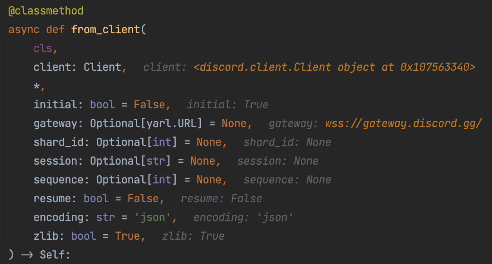

再來是中間，開始連線的部分：

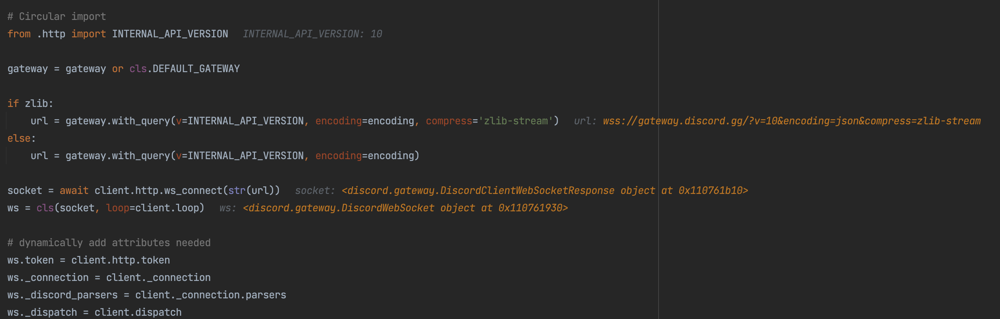

最後，我們還可以詢一下目前的 `Call Stack` 與 `Frame` 內的 binding 總表：

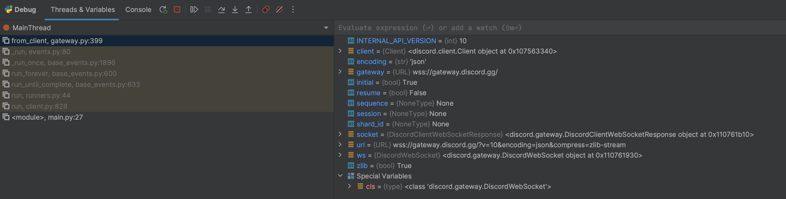

當主要的變數內容都有點概念後，我們可以很快地有個想法。知道除了下面的 code 之外，其它的大多是配角的成份：

```python
socket = await client.http.ws_connect(str(url))
ws = cls(socket, loop=client.loop)
```

```python
# poll event for OP Hello
await ws.poll_event()

if not resume:
    await ws.identify()
    return ws
```

首先 `from_client` 是一個 Class Method，它看起來是用來產生 `DiscordWebSocket` 物件用的，因為它是這麼寫的：

```python
ws = cls(socket, loop=client.loop)
```

若是不習慣這種寫法，那麼稍作改寫應該就會秒懂了！所以，它只是呼叫建構子去生出 `DiscordWebSocket` 物件：

```python
ws = DiscordWebSocket(socket, loop=client.loop)
```

接著，我會有興趣的是 `[poll_event](https://github.com/Rapptz/discord.py/blob/v2.1.1/discord/gateway.py#L610)` 如何等待 `OP Hello` 的呢？也就是 Lifecycle 的第 2 步：

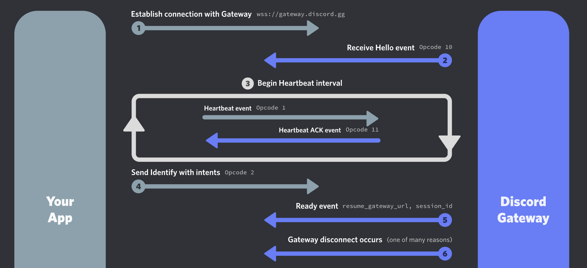

poll_event 的實作如下：

```python
async def poll_event(self) -> None:
    """Polls for a DISPATCH event and handles the general gateway loop.

    Raises
    ------
    ConnectionClosed
        The websocket connection was terminated for unhandled reasons.
    """
    try:
        msg = await self.socket.receive(timeout=self._max_heartbeat_timeout)
        if msg.type is aiohttp.WSMsgType.TEXT:
            await self.received_message(msg.data)
        elif msg.type is aiohttp.WSMsgType.BINARY:
            await self.received_message(msg.data)
        elif msg.type is aiohttp.WSMsgType.ERROR:
            _log.debug('Received %s', msg)
            raise msg.data
        elif msg.type in (aiohttp.WSMsgType.CLOSED, aiohttp.WSMsgType.CLOSING, aiohttp.WSMsgType.CLOSE):
            _log.debug('Received %s', msg)
            raise WebSocketClosure
    except (asyncio.TimeoutError, WebSocketClosure) as e:
        # Ensure the keep alive handler is closed
        if self._keep_alive:
            self._keep_alive.stop()
            self._keep_alive = None

        if isinstance(e, asyncio.TimeoutError):
            _log.debug('Timed out receiving packet. Attempting a reconnect.')
            raise ReconnectWebSocket(self.shard_id) from None

        code = self._close_code or self.socket.close_code
        if self._can_handle_close():
            _log.debug('Websocket closed with %s, attempting a reconnect.', code)
            raise ReconnectWebSocket(self.shard_id) from None
        else:
            _log.debug('Websocket closed with %s, cannot reconnect.', code)
            raise ConnectionClosed(self.socket, shard_id=self.shard_id, code=code) from None
```

剔除雜訊的版本如下！看起來重點會是 `received_message` 後，發生了什麼事情呢？

```python
async def poll_event(self) -> None:
    try:
        msg = await self.socket.receive(timeout=self._max_heartbeat_timeout)
        await self.received_message(msg.data)
    except (asyncio.TimeoutError, WebSocketClosure) as e:
        # ...skipped...
        pass
```

## WebSocket 動起來：received_message

在一層一進的追入不同的函式後，我們終於發現 `received_message` 似乎是我們最接近 Discord 開發者文件上記載的細節的時刻了。在這未刪減版本的原始碼，未滿 120 行：

```python
async def received_message(self, msg: Any, /) -> None:
    if type(msg) is bytes:
        self._buffer.extend(msg)

        if len(msg) < 4 or msg[-4:] != b'\x00\x00\xff\xff':
            return
        msg = self._zlib.decompress(self._buffer)
        msg = msg.decode('utf-8')
        self._buffer = bytearray()

    self.log_receive(msg)
    msg = utils._from_json(msg)

    _log.debug('For Shard ID %s: WebSocket Event: %s', self.shard_id, msg)
    event = msg.get('t')
    if event:
        self._dispatch('socket_event_type', event)

    op = msg.get('op')
    data = msg.get('d')
    seq = msg.get('s')
    if seq is not None:
        self.sequence = seq

    if self._keep_alive:
        self._keep_alive.tick()

    if op != self.DISPATCH:
        if op == self.RECONNECT:
            # "reconnect" can only be handled by the Client
            # so we terminate our connection and raise an
            # internal exception signalling to reconnect.
            _log.debug('Received RECONNECT opcode.')
            await self.close()
            raise ReconnectWebSocket(self.shard_id)

        if op == self.HEARTBEAT_ACK:
            if self._keep_alive:
                self._keep_alive.ack()
            return

        if op == self.HEARTBEAT:
            if self._keep_alive:
                beat = self._keep_alive.get_payload()
                await self.send_as_json(beat)
            return

        if op == self.HELLO:
            interval = data['heartbeat_interval'] / 1000.0
            self._keep_alive = KeepAliveHandler(ws=self, interval=interval, shard_id=self.shard_id)
            # send a heartbeat immediately
            await self.send_as_json(self._keep_alive.get_payload())
            self._keep_alive.start()
            return

        if op == self.INVALIDATE_SESSION:
            if data is True:
                await self.close()
                raise ReconnectWebSocket(self.shard_id)

            self.sequence = None
            self.session_id = None
            self.gateway = self.DEFAULT_GATEWAY
            _log.info('Shard ID %s session has been invalidated.', self.shard_id)
            await self.close(code=1000)
            raise ReconnectWebSocket(self.shard_id, resume=False)

        _log.warning('Unknown OP code %s.', op)
        return

    if event == 'READY':
        self.sequence = msg['s']
        self.session_id = data['session_id']
        self.gateway = yarl.URL(data['resume_gateway_url'])
        _log.info('Shard ID %s has connected to Gateway (Session ID: %s).', self.shard_id, self.session_id)

    elif event == 'RESUMED':
        # pass back the shard ID to the resumed handler
        data['__shard_id__'] = self.shard_id
        _log.info('Shard ID %s has successfully RESUMED session %s.', self.shard_id, self.session_id)

    try:
        func = self._discord_parsers[event]
    except KeyError:
        _log.debug('Unknown event %s.', event)
    else:
        func(data)

    # remove the dispatched listeners
    removed = []
    for index, entry in enumerate(self._dispatch_listeners):
        if entry.event != event:
            continue

        future = entry.future
        if future.cancelled():
            removed.append(index)
            continue

        try:
            valid = entry.predicate(data)
        except Exception as exc:
            future.set_exception(exc)
            removed.append(index)
        else:
            if valid:
                ret = data if entry.result is None else entry.result(data)
                future.set_result(ret)
                removed.append(index)

    for index in reversed(removed):
        del self._dispatch_listeners[index]
```

即便，這隻函式比以往我們閱讀的略長，但我們已經熟練地使用「剔除無用雜訊」或「分段理解」與「簡化改寫」的小技巧，這份較長的函式內容也是可以用上的。

由最開頭，看到取得 `msg` 做了些什麼唄：

```python
async def received_message(self, msg: Any, /) -> None:
    if type(msg) is bytes:
        self._buffer.extend(msg)

        if len(msg) < 4 or msg[-4:] != b'\x00\x00\xff\xff':
            return
        msg = self._zlib.decompress(self._buffer)
        msg = msg.decode('utf-8')
        self._buffer = bytearray()

    self.log_receive(msg)
    msg = utils._from_json(msg)
```

這段可以對應回 `from_client` 的是否要使用 `zlib` 壓縮的部分：

```python
if zlib:
    url = gateway.with_query(v=INTERNAL_API_VERSION, encoding=encoding, compress='zlib-stream')
else:
    url = gateway.with_query(v=INTERNAL_API_VERSION, encoding=encoding)
```

可以看到，當他發現 `msg` 是 `bytes` 型別時，會試著判斷一下再決定要不要解壓縮。你會看到它有個 `magic number` 的部分 `\x00\x00\xff\xff`，儘管一開始不明白無所謂，有經驗的開發者會先猜可能是 File Header，用來判斷 File Type 的部分。那麼沒有經驗的人，可以直接 Google 後獲得經驗：

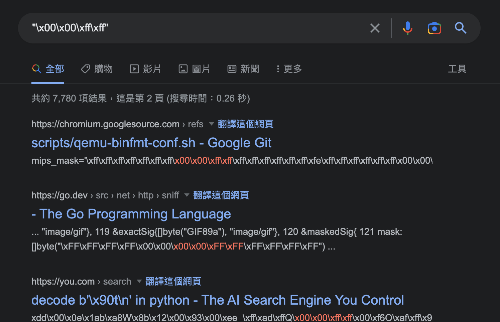

看起來結果沒有太多可用的資訊，那我們試著追加 `zlib` 作為關鍵字看看，似乎多了一點可以用的「關鍵字」`Z_SYNC_FLUSH`：

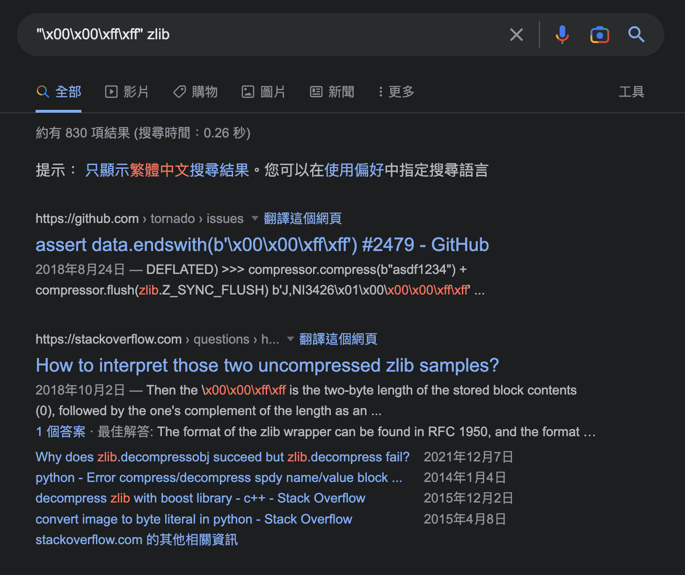

同時，我們在利用開發者手冊的搜尋功能，[看起來也出現了 `Z_SYNC_FLUSH`](https://discord.com/developers/docs/topics/gateway#transport-compression)：

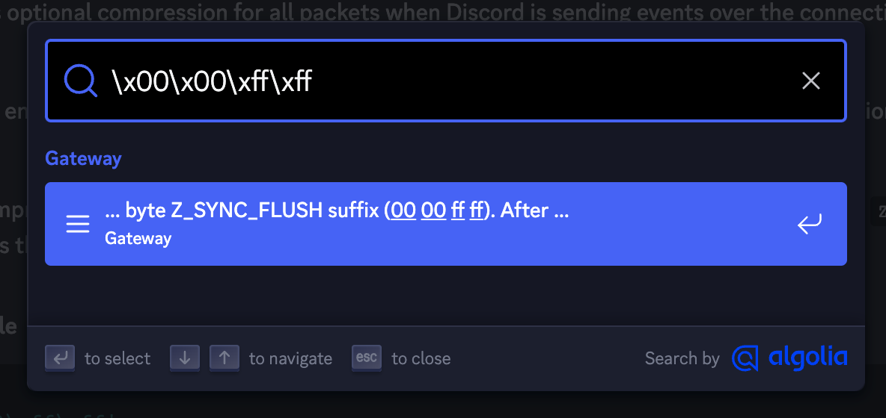

他會是在講解如何處理 [Transport Compression](https://discord.com/developers/docs/topics/gateway#transport-compression) 的部分：

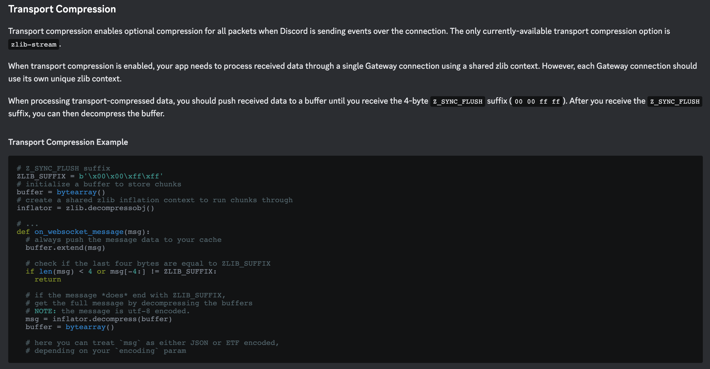

讀到這邊，心中大致有譜，他是處理有「壓縮」情境的一條分枝，那對我們來說有意義的部分只剩下二行實作，若是再忽略 logging 的部分，那其實只剩一行而已：

```python
async def received_message(self, msg: Any, /) -> None:
    self.log_receive(msg)
    msg = utils._from_json(msg)
```

這唯一的一行做了什麼呢？追入 `utils.py` 內看一下，看起來是一個簡單的抽換實作，但他的目標沒什麼變化就是「將 JSON 文字，解析成 Python 物件」：

```python
if HAS_ORJSON:

    def _to_json(obj: Any) -> str:
        return orjson.dumps(obj).decode('utf-8')

    _from_json = orjson.loads  # type: ignore

else:

    def _to_json(obj: Any) -> str:
        return json.dumps(obj, separators=(',', ':'), ensure_ascii=True)

    _from_json = json.loads
```

接著讀在取得 `msg` 後的事吧！有沒有看到跟文件內容很像的東西了！？

```python
msg = utils._from_json(msg)

_log.debug('For Shard ID %s: WebSocket Event: %s', self.shard_id, msg)
event = msg.get('t')
if event:
    self._dispatch('socket_event_type', event)

op = msg.get('op')
data = msg.get('d')
seq = msg.get('s')
if seq is not None:
    self.sequence = seq

if self._keep_alive:
    self._keep_alive.tick()
```

實作可以與 [Payload Structure](https://discord.com/developers/docs/topics/gateway-events#payload-structure) 部分對上了：

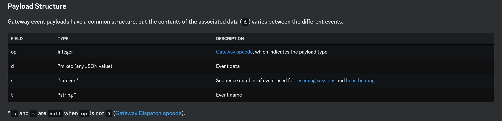

對照文件的說明後 `event` 不一定會存在，因為 `op` 如果不是 `0` 的情況，它會是 `None` 的：

```python
if event:
    self._dispatch('socket_event_type', event)
```

那麼，如果它存在的情況，就會呼叫 `_dispatch` 函式，它是哪來的呢？目前只知道：

1. 他是 DiscordWebSocket `init` 函式中定義的
2. 他會在 `from_client` 中被初始化

```python
# an empty dispatcher to prevent crashes
self._dispatch: Callable[..., Any] = lambda *args: None
```

```python
ws._dispatch = client.dispatch
```

所以，它就是 `Client` 的 [dispatch 函式](https://github.com/Rapptz/discord.py/blob/v2.1.1/discord/client.py#L429)，但我們先收起好奇心，專注在 DiscordWebSocket 本身好了。可以先做個假設，就是它會把 Client 端需要知道的事件，在這個時候發送出去，觸發 `Client` 物件的特定方法。

繼續閱讀：

```python
op = msg.get('op')
data = msg.get('d')
seq = msg.get('s')
if seq is not None:
    self.sequence = seq

if self._keep_alive:
    self._keep_alive.tick()
```

對照文件 `seq` 會是一個整數，用來 `resume` session 用的。多數的開發者看到裡，應該會想像出它怎麼實的 `seq` 八成是一個「單調遞增」的數字，至少是個只會「增加不會減少」的數字。它就像資料庫的 `cursor` 可以用來「接續讀取未完的資源」。

我們繼續推進進度，來看看當不是 `DISPATCH` 時，它做些什麼呢？看到很多不同種的  `opcode`，但莫驚慌、莫害怕，只要查一下手冊就行了！你可以在 [Opcodes and Status codes](https://discord.com/developers/docs/topics/opcodes-and-status-codes#gateway-gateway-opcodes) 中找到它：

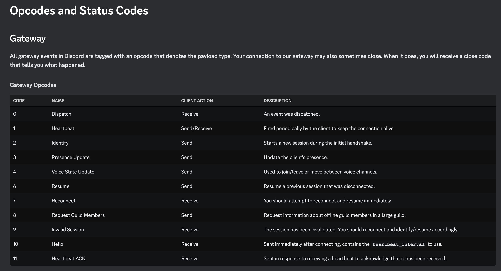

```python
if op != self.DISPATCH:
    if op == self.RECONNECT:
        # "reconnect" can only be handled by the Client
        # so we terminate our connection and raise an
        # internal exception signalling to reconnect.
        _log.debug('Received RECONNECT opcode.')
        await self.close()
        raise ReconnectWebSocket(self.shard_id)

    if op == self.HEARTBEAT_ACK:
        if self._keep_alive:
            self._keep_alive.ack()
        return

    if op == self.HEARTBEAT:
        if self._keep_alive:
            beat = self._keep_alive.get_payload()
            await self.send_as_json(beat)
        return

    if op == self.HELLO:
        interval = data['heartbeat_interval'] / 1000.0
        self._keep_alive = KeepAliveHandler(ws=self, interval=interval, shard_id=self.shard_id)
        # send a heartbeat immediately
        await self.send_as_json(self._keep_alive.get_payload())
        self._keep_alive.start()
        return

    if op == self.INVALIDATE_SESSION:
        if data is True:
            await self.close()
            raise ReconnectWebSocket(self.shard_id)

        self.sequence = None
        self.session_id = None
        self.gateway = self.DEFAULT_GATEWAY
        _log.info('Shard ID %s session has been invalidated.', self.shard_id)
        await self.close(code=1000)
        raise ReconnectWebSocket(self.shard_id, resume=False)

    _log.warning('Unknown OP code %s.', op)
    return
```

在文件中，有個 `Client Action` 的欄位吸引到我的注意，這可以讓我知道以 Client 端的角度，要收訊息還是送訊息，其中有個特別的 **Heartbeat** 是可以收也可以送的。依慣例，為了減輕心理的負擔，來裁減一下程式，把一些太偏例外處理的部分忽略吧！你會做什麼樣的選擇呢？我選擇先將「需要重新連線的案例」忽略，改寫如下：

```python
if op != self.DISPATCH:
    if op == self.HEARTBEAT_ACK:
        if self._keep_alive:
            self._keep_alive.ack()
        return

    if op == self.HEARTBEAT:
        if self._keep_alive:
            beat = self._keep_alive.get_payload()
            await self.send_as_json(beat)
        return

    if op == self.HELLO:
        interval = data['heartbeat_interval'] / 1000.0
        self._keep_alive = KeepAliveHandler(ws=self, interval=interval, shard_id=self.shard_id)
        # send a heartbeat immediately
        await self.send_as_json(self._keep_alive.get_payload())
        self._keep_alive.start()
        return

    _log.warning('Unknown OP code %s.', op)
    return
```

剩下的實作，代表著一個「不需要處理重新連線」的美好世界。當邏輯被刪減後，尾端的 `return` 變得較為明顯了，語意上可以看成：

```python
if op != self.DISPATCH:
    # 處理不是 Dispatch 的 op
    return

# 處理是 Disaptch 的 op
```

同時，你也會發現終於對上了 Connection Lifecycle 的圖：

- Hello (Receive)
- Heartbeat (Send/Receive)
- Heartbeat ACK (Send)

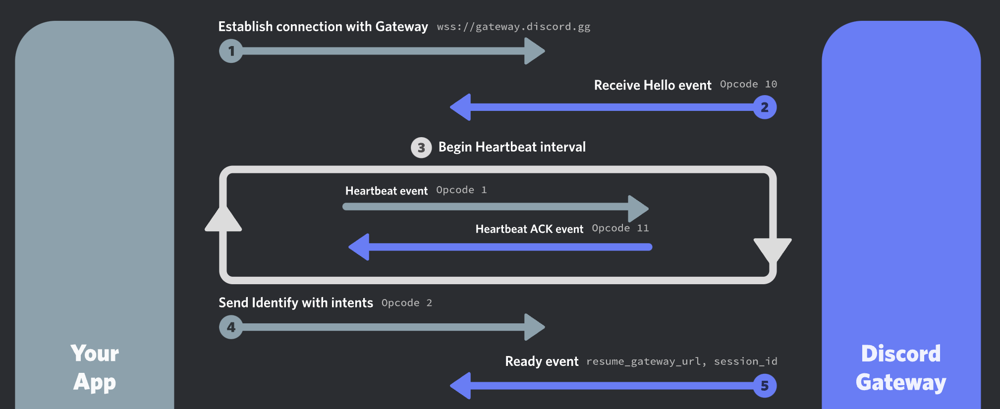

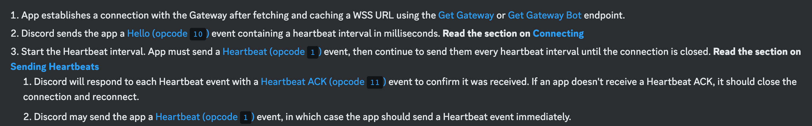

依文件的說明 `Hello` 會包含 Heartbeat 的 interval，我們實作的 Client 要依這個間隔送出 Heartbeat。如同我們看的 `Hello` 處理的方式，由 `heartbeat_interval` 取出間隔，換算為秒，並且開始自己送 Heartbeat：

```python
if op == self.HELLO:
    interval = data['heartbeat_interval'] / 1000.0
    self._keep_alive = KeepAliveHandler(ws=self, interval=interval, shard_id=self.shard_id)
    # send a heartbeat immediately
    await self.send_as_json(self._keep_alive.get_payload())
    self._keep_alive.start()
    return
```

若你查看 KeepAliveHandler 類別，會發現它是標準的 Thread：

```python
class KeepAliveHandler(threading.Thread):
   # ... skipped ...
```

與 Discord Gateway Server 互動的部分就先到此打住，繼續來看 `Dispatch` 該做些什麼唄。

```python
if event:
    self._dispatch('socket_event_type', event)

if op != self.DISPATCH:
    # 處理不是 Dispatch 的 op
    return

# 繼續處理 Dispatch 情況的部分

# ... skipped ...

try:
    func = self._discord_parsers[event]
except KeyError:
    _log.debug('Unknown event %s.', event)
else:
    func(data)

# remove the dispatched listeners
removed = []
for index, entry in enumerate(self._dispatch_listeners):
    if entry.event != event:
        continue

    future = entry.future
    if future.cancelled():
        removed.append(index)
        continue

    try:
        valid = entry.predicate(data)
    except Exception as exc:
        future.set_exception(exc)
        removed.append(index)
    else:
        if valid:
            ret = data if entry.result is None else entry.result(data)
            future.set_result(ret)
            removed.append(index)

for index in reversed(removed):
    del self._dispatch_listeners[index]
```

## Client 端是如何收到事件的呢？

我們先前有個假設：

> `_dispatch` 時，Client 註冊的函式就會被呼叫到了。


但接了後續的程式後，我改變了想法。也許 `_dispatch` 時，Client 的函式還沒有被呼叫到。因為本質上在 `Client` 物件註冊的函式是 co-rountine，它的結果會是 `Future` 或 `Task` 物件執行到 completed 階段才有答案。換句話說，答案是這樣設定進去的：

```python
future.set_result(ret)
```

明顯的，眼前的實作已經無法簡單推論是哪一種可能，這時就啟用 Debugger 來輔助吧！問題是，要攔截誰呢？DiscordWebSocket 內的 `received_message` 中的哪一部分？為了驗證想法，我們在 `main.py` 與 `gateway.py` 都設上了 Breakpoint，觀察 `on_message` 函式是在誰之後被呼叫的：

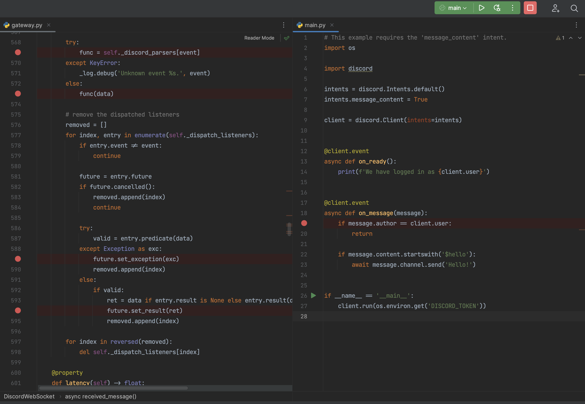

當重啟程式後，我們第 1 個遇到的 Event 是 `READY`，看著 `event` 變數僅僅是 `READY` 字串，我想通了 503 行只是單純送出，目前看到的「事件名稱」，跟 Client 物件主要關注的收到什麼訊息，其實沒什麼關係。這大概是 Library 開發者需要的訊息吧。

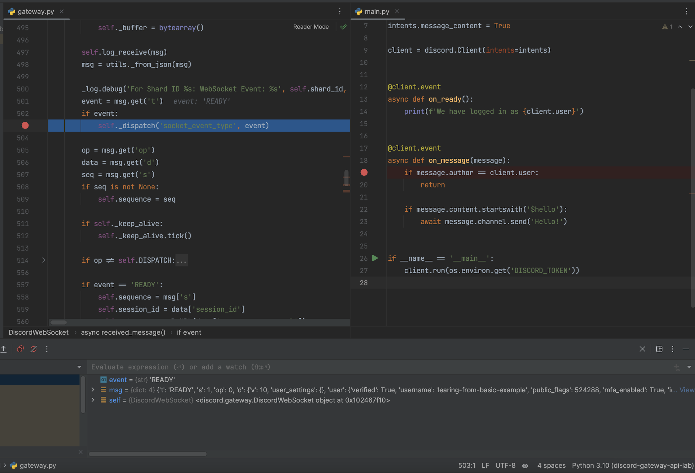

以 `READY` 為 key，在 `_discord_parsers` 取得的處理函式為 `ConnectionState.parse_ready`。這留了個新的線索，到時應該也探一探 `_discord_parsers` 註冊了哪些處理函式，理論上 Gateway 文件上有提供的事件都得有一組：

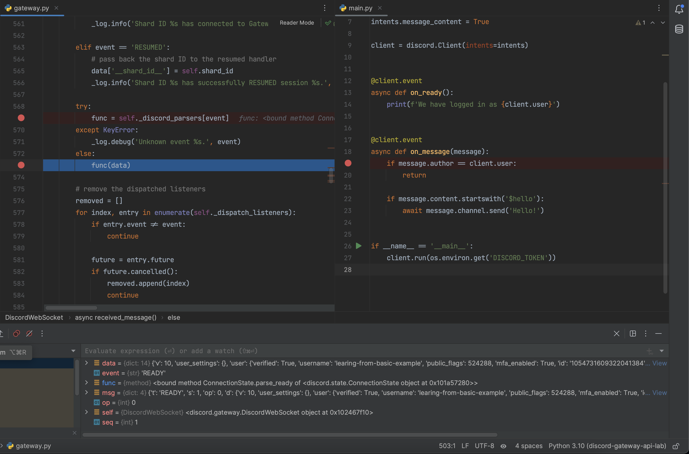

繼  `READY` 之後，我們收到的是 `[GUILD_CREATED` 事件](https://discord.com/developers/docs/topics/gateway-events#guild-create)，然後程式就等待我們回 Discord 頻道上打字觸發 callback 函式囉！

在觀察收 Message 的過程，我們意外發現有個 `TYPING_START` 事件與他對應的處理函式：

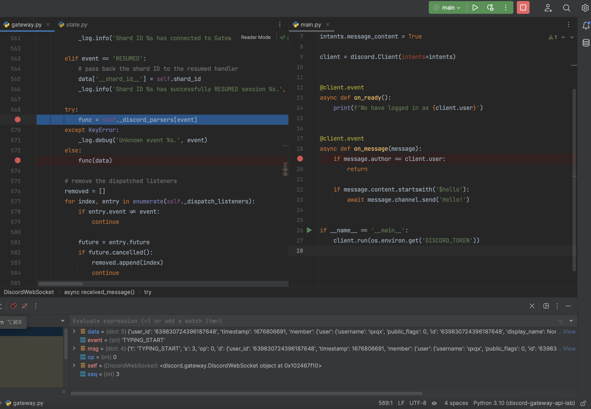

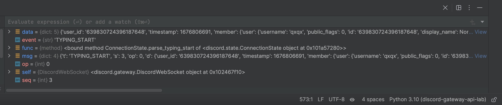

而且我主要研究的對象 `MESSAGE_CREATE`，則是被 `parse_message_create` 觸發的：

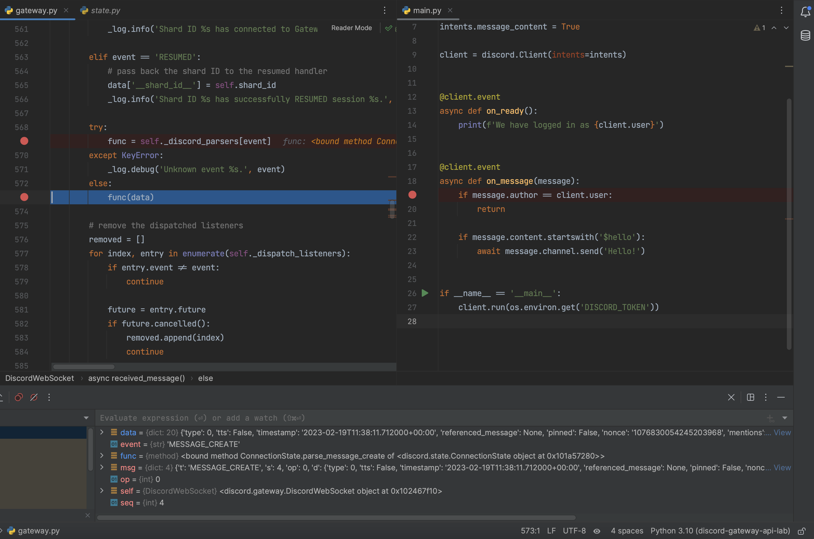

[parse_message_create](https://github.com/Rapptz/discord.py/blob/v2.1.1/discord/state.py#L608-L617) 的內容如下：

```python
def parse_message_create(self, data: gw.MessageCreateEvent) -> None:
    channel, _ = self._get_guild_channel(data)
    # channel would be the correct type here
    message = Message(channel=channel, data=data, state=self)  # type: ignore
    self.dispatch('message', message)
    if self._messages is not None:
        self._messages.append(message)
    # we ensure that the channel is either a TextChannel, VoiceChannel, or Thread
    if channel and channel.__class__ in (TextChannel, VoiceChannel, Thread):
        channel.last_message_id = message.id  # type: ignore
```

目測，主要的行為仍是 dispatch：

```python
self.dispatch('message', message)
```

是時候來研究源頭的 `[Client.dispatch` 函式實作](https://github.com/Rapptz/discord.py/blob/v2.1.1/discord/client.py#L429)了：

```python
def dispatch(self, event: str, /, *args: Any, **kwargs: Any) -> None:
    _log.debug('Dispatching event %s', event)
    method = 'on_' + event

    listeners = self._listeners.get(event)
    if listeners:
        removed = []
        for i, (future, condition) in enumerate(listeners):
            if future.cancelled():
                removed.append(i)
                continue

            try:
                result = condition(*args)
            except Exception as exc:
                future.set_exception(exc)
                removed.append(i)
            else:
                if result:
                    if len(args) == 0:
                        future.set_result(None)
                    elif len(args) == 1:
                        future.set_result(args[0])
                    else:
                        future.set_result(args)
                    removed.append(i)

        if len(removed) == len(listeners):
            self._listeners.pop(event)
        else:
            for idx in reversed(removed):
                del listeners[idx]

    try:
        coro = getattr(self, method)
    except AttributeError:
        pass
    else:
        self._schedule_event(coro, method, *args, **kwargs)
```

看了開頭的：

```python
method = 'on_' + event
```

似乎知道為什麼在 `main.py` 要將函式命名成 `on_message`！不浪費時間，直接開 Debugger 看個明白。這次使用 Debugger 前，我們稍為限縮一下條件，只看 `message` event 的情況。在 IDE 設定 Conditional breakpoint：

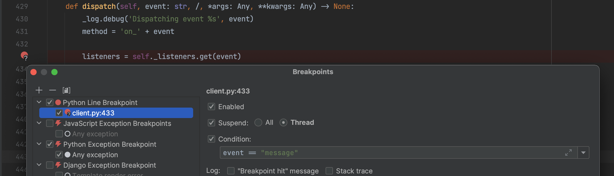

基於明確目標下的 trace code，我們很快發現 `getattr` 就對應最開始的 `setattr`， 只是在這裡真的把參數傳入給 `on_message` 函式可以呼叫：

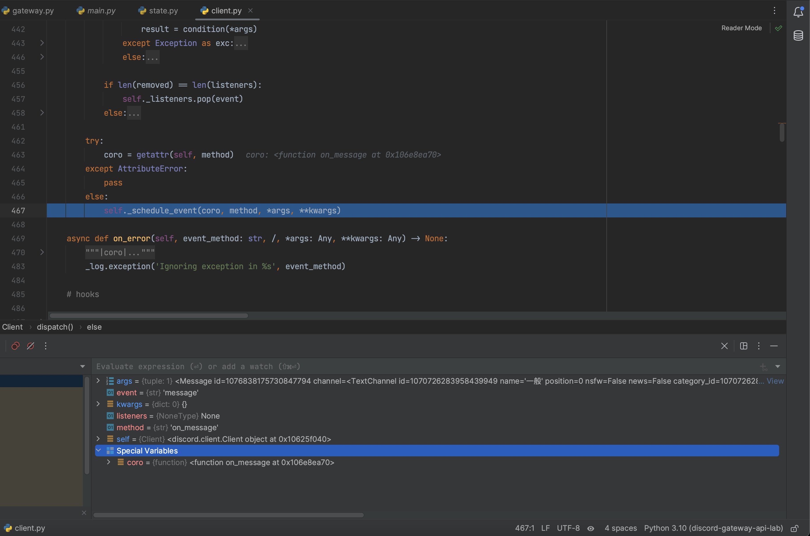

追到後來，它其實只是平凡的 `await` 罷了：

```python
async def _run_event(
    self,
    coro: Callable[..., Coroutine[Any, Any, Any]],
    event_name: str,
    *args: Any,
    **kwargs: Any,
) -> None:
    try:
        await coro(*args, **kwargs)
    except asyncio.CancelledError:
        pass
    except Exception:
        try:
            await self.on_error(event_name, *args, **kwargs)
        except asyncio.CancelledError:
            pass
```

## 結語

在完成了簡單的 Discord Bot 學習後，也想要理解更即時的 Gateway API 用法，而開始試著 trace `discord.py` 的實作，儘管我們沒有追太多細節。但由最基礎的範例開始追蹤，由外至內，再由內至外摸清楚了一條 Happy Path 怎麼實作的。

Trace Code 記錄是我很喜歡的一種「文體」(?)，大部分時間保持著「無我」的狀態，忠實記載眼看所見所得，再微加一些主觀的「路徑選擇」，去探索想要知道的部分。這過程中，可以複習到程式的基礎語法，也可以對照 Open Source 專案實作的主題與規格文件上的內容。畢竟，對工程師來說原始碼說不定比文字描述更有親和力。

這篇文章雖然稍長，但作為後續可以繼承烹調的素材，是相當實用的。可以用這裡的理解，實作自己的 Discord Gateway Client 或再去讀不同語言實作的版本，還是針對 Gateway API 文件上的細節寫出解說都很有幫助。
