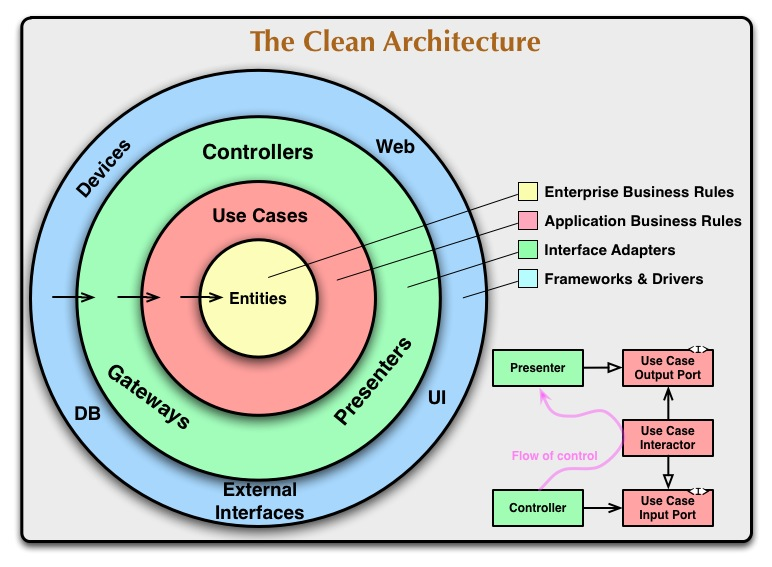
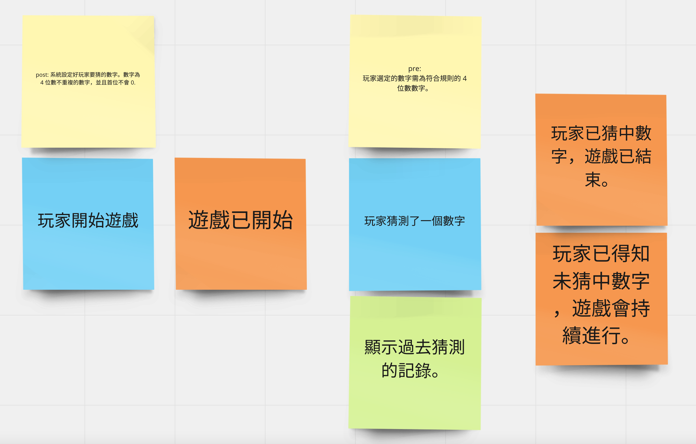
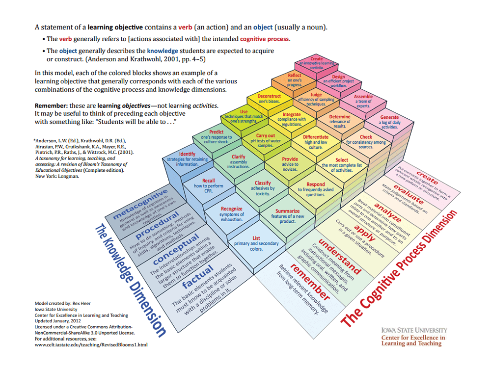
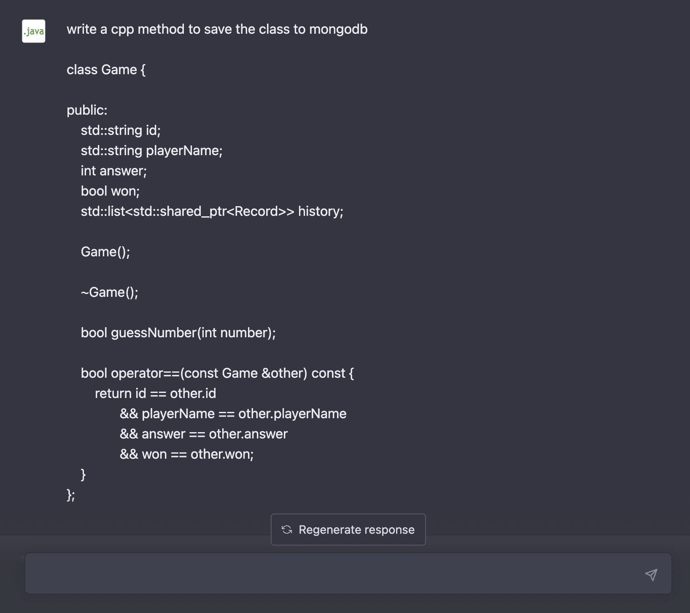

# 跟 ChatGPT 一起 Pair Programming

由於近期參加的[學習團體](https://www.facebook.com/groups/wsa.old.tw)，是個相當喜歡以不同的語言結合軟體工程方法論，同時探討理論的實踐與實務上實作併進的。但自己有個顧慮，看別人做起來困難重重的事情，自己還沒體驗過去給意見不太好。基於這個動機，試著用 `C++` 搭著 `Drogon Framework` 寫了一個簡單的 Side Project，來體驗一下開發上會遇到的困難。

當然，除了實作上的問題，也同時又複習了一次《遊戲微服務計劃》提供的練習方向。這回製作的是一個簡單的 [1A2B 類型的猜數字遊戲](https://github.com/qtysdk/gaas_cpp)。在最初本來沒想要寫個遊戲，而是想專注在理解搭建開發環境上的難度，怎麼讓它去符合期望的練習路徑。

## 那些該練習的路徑們

完成基本的專案設置：該有的編譯工具、專案建置工具與相依的函式庫都先裝好。

完成 Walking Skeleton：純粹地一條由成品的最外部打通到內部的開發路徑。以 Web 應用程式來說，至少打一個 HTTP Request  進去，有得到一個 HTTP Response。這個請求的發起，來自 Testing Framework 而非人工去做的，而獲得的 HTTP Response 也是要能通過測試驗證，即使是固定的內容也無妨。

> 在這階段概念簡單，難處在於不熟悉 C++ 與語與 Drogon Testing Framework 而多花了不少時間。[主要在修 Wiki 上查到的範例，它並不是直接可用的](https://github.com/qtysdk/gaas_cpp/blob/v0.2/notes/1-walking-skeleton.md)。


完成 ATDD 路線：ATDD 跟純粹的 TDD 差別在於加上了 Actor 的視角，結果得是 Actor 可以接受的 (Acceptable)。所以，在 Clean Architecture 的主軸之下，我們得做個比 Walking Skeleton 再擴大一點的版本，並且只有一點點就好。



在 `Walking Skeleton` 階段，我們只測到 `Interface Adapter` 那一層 (就是 Controller 與 Presenters)。在 `ATDD` 階段得進一步擴大前面的成果，加入 `Use Case`。這也是為什麼，即使不想要把焦點放在遊戲，但還是[規劃了一個簡單的遊戲](https://github.com/qtysdk/gaas_cpp/blob/v0.2/notes/2-guess-number-game.md)。要有實際案例來玩比較有趣味啊！



針對猜數字本身，其實它只需要二個 Use Case：

- 開局
- 猜數字

利用首發的 `開局` Use Case 實作出第一次的 ATDD 循環。我們只需要簡單的固定答案和固定結果，因為只要先串起流程，就可以體驗從紅燈到綠燈的測試流程。此時的結果與猜數字無關，僅僅是一個簡單的回應 `{&quot;Hello&quot;: &quot;World&quot;}`。

> 你的內在要有個好的引導者與讚美者：實在太棒了，又向 Clean Architecture 內圈前進了一層。


是的！我們進前到了 `Use Case` 這一層了。後續就會進到 Domain Model 與 Aggregate Root 的實作，[相關細節可以參考專案記錄](https://github.com/qtysdk/gaas_cpp/blob/v0.2/notes/README.md)。

## ChatGPT 成為事實與程序知識的外掛

<https://www.teachthought.com/critical-thinking/blooms-taxonomy-model-3d/>



上圖把知識的維度分為四個維度，還標上了適當的學習策略。在我們「國民教育」的學習歷程中，特別像我這般的文組人士，覺得最能依靠的就是「記憶與背誦」。僅管我只能代表自己，但上一代與我自己同輩的人，多數人知道的「學習策略」或「學習手段」只有二招：「記憶」與「大量練習」。

當時間不夠你去孵化知識時，這二招確實是最快速有效的，但他來得快去得也快就是了。因為，要把知識塞進「長期記憶」得花不少工夫。

在新時代的教學中，不再只是依賴蠻力，而是注重「有意義的學習」。有意義的學習包含以下三個層面：知道為什麼可以這樣做（概念性 conceptual）、知道如何依照步驟來做（程序性 procedural）、並且知道在實際操作時需要依賴哪些工具和器材（事實性 factual）。

所以，教學步奏大概會是先探索練習，先給你一個可能做得出來的步驟，你就先試看看。有的人會成功，有的人成功一部分，有的人也許還沒弄懂怎麼開始。而接著，大家一起研究極端的例案去歸納出成功為何成功，失敗為何失敗。引導者在這裡帶著學習者一起「復盤」剖析不同歷程下的成敗，即為後設認知 (metacongnitive)。

回到 ChatGPT 與我一起 Pair Programming 來完成 Side Project 的部分。我是個 `C++` 新手，這是生平的第一個 `C++` 專案。但我有 C 語言專案的經驗，所以 Toolchain 與相依套件的安裝不太是問題。剩下的就是 `C++` 這個語言本身如何使用的問題了。

可以用來「學習遷移」(通俗的話是舉一反三) 的經驗是寫過同為 OOP 的 Java 語言，在語意上部分可以互通。但 `C++` 在處理類別定義上的極大彈性，與可選的 `Call By XXX` 性質讓我在開發上吃了點苦頭。這類沒辦法把 Code 寫好的事，常就貼給 ChatGPT 跟他說我寫錯了，請幫我修看看。像我就常忘了繼承的 supper class 前要加 `public`。

在這個過程中，我大量體認到，自己只是缺少大量的「事實知識」與「程序知識」，當然我的概念不可能是無缺的，但這個在看懂了成果後，依著過去的開發經驗可以自行歸納出我缺少的概念。不過，復盤與歸納出新知識是自己大腦內的認知活動啊！這點 ChatGPT 幫不了你的。

## ChatGPT 代寫的部分

上述是經歷完 Side Project 開發後，反思了如可與 ChatGPT 合作來實作日常開發。它適合用來當事實知識與程序知識的擴充包。特別是需要遊走在不同語言的開發者，只要語言的典範沒有差太多，依賴著程式母語圈即有的文化，以及泛用的開發經驗。其他不確定的事實或程序先找 ChatGPT 打個底稿，拿到基本的方案後再修改成期望的樣子。

這個專案哪些東西主要是 ChatGPT 寫的呢？寫起來很麻煩的都是利用它先打底稿的！他貢獻的部分主要有二處：

1. [C++ 執行 Python 的部分](https://github.com/qtysdk/gaas_cpp/blob/v0.3/test_gtest/test_container.cc)。
2. [直接在 C++ 內實作 MongoDB 的 CRUD 的部分](https://github.com/qtysdk/gaas_cpp/blob/v0.3/src/repo/GameRepository.cc)。

`[1]` 跨語言直接對 Call 是最麻煩寫的，有點讓我回想起早期在寫 Android NDK 要整合 FFMpeg 與 Java Library 的東西，真的超麻煩的。如果那時有 ChatGPT 就不用搞那麼久了 (當然，最花時間的部分，大概還是在 Debug 我自己的實作邏輯)。

不過 ChatGPT 太「古意」了，我本來給他一段 Python Script，跟他說我想用 C++ 呼叫它，他逐句翻譯。我也試著整合看看，也順便熟悉 Embedded Python 的寫法，但越想越不對勁。這樣寫不好維護，我應該直接建出 Python Context，塞個預先備好的 Python Class，再來 C++ 內建出 PyObject 後直接使用。這部分有個小 Bug 是，它可能會不懂 `Instance field` 要直接 `Get Attr` 就行了，剛生出來變成 Method Call 所以 Crash 了。這部分稍為 Debug 一下手動改寫就行了。

`[2]` 那部分的 Library 提供的方式，本身就不太好看，我想是沒救了。直接放棄去學起來自己寫，就請 ChatGPT 幫忙生 Code 了。大致會跟他，我有個 `Game` 類別，請幫我生 `save` 的方法存入 MongoDB 內：



```cpp
#include <bsoncxx/json.hpp>
#include <mongocxx/client.hpp>
#include <mongocxx/instance.hpp>
#include <mongocxx/pool.hpp>
#include <mongocxx/uri.hpp>
#include <bsoncxx/builder/stream/document.hpp>

class Game {
public:
    std::string id;
    std::string playerName;
    int answer;
    bool won;
    std::list<std::shared_ptr<Record>> history;

    Game();

    ~Game();

    bool guessNumber(int number);

    bool operator==(const Game &other) const {
        return id == other.id
               && playerName == other.playerName
               && answer == other.answer
               && won == other.won;
    }

    void saveToDatabase() const {
        // Create a connection to the MongoDB server
        mongocxx::instance instance{}; // This should be done only once
        mongocxx::pool pool{mongocxx::uri{}};

        // Get a connection from the pool
        auto conn = pool.acquire();

        // Get the games collection from the test database
        auto collection = (*conn)["test"]["games"];

        // Create a BSON document from the Game object
        bsoncxx::builder::stream::document document{};
        document << "id" << id
                 << "playerName" << playerName
                 << "answer" << answer
                 << "won" << won;

        // Convert the list of history records to a BSON array
        bsoncxx::builder::stream::array historyArray{};
        for (const auto &record : history) {
            bsoncxx::builder::stream::document recordDoc{};
            recordDoc << "description" << record->description
                      << "timestamp" << record->timestamp;
            historyArray << recordDoc;
        }
        document << "history" << historyArray;

        // Insert the document into the collection
        collection.insert_one(document.view());
    }
};
```

只要把事先寫好的結構給 ChatGPT，讓它去生出來再看有沒有需要修改的就行了。在這專案內要對 MongoDB 的 CRUD 都是這麼「弄」出來的。

例一的程式：

<https://github.com/qtysdk/gaas_cpp/blob/main/test_gtest/test_container.cc>

例二的程式：

<https://github.com/qtysdk/gaas_cpp/blob/main/src/repo/GameRepository.cc>

## 開發者省力的時代

這回實作 Side Project 除了稍為學習到一點 `Modern C++`，還有大量複習了《[遊戲微服務計劃](https://www.facebook.com/groups/wsa.tw/posts/604202378070147/)》推薦的 Practice Stack 與 Tech Stack 之外。最意外的收獲是與 ChatGPT 一起 Pair Programming 的體驗。

儘管目前還有許多人會恐懼自己是否會被 AI 所取代，但你不能把自己的大腦外包出去。至少在學習知識這部分，我已經找到了省下力量的方法。我們運用 AI 的目的不是基於恐懼失去立足之地，而是為了避免自己落於競爭劣勢。我們可以利用它來處理自己不擅長的**知識維度**，特別是面對事實知識的情況。記憶只是其中一種手段。撇開考試的情況，現代人應該利用工具收集事實知識。在 ChatGPT 出現之前，我們透過搜尋引擎來收集資訊。現在，我們多了一個選擇。

利用工具讓我們省下製作速查表 (a.k.a. 小抄 cheat sheet) 的時間，動態地透過工具來補充多數人都不擅長透過記憶處理事實知識的問題。我希望提醒大家，不要落入過去教育環境沒有好好啟發你學習技巧的窘境，為了速成總是要求你「背起來」，因為背起來就沒事了。

在這裡，你必須知道一個壞消息和一個好消息。壞消息是，事實知識無法建構出新的知識，它們是僵固的，不易使用。換言之，你無法透過「槓桿」來催動更大的成果。就像死命地存錢，但不理財的人，你的資產成長速度還跑不過通膨。事實上，它甚至會更糟糕，因為記憶比想像中的不可靠。那麼，我們要怎麼槓桿它呢？顯然得利用概念知識與後設認知。好消息是，在四個知識維度中，只有事實知識是厚重的，隨著人類歷史與文化堆疊而來。但基礎的理論、原理和原則並不像想像中那麼龐大。相對來說，其他三者要輕便得多。

想通了這些，只要正常地練習概念詮釋和反覆優化，你就能運用知識承擔更大的任務。
