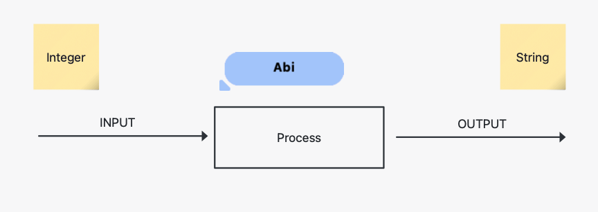
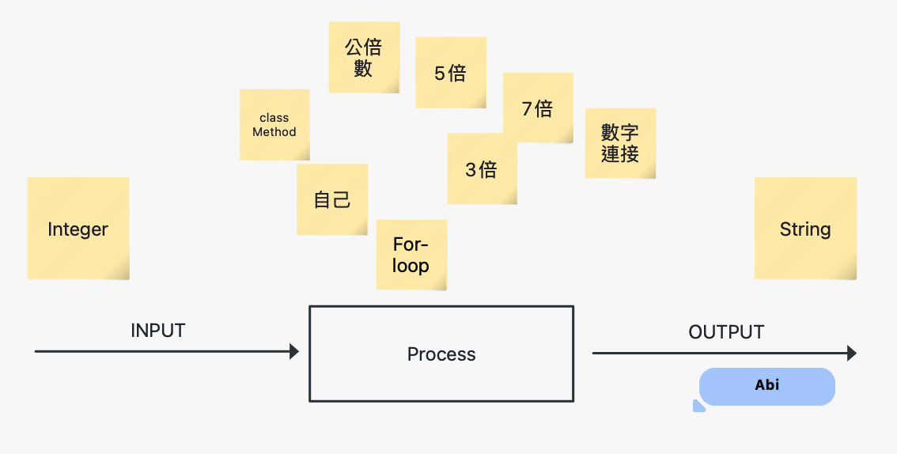
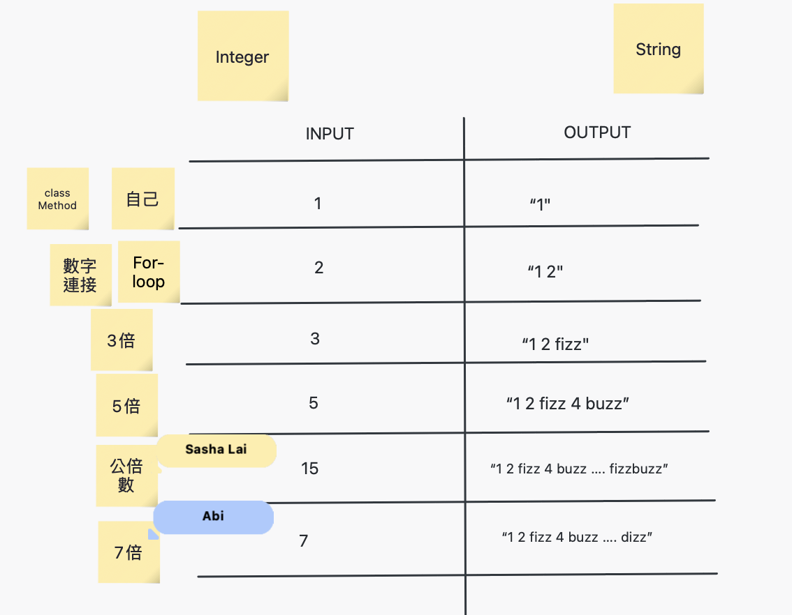
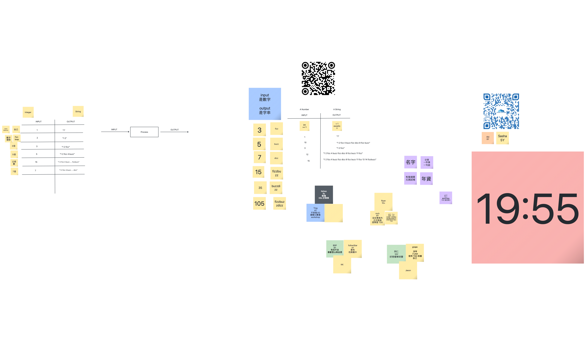
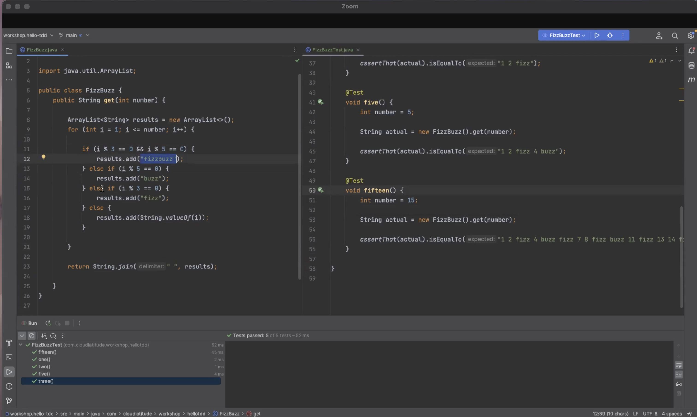
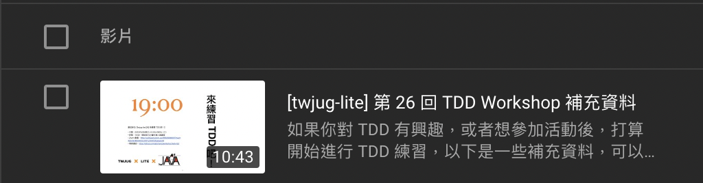

# TWJUG-LITE 26 TDD Workshop

## 需求提問

```
input number => output string

1 <= X <= Int.max

3 => 1 2 fizz 
12 => 1 2 fizz 4 buzz fizz dizz 8 fizz buzz 11 fizz
10 => 1 2 fizz 4 buzz fizz dizz 8 fizz buzz

3*n fizz
5*n buzz
7*n dizz

15 => 1 2 fizz 4 buzz fizz dizz 8 fizz buzz 11 fizz 13 14 fizzbuzz
```

* 先完成 happy path，再來考慮 edge case
* 先講求有效果，再研究不傷身。


## 實作時間 19:55

Go Go Go !!!

## 中場解說

分析 Input/Process/Output 流程



Brain Storming 後的產出：



### 建議的 TDD 流程 (討論)



**小編自己想的順序**

1. Take Easy (誤) 挑簡單的做 => 不要太為難自己
2. (接著將事情由簡單到複雜處理)
3. 簡單的 input
4. ...(參考圖片內容)...
5. ...

## 白板內容



### 回顧心得

#### 需求釐清

這場 Workshop 由 IPO 模型開啟討論，而 IPO 即為 Input、Process、Output 的簡稱。

依著同樣的套路一開始不能講得太清楚：

> 我們要做一個功能，輸入是 Integer，而 Output 是 String
> 而 Integer 最小是 1，沒有上限。

> 接著，如果有什麼疑問，就儘管發問。


如果有參與上一場的朋友，可能已經知道了「代誌不是憨人想得那麼簡單」，現在大概是處於「需求還沒有弄清楚的階段」：

> 先給個簡單的例子：
> 輸入為 1 時，會輸出為 "1"


那有沒有人要接著問其他的例子來弄明白需求呢？

> 3 會是什麼呢？
> 1 2 fizz


到了第一個比較「意外」的例子出現後，有些人真的發現自己沒在狀況內了。後續就如同前面的表列，完成了測試案例表。

#### Live Demo 示範



據小編的觀察，已經一開始就熟悉 3A 測試的組別佔少數，也許需要有一點補充材料讓大家能接上「由開始，到起跑」中間的流程。

昨天，講者們替我們示範的重點有：

* production code 與 test code 一次只能動一邊
* 重構的前提是 test code 都過關，在不動 test code 的前提下，去修改 production code。
* 中間示範「整理程式碼為相似結構再進行重構」的實作策略。

#### 準備活動補充



https://www.youtube.com/watch?v=CD4u9Tk8DDc

## 推薦書籍

* [你就是不寫測試才會沒時間：Kuma 的單元測試實戰 -- Java篇（iThome鐵人賽系列書）](https://www.tenlong.com.tw/products/9786263332645?list_name=r-zh_tw)
* [單元測試的藝術](https://www.tenlong.com.tw/products/9789864342471)
