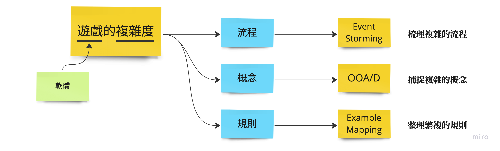

# Practice Stack 導覽

在《遊戲微服務計劃》中，主張「寫遊戲」是最好的軟體開發練習，因為它會面對足夠的「複雜度」。長期參與讀書會的伙伴應該能朗朗上口，到底是哪些面向的複雜足以讓我們有「信心」來說，寫遊戲就是個最棒的練習呢？

分三維度來說：流程、概念與規則。儘管遊戲，先以入門等級的「桌遊」來說，多數有「事先定義好的規則」，但若是看了幾眼規則就想要開始實作，能不能做得完或是在製作的途中對「進度的掌握」有沒有足夠的資訊，讓你估量目前的成果與實際完成的差距？你能有信心地說出來嗎？通常是個 gut feeling。你也可能會想反問：「那你就估得出來嗎？」答案是肯定的，它的前提是我參與了一套遊戲開發歷程的 Practice Stack 後，我可以知道它的流程、概念與規則是什麼，並且知道它們各別的複雜程度。

## Event Storming

複雜程度聽起來似乎依然抽象。能不能再具體一些呢？先以 **「流程」** 來說，你可以很容易想像，有些遊戲的流程，相常的「線性」它的前一步、後一步之間是固定的，變化不太多。而在這些既定的流程中，它們會發生的事件也是有限的。我們可以明確地知道，一個玩家遊完的歷程是否單純線性，也可以數得出來有哪些必然的遊戲事件。當然，可以有信心地說明，目前實作的遊戲複雜與否，也可以去看觸發「事件」發生的功能，有多少已經完成實作了。

為了要弄懂流程的問題，會向你推薦舉辦 Event Storming 型式的工作坊，與自己小組的成員一同梳理遊戲的流程。梳理到一個段落後，我們就會明白它的複雜度囉！

## OOA/D

以 **「概念」** 來看，當一個遊戲的概念很多時，它就是相對地複雜。上一句我用概念描述概念，聽起來沒解釋到什麼，明確地說就是這遊戲的領域之下，它定義的領域知識 (也就是專有名詞、專門術語的內涵)，更直接地說，在我們「未特別收斂」概念之前，它應該是一個概念對應一個類別、物件，出現在你的 `OOA/D` 繪製的 Class Diagram。Class Diagram 內容納的類別數多寡與對應的關聯 (dependency)，就是目前遊戲的複雜度。

在 Event Storming 進行之後，有二個後續的活動可以進行：

* OOA/D
* Example Mapping

它其實沒有順序的關係，但都是接在 Event Storming 會比較適當。因為在 Event Storming 會流理好流程，並同步完參與者的認知，開始有著一樣的語彚與概念。`OOA/D` 主要面對的就是處理領域之內各種概念之間的關係。

## Example Mapping

最後是 **「規則」** 的複雜度，我們已知流程，也捕足出概念了。要怎麼知道它們運作起來是對的呢？這就得依賴 Specification By Examples 了。採用 BDD 的思想，將使用案例情境化，舉具體的正反例子，來表達遊戲的行為是否符合期待。規則的複雜度是流程與概念交互下的產物，你想像成是它們的乘積也不為過。因此，只要流程與概念都簡單，那麼規則也會是簡單的。反之，你一定可以想像到最慘烈的情況就是 `N^2` 或是其中一項很巨大。

## 即使迷惘也繼續前進吧！

一旦，我們弄清楚了這三項主要被推廣的 Practice Stack 後，我們就可以做到 **「富有根據」** 的開發體驗。你知道手上的軟體專案複雜與否，也知道可以如同開了戰霧去拼一塊拼圖的感覺。這就是為什麼寫遊戲是最好的軟體工程實踐了。

對於剛加參與遊戲微服務活動的新朋友，肯定對上述三種常見的 Practice Stack 感到陌生，或懷疑自己一知半解的情況，能否順利進行呢？不用害怕，這只是個高度擬真的練習，還沒有要你立馬就熟練在自己工作的領域。跟著小組的參與著一起「解謎」，不管懂多少，就試著強迫自己前進一步。往後，對照著週二小組分享與週六的示範組帶領活動，會越來越明白這些 Practice Stack 的內涵。
