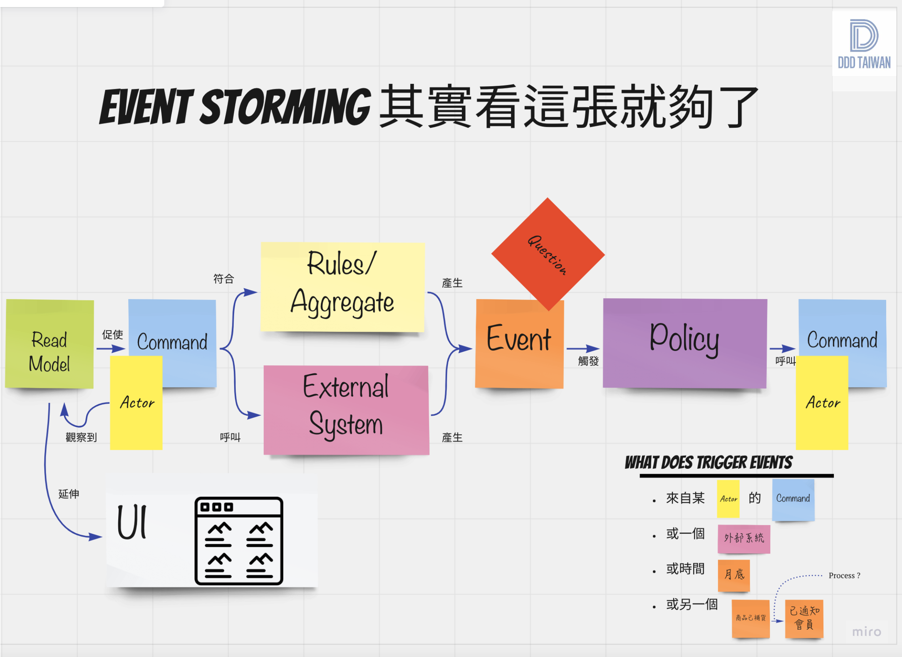
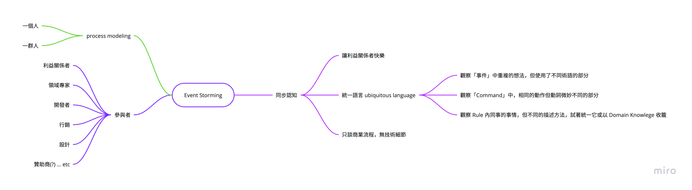
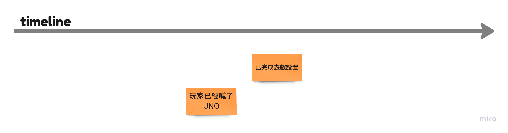
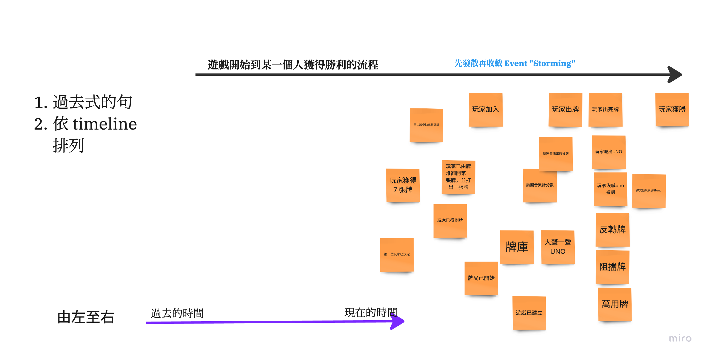
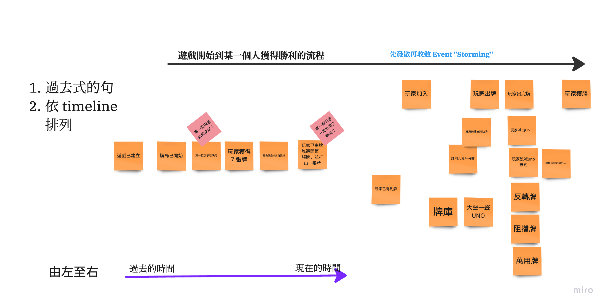
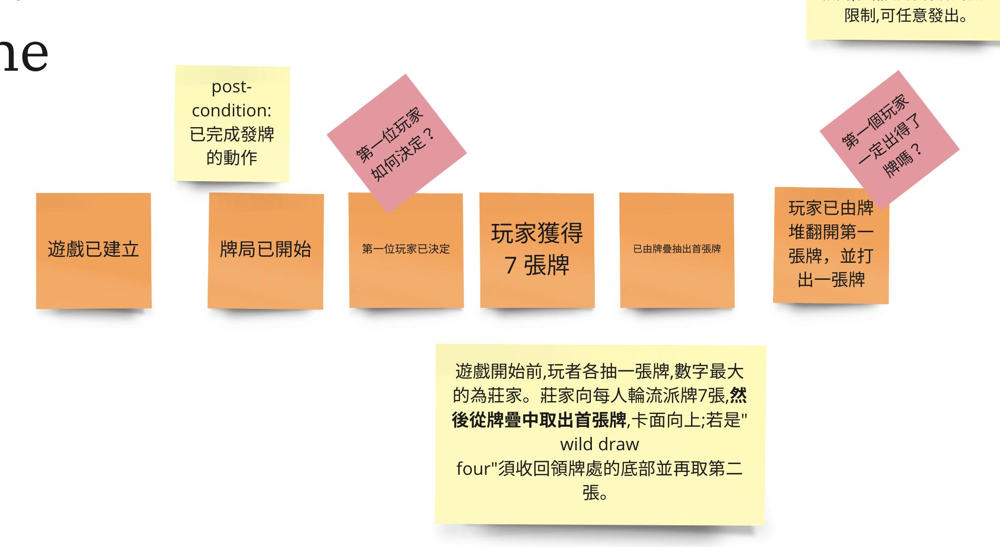
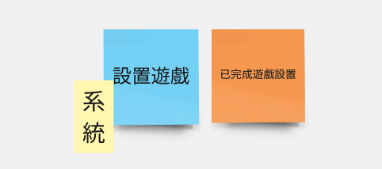
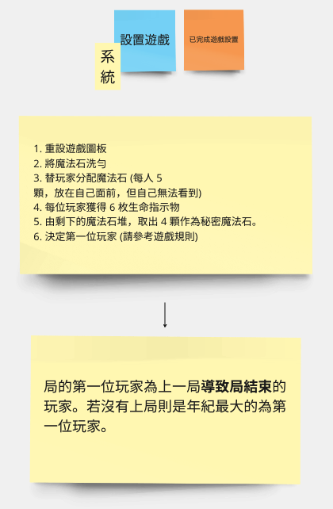
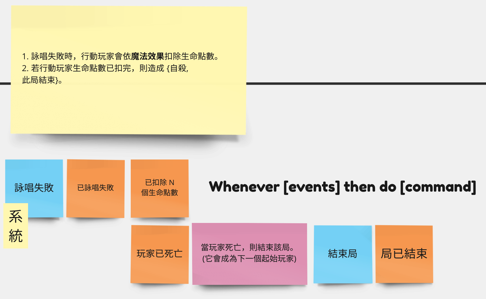
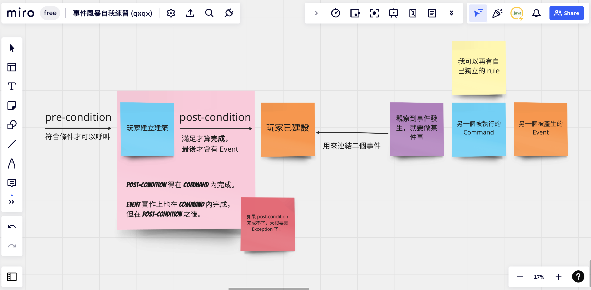

# 來場輕便可攜的 Event Storming 吧！

> 先有經驗，再學知識


當各個遊戲組別開始進行討論時，第一個會遇到的難題是 Event Storming 是什麼？以我自己的經驗來說，當初為了理解 Event Storming 是什麼，去買了本《[Introducing Event Storming](https://www.eventstorming.com/book/)》來看，看完後多少有一點理解，配合著網路上大量的範例也試著做自己的練習，這啟動的成本太高了！

你可以在學院的 [miro](https://miro.com/app/board/uXjVPLbiyto=/) 中找到圖例：



最初在學習時，也看了各種影片與資料去弄懂圖例。後來，反覆參與讀書會，觀看示範才發現。其實，我們並不需要先學習那麼多。如同《[Introducing Event Storming](https://www.eventstorming.com/book/)》開始告訴我們的，作為「引導師 (Facilitator)」不要花太多時間介紹各種便利貼的意義，**直接示範應該要做些什麼，自己先動起來，讓參與者跟隨與模仿你的行為**。

- 核對期望與行為準則
- 事件風暴 (事件的膨脹與收斂)
- 事出必有因 (Command 與 Rule)

## 建立共同期望



我們一群人來參加 Event Storming 型式的工作坊。要先對它能做到什麼，以及它的產出有個理解。首先，在 miro 上堆好的各示便利貼只是「副產物」，真的產出是與會者的**認知大致同步且滿意結果**。

先來關心會有哪些參與者，特別是針對商業流程建模 (process modeling) 的工作坊來說：

> 不會只有「開發者」參與。


> 不會只有「開發者」參與。


> 不會只有「開發者」參與。


先放棄以開發者本位的思考方式很重要，要先說三次強調請開發人員切換為**人類友善模式**。這個工作坊的終點是利益關係 (stakeholder) 者與領域專家 (domain expert) 都覺得滿意，其他各種角色也都獲得一致的想法。因此，在這個工作坊中，不談技術細節，只會有描述商業行為的語句。

同步認知不只是個望願，最終的反應是每一位參與者，可以依著時間軸的推進講出完整的故事 (story telling)。並且，在這講述的過程中，不同的參與者用的**術語**會是一致的。這術語一致的情況，會同時呈現在下列地方：

- miro 畫布上，即 Event Storming 完成的 process
- PO、UX/UI designer 乃至 marketing 等非開發人員討論時用的術語
- 開發者 `OOA/D` 使用到的類別、方法、參數名稱

這就是統一語言 (ubiquitous language) 追求的結果，不會再是**非開發者**與**開發者**講著不同的方言，如同人月神化裡講述的巴比倫塔工程，越到後期歧異越大，最終讓開發速度因溝通的成本太高，而無法再進一步。

## 事件風暴

如同開頭說的「先有經驗，再學知識」。這裡的經驗不是問你有沒有精熟後自己操作或帶領它人進行 Workspace 的經驗，相反的，儘管你瞢瞢懂懂時親身參與過 Workspace，以第一人稱視角獲得的親身體驗。

### 階段一：讓事件風暴起來

作為主持工作坊的人，不需要解說太多「Domain Event」的細節，太多細節讓參與者困惑，而困惑的感受讓人無法好好品味後續的刺激。

一切會在引導師講述今日目標與貼上第一組破冰事件開始：「各位參與 UNO 團隊的朋友們好，今天事件風暴的目標，我們來 modeling 遊戲開始到一位玩家獲得一局勝利的流程」。有目標是重要的，這樣事件生長的方向才會比較明確有範圍，更何況有些遊戲的流程太複雜，不先聚焦一下會讓事件發散地過多，後續要花費較久的時間收斂。



以上面簡單的例子來說，這二張也許都是引導師示範的。一開始也不用太在意 timeline，事件的順便不合理也沒有關係，總之先把各種事件生出來。直到看似足滿「遊戲開始到一位玩家獲得一局勝利的流程」。

在這一段引導師要示範 ***Thinking Out Loud***，把正在想的東西以讓其他人聽得到的音量也說出來，同時鼓勵大家這麼做。因為「同步認知」，要先知道他人有沒有想法與自己不同，或是被他人的想法同步。

稍為提醒一下，在每一個活動的階段都設個 **timebox**，例如 10 分鐘或 15 分鐘，也可以更短不夠再加時間。

### 階段二：文法與時序

在上一輪讓參與者填上各種事件後，第二階段可以開始來加一點點的「Event Storming 規則」，也只有一點點：

- 事件的內容用**過去式**描述
- 事件**時序**是由左至右排列的

由於一套流程要成立，得透過實際觀察到的事實來決定它合不合理。這些被領域專家觀察到的事實，就可以被寫成 Domain Event。在這階段，參與者只需要知道我們在描述「已發生的事實」，所以有著使用過去式來描述它的慣例。

下圖是借用自先前參與引導的 uno 組別的範例：



在第一階段時，引導師不用特別修「過去式」，也不需要特別去提醒參與者「事件需符合時序排序」，因為這些內容都可以是同步認知的一環。要大家一起來修護比較值得，若只是單純某個人內心中的小劇場，那就太浪費了這些素材了。

引導師可能會講這些內容：

- 在這堆事件之中，有哪個事件它應該是第一個發生的！？
  - 遊戲已建立 → 有需要修文法或文字嗎？
- 接著續的事件，是誰比較合理？
  - 牌局已開始 → 有需要修文法或文字嗎？
- 回到遊戲規則，有沒有我們遺漏的事件，可以排入目前的二個事件之前或之後呢？

過程都會是這些活動的循環：

- 選擇未排序事件
- 事件決定先後關係
- 修正事件內容的文法
- 挑選適合的術語
- 發掘遺漏的事件

經過一番努力後，會發現「有序」的事件在變多。反覆上述的流程，把「無序」納入有序的歷程，就是在這階段最重要的事。



要注意，如果時間太久讓參與者經神不濟就不好了。因為，完成排序是最重的目標，但不是工作坊主要的目標「同步認知」。精神力低落時，腦中是無法再接收新的知識的，當領域知識太旁大時，可以分不同批次慢慢把它執行完。

### 階段三：說故事



「說故事」story telling 並不一定得在**階段二**完成才可以執行，只要我們在時序上有一些進展的時候都很適合。說故事就是利用已排好的事件串連起來的描述：

> 當遊戲已建立後，就能開始新的牌局。選出第一位玩家，他會負責洗牌與發牌，每位玩家會得到七張牌，接著，由牌疊抽出第一張牌放在檯面上，正面朝上讓玩家都看到。玩家已由牌堆翻開第一張牌，並打出它。


需要請參與者仔細聆聽說故事的**細節**，因為為了串連起故事，說故事的人會去自動補足「事件」中不連貫的部分，也會突顯事件中缺乏的細節與用語不一致的部分。在這個階段，是做製造「討論」與「同步認知」的好時機。

### 階段四：命令與規則

我們知道 Domain Event 並不會無緣無故自己發生，它得有一個發生的原因。肯定來自某種機制做了些什麼，我們先討論直覺得情境：

> Command 產生 Domain Event




借用《出包魔法師》的 Event Storming 圖例，在這個遊戲中我們找出一個遊戲過程中必需發生的事件「已完成遊戲設置」，我們得替這個事件找個觸發的 Command，於是拉了一張藍色便利貼寫著「設置遊戲」就搞定了。

針對 Event Storming 畫布上的每一個 Domain Event 我們都先 **「無腦地」** 幫他加上對應的 Command。就只是把「過去式」的 Domain Event 換成另一個「動詞」開始的句子罷了。

不過，Command 幫助我們思考的，其實是它本身帶有「責任」，責任完成才能產生 Domain Event。所以，這時，經典款的淺黃色便利貼就要上場囉！我們得在這貼利便中描述 **Rule -** 規則。當規則內的事項完成了，才可以有自信地說 Domain Event 所代表的事實被確立了。



所以，我們看著規則回推「已完成遊戲設置」時遊戲會處於什麼狀態呢？

- 遊戲圖板已經被重設囉！→ 不會有前一局殘留的內容。
- 魔法石洗勻 → 所有的魔法石都在我們的「遊戲」管理之中，並且重新洗牌成打亂的順序。
- 替玩家分配魔法石 → 遊戲參與的 N 個玩家，每人得到 5 個魔法石，但自己不知道自己的魔法石，只能看得到別人的魔法石。
- 每位玩家獲得 6 枚生命指示物 → 俗稱血量的東西，不管經過幾局，重新開始就是 6 點起跳。
- 由剩下的魔法石堆，取出 4 顆作為秘密魔法石。→ 剛剛抽剩下未分配的魔法石中，再抽出 4 個當作秘密魔法石。
- 選定該局初始玩家。

所以，我們可以有信心地說「已完成遊戲設置」就是上面規則由 Command 執行完成。儘管不一定每一個 Command 都有複雜的規則，但這個階段讓我們省思什麼情況，代表了 Domain Event 確實發生了。

> Q：如果有任何條件無法被滿足，該如何是好呢？


如果有任何條件被滿足，那它跟我們目前探討的 Domain Event 應該是屬於互斥的關係，你再立一個新的 Domain Event 看它是否值得有獨立的 Command 能來作為觸發點。或者，你在規則中多描述特定事件，只有在某些情況才會發生。

請參考「詠唱失敗」的例子：



當玩家詠唱失敗，一定會扣除若干生命點數，但是玩家不一定會死亡。這就是 Domain Event 不一定會觸發的原因。同時，這個例子你也可以看到一個 Command 可以產生一個以上的 Domain Event，這都是合理的情境。

在補足 Command 與 Rule 後，推薦再次進行「說故事」環節，因為這次有了明確的「動詞」與「該滿足的條件」描述起來會更加流暢。

### 其它：Policy

Policy 並不是必要的，它的出現理解它用來表現二種目的：

- 結構上的功能，用來連結二組 Domain Event
- 強調是一個重要的 Business Logic (這時，它可能是一個專業術語；或是描述著豐富情境的句子，來描寫為何二組 Domain Event 該連在一起)

結構上它得符合這個型式：

```
Whenever [events] then do [command]
```

用上面的例子來套，就會是：

```
Whenever 玩家已死亡 then do 結束局
```

白話地說：

- 無論什麼時候，只要玩家死掉了，就結束該局。
- 無論什麼時候，只要玩家死掉了，這局就結束了。 (用事件來描述也沒什問題)

Policy 通常是用來「強調」與「同步認知」的意圖，就算你的 Event Storming 畫布完全都沒有 Policy 也不會產生任何問題。因為 Policy 多半的時候，可以是 Rule 的一部分，特別拿出來講是為了強調這看法是對的，無法撼動的。

在書上教 Policy 是一個**測謊器**，當你試著把 always 或 immediately 放到句子中，在場的參與者有任何一個人反對，那目前這一版的 Policy 地位就受到撼動，因為它不符合 always 與 immediately 存在的情況。這時，你可以做的是去釐清陳述中的哪一部分導致 Policy 失效，透過建立互斥的 Domain Event 來讓 Policy 合理。

### 其它：Rule 的分類

到目前為止，我們沒有細談 Rule，因為在最初的一二三階段，並不需要理解那麼多。它可以分為三類：

- 固定規則 invariants
- 前置條件 pre-condition
- 後置條件 post-condition



所謂「固定規則」，使用的情況這個 Rule 無論在哪一個 Command 發生都要保持，是屬於整個 Domain 都要遵守的事情，像是一開始的遊戲人數限制，就是固定規則的一種。

接著 post-condition，這就是我們剛剛寫在 Rule 裡的內容，如果沒有特別寫你當作 invariants 或 post-condition 都可以，滿足了 post-condition 才能產生 Domain Event。另一種 pre-condition 就還沒提過了，這是要「符合條件」才能執行 Command，也就是「Actor 有執行這 Command 的資格嗎？」

## 動手做 Event Storming

對於這份寫給自己看的「引導」筆記，也許稍長了點。若你打算使用它來自我引導，建議不要吸收太多知識，先快速地拿很多套遊戲，反覆練習階段一二三就好。其它的只是加分項目，但只要階段一二練得熟，階段三自然順利。後續的接 Command 就只是更細節地檢查規則罷了。儘可能多動手做，少停下來迷惘。
