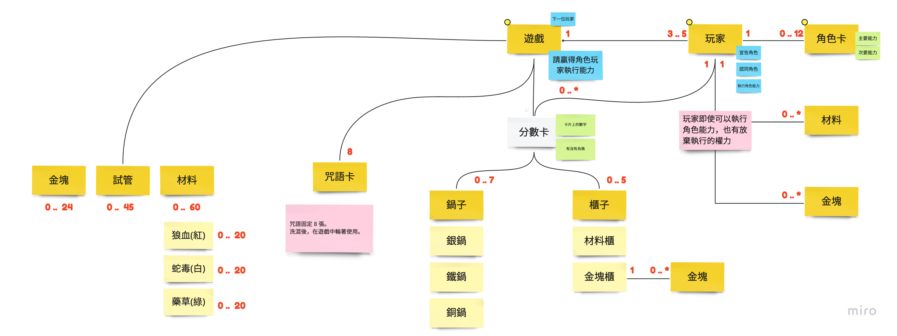
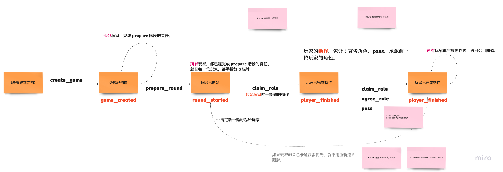
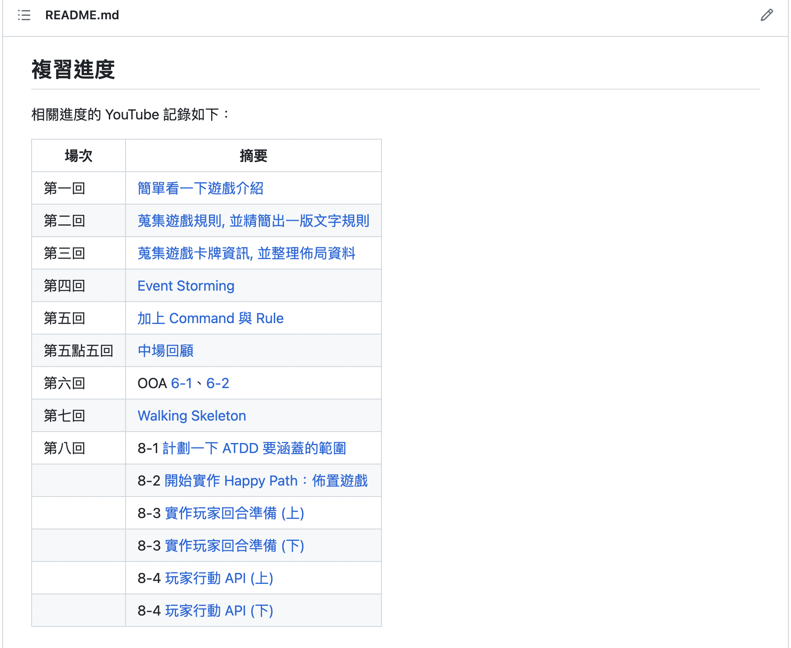

# 女巫的佳釀初回 ATDD 內容回顧

「複習遊戲微服務計劃的大小知識」第八回是我們大量提升實作比例的開始，但憑心而論它的實作並不算是很多，花上許多時間在慢慢講解為何要這麼做。這篇內容回顧是作為「總集篇」詮釋一下相關影片的內容。

接續著 Walking Skeleton 之後的第八回，我們開始實行 ATDD 的開發方式，它的全名為 Acceptance Test-Driven Development)，簡稱 ATDD。它與一般的 TDD 著重與可測性與設計上的探索不同的部分為注重「驗收」，也就是它有稍為完整的情境，並針對使用方的視角去驗證流程上應該發生的流程。我這故意用了「使用方」而非使用者，是為了避免閱讀者往真實的使用者去想這個情境，我們著重在 caller 應該要獲得的結果，並且是在多種行動的交互結果後獲得的結果。

## 設定 ATDD 的目標

要實行 ATDD 前，最好跟 Event Storming 一樣，有個簡單的 Happy Path 來貫穿需要討論的範圍，而非窮舉展開各種情境。以我們選擇的遊戲《女巫的佳釀》來說我選擇了跟 Event Storming 一致的 Happy Path。因為，我們的 Event Storming 也沒有讓遊戲進展到結束，但它已有足夠的內容來捕抓遊戲中提到的多數**概念**。

第一輪 Happy Path 的目標：

- 確認 OOA 捕抓到的概念都可以合理地使用

Happy Path 的情境：

- 3 位玩家加入遊戲並開始遊戲
- 3 位玩家在遊戲開始後，進入了遊戲回合準備階段
- 在遊戲回合準備階段，每位玩家需要選定 5 張角色卡完成準備
- 一旦，所有的玩家都準備好了，遊戲回合準備階段就完成了。
- 完成遊戲回合準備，玩家可以開始行動。
- 回合初始玩家選擇宣告角色
- 回合其它玩家因為沒有相同的角色卡，只能選擇 pass
- 所有玩家都完成行動後，再次進入「遊戲回合準備完成」

以上是比較完整版的，當大家在實作時也可以先試著列出來會經歷的內容。這樣唸過去是很快的，並仔細寫出來快很多，我在這稍為詳列只是為了「展示」它的用法。真實的實作，我們是漸增遞補上去的。

## Happy 該如何 Happy

理論上，不處理 Edge Case 的部分就是 Happy Path 的內容，但為了讓實作更加地「快樂」沒有負擔，各自的團隊可以決定在這階段的 Happy 程度，可以讓實作時「猶豫」或「糾結」時，可以簡單地判斷要不要現在處理。

我會期望在初次實作 ATDD 的朋友，儘可能如 Event Storming 一樣只抓大方向，不要太深入細節。簡單的建議如下：

- 要有一個情境 (如前一小節的描述)
- 假設每一個 Actor 都「自動自發」依規則行動
- 僅實作「有用到」的概念 (舉例來說是類別與它的方法)

基於不處理「不 Happy」的部分，我們先相信每一個行動都是符合規則的，並且**還沒有用到的東西**不去實作它。所以，我們不會特別去實作「規則」的檢查，它有更適合的時機 — TDD。相似的建議，遊戲的概念部分，我們也只去實作有用到的。以下面類別圖為例：



在第八回的 ATDD 完成時，我們僅開出了「遊戲」「玩家」與「角色卡」類別。

```python
class Game:
    def __init__(self):
        self.state = "game_created"
        self.id = "game-9527"
        self.players: List[Player] = []

    def add_player(self, data: PlayerInput):
        ...

    def as_view(self):
        ...

    def refresh_state(self):
        ...

    def claim_role(self, player_id: str, card: str):
        ...

    def pass_action(self, player_id: str):
        ...
```

以遊戲類別來說，它甚至連 game-id 都是 hardcode 的。因為，我們目前只有唯一的一個案例，可以晚點再處理它，你可以到它跟 Player 有關聯，也有加入 Player 的方法，並有作為 Aggagrate Root 的特色 `state`，它是一個簡單的狀態機。我們給定的初始狀態就是參考 Event Storming 上的「遊戲已佈置」

而最後的二組方法，帶著 player_id 則是玩家在行動時，透過 Aggregate Root 傳遞行為至真實 Player 物件的方法，它們只是簡單的委派 (delegation)，所以你可以在 Player 內看到相同的方法名稱：

```python
class Player:
    def __init__(self, player_id):
        self.id = player_id
        self.cards: List[RoleCard] = []
        self.action = {}

    def add_card_by_name(self, card_name: str):
        ...

    def as_view(self):
        ...

    def claim_role(self, card_name: str):
        ...

    def do_pass(self):
        ...
```

這裡要提醒的是，撰文時讀者先看到的 Game 類別與 Player 類別，並不是先生出來的，而是走 ATDD「先許願」再來實作出來的。

## ATDD 漸增遞補

回到完整的情境：

- 3 位玩家加入遊戲並開始遊戲
- 3 位玩家在遊戲開始後，進入了遊戲回合準備階段
- 在遊戲回合準備階段，每位玩家需要選定 5 張角色卡完成準備
- 一旦，所有的玩家都準備好了，遊戲回合準備階段就完成了。
- 完成遊戲回合準備，玩家可以開始行動。
- 回合初始玩家選擇宣告角色
- 回合其它玩家因為沒有相同的角色卡，只能選擇 pass
- 所有玩家都完成行動後，再次進入「遊戲回合準備完成」

### 第一輪

它真實的實作是先做 ([實作參考連結](https://github.com/qtysdk/rebuild-gaas-skill-2023/commit/8021565b1667c2136099e08a09e80a0aa11dda25))：

- 3 位玩家加入遊戲並開始遊戲

只有這樣。在這裡，我們先寫好測試的「許願」，知道玩家要加入遊戲是透過哪一個 HTTP POST，打到 endpoint 上，最初版的測試內容如下：

```python
def test_happy_path():
    client = TestClient(app)

    #
    # Game created
    #

    request_body = {"players": [
        {"id": "player-1"},
        {"id": "player-2"},
        {"id": "player-3"},
    ]}
    response = client.post("/games", json=request_body)

    assert response.status_code == 200

    expected = {"game_id": "game-9527", "players": [
        {"id": "player-1"},
        {"id": "player-2"},
        {"id": "player-3"},
    ]}
    assert response.json() == expected
```

你會看到，在這時連 `state` 都還沒出現，因為基於「還沒用到就不做」的想法，這是我們的第 1 個狀態，它還沒有下一個狀態可以轉移，當然還不用考慮狀態的事情。許願寫完就順順地開出需要的類別，將測試由紅燈轉成綠燈後，commit 完成了 ATDD 的一個循環。

### 第二輪

在完整的情境列表中，加入一組進度 ([實作參考連結](https://github.com/qtysdk/rebuild-gaas-skill-2023/commit/edc9870e0e573c29ac89d3a844fb42e504872e19))

- 3 位玩家加入遊戲並開始遊戲
- 3 位玩家在遊戲開始後，進入了遊戲回合準備階段

基於上一輪的成功，我們可以開始實作「遊戲回合準備」。先來看一下許願的部分變化：

```python
def test_happy_path():
    client = TestClient(app)

    #
    # Game created
    #

    request_body = {"players": [
        {"id": "player-1"},
        {"id": "player-2"},
        {"id": "player-3"},
    ]}
    response = client.post("/games", json=request_body)

    assert response.status_code == 200

    expected = {"game_id": "game-9527", "state": "game_created", "players": [
        {"id": "player-1"},
        {"id": "player-2"},
        {"id": "player-3"},
    ]}
    assert response.json() == expected
```

你可以發現，在「遊戲已佈置」的回傳，多出了 `game_created` 的狀態。因為，我們真的有狀態需要轉移了，並且是在「所有玩家」都選好了要在新回合使用的角色卡後，會再次轉移狀態。新的許願內容如下，讓 3 名玩家隨意提交 5 張牌，最後一位玩家提交完成後，狀態會轉移。

```python
#
# Players prepare their round
#

request_body = {
    "cards": [
        "card-1", "card-2", "card-3", "card-4", "card-5"
    ]
}

response = client.post('/games/game-9527/player/player-1/prepare', json=request_body)
expected = {"player_id": "player-1", "cards": [
    "card-1", "card-2", "card-3", "card-4", "card-5"
]}
assert response.status_code == 200
assert response.json() == expected
check_game_state(client, "game_created")

response = client.post('/games/game-9527/player/player-2/prepare', json=request_body)
expected = {"player_id": "player-2", "cards": [
    "card-1", "card-2", "card-3", "card-4", "card-5"
]}
assert response.status_code == 200
assert response.json() == expected
check_game_state(client, "game_created")

response = client.post('/games/game-9527/player/player-3/prepare', json=request_body)
expected = {"player_id": "player-3", "cards": [
    "card-1", "card-2", "card-3", "card-4", "card-5"
]}
assert response.status_code == 200
assert response.json() == expected
check_game_state(client, "round_started")
```

在這裡你會發現，我的「角色卡」並沒有真的實作《女巫的佳釀》會用到的角色卡。因為，在這階段它們還沒有真實被用到，基於沒有用到就不做的理由，我們讓它有東西就可以了。

### 經過了 N 輪

在 N 輪的實作後，我們打通了原先設定的「情境」將需要的概念都實作出來，成果就是該開的類別都有了，也有狀態機的簡單實作：



同時，我們也有簡單的 TODO 先記一下目前刻意忽略的部分，可以留在 Example Mapping 與 TDD 階段妥善地處理它們。

## 開始享受你的 ATDD 旅程吧！

這分 ATDD 的詮釋是作為「摘要」的功能來引領大家有點興趣來觀看我的錄影 :D 連結全都放在專案首頁的[進度表](https://github.com/qtysdk/rebuild-gaas-skill-2023#%E8%A4%87%E7%BF%92%E9%80%B2%E5%BA%A6)內。



同時，這也是作為 ATDD 回的總結。一方面重新詮釋自己在參與活動後的理解，並且試著「單人」做一份示範的內容供讀書會的參與者參考。畢竟，並非人人都可以弄懂讀書會 mob programming 時，同時發生的大小事情。看完了這些要去練習，至少知道可以先設定 Happy Path 的情境，並且「不糾結」沒用到的東西不用事先處理。實作時就簡單地：許願、實現願望的循環 (測試紅綠燈)。
