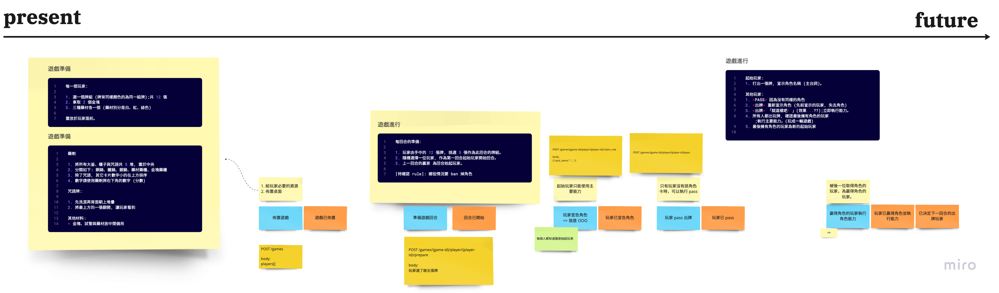

# 由 Walking Skeleton 到 Iteration 0

參加 DDD 社群舉辦的 Workshop 後，接觸到了 Iteration Zero 的概念。更進一步閱讀了《*Growing Object-Oriented Software*》的內容，可以知道它與 [Walking Skeleton](https://qrtt1.medium.com/gaas-walking-skeleton-194e5fcc6b27) 密不可分。

在學院讀書會的內容，將 Walking Skeleton 與 DevOps 串連起來，讓你的程式由單純有著一堆原始碼的專案，搭配著 CI/CD 基礎建設，達到一有新的產出就可以立即地進行測試，並在適當的時機自動部署更新。我們用最簡單的專案實作，先串起了這個自動化流程的美好未來。免去了不同人為執行衍生的不可控品質。「簡單的專案實作」它可以單純只有堆疊 Tech Stack 的內容，沒有 Domain 相關的概念也無妨。先前我們實作的 Walking Seleton 也只有 FastAPI 基礎範例搭上了 TestClient 而已。

## Happy Path 與 ATDD

接在 Walking Skeleton 後的按排，我們開始實作一個「簡短的 Happy Path」並以 ATDD 的風格去實作它。由於我們的 Happy Path 恰好對齊 Event Storming 內的 Happy Path：



搭配 OOA 捕捉到的概念，我們讓實作專案在「概念」有被用上，並且作為聚合根 (Aggregate Root) 的遊戲 (Game) 物件，能依著 Command 的觸發而進行狀態的轉變。目前，我們的狀態轉行設計如下：


在這個階段，我們只有「粗略實作的 Command」與大致可用的「狀態機」流程實作。這樣試著走一回 Happy Path 與重點試著完成主要骨幹：

> 專注在聚合根即狀態機，而狀態機依著固定規則 Invariants 運作。


## Iteration 0

這樣專案在開闢「主要幹道」的實作歷程即為 `Iteration 0`。當各個遊戲微服務計劃組別在實作時，若是覺得難以分工，或是分工後對情境的體驗感到支離破碎時。由眾人一起 pair programming 或 mob programming 來完成 Iteration 0 是個很好的方式。在大家的見證之下，開出這個領域的主要道路，之後要開出省道、縣道乃至鄉間小路，在心中都會踏實地知道它來至哪條主要道路。

那個粗略實作的 Command，就是先發展起來的城巿。雖然還不完備，但我們已經透過 Event Storming 知道這個 Command 有哪些使命，特別是圍繞著 Command 的 Rule 會告訴你該做些什麼。這麼細節的事情，我們不會在 Iteration 0 去實作它，但它可以變成後續 Iteration N 的開發焦點。

以「佈置遊戲」來看，它的 Rule 就有這些：


- [玩家] 決定玩家牌組顏色
- [玩家] 發給玩家資源
- [遊戲] 準備公用區藥劑牌堆
- [遊戲] 準備公用區咒語牌堆
- [遊戲] 準備公用區資源

這麼多要做的事，我們在 Iteration 0 內都沒特別去處理它。因為在 Happy Path 的內容中，還沒有使用到它們的機會，我們專注在實作「會派上用場的事務」，完成了替 Game 聚合根開出 `create_game` 的 Command，並讓它完成首次的狀態轉移。我們對每一個 Command 與它會轉移的狀態都是這麼「粗心」地對待，在這個時機粗心一點就是恰好需要的品質。

## TDD

「細節」與提高完成度的事情，會在 Iteration 0 **之後**追求，並且可以在 TDD 的輔助下讓事情變得容易。特別是在 ATDD 開出主要道路後，我們只要搭配著 Event Storming 與原始的規格書描述，就可以做出有品質的實作。

與 ATDD 不同的是，我們不會特地以使用者的角度來測整條調用鏈路 (invocation path)，而是以 `內部的呼叫者` 的角度來看。具體來說，我們假設「佈置遊戲」就等同於建立 Game 物件：

```python
game = Game()
```

那麼，在 TDD 的歷程，無論你有沒有準備 Example Mapping 的案例，你的 Given-When-Then 或 3A 測試的目標就是去滿足「佈置遊戲」相關的 Rule。滿足了這些 Rule，這個 Game 的狀態才有資格轉移成「遊戲已佈置」：

```python
- [玩家] 已決定玩家牌組顏色
- [玩家] 已發給玩家資源
- [遊戲] 已準備公用區藥劑牌堆
- [遊戲] 已準備公用區咒語牌堆
- [遊戲] 已準備公用區資源
```

> 需要強調一下「內部呼叫者」，就是在撰寫測試時，選擇呼叫的方式與流程，儘可能與正式的程式一致。這樣才比較不會有「意料之外」的事情發生。


## Example Mapping

我們並不會「總是」替每一個測試案例準備好它的 Example Mapping，特別是太過單純的規則其實沒有舉例的必要，它可以是刻意練習的一部分，但不用太強迫症地想要替每一條規則舉例說明。只有規則太複雜或抽象，不舉一些正反例子出來，就難以完美的實作出合理的成果時，這比較有花時間舉例說明的價值。由於明前的 Happy Path 都還沒有接觸到需要舉例的角色卡，只要單純走地 TDD 將一般認知的規則、流程與狀態轉換實作出來就行了。

舉個例子來說，當**扒手**時可以扒所有的人金塊。可是，扒完所有人的金塊時，依然無法取得藥劑時，金塊會留在場面上，等著另一個扒手滿足條件取得分數：


我們可以先用上述的內容，寫一個簡單的案例：

> 情境：扒手搜刮完金塊後，仍不足以取得得分卡，身上也沒有足夠的餘額補足所需金塊。最後，留下有金塊的得分卡在場上。


- Given `家玩` (依行動順序排列)

  - A: 擁有 1 個金塊, 有扒手角色卡
  - B: 擁有 2 個金塊, 無扒手角色卡
  - C: 擁有 5 個金塊, 無扒手角色卡
  - D: 擁有 1 個金塊, 無扒手角色卡

- Given `藥劑櫃` 需要 3 個金塊方得取得

- When

  - 玩家 A 宣稱「我是扒手」 (要求其他玩家每 3 個金塊，得上繳 1 個)
  - 其它玩家 pass

- Then 角色得主

  - 玩家 A 取得扒手角色

- When 角色得主執行能力

- Then 玩家狀態

  - 玩家 A 擁有 1 個金塊 (扒手本人不用出)
  - 玩家 B 擁有 2 個金塊 (未達 3 個不用繳)
  - 玩家 C 擁有 4 個金塊 (每 3 個要上繳 1 個)
  - 玩家 D 擁有 1 個金塊 (未達 3 個不用繳)

- Then 得分卡狀態

  - 藥劑櫃上有 1 個金塊 (規則上允許扒手補足餘額，但扒手本人只剩 1 個金塊，還差一枚才能補足)

- Then 扒手狀態

  - 玩家 A 沒有取得藥劑櫃而得分

這個案例看起來比較悲傷一點，但其實遊戲規則也允許「放棄」執行能力。所以，我們可以再有一個放棄的情境：

> 情境：玩家贏得角色後，為了繼續累積手上的資源，而選擇放棄執行角色主要能力。他作為此回合贏家，繼續作為下一回合的起始玩家繼續遊戲。


由了情境後，大家就可以再依上面的方式寫出測試案例的計劃囉！

## Iteration 0 弄得好，開發不互卡

我們在 Iteration 0 將主要的幹道開出來後，大家就有個相對穩固的地基可以作為立足點了。他們不會互卡的原因，如同實作 thread-safe 又保持 performance 的情境相似。追求 Lock-free 的前提下，下面的策略可以應用在完成 Iteration 0 後的分工：

- 沒有共享的狀態
- 即使有共享的狀態，但狀態是不可變的 (immutable)

當你的專案有許多任務得完成，但因為有些相依的關係得在 A 完成後才能做 B。這樣就不會是適當的安排，其實可以仔細研究一下 A 與 B 是不真的需要有「共享」的狀態。以遊戲微服務的專案來說，最常被「**共享**」的東西會是 Game 與 Player。

所以，我們至少確任了這二個類別在不同的 Command 與 Domain Event 的組合間會被用上，但在 Iteration 0 時，已經開出了 Game 與 Player 的雛型，並且已經弄出來的部分不太會再改變，那它們就會是「即使有共享的狀態，但狀態是不可變的」情況。後續增加細節時，只是在既有的類別人增加屬性或方法罷了。

這麼想，是不是對於團隊協作有點概念了呢？
