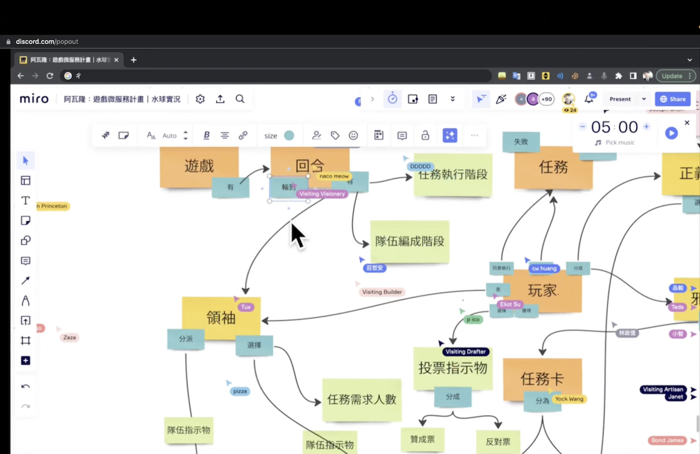

# OOA 結構化分析怎麼做 (極簡版)

物件導向分析 Workshop

- 先不要管什麼是物件導向分析，我們就先做起來！
- OOP vs OOA 有什麼差異？ 我內心的 OS：「講到你懂我鬍子都白了，不講了。直接做起來吧！」
- 需求分析的工具之一，跟寫 Code 無關。物件導向分析，是在做需求的**結構化**分析

我們會一邊閱讀事先備妥的需求，依著 Workshop 的 Steps 在畫布上作畫。

## 一、結構化

先由需求中「無腦」的捕抓一下結構

- 受詞可以不存在
- 「結構」，元素 + 元素之間的關係。
- 我們只要名詞與動詞，不需要有因果關係

慢慢收斂結構：

- 去掉無關的
- 合併重複的概念

## 二、名詞分類

投票：物件 (銘黃色)

- 針對所有名詞，來投票決定哪些是**物件**。
- 大家有共識就好，多數決
- 如果意見不分上下，先上 Question

投票：屬性

- Value 不帶有需追蹤改變的值

其它：就是類別

三、物件分類

- 每一個物件會被分派到一個他隸屬的類別
- 如果類別不存在，在這個階段開出來
- 在這個階段，我們要「殺」掉物件，因為類別圖最後只會有類別。

四、關係分類

(圖內的三是標錯的)

- 關係：
  - is-a (繼承)
  - use-a (依賴)
  - has-a (關聯、組合)：以上階非
- 若為 has-a 還要在二端補上參與者數量

***

credit by [水球軟體學院](https://waterballsa.tw/)
