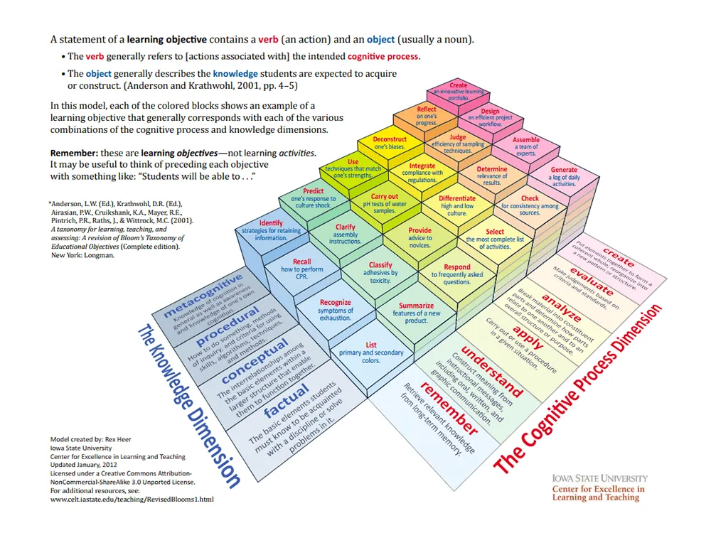

我幾前年前有花了不少時間，試著在陪網路上試著轉職的人練習 (不管是付費的家教或是免費的指導)。第一階段要做的就是看他們值不值得我投入陪同訓練。以我的視角來看，這些有志之士有沒有機會通過初階工作的面試？

> 本文是摘錄自學院討論時的想法，並修訂文字加上具體的範例。最原始的討論連結如下：
> from https://discord.com/channels/937992003415838761/1121618513375809592

## 自導自演的「教學」

測試的方式很簡單，我就是要看到你對學習材料吸收後的「輸出」。多數的人會收到的要求是：「請運用你的學習材料 (特別是影音材料)，重新整理一次大綱並且自導自演錄影起來展現你的「教學」。

多數表達有轉職意願，正在自我學習之路上的人，要求他準備個簡單的流程或劇本，「假裝自己是在上家教」講述一次最近在學習的程式語言的基本概念，多半的人在這簡單的測驗就掛了。

多半的人會不知所措，即使我已經給了不少自己展示的參考範例。面對這些無法啟動自己，轉換成解說者模式的人，我是會果斷地放棄的。理由很簡單，這樣的狀態是無法通過面試的。

只要你可以說點什麼即使是不通順的句子，或是無法順利地組織起內容為容易講述的順序。只要能夠讓自己由「純粹地吸收知識」轉換為「開始輸出所學所知」，機會之門才會稍稍打開一些。

## 能或不能的分野

無法試著「自導自演」的人，會飛快地收到我的勸告並在社交軟體上成為禁止往來戶。勸告的內容大意為：

* 人生有很多種成功的方式，不太需要執著於轉行為軟體工程師。
* 如果依然對寫程式充滿興趣，這完全沒有問題，但你就當業餘的興趣就好。

摸著自己的良心！若是，把明顯不適合的人硬推進職場，除了很快陣亡之外也很對不起他未來的同事。

如果你想要試著改變自己，那麼水球軟體學院的 `TTM 技術演講吐司會` 會是個很好的練習園地。

## 劇本與流程

具體要怎麼去實驗自己組識能力好不好？也不用真的從無到有去準備一個主題，常用的方法就是用正在學習的線上課程內容，挑一個單元中的一小節，你把課程複製起來講一遍試試。

特別選擇影音課程是因為它的門檻最低，有些人無法由文字資料直接轉成「可以講述的材料」，那麼線上課程已經有人「編排」與「示範」的前提下，就當自己是「拷貝忍者。卡卡西」看著重現一次就好。

對著學習材料中的講者，做跟他相似的「行為」。他說明概念，你就筆記起來要說明。他解說流程，他就列點起來有哪些流程要解說。他實際在 live coding，那你就開 IDE 或 Editor，跟著他講解一段、寫下一段程式。

上面其實就是看著影片的 timecode 去擬個大綱的歷程。若你覺得「大綱」聽起來太抽象？那至少把「主題」分段。然後，把一些重點摘錄下來，作為講課與 live coding 的小抄，依著時序試著講看看唄。

***

即使，你聽我描述起來很簡單，我自己也很常這麼做。驚人的事實：很多人在「準備」階段就掛了。

我不確定是真的能力上做不到或是懶得做出來。不過，在這階段都過不了的學習伙伴，我通常不太會花時間深入，只是祝福他有朝一日能學到他想學的東西。

## 啟動解說之力「後」

當學習者能完成「初版」的解說後，就會開始反覆修改的狀態了。我們會試著用同樣的方式，整理不同的學習材料，並且一直濃縮合併各方學習材料的內容。

一旦證明了「有能力開始輸出結果」的階段，學習者才會真的用上 mentor 的功能：「確定一下你是不是真的適合。」判斷的方式完全是我個人的主觀想法，側重在二個方向：

* 對於不同「知識載體」的吸收能力
* 理解能力與學習策略。

## 知識載體

自從網路普遍，在台灣也能便宜地使用網路資源學習，很多新一代的學習者會極度偏好「影音」學習資源。但這是優點也是缺點，主要是有些人會變成「無法透過文字資料學習」，先撇開英文無法閱讀的情況。沒辦法好好靜下來吸收文字材料，在學習的速度上會是很大的弱勢，而一些精確的定義得要靠這類的材料為主。

影音材料當然也會有相價的資料，但因為影音的創作成本比較好，內容通常更為濃縮還有選材的偏好與口語表達的偏好，造成同一個概念在不同人的解說會有較大的誤差。這個問題通常要詢求權威資料來解，像是程式語言或工具的「官方網站」。

在觀察學習者的「成長潛力」時，能運用的載體種類越多，我會傾向於認為他們有較大的優勢與較高的學習速度。特別是只能靠影音資料的人，速度是弱於書本的。

雖然，我常會得到，看書多慢啊的回饋，但你影音高倍速播放，也是比不上文字資料的密度。但他們不是互斥，應該是互補的。文字資料不會包含的「連續操作」，可以補足「未有經驗者」對於「東西怎麼做出來的」有極大的幫助。

## 理解能力與學習策略

理解力與學習策略是一體的，因為這得由《知識的分類》下手：

進展到這裡時，會開始試著讓學習著區分出知識的類型。過去，我們的義務教育中沒有提到太多「學習的技術」，所以只會以沒有技術力的「背起來」要求學生這樣地學習。在我的求學過程中，真的有天資超群的朋友連「理科」因理解不能，所以都是用「背」的。當然，這樣是無法真的應用的。

> 即使是「背」，別忘了「記憶技巧」本身也是個多數人未磨練的技術，因此大家都靠著自身的天賦在使用它。就像拿著未開鋒的刀胡亂地揮舞一番，又期望著有強大的破壞力。

***

能一起留到這階段的學習伙伴，通常我會跟他說這樣的好消息：「看起來要學的東西很多，但大部分都是不是記憶為主的學習策略」。

> 有些人因此而誤會，我們不再需要記東西了！到時候只需要上網查查或問問 ChatGPT 就好了。

如果你已經找到工作了，這樣想完全沒有問題。可是，你是在準備轉職的面試啊！你得有一份核心的知識，是熟悉到不需要一直查閱各種資料的。要怎麼做得到這種程度呢？那就是 **大量又反覆地輸出囉。**

***

運用知識分類觀點，來處理多數得學習的新領域：

* `[procedural]`什麼都先不要想，依著學習指引把該做的步驟做過，看能不能重現同樣的結果。
* `[conceptual]` 接觸一點「概念解說」的內容，再「回想」(`meta-`) 一下施作時，哪些步驟跟剛剛聽到的概念有關。
* `[factual]` 去整理出要做出結果，具體哪些行為是用到「事實知識」，把它們整理成「小抄」反覆練習時查看。

> 這聽起來很「抽象」？其實你只要一邊 live coding 又一邊解說就自然全都用上了。

PS. 同時可以參考 [跟 ChatGPT 一起 Pair Programming 一文中的 ChatGPT 成為事實與程序知識的外掛](https://medium.com/p/ba606160608c)

### 入門範例

對於試圖轉行寫程式或是學生要掌握新的技能，進行有意義的學習的簡單步驟：

1. 擬出實踐一個具體目標的流程 (學習材料上會有，只是不同的表達方式不一定有明確列出項目)
2. 蒐集完全流程要使用的各種材料 (過程中要打哪些字？想呼叫的類別或方法他們的名字或參數需求是什麼？)
3. 學習材料範圍中的「概念」蒐集，之後解說過程中需要「點出來」。
4. 結合以上內容的「輸出演示」

#### 範例：製作第一隻 Java 程式

* 劇本材料：https://github.com/qtysdk/LearningJavaByTeaching/tree/main/module_1
* 活動一影片記錄：https://youtu.be/yilV-5bNsqg
* 活動二影片記錄：https://youtu.be/lBEBNA56FZU

#### 範例：類別與控制結構

* 劇本材料：https://github.com/qtysdk/LearningJavaByTeaching/tree/main/module_2

## 輸出

你真的想學東西嗎？學東西不是對自己「輸入」一堆知識而已，當你無意間做出適當的「輸出」才能肯定你學會了，但我們不會等待那個「無意間」的到來，要直接「刻意練習」不斷地輸出。

一開始會覺得這方式很笨拙，但你會發現一旦掌握了夠多的知識量，你要準備什麼都會變得很快。再加上，我們不讓那麼平等地對待所有的學習範圍，你只要針對一些重要但還不太熟悉的學習主題這麼做就行了。

## 其它資源

* TWJUG (Taiwan Java user Group) https://www.facebook.com/groups/185338705012
* Taiwan Kotlin User Group https://www.facebook.com/kotlintwn
* 水球軟體學院 https://www.facebook.com/groups/950597115935440
* 我的 medium https://medium.com/@qrtt1
