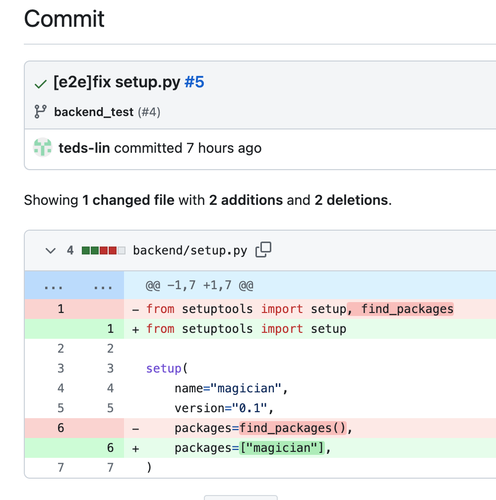

https://github.com/Game-as-a-Service/magician/commit/6b62e9cb5b24edde300cf8479b785f5ebbabf874

## 修改內容



## 目錄結構

```
(venv) (⎈ |kind-kind:default)(base) ➜  magician git:(backend_test) ✗ tree
.
├── README.md
├── backend
│   ├── magician
│   │   ├── app
│   │   │   ├── __init__.py
│   │   │   └── flask_app.py
│   │   └── service
│   │       ├── __init__.py
│   │       └── print_hello.py
│   └── setup.py
├── requirements.txt
└── tests
    ├── conftest.py
    ├── e2e
    │   └── test_api.py
    └── unit
        └── test_hello.py

7 directories, 10 files
```

## 基本概念

我會傾向這樣的改寫是 work-around，並且內容不完整。讓我們先理解一下 Python Package 與 Python Module。

*Python Module* 比較好懂，就是一個 `.py` 的檔案，先不論它的檔名有沒有符合 module 規則，能不能被其它程式 `import`，這就是一組 Python 程式的復用最小單位。

*Python Package* 就是在一個目錄內，放一個或多個 Python Module，並且帶有一個初始化 package 專用的 `__init__.py` module。對 Python 來說，它支援 Python Package 是「巢狀」「遞迴」的結構。因此，一個 Python Package 可以內含 Python Package。

## 我的判斷

由於我們已知

> Python Package 是可以遞迴的樹狀結構


那麼這樣的修改就顯得不合理：

```diff
diff --git a/backend/setup.py b/backend/setup.py
index e46a5fd..3688f34 100644
--- a/backend/setup.py
+++ b/backend/setup.py
@@ -1,7 +1,7 @@
-from setuptools import setup, find_packages
+from setuptools import setup
 
 setup(
     name="magician",
     version="0.1",
-    packages=find_packages(),
+    packages=["magician"],
 )
```

思考一下這樣的目錄結構：

```
├── backend
│   ├── magician
│   │   ├── app
│   │   │   ├── __init__.py
│   │   │   └── flask_app.py
│   │   └── service
│   │       ├── __init__.py
│   │       └── print_hello.py
│   └── setup.py
```

如果 PYTHONPATH 是`backend`，那麼我們期望看到哪些 Python Package 呢？

* magician
* magician.app
* magician.service

但是目前只有手動指定「樹根」的部分，若是以製作出可以用來發佈為 Python Library 為目標的 `setup.py` 是有差距的。即使，這應該不會是遊戲專案的目標，但還是得點出問題讓想要仿製的參與者們知道，這樣是不適當的。

## 為什麼 `pip install -e backend` 可以動呢？

儘管實作是不適當的，那為什東西可以動呢？我們依然可以使用「老招」來觀察 `pip install` 後的狀態：

* 建立 venv 目錄
* 在這組新的 venv 目錄內，建立 git repo，並把所有的檔案 commit 進去
* 仿造 CI 設定，我們指執安裝的指令

```
(venv) (⎈ |kind-kind:default)(base) ➜  magician git:(backend_test) ✗ pip install -e backend
Obtaining file:///Users/qrtt1/Downloads/magician/backend
  Preparing metadata (setup.py) ... done
Installing collected packages: magician
  Running setup.py develop for magician
Successfully installed magician-0.1
```

由 git 的變化來看，它修改了一個檔，並多出了一個 `egg-link`：

```
(venv) (⎈ |kind-kind:default)(base) ➜  venv git:(master) ✗ g diff
diff --git a/lib/python3.10/site-packages/easy-install.pth b/lib/python3.10/site-packages/easy-install.pth
index e69de29..6141eb8 100644
--- a/lib/python3.10/site-packages/easy-install.pth
+++ b/lib/python3.10/site-packages/easy-install.pth
@@ -0,0 +1 @@
+/Users/qrtt1/Downloads/magician/backend
(venv) (⎈ |kind-kind:default)(base) ➜  venv git:(master) ✗ g status
On branch master
Changes not staged for commit:
  (use "git add <file>..." to update what will be committed)
  (use "git restore <file>..." to discard changes in working directory)
	modified:   lib/python3.10/site-packages/easy-install.pth

Untracked files:
  (use "git add <file>..." to include in what will be committed)
	lib/python3.10/site-packages/magician.egg-link
```

在 `egg-link` 內多了「路徑」，直覺上它只是跟 Python 說，因為我們是 `-e` editable 模式安裝的，沒有直接把檔案搬過來，你想要有什麼樣的 Python Package 或 Python Module 就去那個位置查吧：

```
(venv) (⎈ |kind-kind:default)(base) ➜  venv git:(master) ✗ cat lib/python3.10/site-packages/magician.egg-link
/Users/qrtt1/Downloads/magician/backend
.
```

這樣「反思」了之後，這不就是 PYTHONPATH 的功能？所以，繞了一圈寫 `setup.py` 最後得到了跟 PYTHONPATH 等價的結果嗎？

### 試著驗證一下

驗證方式很簡單，如同先前檢查 PYTHONPATH 的方式一樣，直接問 Python 直譯器它看到了什麼：

```
(venv) (⎈ |kind-kind:default)(base) ➜  venv git:(master) ✗ python
Python 3.10.6 | packaged by conda-forge | (main, Aug 22 2022, 20:41:22) [Clang 13.0.1 ] on darwin
Type "help", "copyright", "credits" or "license" for more information.
>>> import sys
>>> for x in sys.path:
...   print(x)
...

/Users/qrtt1/miniforge3/lib/python310.zip
/Users/qrtt1/miniforge3/lib/python3.10
/Users/qrtt1/miniforge3/lib/python3.10/lib-dynload
/Users/qrtt1/Downloads/magician/venv/lib/python3.10/site-packages
/Users/qrtt1/Downloads/magician/backend
>>>
```

我們可以看到，多出了一組路徑 `/Users/qrtt1/Downloads/magician/backend`，但這組路徑到底是來自 `magician.egg-link` 還是 `easy-install.pth` 呢？只要修改檔案內容就知了。因為不知道他們是不是同時都會有作用，那就都修改吧！

```
(venv) (⎈ |kind-kind:default)(base) ➜  venv git:(master) ✗ cat lib/python3.10/site-packages/easy-install.pth
/Users/qrtt1/Downloads/magician/backend
/Users/qrtt1/Downloads/magician/backend/easy-path

(venv) (⎈ |kind-kind:default)(base) ➜  venv git:(master) ✗ cat lib/python3.10/site-packages/magician.egg-link
/Users/qrtt1/Downloads/magician/backend
/Users/qrtt1/Downloads/magician/backend/egg-link
.

```

執行後，發現沒有變化：

```
(venv) (⎈ |kind-kind:default)(base) ➜  venv git:(master) ✗ python
Python 3.10.6 | packaged by conda-forge | (main, Aug 22 2022, 20:41:22) [Clang 13.0.1 ] on darwin
Type "help", "copyright", "credits" or "license" for more information.
>>> import sys
>>> for x in sys.path:
...   print(x)
...

/Users/qrtt1/miniforge3/lib/python310.zip
/Users/qrtt1/miniforge3/lib/python3.10
/Users/qrtt1/miniforge3/lib/python3.10/lib-dynload
/Users/qrtt1/Downloads/magician/venv/lib/python3.10/site-packages
/Users/qrtt1/Downloads/magician/backend
>>>
```

> 大概，這路徑要符合某種規則，也許我們至少得讓它存在


分別建立了該有的路徑後，在 `easy-path` 的部分似乎生效了：

```
(venv) (⎈ |kind-kind:default)(base) ➜  magician git:(backend_test) ✗ python
Python 3.10.6 | packaged by conda-forge | (main, Aug 22 2022, 20:41:22) [Clang 13.0.1 ] on darwin
Type "help", "copyright", "credits" or "license" for more information.
>>> import sys
>>> for x in sys.path:
...   print(x)
...

/Users/qrtt1/miniforge3/lib/python310.zip
/Users/qrtt1/miniforge3/lib/python3.10
/Users/qrtt1/miniforge3/lib/python3.10/lib-dynload
/Users/qrtt1/Downloads/magician/venv/lib/python3.10/site-packages
/Users/qrtt1/Downloads/magician/backend
/Users/qrtt1/Downloads/magician/backend/easy-path
>>>
```

至少，現在我們已知經知在 `pip install -e` 的情況，它會影響 PYTHONPATH 的內容。

## 現在的 setup.py 會安裝哪些檔案？

若是不使用 `-e` 的參數，讓 `setup.py` 去真實地安裝會發生什麼事？先讓 `venv` 的內容，重設到未安裝前的狀態，接著安裝看看：

```
(venv) (⎈ |kind-kind:default)(base) ➜  magician git:(backend_test) ✗ pip install ./backend
Processing ./backend
  Preparing metadata (setup.py) ... done
Using legacy 'setup.py install' for magician, since package 'wheel' is not installed.
Installing collected packages: magician
  Running setup.py install for magician ... done
Successfully installed magician-0.1

[notice] A new release of pip available: 22.2.1 -> 23.1.2
[notice] To update, run: pip install --upgrade pip
```

可以發現，依然沒有該有的檔案：

```
(venv) (⎈ |kind-kind:default)(base) ➜  venv git:(master) ✗ g status
On branch master
Untracked files:
  (use "git add <file>..." to include in what will be committed)
	lib/python3.10/site-packages/magician-0.1-py3.10.egg-info/

nothing added to commit but untracked files present (use "git add" to track)
(venv) (⎈ |kind-kind:default)(base) ➜  venv git:(master) ✗ g add .
(venv) (⎈ |kind-kind:default)(base) ➜  venv git:(master) ✗ g status
On branch master
Changes to be committed:
  (use "git restore --staged <file>..." to unstage)
	new file:   lib/python3.10/site-packages/magician-0.1-py3.10.egg-info/PKG-INFO
	new file:   lib/python3.10/site-packages/magician-0.1-py3.10.egg-info/SOURCES.txt
	new file:   lib/python3.10/site-packages/magician-0.1-py3.10.egg-info/dependency_links.txt
	new file:   lib/python3.10/site-packages/magician-0.1-py3.10.egg-info/installed-files.txt
	new file:   lib/python3.10/site-packages/magician-0.1-py3.10.egg-info/top_level.txt

(venv) (⎈ |kind-kind:default)(base) ➜  venv git:(master) ✗
```

執行起來當然也不會有需要的 module

```
(venv) (⎈ |kind-kind:default)(base) ➜  venv git:(master) ✗  python
Python 3.10.6 | packaged by conda-forge | (main, Aug 22 2022, 20:41:22) [Clang 13.0.1 ] on darwin
Type "help", "copyright", "credits" or "license" for more information.
>>> import magician
Traceback (most recent call last):
  File "<stdin>", line 1, in <module>
ModuleNotFoundError: No module named 'magician'
>>>
```

## 如何修正 setup.py

已知最正確的方法是讓 `find_packages` 可以正常運作。那麼就得思考，為什麼 `find_packages` 找不到你想要加的 `magician`。因為 find_packages 並不認為你的 magician 目錄是 Python Package。

至少以「古典」的標準 `magician` 肯定不是 Python Package，而 `setup_tools` 是那個時代的產物，你得建立 `magician/__init__.py` 這個 Python Package 初始化用的 Module 才會被認為是一個 Python Module。

我們可以利用 `find_packages` 簡單驗證一下。先移動到 `backend` 目錄下，執行查看結果：

```
(venv) (⎈ |kind-kind:default)(base) ➜  backend git:(backend_test) ✗ python -c "from setuptools import find_packages; print(find_packages())"
[]
```

建立 `magician/__init__.py` 再執行看看：

```
(venv) (⎈ |kind-kind:default)(base) ➜  backend git:(backend_test) ✗ touch magician/__init__.py

(venv) (⎈ |kind-kind:default)(base) ➜  backend git:(backend_test) ✗ python -c "from setuptools import find_packages; print(find_packages())"
['magician', 'magician.app', 'magician.service']
```

明顯的，因為符合 `find_packages` 觀點的 Python Package 成立了，這個樹「節點」，終於被找到，並遞回地找出了子節點的內容。

> 註：Python Package 在 3.3 版後，對於 `__init__.py` 的要求變成「可選的」，但多數工具應該不這麼認為就是了。


新在結果讓我們有信心可以正確地安裝程式了，我們重設一下 `venv` 再試一次吧！以下為安裝後的檔案列表：

```
(venv) (⎈ |kind-kind:default)(base) ➜  venv git:(master) ✗ g status
On branch master
Untracked files:
  (use "git add <file>..." to include in what will be committed)
	lib/python3.10/site-packages/magician-0.1-py3.10.egg-info/
	lib/python3.10/site-packages/magician/

nothing added to commit but untracked files present (use "git add" to track)
(venv) (⎈ |kind-kind:default)(base) ➜  venv git:(master) ✗ g add .
(venv) (⎈ |kind-kind:default)(base) ➜  venv git:(master) ✗ g status
On branch master
Changes to be committed:
  (use "git restore --staged <file>..." to unstage)
	new file:   lib/python3.10/site-packages/magician-0.1-py3.10.egg-info/PKG-INFO
	new file:   lib/python3.10/site-packages/magician-0.1-py3.10.egg-info/SOURCES.txt
	new file:   lib/python3.10/site-packages/magician-0.1-py3.10.egg-info/dependency_links.txt
	new file:   lib/python3.10/site-packages/magician-0.1-py3.10.egg-info/installed-files.txt
	new file:   lib/python3.10/site-packages/magician-0.1-py3.10.egg-info/top_level.txt
	new file:   lib/python3.10/site-packages/magician/__init__.py
	new file:   lib/python3.10/site-packages/magician/__pycache__/__init__.cpython-310.pyc
	new file:   lib/python3.10/site-packages/magician/app/__init__.py
	new file:   lib/python3.10/site-packages/magician/app/__pycache__/__init__.cpython-310.pyc
	new file:   lib/python3.10/site-packages/magician/app/__pycache__/flask_app.cpython-310.pyc
	new file:   lib/python3.10/site-packages/magician/app/flask_app.py
	new file:   lib/python3.10/site-packages/magician/service/__init__.py
	new file:   lib/python3.10/site-packages/magician/service/__pycache__/__init__.cpython-310.pyc
	new file:   lib/python3.10/site-packages/magician/service/__pycache__/print_hello.cpython-310.pyc
	new file:   lib/python3.10/site-packages/magician/service/print_hello.py

(venv) (⎈ |kind-kind:default)(base) ➜  venv git:(master) ✗
```

各種的 Package 也都找得到了：

```
(venv) (⎈ |kind-kind:default)(base) ➜  venv git:(master) ✗ python
Python 3.10.6 | packaged by conda-forge | (main, Aug 22 2022, 20:41:22) [Clang 13.0.1 ] on darwin
Type "help", "copyright", "credits" or "license" for more information.
>>> import magician
>>> import magician.app
>>> import magician.service
>>>
```
