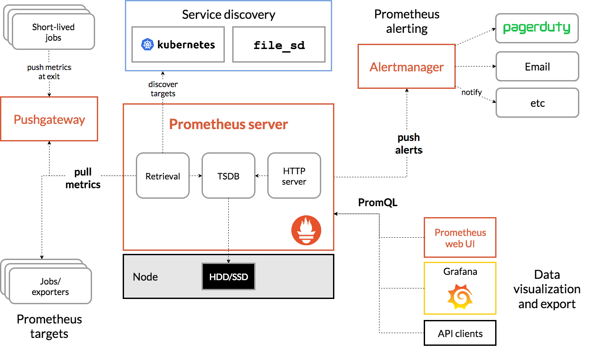
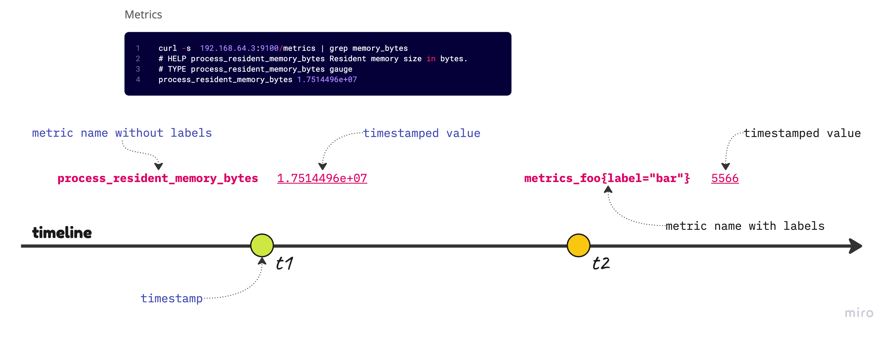
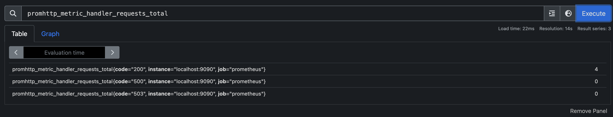

# Prometheus 雜記

工作上一直都有接觸到 Prometheus 的需求，而 Prometheus 作為近年最熱門的監看與警報的服務當之無愧。儘管如此熱門，我還真的沒有花太多時間在學習它的使用方式。剛好有機會又要再摸摸 Prometheus 那就來寫點筆記吧！



上圖為官網上的 Prometheus 架構圖，我們會先關注在 Prometheus server 本身，在他的 Server 主要有三個元件：

- TSDB：它就是 time series database，作為蒐集資料的核心，它提是 time series 資料儲存位置，並且以有效率的方提供簡易的查詢語法。
- HTTP server：它提供一些 API 讓外界可以與 Prometheus 互動，例如它自帶的 Web UI 或是 Grafana 為了要顯示 Dashboard 都要透過 API 下達查詢語法獲得結果來顯示圖表。
- Retrieval：即為採集 `metric` 的元件，它對應至 Prometheus 設定檔內的位置，就是 `scrape_configs` 的部分，它會告知 Prometheus 的 retrieval 該如何行動。

所以，我們可以先以這三個核心元件來理解 Prometheus Server，透過 `Retrieval` 取得了應該要蒐集的 metric 將它們存到 `TSDB` 之內，並讓 `HTTP server` API 來讓外部可以查詢 `TSDB` 的內容來置作各種維運人員可以識別的觀察指標。

## 資料模型

<https://prometheus.io/docs/concepts/data_model/>

初步對於 Prometheus server 內的三個主要元件有概念後，可以接續者了解它的「資料模型」。但對於剛接觸 Prometheus 的新朋友來說，大概會比較想知道如何取得「資料」：

```jsx
curl -s localhost:9100/metrics | head
# HELP go_gc_duration_seconds A summary of the pause duration of garbage collection cycles.
# TYPE go_gc_duration_seconds summary
go_gc_duration_seconds{quantile="0"} 1.4499e-05
go_gc_duration_seconds{quantile="0.25"} 7.3083e-05
go_gc_duration_seconds{quantile="0.5"} 9.5874e-05
go_gc_duration_seconds{quantile="0.75"} 0.000142959
go_gc_duration_seconds{quantile="1"} 0.000926838
go_gc_duration_seconds_sum 0.009321403
go_gc_duration_seconds_count 65
# HELP go_goroutines Number of goroutines that currently exist.
```

在你啟動 Prometheus 後，它會在 `9100` port 開一個 HTTP server，其中的 `/metrics` 端點就可以取得指標(metrics)資料。你會看到它有許多行，除了 `#` 代表註解用來說明指標的意義之外，其它都是指標資料。也就是我們正試途理解的「資料模型」的具體例子。它每一行非註解的資料就是一筆的 `metric`。

這樣是一筆 metric

```jsx
go_gc_duration_seconds{quantile="0"} 1.4499e-05
```

這樣也是一筆 metric

```jsx
go_gc_duration_seconds_count 65
```



> Every time series is uniquely identified by its metric name and optional key-value pairs called labels.


上圖是為了理解資料模型而作的示意圖。我們先下個定義，一筆 `metric` 是由三個維度決定它的「識別性」：

- timestamp
- metric name
- set of labels

當以上三者都一樣時，就會適為同一筆資料處理。而資料的 `值 (value)`，本身不在識別性討論的範圍，至於 Prometheus 會採用什麼策略「剔除重複」我們就先不深入了。

上圖最粗的橫線代表了 timeline，表示隨著時間的推進 Prometheus 的 Retrieval 分別在時間 `t1` 與 `t2` 各取得了一筆 metric。直覺地想，一個 metric 就是一個代有 timestamp 的值與它的指標名稱(metric name)，並且有可能會有標籤(label)，標籤的數量是 `0` 到多個。

直接看上圖的例子。對初接觸 Prometheus 的人，可能只會意識到 metric 長這樣：

```jsx
process_resident_memory_bytes 1.7514496e+07
```

初心者：「我看到了它是一個叫 `process_resident_memory_bytes` 的 metric，並且它的值是 `1.7514496e+07`」，但是在這個時間點它「也許還不是 metric」，因為若它還沒有進到 `TSDB` 內，並存下這筆資料與它的 `timestamp` 前， 那它還無法成為記錄上的 metric。

現在有一個細節需要交流，那就是這個 `timestamp` 會使用 `metric` 本身自帶的，還是要使用 Prometheus 自先去產生的呢？在管理良好的伺服器內，時間都應該是經過自動校正的。在「預設的情況」，Prometheus 會使用 `metric` 本身自帶的 `timestamp`。如果，你覺得這個 `timestamp` 不可信任，那就可以由設定檔內變更，改由 Prometheus 來產生 `timestamp`。

請看下面的範例，其中 `honor_timestamps` 就是設定了要使用 `metric` 給的 `timestamp`，它的預設值是 `true`，因此這樣寫並不會改變什麼。若你需要丟棄這個來源的 `timestamp` 只要將它設為 `false` 即可：

```yaml
scrape_configs:
  - job_name: 'example'
    scrape_interval: 15s
    honor_timestamps: true
    static_configs:
      - targets: ['localhost:9090']
```

現在，我們回到 metric 討論的本身。我們要把「看到的」資料視為真正的 metric 的情況，那麼依「資料模型」給的定義，它應該是要進到 `TSDB` 後，正式地將 timestamp 也紀錄下去才算數的。所以，上圖的 `t1` 與 `t2` 就是代表了這二筆 metric 被記錄下來的時間，正式成為在 Prometheus 內可以被查詢的指標。

那我們來看一下 `t2` 的 metrics_foo：

```jsx
metrics_foo{label="bar"} 5566
```

它長得與前一個 metric 有一點不同，因為它多了標籤 (label)。標籤是可選的 (optional)，它並不是被規範為必填的項目，所以 metrics 的提供者可以決定是否需要在指標名稱 (metric name) 上多放一些標籤在後面。它的寫法很好懂，在有標籤的情況直接在指標名稱後以 `大括弧{}` 包住，並使用 `key-value` pair 的方式填上標籤。

## 標籤與 Retrieval

在理解資料模型後，我們理解了一組 metric 的唯一性是由 `timestamp` `metric name` 與 `labels 的集合` 組成。接續著上面的例子，我們在某個時間點下的 metric 內容如下：

```jsx
metrics_foo{label="bar"} 5566
```

試想一下，如果我同時有上百台的伺服器都傳了一樣的指標，在相近時間點內的 `metric` 大概只能被視為「同一筆」資料而剔除重複了。我所描述的是一個相當常見的使用情境，那對於 Prometheus 來說，肯定有想過這個問題。可以做個簡單的實驗：

1. 直接用 `curl` 查詢 Prometheus 本身的 `/metrics`
2. 使用 Web UI 去查詢看過的 metric

```yaml
curl -s 192.168.64.3:9090/metrics | tail -3
promhttp_metric_handler_requests_total{code="200"} 3
promhttp_metric_handler_requests_total{code="500"} 0
promhttp_metric_handler_requests_total{code="503"} 0
```



你會發現用 `curl` 查詢時，它的標籤數量是比較少的，因為那是原始的資料。當 Prometheus 的 Retrieval 去抓取資料時，再到存入 `TSDB` 之前它會多加一些標籤在裡面，目前觀察到的那些自動長出來的標籤有：

- instance
- job

你可以發現 job 標籤其實就是這組 ScapeConfig 的 `job_name`，而 instance 標籤就是 `target` 內的資料採集對象：

```yaml
# A scrape configuration containing exactly one endpoint to scrape:
# Here it's Prometheus itself.
scrape_configs:
  # The job name is added as a label `job=<job_name>` to any timeseries scraped from this config.
  - job_name: "prometheus"

    # metrics_path defaults to '/metrics'
    # scheme defaults to 'http'.

    static_configs:
      - targets: ["localhost:9090"]
```

我們觀察到這個的現象是正常的，因為 Prometheus 會在不同的階段，去變更 `metric` 的標籤。對於一組 Scrape 的任務來說，它會先取得 `targets` 列表，並留下「活著」的 targets。在這一階段，取得了採集指標的對象後，Prometheus 會先準備好 `job` 與 `instance` 這二個標籤給後續採集到的 `metric` 使用。若我們沒在 `scrape_configs` 內特別指示需要對標籤進行額外的處理時，它就只會附加上我們現在看到的這二組標籤。

PS. 實際上 `metric_name` 本身也會被轉換成 `__name__` 標籤存入，所以真實的「唯一性識別」方式，就是**標籤的集合**。

## 標籤的再處理

<https://prometheus.io/docs/prometheus/latest/configuration/configuration/>

在 Prometheus 的設定檔文件中，你會看到許多的 `relabel_configs`，它們的用法都大同小異，但對於初次面對它的使用者來說，需要一點時間習慣它。第一個問題會是「資訊量」一時之間太大，因為有一些「謎之標籤」先前沒有看過，所以才會感到特別困惑。

我們來看個 [blackbox_exporter](https://github.com/prometheus/blackbox_exporter) 的例子：

```yaml
scrape_configs:
  - job_name: 'blackbox'
    metrics_path: /probe
    params:
      module: [http_2xx]  # Look for a HTTP 200 response.
    static_configs:
      - targets:
        - http://prometheus.io    # Target to probe with http.
        - https://prometheus.io   # Target to probe with https.
        - http://example.com:8080 # Target to probe with http on port 8080.
    relabel_configs:
      - source_labels: [__address__]
        target_label: __param_target
      - source_labels: [__param_target]
        target_label: instance
      - target_label: __address__
        replacement: 127.0.0.1:9115  # The blackbox exporter's real hostname:port.
  - job_name: 'blackbox_exporter'  # collect blackbox exporter's operational metrics.
    static_configs:
      - targets: ['127.0.0.1:9115']
```

在細看 `black_exporter` 之前，我們先來談一下它是什麼。首先，它有個關鍵字 `exporter` 這會意思是「它提供一個機制，讓還未能匯出 (export) 能讓 prometheus 使用的 metrics 的系統，具有匯出 `metric` 的能力」，它可以是獨立的服務或是能被整合到現有應用程式的函式庫。因為，有許多系統是在 prometheus 被創造之前就已經存在的，對於這些既有的系統或工具，它們並不會直接輸出 prometheus 可以使用的 `metrics`，透過 `exporter` 的輔助讓既有的事務能參與現代化的可觀測性 (Observability 也就是 o11y) 體系。

對 `exporter` 有了基本的理解後，接著來看 `black_exporter`，它的用途並不是直接 export 他自己安裝位置的 `metrics`，而是讓別人告訴他「我有一個關心的位置，你幫我看一下他現在的狀態如何」。為了讓大家比較理解現況，我們先由安裝後的基本設定開始研究。以下是什麼都沒加料的 prometheus 原始設定：

```yaml
# A scrape configuration containing exactly one endpoint to scrape:
# Here it's Prometheus itself.
scrape_configs:
  # The job name is added as a label `job=<job_name>` to any timeseries scraped from this config.
  - job_name: "prometheus"

    # metrics_path defaults to '/metrics'
    # scheme defaults to 'http'.

    static_configs:
      - targets: ["localhost:9090"]
```

由上面的設定，我們知道 *prometheus* 這個 scrape job 會去指定的 target 下 HTTP GET 獲得 metrics，等價的 curl 指令可以想像成：

```bash
curl http://localhost:9090/metrics
```

同樣的情境，我們看一下這一份**裁剪版**的 *blackbox* scrape job：

```yaml
scrape_configs:
  - job_name: 'blackbox'
    metrics_path: /probe
    params:
      module: [http_2xx]  # Look for a HTTP 200 response.
    static_configs:
      - targets:
        - http://prometheus.io    # Target to probe with http.
        - https://prometheus.io   # Target to probe with https.
        - http://example.com:8080 # Target to probe with http on port 8080.
```

與上一個例子相比，只是 target 由 1 個變成 3 個，還有 `metrics_path` 由預設的 `/metrics` 變成 `/probe`，那相價的 curl 可以想成：

```bash
curl http://prometheus.io/probe
```

到目前為止還算好理解，但有一個問題。`prometheus.io` 在別人家，我並沒有權利要求他要裝好一個 exporter 讓我可以抓到想要的 metrics。那麼我下前面想像中的 HTTP Request 真的能取得想要的 `metrics` 嗎？實際上，`blackbox_exporter` 的設計並不是這樣用的，你得要做的是：

1. 安裝好 blackbox_exporter 並把它跑起來
2. 請 blackbox_exporter 發出 HTTP Request 取得 metrics

所以，現在我們設定的 `target` 不是直接發出 HTTP Request 的對象，而是得透過 blackbox_exporter 間接發出 HTTP Request。為了達到這個目標，我們得運用標籤再處理 (relabeling) 的機制。這個機制就得聯結到我們先前截剪掉的設定：

```yaml
    relabel_configs:
      - source_labels: [__address__]
        target_label: __param_target
      - source_labels: [__param_target]
        target_label: instance
      - target_label: __address__
        replacement: 127.0.0.1:9115  # The blackbox exporter's real hostname:port.
```

在閱讀這個設定時，若你對於 `__address__` 的出現感到困擾，他在手冊上有個[簡短地說明](https://prometheus.io/docs/prometheus/latest/configuration/configuration/#relabel_config)：

> Initially, aside from the configured per-target labels, a target's `job` label is set to the `job_name` value of the respective scrape configuration. The `__address__` label is set to the `&lt;host&gt;:&lt;port&gt;` address of the target. After relabeling, the `instance` label is set to the value of `__address__` by default if it was not set during relabeling.


由上述說明你可以知道，在 prometheus 對每一個要處理的 target 會有一個初始的狀態，它會把 `__address__` 放在裡面，後續的 `relabel_config`s，會一個一個依順序執行。所以，它會做的事情是：

1. 將 target_label `__param_target` 標籤的內容，設定為 `__address__` 標籤的內容
2. 將 target_label `instance` 標籤的內容，設定為 `__param_target` 標籤的內容
3. 將 `__address__` 標籤的內容，設定為 `127.0.0.1:9115`。

完整的結果如下：

- `__address__`: "127.0.0.1:9115"
- `__metrics_path__`: "/probe"
- `__param_module`: "http_2xx"
- `__param_target`: "http://prometheus.io"
- `__scheme__`: "http"
- `__scrape_interval__`: "15s"
- `__scrape_timeout__`: "10s"
- `instance`: "http://prometheus.io"
- `job`: "blackbox"

透過 relabeling 後，scrape 會使用的 HTTP Request 就會變成：

```bash
# __scheme__://__address__/__metrics_path__
curl http://127.0.0.1:9115/probe
```

而依 [UNDERSTANDING AND USING THE MULTI-TARGET EXPORTER PATTERN](https://prometheus.io/docs/guides/multi-target-exporter/#querying-multi-target-exporters-with-prometheus) 文件的說明 `__param_` prefix 的參數會被取出來，成為 Request Parameters：

```bash
# __scheme__://__address__/__metrics_path__?__param_<name_1>&__param_<name_2>..
curl http://127.0.0.1:9115/probe?module=http_2xx&target=http://prometheus.io
```

透過這樣逐步拆解後，我們就能輕鬆讀懂 `relabel_configs` 設定的用途囉！

## 重點摘要

這篇文章我們整理了一些關於 Prometheus 的基礎知識，包含：

- Prometheus 的資料模型 (data model)，它會儲存的是一個帶有 `時間戳記` 的值，而這個值代表的指標 (metrics) 的唯一性是由這三個維度構成的：時間戳記、指標名稱還有`標籤集合`。
- Prometheus 的設定檔對於初學入門的人來說，我們先把心力放在瞭解 `scrape_configs` 即可，它就是架構圖中的 `Retrieval` 的具體實作。每一個 Scrape Job 由 `job` 與 `targets` 的集合組成，我們先忽略實務需要學習的 Service Discovery 部分，差別只是 `targets` 的列表是靜態寫死的或是動態生成或查詢而來。
- 針對 Scrape Job，我們學習了它的參數的看法，學習如何去「想像」推論出他大概會像是什麼樣的 `curl` 指令，同時也學習看懂實務上常用的 `blackbox_exporter` 的寫法，特別是 `relabel_configs` 的解讀。
